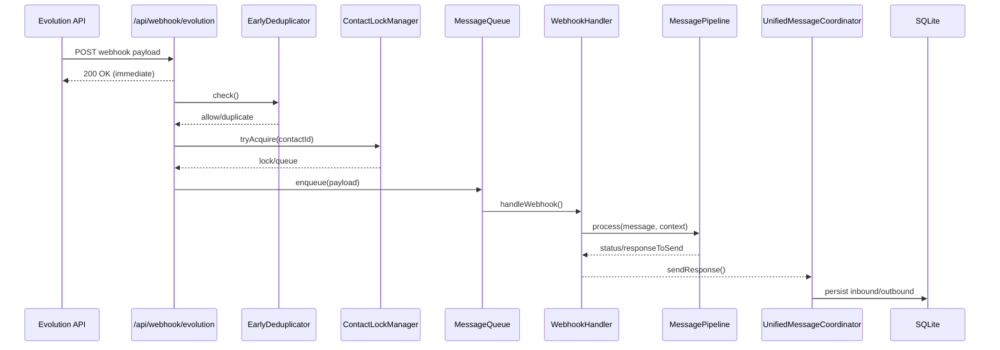
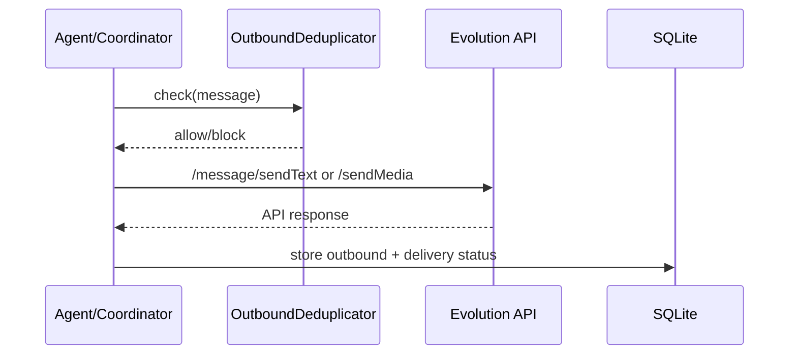
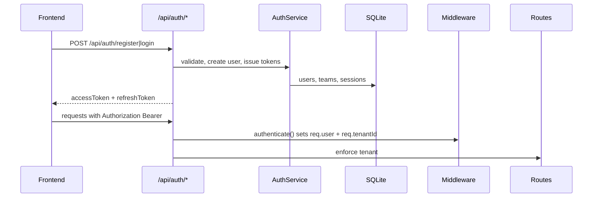

# Runtime Data Flow Maps

## Flow 1: Inbound webhook → staging → job queue → worker → messages/conversations

**Who calls who (active path)**
- `src/api/routes/webhook.routes.js:50` → `processWebhook()` → `src/handlers/webhook_handler.js:56`
- `src/handlers/webhook_handler.js:117` → `src/middleware/MessagePipeline.js`
- `src/handlers/webhook_handler.js:166` → `src/handlers/UnifiedMessageCoordinator.js`
- `src/handlers/UnifiedMessageCoordinator.js:204` → `src/tools/whatsapp.js` / `src/messaging/MediaSender.js` (Evolution API send)

**Staging/queue components (exist, not wired in this path)**
- `src/services/InboundEventsService.js:51` stages into `inbound_events`
- `src/services/AsyncJobsService.js:73` enqueues into `async_jobs`
- Migrations: `src/db/migrations/031_inbound_events.sql:20`, `src/db/migrations/032_async_jobs.sql:21`

**Alternate inbound path (multi-tenant)**
- `src/api/routes/webhooks-inbound.routes.js:20` validates secret and routes by provider.
- Note: Evolution `MESSAGES_UPSERT` currently does not forward into the main pipeline.
  Evidence: `src/api/routes/webhooks-inbound.routes.js:154`.

---

## Flow 2: Outbound message → provider send → status update

**Who calls who (primary path)**
- `src/handlers/UnifiedMessageCoordinator.js:204` → `_sendWithRetry()` → `src/tools/whatsapp.js:157`
- `src/tools/whatsapp.js:235` → Evolution API `/message/sendText/{instance}`
- `src/handlers/UnifiedMessageCoordinator.js:204` → `simpleBotDetector.recordOutgoingMessage()`

**Alternate path (adapter)**
- `src/infrastructure/adapters/WhatsAppAdapter.js:40` sends to Evolution API via axios.

**Delivery tracking**
- `src/services/DeliveryTrackingService.js:92` handles delivery updates from webhook.

---

## Flow 3: Auth (register/login/refresh/logout) → tenant resolution → route guard

**Who calls who**
- `src/api/routes/auth.routes.js` → `src/services/AuthService.js`
- `src/middleware/auth.middleware.js:21` sets `req.tenantId` from JWT
- `src/middleware/tenant.middleware.js:18` sets `req.tenantId` for routes that use it

