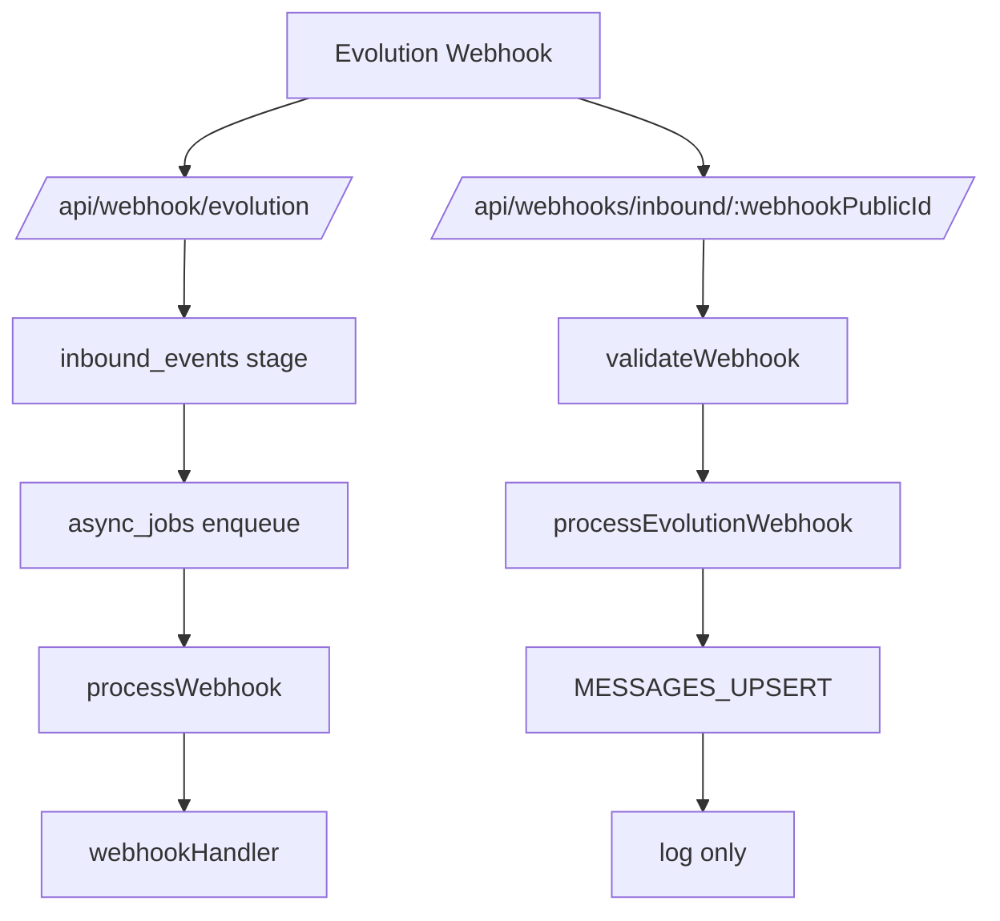

# ETAPA 6 — Diagramas e Lista de Acoes

## 1) Mermaid — Boot

```mermaid
graph TD
  A[src/server.js] --> B[runMigrations]
  A --> C[getContainer]
  A --> D[express()]
  D --> E[configureExpress]
  E --> F[routes index]
  F --> G[SPA fallback /app/*]
  G --> H[404 handler]
  H --> I[startServer]
  I --> J[start jobs]
```

Evidencias: `src/server.js:123-305`, `src/config/express.config.js:81-138`, `src/api/routes/index.js:60-105`.

## 2) Mermaid — Webhook inbound



Evidencias: `src/api/routes/webhook.routes.js:58-196`, `src/api/routes/webhooks-inbound.routes.js:20-170`, `src/services/IntegrationService.js:586-654`, `src/db/migrations/031_inbound_events.sql`, `src/services/AsyncJobsService.js:73-174`.

## 3) Mermaid — Comunicacao FE/BE (Vite)

```mermaid
graph TD
  FE[apps/web-vite /app] --> API[/api/*]
  API --> BE[Express routes]
  BE --> DB[SQLite]
  FE --> SPA[/app/* fallback]
```

Evidencias: `apps/web-vite/src/App.tsx:80-111`, `apps/web-vite/src/lib/api.ts:1-47`, `src/config/express.config.js:124-129`.

## 4) Acoes priorizadas (P0/P1/P2)

P0
- MESSAGES_UPSERT nao entra no pipeline quando o endpoint ativo e `/api/webhooks/inbound/:webhookPublicId`. Evidencia: `src/api/routes/webhooks-inbound.routes.js:154-162`.
- Frontend usa endpoints inexistentes para Evolution (ex.: `/api/agents/evolution/qrcode`), bloqueando conexao via dashboard em parte das telas. Evidencia: `apps/web-vite/src/pages/AgentDetail.tsx:294-333` vs `src/api/routes/agents.routes.js:586-623`.

P1
- Rotas duplicadas para `/api/agents/my` no backend podem causar override silencioso. Evidencia: `src/api/routes/agents.routes.js:181-202` e `src/api/routes/agents.routes.js:344-365`.
- Server e worker iniciam os mesmos jobs, criando risco de execucao duplicada. Evidencia: `src/server.js:207-288` e `src/worker.js:138-195`.

P2
- Dois fluxos de webhook (legacy vs multi-tenant) aumentam complexidade e tornam cutover confuso. Evidencia: `src/api/routes/index.js:61-103`.

