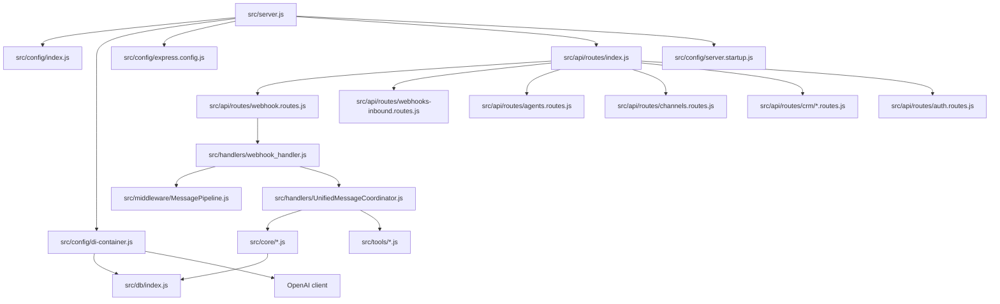
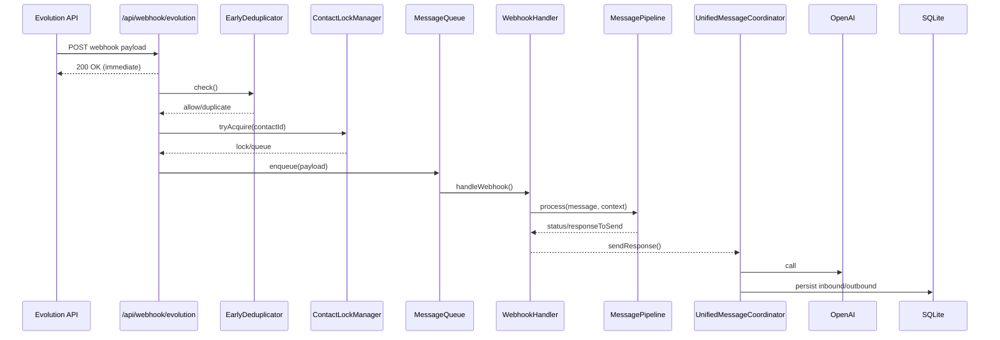

# Communication Map A–E (Auto-Generated)

## A) Dependency Graph (Imports)

- Nodes: 361
- Edges: 741

### A.1 Folder-to-Folder Import Edges (Top 30)

- scalable -> scalable: 42
- api -> api: 41
- platform -> platform: 41
- api -> services: 21
- intelligence -> intelligence: 20
- utils -> utils: 20
- api -> middleware: 18
- api -> utils: 16
- api -> models: 16
- services -> db: 16
- services -> utils: 16
- api -> db: 14
- agents -> agents: 12
- v2 -> v2: 12
- agents -> utils: 11
- api -> tools: 11
- api -> intelligence: 11
- domain -> domain: 11
- tools -> tools: 11
- tools -> root: 11
- agents -> intelligence: 10
- automation -> utils: 10
- automation -> automation: 10
- domain -> utils: 10
- intelligence -> db: 10
- intelligence -> utils: 9
- models -> models: 9
- api -> handlers: 8
- services -> tools: 8
- config -> utils: 7

### A.2 Cycles (Static Import Analysis)

1. src/security/SimpleBotDetector.js -> src/automation/CadenceEngine.js
2. src/config/retry.config.js -> src/utils/retry.js

### A.3 Top 20 Central Files (In+Out Degree)

| Rank | File | In | Out | Total |
|---:|---|---:|---:|---:|
| 1 | src/db/index.js | 53 | 0 | 53 |
| 2 | src/api/routes/index.js | 1 | 41 | 42 |
| 3 | src/utils/logger-wrapper.js | 34 | 1 | 35 |
| 4 | src/utils/errors/index.js | 29 | 0 | 29 |
| 5 | src/config/di-container.js | 3 | 25 | 28 |
| 6 | src/db/connection.js | 22 | 3 | 25 |
| 7 | src/memory.js | 21 | 1 | 22 |
| 8 | src/services/ServiceLocator.js | 1 | 21 | 22 |
| 9 | src/api/routes/webhook.routes.js | 1 | 19 | 20 |
| 10 | src/tools/whatsapp.js | 14 | 5 | 19 |
| 11 | src/intelligence/IntelligenceOrchestrator.js | 4 | 14 | 18 |
| 12 | src/automation/ProspectingEngine.js | 4 | 13 | 17 |
| 13 | src/automation/CadenceEngine.js | 6 | 8 | 14 |
| 14 | src/handlers/webhook_handler.js | 3 | 11 | 14 |
| 15 | src/middleware/auth.middleware.js | 13 | 1 | 14 |
| 16 | src/utils/logger.enhanced.js | 13 | 1 | 14 |
| 17 | src/agents/agent_hub.js | 1 | 12 | 13 |
| 18 | src/server.js | 0 | 13 | 13 |
| 19 | src/agents/sdr_agent.js | 1 | 11 | 12 |
| 20 | src/repositories/lead.repository.js | 10 | 2 | 12 |

### A.4 Mermaid – Boot Graph

### A.5 Mermaid – Message Pipeline Graph (Evolution)

## B) Express Routes Map

Total routes parsed: 341

| METHOD | PATH | MIDDLEWARE CHAIN | HANDLER | FILE | SERVICES (imported) | REPOS/MODELS (imported) |
|---|---|---|---|---|---|---|
| GET | '/api/activities' | optionalAuth | inline | src/api/routes/activities.routes.js | - | models/Activity.js |
| GET | '/api/activities/timeline' | optionalAuth | inline | src/api/routes/activities.routes.js | - | models/Activity.js |
| GET | '/api/activities/overdue' | optionalAuth | inline | src/api/routes/activities.routes.js | - | models/Activity.js |
| GET | '/api/activities/today' | optionalAuth | inline | src/api/routes/activities.routes.js | - | models/Activity.js |
| GET | '/api/activities/upcoming' | optionalAuth | inline | src/api/routes/activities.routes.js | - | models/Activity.js |
| GET | '/api/activities/stats' | optionalAuth | inline | src/api/routes/activities.routes.js | - | models/Activity.js |
| GET | '/api/activities/:id' | - | inline | src/api/routes/activities.routes.js | - | models/Activity.js |
| POST | '/api/activities' | optionalAuth | inline | src/api/routes/activities.routes.js | - | models/Activity.js |
| PUT | '/api/activities/:id' | - | inline | src/api/routes/activities.routes.js | - | models/Activity.js |
| PUT | '/api/activities/:id/complete' | - | inline | src/api/routes/activities.routes.js | - | models/Activity.js |
| PUT | '/api/activities/:id/reschedule' | - | inline | src/api/routes/activities.routes.js | - | models/Activity.js |
| DELETE | '/api/activities/:id' | - | inline | src/api/routes/activities.routes.js | - | models/Activity.js |
| GET | '/api/health' | - | inline | src/api/routes/admin.routes.js | - | - |
| GET | '/api/stats' | - | inline | src/api/routes/admin.routes.js | - | - |
| POST | '/api/admin/clear-cache' | - | inline | src/api/routes/admin.routes.js | - | - |
| GET | '/api/admin/handlers-health' | - | inline | src/api/routes/admin.routes.js | - | - |
| GET | '/api/admin/system-health' | - | inline | src/api/routes/admin.routes.js | - | - |
| GET | '/api/admin/error-stats' | - | inline | src/api/routes/admin.routes.js | - | - |
| POST | '/api/admin/clear-old-errors' | - | inline | src/api/routes/admin.routes.js | - | - |
| GET | '/api/admin/coordinator/stats' | - | inline | src/api/routes/admin.routes.js | - | - |
| POST | '/api/admin/coordinator/emergency-cleanup' | - | inline | src/api/routes/admin.routes.js | - | - |
| GET | '/api/admin/audio/stats' | - | inline | src/api/routes/admin.routes.js | - | - |
| GET | '/api/admin/audio/status/:messageId' | - | inline | src/api/routes/admin.routes.js | - | - |
| GET | '/api/admin/context/stats' | - | inline | src/api/routes/admin.routes.js | - | - |
| GET | '/api/agents' | - | inline | src/api/routes/agents.routes.js | - | repositories/agent.repository.js |
| GET | '/api/agents/my' | authenticate, tenantContext | inline | src/api/routes/agents.routes.js | - | repositories/agent.repository.js |
| GET | '/api/agents/:agentId' | validateAgentId | inline | src/api/routes/agents.routes.js | - | repositories/agent.repository.js |
| POST | '/api/agents' | requireManager | inline | src/api/routes/agents.routes.js | - | repositories/agent.repository.js |
| PUT | '/api/agents/:agentId' | requireManager, validateAgentId | inline | src/api/routes/agents.routes.js | - | repositories/agent.repository.js |
| DELETE | '/api/agents/:agentId' | requireManager, validateAgentId | inline | src/api/routes/agents.routes.js | - | repositories/agent.repository.js |
| GET | '/api/admin/agents' | - | inline | src/api/routes/agents.routes.js | - | repositories/agent.repository.js |
| GET | '/api/agents/my' | authenticate, tenantContext | inline | src/api/routes/agents.routes.js | - | repositories/agent.repository.js |
| GET | '/api/agents/:agentId/permissions' | authenticate, tenantContext, validateAgentId | inline | src/api/routes/agents.routes.js | - | repositories/agent.repository.js |
| POST | '/api/agents/:agentId/duplicate' | authenticate, tenantContext, requireManager, validateAgentId, sanitizeInput | inline | src/api/routes/agents.routes.js | - | repositories/agent.repository.js |
| GET | '/api/agents/:agentId/evolution/status' | authenticate, validateAgentId | inline | src/api/routes/agents.routes.js | - | repositories/agent.repository.js |
| POST | '/api/agents/:agentId/evolution/create' | authenticate, tenantContext, requireManager, validateAgentId | inline | src/api/routes/agents.routes.js | - | repositories/agent.repository.js |
| GET | '/api/agents/:agentId/evolution/qrcode' | authenticate, validateAgentId | inline | src/api/routes/agents.routes.js | - | repositories/agent.repository.js |
| POST | '/api/agents/:agentId/evolution/disconnect' | authenticate, requireManager, validateAgentId | inline | src/api/routes/agents.routes.js | - | repositories/agent.repository.js |
| DELETE | '/api/agents/:agentId/evolution' | authenticate, requireManager, validateAgentId | inline | src/api/routes/agents.routes.js | - | repositories/agent.repository.js |
| GET | '/api/evolution/instances' | authenticate | inline | src/api/routes/agents.routes.js | - | repositories/agent.repository.js |
| GET | '/api/ai-insights/sentiment' | optionalAuth | inline | src/api/routes/ai-insights.routes.js | - | - |
| GET | '/api/ai-insights/objections' | optionalAuth | inline | src/api/routes/ai-insights.routes.js | - | - |
| GET | '/api/ai-insights/best-practices' | optionalAuth | inline | src/api/routes/ai-insights.routes.js | - | - |
| GET | '/api/ai-insights/agent-performance' | optionalAuth | inline | src/api/routes/ai-insights.routes.js | - | - |
| GET | '/api/ai-insights/recommendations' | optionalAuth | inline | src/api/routes/ai-insights.routes.js | - | - |
| GET | '/api/analytics/whatsapp-stats' | - | inline | src/api/routes/analytics.routes.js | services/AbandonmentDetectionJob.js | - |
| GET | '/api/analytics/agent-metrics' | - | inline | src/api/routes/analytics.routes.js | services/AbandonmentDetectionJob.js | - |
| GET | '/api/analytics/overview' | - | inline | src/api/routes/analytics.routes.js | services/AbandonmentDetectionJob.js | - |
| GET | '/api/analytics/top-contacts' | - | inline | src/api/routes/analytics.routes.js | services/AbandonmentDetectionJob.js | - |
| GET | '/api/analytics/hourly' | - | inline | src/api/routes/analytics.routes.js | services/AbandonmentDetectionJob.js | - |
| GET | '/api/analytics/p2/stats' | - | inline | src/api/routes/analytics.routes.js | services/AbandonmentDetectionJob.js | - |
| GET | '/api/analytics/p2/abandonment-patterns' | - | inline | src/api/routes/analytics.routes.js | services/AbandonmentDetectionJob.js | - |
| GET | '/api/analytics/p2/experiments' | - | inline | src/api/routes/analytics.routes.js | services/AbandonmentDetectionJob.js | - |
| GET | '/api/analytics/p2/sentiment-summary' | - | inline | src/api/routes/analytics.routes.js | services/AbandonmentDetectionJob.js | - |
| GET | '/api/analytics/p2/insights-report' | - | inline | src/api/routes/analytics.routes.js | services/AbandonmentDetectionJob.js | - |
| POST | '/api/analytics/p2/create-experiment' | - | inline | src/api/routes/analytics.routes.js | services/AbandonmentDetectionJob.js | - |
| GET | '/api/analytics/learning/outcomes' | - | inline | src/api/routes/analytics.routes.js | services/AbandonmentDetectionJob.js | - |
| GET | '/api/analytics/learning/abandonment-job' | - | inline | src/api/routes/analytics.routes.js | services/AbandonmentDetectionJob.js | - |
| POST | '/api/analytics/learning/detect-abandonments' | - | inline | src/api/routes/analytics.routes.js | services/AbandonmentDetectionJob.js | - |
| GET | '/api/analytics/learning/abandonment-hotspots' | - | inline | src/api/routes/analytics.routes.js | services/AbandonmentDetectionJob.js | - |
| GET | '/api/analytics/learning/full-report' | - | inline | src/api/routes/analytics.routes.js | services/AbandonmentDetectionJob.js | - |
| GET | '/api/analytics/learning/activity' | - | inline | src/api/routes/analytics.routes.js | services/AbandonmentDetectionJob.js | - |
| GET | '/api/analytics/optimizer/status' | - | inline | src/api/routes/analytics.routes.js | services/AbandonmentDetectionJob.js | - |
| POST | '/api/analytics/optimizer/run-cycle' | - | inline | src/api/routes/analytics.routes.js | services/AbandonmentDetectionJob.js | - |
| GET | '/api/analytics/optimizer/stage-health' | - | inline | src/api/routes/analytics.routes.js | services/AbandonmentDetectionJob.js | - |
| GET | '/api/analytics/optimizer/optimizations' | - | inline | src/api/routes/analytics.routes.js | services/AbandonmentDetectionJob.js | - |
| POST | '/api/analytics/optimizer/start' | - | inline | src/api/routes/analytics.routes.js | services/AbandonmentDetectionJob.js | - |
| POST | '/api/analytics/optimizer/stop' | - | inline | src/api/routes/analytics.routes.js | services/AbandonmentDetectionJob.js | - |
| POST | '/api/analytics/optimizer/detect-risk' | - | inline | src/api/routes/analytics.routes.js | services/AbandonmentDetectionJob.js | - |
| GET | '/api/analytics/maturity-level' | - | inline | src/api/routes/analytics.routes.js | services/AbandonmentDetectionJob.js | - |
| POST | '/api/auth/create-user' | authenticate | inline | src/api/routes/auth.routes.js | services/AuthService.js, services/EntitlementService.js | - |
| POST | '/api/auth/login' | - | inline | src/api/routes/auth.routes.js | services/AuthService.js, services/EntitlementService.js | - |
| POST | '/api/auth/logout' | authenticate | inline | src/api/routes/auth.routes.js | services/AuthService.js, services/EntitlementService.js | - |
| POST | '/api/auth/refresh' | - | inline | src/api/routes/auth.routes.js | services/AuthService.js, services/EntitlementService.js | - |
| GET | '/api/auth/me' | authenticate | inline | src/api/routes/auth.routes.js | services/AuthService.js, services/EntitlementService.js | - |
| PUT | '/api/auth/password' | authenticate | inline | src/api/routes/auth.routes.js | services/AuthService.js, services/EntitlementService.js | - |
| GET | '/api/auth/sessions' | authenticate | inline | src/api/routes/auth.routes.js | services/AuthService.js, services/EntitlementService.js | - |
| DELETE | '/api/auth/sessions' | authenticate | inline | src/api/routes/auth.routes.js | services/AuthService.js, services/EntitlementService.js | - |
| GET | '/api/auth/entitlements' | authenticate | inline | src/api/routes/auth.routes.js | services/AuthService.js, services/EntitlementService.js | - |
| POST | '/api/auth/verify' | - | inline | src/api/routes/auth.routes.js | services/AuthService.js, services/EntitlementService.js | - |
| GET | '/api/automations' | - | inline | src/api/routes/automation.routes.js | - | - |
| GET | '/api/automations/:id' | - | inline | src/api/routes/automation.routes.js | - | - |
| POST | '/api/automations' | - | inline | src/api/routes/automation.routes.js | - | - |
| PUT | '/api/automations/:id' | - | inline | src/api/routes/automation.routes.js | - | - |
| DELETE | '/api/automations/:id' | - | inline | src/api/routes/automation.routes.js | - | - |
| POST | '/api/automations/:id/toggle' | - | inline | src/api/routes/automation.routes.js | - | - |
| POST | '/api/automations/:id/run' | - | inline | src/api/routes/automation.routes.js | - | - |
| GET | '/api/automations/:id/executions' | - | inline | src/api/routes/automation.routes.js | - | - |
| GET | '/api/automations/executions/recent' | - | inline | src/api/routes/automation.routes.js | - | - |
| GET | '/api/automations/engine/stats' | - | inline | src/api/routes/automation.routes.js | - | - |
| POST | '/api/automations/engine/initialize' | - | inline | src/api/routes/automation.routes.js | - | - |
| GET | '/api/automations/templates' | - | inline | src/api/routes/automation.routes.js | - | - |
| POST | '/api/automations/templates/:templateId/install' | - | inline | src/api/routes/automation.routes.js | - | - |
| GET | '/api/cadences' | - | inline | src/api/routes/cadence.routes.js | - | - |
| GET | '/api/cadences/stats' | - | inline | src/api/routes/cadence.routes.js | - | - |
| GET | '/api/cadences/pipeline-view' | - | inline | src/api/routes/cadence.routes.js | - | - |
| GET | '/api/cadences/:id' | - | inline | src/api/routes/cadence.routes.js | - | - |
| GET | '/api/cadences/:id/steps' | - | inline | src/api/routes/cadence.routes.js | - | - |
| POST | '/api/cadences/:id/enroll' | - | inline | src/api/routes/cadence.routes.js | - | - |
| GET | '/api/cadences/enrollments/active' | - | inline | src/api/routes/cadence.routes.js | - | - |
| PUT | '/api/cadences/enrollments/:id/pause' | - | inline | src/api/routes/cadence.routes.js | - | - |
| PUT | '/api/cadences/enrollments/:id/resume' | - | inline | src/api/routes/cadence.routes.js | - | - |
| PUT | '/api/cadences/enrollments/:id/respond' | - | inline | src/api/routes/cadence.routes.js | - | - |
| GET | '/api/cadences/actions/pending' | - | inline | src/api/routes/cadence.routes.js | - | - |
| POST | '/api/cadences/actions/execute' | - | inline | src/api/routes/cadence.routes.js | - | - |
| POST | '/api/cadences/advance-day' | - | inline | src/api/routes/cadence.routes.js | - | - |
| POST | '/api/calibration/test' | - | inline | src/api/routes/calibration.routes.js | - | - |
| GET | '/api/calibration/status' | - | inline | src/api/routes/calibration.routes.js | - | - |
| POST | '/api/agents/:agentId/channels/evolution/connect' | authenticate, tenantContext | inline | src/api/routes/channels.routes.js | services/IntegrationService.js, services/EntitlementService.js | - |
| GET | '/api/agents/:agentId/channels/evolution/status' | authenticate, tenantContext | inline | src/api/routes/channels.routes.js | services/IntegrationService.js, services/EntitlementService.js | - |
| GET | '/api/agents/:agentId/channels/evolution/qrcode' | authenticate, tenantContext | inline | src/api/routes/channels.routes.js | services/IntegrationService.js, services/EntitlementService.js | - |
| POST | '/api/agents/:agentId/channels/evolution/disconnect' | authenticate, tenantContext | inline | src/api/routes/channels.routes.js | services/IntegrationService.js, services/EntitlementService.js | - |
| GET | '/api/integrations' | authenticate, tenantContext | inline | src/api/routes/channels.routes.js | services/IntegrationService.js, services/EntitlementService.js | - |
| GET | '/api/integrations/:integrationId' | authenticate, tenantContext | inline | src/api/routes/channels.routes.js | services/IntegrationService.js, services/EntitlementService.js | - |
| GET | '/api/integrations/:integrationId/status' | authenticate, tenantContext | inline | src/api/routes/channels.routes.js | services/IntegrationService.js, services/EntitlementService.js | - |
| GET | '/api/clientes' | - | inline | src/api/routes/clientes.routes.js | - | repositories/lead.repository.js, models/Notification.js |
| POST | '/api/clientes/from-opportunity' | - | inline | src/api/routes/clientes.routes.js | - | repositories/lead.repository.js, models/Notification.js |
| GET | '/api/clientes/:id' | - | inline | src/api/routes/clientes.routes.js | - | repositories/lead.repository.js, models/Notification.js |
| PUT | '/api/clientes/:id/status' | - | inline | src/api/routes/clientes.routes.js | - | repositories/lead.repository.js, models/Notification.js |
| POST | '/api/clientes/:id/greeting' | - | inline | src/api/routes/clientes.routes.js | - | repositories/lead.repository.js, models/Notification.js |
| POST | '/api/clientes/:id/followup' | - | inline | src/api/routes/clientes.routes.js | - | repositories/lead.repository.js, models/Notification.js |
| GET | '/api/command-center/overview' | optionalAuth | inline | src/api/routes/command-center.routes.js | - | - |
| GET | '/api/command-center/tasks/urgent' | optionalAuth | inline | src/api/routes/command-center.routes.js | - | - |
| GET | '/api/command-center/hot-leads' | optionalAuth | inline | src/api/routes/command-center.routes.js | - | - |
| GET | '/api/command-center/activity-feed' | optionalAuth | inline | src/api/routes/command-center.routes.js | - | - |
| GET | '/api/command-center/pipeline-summary' | optionalAuth | inline | src/api/routes/command-center.routes.js | - | - |
| GET | '/api/command-center/performance' | optionalAuth | inline | src/api/routes/command-center.routes.js | - | - |
| GET | '/api/crm/accounts' | - | inline | src/api/routes/crm/accounts.routes.js | - | models/Account.js |
| GET | '/api/crm/accounts/stats' | - | inline | src/api/routes/crm/accounts.routes.js | - | models/Account.js |
| GET | '/api/crm/accounts/:id' | - | inline | src/api/routes/crm/accounts.routes.js | - | models/Account.js |
| POST | '/api/crm/accounts' | - | inline | src/api/routes/crm/accounts.routes.js | - | models/Account.js |
| PUT | '/api/crm/accounts/:id' | - | inline | src/api/routes/crm/accounts.routes.js | - | models/Account.js |
| DELETE | '/api/crm/accounts/:id' | - | inline | src/api/routes/crm/accounts.routes.js | - | models/Account.js |
| GET | '/api/crm/contacts' | - | inline | src/api/routes/crm/contacts.routes.js | - | models/Contact.js |
| GET | '/api/crm/contacts/stats' | - | inline | src/api/routes/crm/contacts.routes.js | - | models/Contact.js |
| GET | '/api/crm/contacts/:id' | - | inline | src/api/routes/crm/contacts.routes.js | - | models/Contact.js |
| POST | '/api/crm/contacts' | - | inline | src/api/routes/crm/contacts.routes.js | - | models/Contact.js |
| PUT | '/api/crm/contacts/:id' | - | inline | src/api/routes/crm/contacts.routes.js | - | models/Contact.js |
| DELETE | '/api/crm/contacts/:id' | - | inline | src/api/routes/crm/contacts.routes.js | - | models/Contact.js |
| POST | '/api/crm/contacts/:id/consent' | - | inline | src/api/routes/crm/contacts.routes.js | - | models/Contact.js |
| PUT | '/api/crm/contacts/:id/score' | - | inline | src/api/routes/crm/contacts.routes.js | - | models/Contact.js |
| GET | '/crm' | - | inline | src/api/routes/crm/dashboard.routes.js | - | - |
| GET | '/crm/' | - | inline | src/api/routes/crm/dashboard.routes.js | - | - |
| GET | '/crm/leads' | - | inline | src/api/routes/crm/dashboard.routes.js | - | - |
| GET | '/crm/pipeline' | - | inline | src/api/routes/crm/dashboard.routes.js | - | - |
| GET | '/crm/accounts' | - | inline | src/api/routes/crm/dashboard.routes.js | - | - |
| GET | '/crm/contacts' | - | inline | src/api/routes/crm/dashboard.routes.js | - | - |
| GET | '/api/crm/leads' | - | inline | src/api/routes/crm/leads.routes.js | - | models/Lead.js |
| GET | '/api/crm/leads/stats' | - | inline | src/api/routes/crm/leads.routes.js | - | models/Lead.js |
| GET | '/api/crm/leads/:id' | - | inline | src/api/routes/crm/leads.routes.js | - | models/Lead.js |
| POST | '/api/crm/leads' | - | inline | src/api/routes/crm/leads.routes.js | - | models/Lead.js |
| PUT | '/api/crm/leads/:id' | - | inline | src/api/routes/crm/leads.routes.js | - | models/Lead.js |
| DELETE | '/api/crm/leads/:id' | - | inline | src/api/routes/crm/leads.routes.js | - | models/Lead.js |
| PUT | '/api/crm/leads/:id/status' | - | inline | src/api/routes/crm/leads.routes.js | - | models/Lead.js |
| PUT | '/api/crm/leads/:id/bant' | - | inline | src/api/routes/crm/leads.routes.js | - | models/Lead.js |
| POST | '/api/crm/leads/:id/convert' | - | inline | src/api/routes/crm/leads.routes.js | - | models/Lead.js |
| GET | '/api/crm/opportunities' | - | inline | src/api/routes/crm/opportunities.routes.js | - | models/Opportunity.js |
| GET | '/api/crm/opportunities/pipeline' | - | inline | src/api/routes/crm/opportunities.routes.js | - | models/Opportunity.js |
| GET | '/api/crm/opportunities/:id' | - | inline | src/api/routes/crm/opportunities.routes.js | - | models/Opportunity.js |
| POST | '/api/crm/opportunities' | - | inline | src/api/routes/crm/opportunities.routes.js | - | models/Opportunity.js |
| PUT | '/api/crm/opportunities/:id' | - | inline | src/api/routes/crm/opportunities.routes.js | - | models/Opportunity.js |
| DELETE | '/api/crm/opportunities/:id' | - | inline | src/api/routes/crm/opportunities.routes.js | - | models/Opportunity.js |
| PUT | '/api/crm/opportunities/:id/stage' | - | inline | src/api/routes/crm/opportunities.routes.js | - | models/Opportunity.js |
| POST | '/api/crm/opportunities/:id/win' | - | inline | src/api/routes/crm/opportunities.routes.js | - | models/Opportunity.js |
| POST | '/api/crm/opportunities/:id/lose' | - | inline | src/api/routes/crm/opportunities.routes.js | - | models/Opportunity.js |
| POST | '/api/crm/opportunities/:id/products' | - | inline | src/api/routes/crm/opportunities.routes.js | - | models/Opportunity.js |
| DELETE | '/api/crm/opportunities/:id/products/:productId' | - | inline | src/api/routes/crm/opportunities.routes.js | - | models/Opportunity.js |
| GET | '/api/integrations/crm/:provider/oauth/start' | authenticate, tenantContext | inline | src/api/routes/crm-integration.routes.js | services/IntegrationService.js, services/IntegrationOAuthService.js, services/EntitlementService.js | - |
| GET | '/api/integrations/oauth/callback/:provider' | - | inline | src/api/routes/crm-integration.routes.js | services/IntegrationService.js, services/IntegrationOAuthService.js, services/EntitlementService.js | - |
| POST | '/api/integrations/:integrationId/disconnect' | authenticate, tenantContext | inline | src/api/routes/crm-integration.routes.js | services/IntegrationService.js, services/IntegrationOAuthService.js, services/EntitlementService.js | - |
| POST | '/api/integrations/:integrationId/sync' | authenticate, tenantContext | inline | src/api/routes/crm-integration.routes.js | services/IntegrationService.js, services/IntegrationOAuthService.js, services/EntitlementService.js | - |
| GET | '/api/integrations/:integrationId/pipelines' | authenticate, tenantContext | inline | src/api/routes/crm-integration.routes.js | services/IntegrationService.js, services/IntegrationOAuthService.js, services/EntitlementService.js | - |
| POST | '/api/integrations/:integrationId/leads' | authenticate, tenantContext | inline | src/api/routes/crm-integration.routes.js | services/IntegrationService.js, services/IntegrationOAuthService.js, services/EntitlementService.js | - |
| GET | '/api/integrations/:integrationId/test' | authenticate, tenantContext | inline | src/api/routes/crm-integration.routes.js | services/IntegrationService.js, services/IntegrationOAuthService.js, services/EntitlementService.js | - |
| GET | '/' | - | inline | src/api/routes/dashboard.routes.js | - | - |
| POST | '/api/tts/elevenlabs' | - | inline | src/api/routes/dashboard.routes.js | - | - |
| POST | '/api/chat' | - | inline | src/api/routes/dashboard.routes.js | - | - |
| POST | '/api/dashboard/voice-navigate' | - | inline | src/api/routes/dashboard.routes.js | - | - |
| POST | '/api/dashboard/execute-navigation' | - | inline | src/api/routes/dashboard.routes.js | - | - |
| GET | '/api/dashboard/voice-commands' | - | inline | src/api/routes/dashboard.routes.js | - | - |
| GET | '/api/debug/sheets' | - | inline | src/api/routes/debug.routes.js | - | - |
| GET | '/api/email-optin/status' | - | inline | src/api/routes/email-optin.routes.js | - | - |
| GET | '/api/email-optin/stats' | - | inline | src/api/routes/email-optin.routes.js | - | - |
| POST | '/api/email-optin/start' | - | inline | src/api/routes/email-optin.routes.js | - | - |
| POST | '/api/email-optin/stop' | - | inline | src/api/routes/email-optin.routes.js | - | - |
| POST | '/api/email-optin/pause' | - | inline | src/api/routes/email-optin.routes.js | - | - |
| POST | '/api/email-optin/resume' | - | inline | src/api/routes/email-optin.routes.js | - | - |
| POST | '/api/email-optin/import' | - | inline | src/api/routes/email-optin.routes.js | - | - |
| POST | '/api/email-optin/send-single' | - | inline | src/api/routes/email-optin.routes.js | - | - |
| GET | '/api/email-optin/pending' | - | inline | src/api/routes/email-optin.routes.js | - | - |
| GET | '/api/email-optin/sent' | - | inline | src/api/routes/email-optin.routes.js | - | - |
| GET | '/api/email-optin/eligible' | - | inline | src/api/routes/email-optin.routes.js | - | - |
| POST | '/api/email-optin/config' | - | inline | src/api/routes/email-optin.routes.js | - | - |
| POST | '/api/email-optin/mark-eligible' | - | inline | src/api/routes/email-optin.routes.js | - | - |
| GET | '/api/forecasting/pipeline-weighted' | optionalAuth | inline | src/api/routes/forecasting.routes.js | - | - |
| GET | '/api/forecasting/scenarios' | optionalAuth | inline | src/api/routes/forecasting.routes.js | - | - |
| GET | '/api/forecasting/velocity' | optionalAuth | inline | src/api/routes/forecasting.routes.js | - | - |
| GET | '/api/forecasting/win-rate' | optionalAuth | inline | src/api/routes/forecasting.routes.js | - | - |
| GET | '/api/forecasting/trends' | optionalAuth | inline | src/api/routes/forecasting.routes.js | - | - |
| GET | '/api/forecasting/monthly' | optionalAuth | inline | src/api/routes/forecasting.routes.js | - | - |
| GET | '/api/funil/bant' | - | inline | src/api/routes/funil.routes.js | - | repositories/lead.repository.js |
| GET | '/api/funil/stats' | - | inline | src/api/routes/funil.routes.js | - | repositories/lead.repository.js |
| GET | '/api/funil/bant/:contactId' | - | inline | src/api/routes/funil.routes.js | - | repositories/lead.repository.js |
| POST | '/api/leads/update-stage' | - | inline | src/api/routes/funil.routes.js | - | repositories/lead.repository.js |
| POST | '/api/funil/cleanup-prospecting' | - | inline | src/api/routes/funil.routes.js | - | repositories/lead.repository.js |
| POST | '/api/funil/sheets-sync/enable' | - | inline | src/api/routes/funil.routes.js | - | repositories/lead.repository.js |
| POST | '/api/funil/sheets-sync/disable' | - | inline | src/api/routes/funil.routes.js | - | repositories/lead.repository.js |
| POST | '/api/funil/sync-to-sheets' | - | inline | src/api/routes/funil.routes.js | - | repositories/lead.repository.js |
| GET | '/api/funil/pipeline-unificado' | - | inline | src/api/routes/funil.routes.js | - | repositories/lead.repository.js |
| POST | '/api/leads/ingest' | - | inline | src/api/routes/funil.routes.js | - | repositories/lead.repository.js |
| GET | '/api/leads/ingest/stats' | - | inline | src/api/routes/funil.routes.js | - | repositories/lead.repository.js |
| GET | '/api/google/auth-url' | - | inline | src/api/routes/google/calendar.routes.js | - | - |
| GET | '/api/google/auth-status' | - | inline | src/api/routes/google/calendar.routes.js | - | - |
| GET | '/auth/google' | - | inline | src/api/routes/google/calendar.routes.js | - | - |
| GET | '/oauth2callback' | - | inline | src/api/routes/google/calendar.routes.js | - | - |
| GET | '/api/calendar/status' | - | inline | src/api/routes/google/calendar.routes.js | - | - |
| GET | '/api/events' | - | inline | src/api/routes/google/calendar.routes.js | - | - |
| POST | '/api/events' | - | inline | src/api/routes/google/calendar.routes.js | - | - |
| PUT | '/api/events/:eventId' | - | inline | src/api/routes/google/calendar.routes.js | - | - |
| DELETE | '/api/events/:eventId' | - | inline | src/api/routes/google/calendar.routes.js | - | - |
| GET | '/api/calendar/free-slots' | - | inline | src/api/routes/google/calendar.routes.js | - | - |
| POST | '/api/calendar/suggest-times' | - | inline | src/api/routes/google/calendar.routes.js | - | - |
| GET | '/api/leads' | - | inline | src/api/routes/google/sheets.routes.js | - | - |
| GET | '/api/dashboard/leads' | - | inline | src/api/routes/google/sheets.routes.js | - | - |
| GET | '/health' | - | inline | src/api/routes/health.routes.js | services/HealthCheckService.js | - |
| GET | '/health/detailed' | - | inline | src/api/routes/health.routes.js | services/HealthCheckService.js | - |
| GET | '/health/ready' | - | inline | src/api/routes/health.routes.js | services/HealthCheckService.js | - |
| GET | '/health/live' | - | inline | src/api/routes/health.routes.js | services/HealthCheckService.js | - |
| GET | '/api/version' | - | inline | src/api/routes/health.routes.js | services/HealthCheckService.js | - |
| GET | '/api/scoring/rules' | - | inline | src/api/routes/lead-scoring.routes.js | - | models/ScoringRule.js, models/Lead.js |
| GET | '/api/scoring/rules/:id' | - | inline | src/api/routes/lead-scoring.routes.js | - | models/ScoringRule.js, models/Lead.js |
| POST | '/api/scoring/rules' | - | inline | src/api/routes/lead-scoring.routes.js | - | models/ScoringRule.js, models/Lead.js |
| PUT | '/api/scoring/rules/:id' | - | inline | src/api/routes/lead-scoring.routes.js | - | models/ScoringRule.js, models/Lead.js |
| DELETE | '/api/scoring/rules/:id' | - | inline | src/api/routes/lead-scoring.routes.js | - | models/ScoringRule.js, models/Lead.js |
| PUT | '/api/scoring/rules/:id/toggle' | - | inline | src/api/routes/lead-scoring.routes.js | - | models/ScoringRule.js, models/Lead.js |
| POST | '/api/scoring/calculate/:leadId' | - | inline | src/api/routes/lead-scoring.routes.js | - | models/ScoringRule.js, models/Lead.js |
| POST | '/api/scoring/calculate-all' | - | inline | src/api/routes/lead-scoring.routes.js | - | models/ScoringRule.js, models/Lead.js |
| GET | '/api/scoring/leaderboard' | - | inline | src/api/routes/lead-scoring.routes.js | - | models/ScoringRule.js, models/Lead.js |
| GET | '/api/scoring/lead/:leadId' | - | inline | src/api/routes/lead-scoring.routes.js | - | models/ScoringRule.js, models/Lead.js |
| GET | '/api/scoring/lead/:leadId/history' | - | inline | src/api/routes/lead-scoring.routes.js | - | models/ScoringRule.js, models/Lead.js |
| GET | '/api/scoring/stats' | - | inline | src/api/routes/lead-scoring.routes.js | - | models/ScoringRule.js, models/Lead.js |
| GET | '/api/learning/report' | - | inline | src/api/routes/learning.routes.js | - | - |
| GET | '/api/learning/patterns' | - | inline | src/api/routes/learning.routes.js | - | - |
| GET | '/api/learning/score/:contactId' | - | inline | src/api/routes/learning.routes.js | - | - |
| GET | '/api/learning/intelligence/dashboard' | - | inline | src/api/routes/learning.routes.js | - | - |
| GET | '/api/learning/adaptations' | - | inline | src/api/routes/learning.routes.js | - | - |
| GET | '/api/learning/abandonment-patterns' | - | inline | src/api/routes/learning.routes.js | - | - |
| POST | '/api/learning/patterns/refresh' | - | inline | src/api/routes/learning.routes.js | - | - |
| GET | '/api/learning/experiments' | - | inline | src/api/routes/learning.routes.js | - | - |
| POST | '/api/meetings/transcriptions/fetch-by-event' | - | inline | src/api/routes/meetings.routes.js | services/meetings/MeetingTranscriptionService.js, services/meetings/MeetingAnalysisService.js | models/MeetingTranscription.js, models/MeetingAnalysis.js, models/MeetingScore.js, models/MeetingInsight.js |
| POST | '/api/meetings/transcriptions/fetch-by-type' | - | inline | src/api/routes/meetings.routes.js | services/meetings/MeetingTranscriptionService.js, services/meetings/MeetingAnalysisService.js | models/MeetingTranscription.js, models/MeetingAnalysis.js, models/MeetingScore.js, models/MeetingInsight.js |
| POST | '/api/meetings/transcriptions/fetch-recent' | - | inline | src/api/routes/meetings.routes.js | services/meetings/MeetingTranscriptionService.js, services/meetings/MeetingAnalysisService.js | models/MeetingTranscription.js, models/MeetingAnalysis.js, models/MeetingScore.js, models/MeetingInsight.js |
| GET | '/api/meetings/transcriptions/:id' | - | inline | src/api/routes/meetings.routes.js | services/meetings/MeetingTranscriptionService.js, services/meetings/MeetingAnalysisService.js | models/MeetingTranscription.js, models/MeetingAnalysis.js, models/MeetingScore.js, models/MeetingInsight.js |
| GET | '/api/meetings/transcriptions' | - | inline | src/api/routes/meetings.routes.js | services/meetings/MeetingTranscriptionService.js, services/meetings/MeetingAnalysisService.js | models/MeetingTranscription.js, models/MeetingAnalysis.js, models/MeetingScore.js, models/MeetingInsight.js |
| POST | '/api/meetings/analyze/:transcriptionId' | - | inline | src/api/routes/meetings.routes.js | services/meetings/MeetingTranscriptionService.js, services/meetings/MeetingAnalysisService.js | models/MeetingTranscription.js, models/MeetingAnalysis.js, models/MeetingScore.js, models/MeetingInsight.js |
| POST | '/api/meetings/analyze/quick' | - | inline | src/api/routes/meetings.routes.js | services/meetings/MeetingTranscriptionService.js, services/meetings/MeetingAnalysisService.js | models/MeetingTranscription.js, models/MeetingAnalysis.js, models/MeetingScore.js, models/MeetingInsight.js |
| GET | '/api/meetings/analysis/:id' | - | inline | src/api/routes/meetings.routes.js | services/meetings/MeetingTranscriptionService.js, services/meetings/MeetingAnalysisService.js | models/MeetingTranscription.js, models/MeetingAnalysis.js, models/MeetingScore.js, models/MeetingInsight.js |
| GET | '/api/meetings/analysis/by-meeting/:meetingId' | - | inline | src/api/routes/meetings.routes.js | services/meetings/MeetingTranscriptionService.js, services/meetings/MeetingAnalysisService.js | models/MeetingTranscription.js, models/MeetingAnalysis.js, models/MeetingScore.js, models/MeetingInsight.js |
| GET | '/api/meetings/scores/excellent' | - | inline | src/api/routes/meetings.routes.js | services/meetings/MeetingTranscriptionService.js, services/meetings/MeetingAnalysisService.js | models/MeetingTranscription.js, models/MeetingAnalysis.js, models/MeetingScore.js, models/MeetingInsight.js |
| GET | '/api/meetings/scores/bant-qualified' | - | inline | src/api/routes/meetings.routes.js | services/meetings/MeetingTranscriptionService.js, services/meetings/MeetingAnalysisService.js | models/MeetingTranscription.js, models/MeetingAnalysis.js, models/MeetingScore.js, models/MeetingInsight.js |
| GET | '/api/meetings/scores/stats' | - | inline | src/api/routes/meetings.routes.js | services/meetings/MeetingTranscriptionService.js, services/meetings/MeetingAnalysisService.js | models/MeetingTranscription.js, models/MeetingAnalysis.js, models/MeetingScore.js, models/MeetingInsight.js |
| GET | '/api/meetings/insights/high-priority' | - | inline | src/api/routes/meetings.routes.js | services/meetings/MeetingTranscriptionService.js, services/meetings/MeetingAnalysisService.js | models/MeetingTranscription.js, models/MeetingAnalysis.js, models/MeetingScore.js, models/MeetingInsight.js |
| PATCH | '/api/meetings/insights/:id/status' | - | inline | src/api/routes/meetings.routes.js | services/meetings/MeetingTranscriptionService.js, services/meetings/MeetingAnalysisService.js | models/MeetingTranscription.js, models/MeetingAnalysis.js, models/MeetingScore.js, models/MeetingInsight.js |
| GET | '/api/meetings/insights/stats' | - | inline | src/api/routes/meetings.routes.js | services/meetings/MeetingTranscriptionService.js, services/meetings/MeetingAnalysisService.js | models/MeetingTranscription.js, models/MeetingAnalysis.js, models/MeetingScore.js, models/MeetingInsight.js |
| GET | '/api/meetings/auth/google/url' | - | inline | src/api/routes/meetings.routes.js | services/meetings/MeetingTranscriptionService.js, services/meetings/MeetingAnalysisService.js | models/MeetingTranscription.js, models/MeetingAnalysis.js, models/MeetingScore.js, models/MeetingInsight.js |
| POST | '/api/meetings/auth/google/callback' | - | inline | src/api/routes/meetings.routes.js | services/meetings/MeetingTranscriptionService.js, services/meetings/MeetingAnalysisService.js | models/MeetingTranscription.js, models/MeetingAnalysis.js, models/MeetingScore.js, models/MeetingInsight.js |
| GET | '/api/metrics' | - | inline | src/api/routes/metrics.routes.js | services/PerformanceMonitor.js | - |
| GET | '/api/metrics/summary' | - | inline | src/api/routes/metrics.routes.js | services/PerformanceMonitor.js | - |
| POST | '/api/metrics/reset' | - | inline | src/api/routes/metrics.routes.js | services/PerformanceMonitor.js | - |
| GET | '/api/notifications' | optionalAuth | inline | src/api/routes/notifications.routes.js | - | models/Notification.js |
| GET | '/api/notifications/unread-count' | optionalAuth | inline | src/api/routes/notifications.routes.js | - | models/Notification.js |
| GET | '/api/notifications/:id' | - | inline | src/api/routes/notifications.routes.js | - | models/Notification.js |
| POST | '/api/notifications' | - | inline | src/api/routes/notifications.routes.js | - | models/Notification.js |
| POST | '/api/notifications/broadcast' | - | inline | src/api/routes/notifications.routes.js | - | models/Notification.js |
| PUT | '/api/notifications/:id/read' | - | inline | src/api/routes/notifications.routes.js | - | models/Notification.js |
| PUT | '/api/notifications/read-all' | optionalAuth | inline | src/api/routes/notifications.routes.js | - | models/Notification.js |
| DELETE | '/api/notifications/:id' | - | inline | src/api/routes/notifications.routes.js | - | models/Notification.js |
| DELETE | '/api/notifications/old' | - | inline | src/api/routes/notifications.routes.js | - | models/Notification.js |
| GET | '/api/notifications/preferences' | optionalAuth | inline | src/api/routes/notifications.routes.js | - | models/Notification.js |
| PUT | '/api/notifications/preferences' | optionalAuth | inline | src/api/routes/notifications.routes.js | - | models/Notification.js |
| GET | '/api/pipeline' | - | inline | src/api/routes/pipeline.routes.js | - | repositories/lead.repository.js |
| GET | '/api/pipeline/stats' | - | inline | src/api/routes/pipeline.routes.js | - | repositories/lead.repository.js |
| POST | '/api/pipeline' | - | inline | src/api/routes/pipeline.routes.js | - | repositories/lead.repository.js |
| PUT | '/api/pipeline/:id/stage' | - | inline | src/api/routes/pipeline.routes.js | - | repositories/lead.repository.js |
| PUT | '/api/pipeline/:id' | - | inline | src/api/routes/pipeline.routes.js | - | repositories/lead.repository.js |
| GET | '/api/pipeline/:id' | - | inline | src/api/routes/pipeline.routes.js | - | repositories/lead.repository.js |
| GET | '/api/ports/status' | - | inline | src/api/routes/ports.routes.js | - | - |
| GET | '/api/ports/available' | - | inline | src/api/routes/ports.routes.js | - | - |
| POST | '/api/ports/release/:port' | - | inline | src/api/routes/ports.routes.js | - | - |
| POST | '/api/prospecting/start' | optionalAuth | inline | src/api/routes/prospecting.routes.js | services/ProspectSyncJob.js, services/ProspectImportService.js | - |
| POST | '/api/prospecting/stop' | optionalAuth | inline | src/api/routes/prospecting.routes.js | services/ProspectSyncJob.js, services/ProspectImportService.js | - |
| POST | '/api/prospecting/pause' | optionalAuth | inline | src/api/routes/prospecting.routes.js | services/ProspectSyncJob.js, services/ProspectImportService.js | - |
| POST | '/api/prospecting/resume' | optionalAuth | inline | src/api/routes/prospecting.routes.js | services/ProspectSyncJob.js, services/ProspectImportService.js | - |
| GET | '/api/prospecting/status' | optionalAuth | inline | src/api/routes/prospecting.routes.js | services/ProspectSyncJob.js, services/ProspectImportService.js | - |
| GET | '/api/prospecting/metrics' | optionalAuth | inline | src/api/routes/prospecting.routes.js | services/ProspectSyncJob.js, services/ProspectImportService.js | - |
| GET | '/api/prospecting/history' | optionalAuth | inline | src/api/routes/prospecting.routes.js | services/ProspectSyncJob.js, services/ProspectImportService.js | - |
| POST | '/api/prospecting/config' | optionalAuth | inline | src/api/routes/prospecting.routes.js | services/ProspectSyncJob.js, services/ProspectImportService.js | - |
| POST | '/api/prospecting/template' | optionalAuth | inline | src/api/routes/prospecting.routes.js | services/ProspectSyncJob.js, services/ProspectImportService.js | - |
| POST | '/api/prospecting/manual' | optionalAuth | inline | src/api/routes/prospecting.routes.js | services/ProspectSyncJob.js, services/ProspectImportService.js | - |
| POST | '/api/prospecting/test' | optionalAuth | inline | src/api/routes/prospecting.routes.js | services/ProspectSyncJob.js, services/ProspectImportService.js | - |
| POST | '/api/prospecting/reset' | optionalAuth | inline | src/api/routes/prospecting.routes.js | services/ProspectSyncJob.js, services/ProspectImportService.js | - |
| GET | '/api/prospecting/sync/status' | optionalAuth | inline | src/api/routes/prospecting.routes.js | services/ProspectSyncJob.js, services/ProspectImportService.js | - |
| POST | '/api/prospecting/sync/now' | optionalAuth | inline | src/api/routes/prospecting.routes.js | services/ProspectSyncJob.js, services/ProspectImportService.js | - |
| GET | '/api/prospecting/prospects/stats' | optionalAuth | inline | src/api/routes/prospecting.routes.js | services/ProspectSyncJob.js, services/ProspectImportService.js | - |
| GET | '/api/reports/summary' | optionalAuth | inline | src/api/routes/reports.routes.js | - | - |
| GET | '/api/reports/templates' | - | inline | src/api/routes/reports.routes.js | - | - |
| POST | '/api/reports/generate' | optionalAuth | inline | src/api/routes/reports.routes.js | - | - |
| GET | '/api/reports/export/:format' | optionalAuth | inline | src/api/routes/reports.routes.js | - | - |
| GET | '/api/team/users' | - | inline | src/api/routes/team.routes.js | services/AuthService.js | models/User.js, models/Team.js |
| GET | '/api/team/users/:id' | - | inline | src/api/routes/team.routes.js | services/AuthService.js | models/User.js, models/Team.js |
| POST | '/api/team/users' | - | inline | src/api/routes/team.routes.js | services/AuthService.js | models/User.js, models/Team.js |
| PUT | '/api/team/users/:id' | - | inline | src/api/routes/team.routes.js | services/AuthService.js | models/User.js, models/Team.js |
| DELETE | '/api/team/users/:id' | - | inline | src/api/routes/team.routes.js | services/AuthService.js | models/User.js, models/Team.js |
| GET | '/api/team/users/:id/performance' | - | inline | src/api/routes/team.routes.js | services/AuthService.js | models/User.js, models/Team.js |
| GET | '/api/team/leaderboard' | - | inline | src/api/routes/team.routes.js | services/AuthService.js | models/User.js, models/Team.js |
| GET | '/api/teams' | - | inline | src/api/routes/team.routes.js | services/AuthService.js | models/User.js, models/Team.js |
| GET | '/api/team/teams' | - | inline | src/api/routes/team.routes.js | services/AuthService.js | models/User.js, models/Team.js |
| GET | '/api/team/teams/:id' | - | inline | src/api/routes/team.routes.js | services/AuthService.js | models/User.js, models/Team.js |
| POST | '/api/team/teams' | - | inline | src/api/routes/team.routes.js | services/AuthService.js | models/User.js, models/Team.js |
| PUT | '/api/team/teams/:id' | - | inline | src/api/routes/team.routes.js | services/AuthService.js | models/User.js, models/Team.js |
| DELETE | '/api/team/teams/:id' | - | inline | src/api/routes/team.routes.js | services/AuthService.js | models/User.js, models/Team.js |
| POST | '/api/team/teams/:id/members' | - | inline | src/api/routes/team.routes.js | services/AuthService.js | models/User.js, models/Team.js |
| DELETE | '/api/team/teams/:id/members/:userId' | - | inline | src/api/routes/team.routes.js | services/AuthService.js | models/User.js, models/Team.js |
| GET | '/api/team/teams/:id/performance' | - | inline | src/api/routes/team.routes.js | services/AuthService.js | models/User.js, models/Team.js |
| GET | '/api/version' | - | inline | src/api/routes/version.routes.js | - | - |
| GET | '/api/version/short' | - | inline | src/api/routes/version.routes.js | - | - |
| GET | '/health/version' | - | inline | src/api/routes/version.routes.js | - | - |
| POST | '/api/webhook/evolution' | rateLimitWebhook, validateWebhookRequest | inline | src/api/routes/webhook.routes.js | services/ConversationContextService.js, services/CadenceIntegrationService.js, services/EntitlementService.js | - |
| GET | '/api/webhook/health' | - | inline | src/api/routes/webhook.routes.js | services/ConversationContextService.js, services/CadenceIntegrationService.js, services/EntitlementService.js | - |
| GET | '/api/webhook/coordinator/stats' | - | inline | src/api/routes/webhook.routes.js | services/ConversationContextService.js, services/CadenceIntegrationService.js, services/EntitlementService.js | - |
| POST | '/api/webhook/coordinator/emergency-cleanup' | - | inline | src/api/routes/webhook.routes.js | services/ConversationContextService.js, services/CadenceIntegrationService.js, services/EntitlementService.js | - |
| POST | '/api/webhooks/inbound/:webhookPublicId' | - | inline | src/api/routes/webhooks-inbound.routes.js | services/IntegrationService.js | - |
| POST | '/api/website/contact' | - | inline | src/api/routes/website.routes.js | - | models/Lead.js |
| POST | '/api/website/newsletter' | - | inline | src/api/routes/website.routes.js | - | models/Lead.js |
| GET | '/api/website/health' | - | inline | src/api/routes/website.routes.js | - | models/Lead.js |
| POST | '/api/whatsapp/send' | - | inline | src/api/routes/whatsapp.routes.js | - | repositories/lead.repository.js |
| POST | '/api/campaign/run' | - | inline | src/api/routes/whatsapp.routes.js | - | repositories/lead.repository.js |
| GET | '/api/whatsapp/campaign-status' | - | inline | src/api/routes/whatsapp.routes.js | - | repositories/lead.repository.js |
| POST | '/api/whatsapp/intelligent-campaign' | - | inline | src/api/routes/whatsapp.routes.js | - | repositories/lead.repository.js |
| GET | '/api/leads' | - | inline | src/api/routes/whatsapp.routes.js | - | repositories/lead.repository.js |
| POST | '/api/leads/update-stage' | - | inline | src/api/routes/whatsapp.routes.js | - | repositories/lead.repository.js |

### B.1 Route-to-DB Map (Direct SQL in Route Files)

| FILE | TABLES (direct SQL only) |
|---|---|
| src/api/routes/ai-insights.routes.js | whatsapp_messages, meetings, activities, leads, opportunities |
| src/api/routes/analytics.routes.js | whatsapp_messages |
| src/api/routes/cadence.routes.js | cadences, cadence_enrollments, leads, pipeline_stages |
| src/api/routes/command-center.routes.js | activities, meetings, leads, whatsapp_messages |
| src/api/routes/email-optin.routes.js | leads |
| src/api/routes/forecasting.routes.js | opportunities |
| src/api/routes/funil.routes.js | leads, whatsapp_messages, lead_states, pipeline_stages, cadence_enrollments |
| src/api/routes/notifications.routes.js | notifications |
| src/api/routes/pipeline.routes.js | leads, meetings |
| src/api/routes/reports.routes.js | leads, opportunities, activities |
| src/api/routes/webhook.routes.js | leads, whatsapp_messages |
| src/api/routes/webhooks-inbound.routes.js | integrations |

## C) Webhook End-to-End Trace

Evidence references are in the main response. See Mermaid in A.5 for the Evolution path.

## D) Multi-Tenant SQL Audit (No tenant/team filter)

Findings: 261

| FILE | LINE | TABLES | SQL (truncated) |
|---|---:|---|---|
| src/api/routes/ai-insights.routes.js | 116 | whatsapp_messages | SELECT message_text, phone_number, timestamp FROM whatsapp_messages WHERE timestamp > datetime('now', '-' \|\| ? \|\| ' days') AND from_me = 0 AND message_text IS NOT NULL |
| src/api/routes/ai-insights.routes.js | 318 | meetings | SELECT COUNT(*) as scheduled FROM meetings WHERE created_at > datetime('now', '-' \|\| ? \|\| ' days') |
| src/api/routes/ai-insights.routes.js | 373 | activities | SELECT COUNT(*) as count FROM activities WHERE status IN ('pending', 'in_progress') AND due_date < date('now') |
| src/api/routes/ai-insights.routes.js | 391 | leads | SELECT COUNT(*) as count FROM leads l LEFT JOIN lead_scores ls ON l.id = ls.lead_id WHERE (ls.total_score >= 70 OR l.bant_score >= 70) AND l.status NOT IN ('convertido', 'desqualificado') AND l.ultimo |
| src/api/routes/ai-insights.routes.js | 412 | opportunities | SELECT COUNT(*) as count FROM opportunities WHERE status = 'aberta' AND updated_at < datetime('now', '-7 days') |
| src/api/routes/ai-insights.routes.js | 431 | meetings | SELECT COUNT(*) as count FROM meetings WHERE date(data_inicio) = date('now') |
| src/api/routes/analytics.routes.js | 32 | whatsapp_messages | SELECT COUNT(*) as count FROM whatsapp_messages WHERE from_me = 1 |
| src/api/routes/analytics.routes.js | 33 | whatsapp_messages | SELECT COUNT(*) as count FROM whatsapp_messages WHERE from_me = 0 |
| src/api/routes/analytics.routes.js | 108 | whatsapp_messages | SELECT COUNT(*) as count FROM whatsapp_messages WHERE from_me = 1 |
| src/api/routes/analytics.routes.js | 109 | whatsapp_messages | SELECT COUNT(*) as count FROM whatsapp_messages WHERE from_me = 0 |
| src/api/routes/analytics.routes.js | 112 | whatsapp_messages | SELECT COUNT(DISTINCT phone_number) as count FROM whatsapp_messages WHERE from_me = 1 GROUP BY phone_number HAVING COUNT(*) >= 2 |
| src/api/routes/cadence.routes.js | 32 | cadence_enrollments, cadences | SELECT c.*, (SELECT COUNT(*) FROM cadence_enrollments WHERE cadence_id = c.id AND status = 'active') as active_enrollments, (SELECT COUNT(*) FROM cadence_enrollments WHERE cadence_id = c.id AND status |
| src/api/routes/cadence.routes.js | 58 | cadence_enrollments | SELECT COUNT(*) as count FROM cadence_enrollments WHERE status = 'active' |
| src/api/routes/cadence.routes.js | 59 | cadence_enrollments | SELECT COUNT(*) as count FROM cadence_enrollments WHERE status = 'responded' |
| src/api/routes/cadence.routes.js | 60 | cadence_enrollments | SELECT COUNT(*) as count FROM cadence_enrollments WHERE status = 'completed' |
| src/api/routes/cadence.routes.js | 61 | cadence_enrollments | SELECT COUNT(*) as count FROM cadence_enrollments WHERE status = 'converted' |
| src/api/routes/cadence.routes.js | 67 | cadence_enrollments | SELECT AVG(first_response_day) as avg_day FROM cadence_enrollments WHERE first_response_day IS NOT NULL |
| src/api/routes/cadence.routes.js | 73 | cadence_enrollments | SELECT first_response_channel as channel, COUNT(*) as count FROM cadence_enrollments WHERE first_response_channel IS NOT NULL GROUP BY first_response_channel |
| src/api/routes/cadence.routes.js | 80 | cadence_enrollments | SELECT response_type, COUNT(*) as count FROM cadence_enrollments WHERE response_type IS NOT NULL GROUP BY response_type |
| src/api/routes/cadence.routes.js | 87 | cadence_enrollments | SELECT first_response_day as day, COUNT(*) as count FROM cadence_enrollments WHERE first_response_day IS NOT NULL GROUP BY first_response_day ORDER BY first_response_day |
| src/api/routes/cadence.routes.js | 95 | leads, pipeline_stages | SELECT ps.name as stage, ps.color, COUNT(l.id) as count FROM pipeline_stages ps LEFT JOIN leads l ON l.stage_id = ps.id WHERE ps.pipeline_id = 'pipeline_outbound_solar' GROUP BY ps.id ORDER BY ps.posi |
| src/api/routes/cadence.routes.js | 135 | pipeline_stages | SELECT * FROM pipeline_stages WHERE pipeline_id = 'pipeline_outbound_solar' ORDER BY position |
| src/api/routes/cadence.routes.js | 186 | cadences | SELECT * FROM cadences WHERE id = ? |
| src/api/routes/cadence.routes.js | 256 | cadence_enrollments | SELECT * FROM cadence_enrollments WHERE cadence_id = ? AND lead_id = ? AND status IN ('active', 'paused') |
| src/api/routes/cadence.routes.js | 272 | cadence_enrollments | INSERT INTO cadence_enrollments (id, cadence_id, lead_id, status, current_day, enrolled_by, started_at) VALUES (?, ?, ?, 'active', 1, ?, datetime('now')) |
| src/api/routes/cadence.routes.js | 278 | leads | UPDATE leads SET cadence_id = ?, cadence_status = 'active', cadence_started_at = datetime('now'), cadence_day = 1, stage_id = 'stage_em_cadencia', stage_entered_at = datetime('now'), updated_at = date |
| src/api/routes/cadence.routes.js | 367 | cadence_enrollments | UPDATE cadence_enrollments SET status = 'paused', paused_at = datetime('now'), pause_reason = ? WHERE id = ? |
| src/api/routes/cadence.routes.js | 374 | cadence_enrollments | SELECT lead_id FROM cadence_enrollments WHERE id = ? |
| src/api/routes/cadence.routes.js | 376 | leads | UPDATE leads SET cadence_status = 'paused', updated_at = datetime('now') WHERE id = ? |
| src/api/routes/cadence.routes.js | 400 | cadence_enrollments | UPDATE cadence_enrollments SET status = 'active', paused_at = NULL, pause_reason = NULL WHERE id = ? |
| src/api/routes/cadence.routes.js | 406 | cadence_enrollments | SELECT lead_id FROM cadence_enrollments WHERE id = ? |
| src/api/routes/cadence.routes.js | 408 | leads | UPDATE leads SET cadence_status = 'active', updated_at = datetime('now') WHERE id = ? |
| src/api/routes/cadence.routes.js | 433 | cadence_enrollments | SELECT * FROM cadence_enrollments WHERE id = ? |
| src/api/routes/cadence.routes.js | 439 | cadence_enrollments | UPDATE cadence_enrollments SET status = 'responded', responded_at = datetime('now'), first_response_channel = ?, first_response_day = current_day, response_type = ? WHERE id = ? |
| src/api/routes/cadence.routes.js | 450 | leads | UPDATE leads SET cadence_status = 'responded', first_response_at = datetime('now'), first_response_channel = ?, response_type = ?, stage_id = 'stage_respondeu', stage_entered_at = datetime('now'), upd |
| src/api/routes/cadence.routes.js | 574 | cadence_enrollments | SELECT * FROM cadence_enrollments WHERE id = ? |
| src/api/routes/cadence.routes.js | 592 | cadence_enrollments | UPDATE cadence_enrollments SET messages_sent = messages_sent + 1 WHERE id = ? |
| src/api/routes/cadence.routes.js | 594 | cadence_enrollments | UPDATE cadence_enrollments SET emails_sent = emails_sent + 1 WHERE id = ? |
| src/api/routes/cadence.routes.js | 596 | cadence_enrollments | UPDATE cadence_enrollments SET calls_made = calls_made + 1 WHERE id = ? |
| src/api/routes/cadence.routes.js | 600 | leads | UPDATE leads SET cadence_last_action_at = datetime('now'), cadence_attempt_count = cadence_attempt_count + 1, updated_at = datetime('now') WHERE id = ? |
| src/api/routes/cadence.routes.js | 631 | cadence_enrollments, cadences | SELECT e.*, c.duration_days FROM cadence_enrollments e JOIN cadences c ON e.cadence_id = c.id WHERE e.status = 'active' |
| src/api/routes/cadence.routes.js | 646 | cadence_enrollments | UPDATE cadence_enrollments SET status = 'completed', completed_at = datetime('now'), completion_reason = 'No response after full cadence' WHERE id = ? |
| src/api/routes/cadence.routes.js | 652 | leads | UPDATE leads SET cadence_status = 'completed', stage_id = 'stage_nutricao', stage_entered_at = datetime('now'), in_nurture_flow = 1, nurture_started_at = datetime('now'), updated_at = datetime('now')  |
| src/api/routes/cadence.routes.js | 671 | cadence_enrollments | UPDATE cadence_enrollments SET current_day = ? WHERE id = ? |
| src/api/routes/cadence.routes.js | 675 | leads | UPDATE leads SET cadence_day = ?, updated_at = datetime('now') WHERE id = ? |
| src/api/routes/command-center.routes.js | 70 | activities, meetings | ) THEN 1 ELSE 0 END) as overdue FROM activities `); const activities = activitiesStmt.get(); // Meetings today const meetingsStmt = db.prepare(` SELECT COUNT(*) as count FROM meetings WHERE date(data_ |
| src/api/routes/command-center.routes.js | 191 | leads, whatsapp_messages | , optionalAuth, (req, res) => { const db = getDb(); try { const { limit = 10, minScore = 60 } = req.query; const stmt = db.prepare(` SELECT l.*, ls.total_score, ls.classification as grade, ls.firmogra |
| src/api/routes/email-optin.routes.js | 283 | leads | SELECT l.*, e.sent_at as email_sent_at, e.message_id as email_message_id FROM leads l LEFT JOIN email_optins e ON e.email = l.email WHERE l.whatsapp_eligible = 1 AND l.cadence_status = 'not_started' O |
| src/api/routes/email-optin.routes.js | 336 | leads | UPDATE leads SET whatsapp_eligible = 1, stage_id = 'stage_lead_novo', updated_at = datetime('now') WHERE email_optin_status = 'sent' AND whatsapp_eligible = 0 |
| src/api/routes/email-optin.routes.js | 348 | leads | UPDATE leads SET whatsapp_eligible = 1, stage_id = 'stage_lead_novo', updated_at = datetime('now') WHERE email = ? AND whatsapp_eligible = 0 |
| src/api/routes/forecasting.routes.js | 183 | opportunities | SELECT AVG(valor) as avg_deal FROM opportunities WHERE status = 'ganha' AND data_fechamento > datetime('now', '-90 days') |
| src/api/routes/forecasting.routes.js | 192 | opportunities | SELECT AVG(ciclo_venda_dias) as avg_cycle FROM opportunities WHERE status = 'ganha' AND data_fechamento > datetime('now', '-90 days') AND ciclo_venda_dias IS NOT NULL |
| src/api/routes/forecasting.routes.js | 202 | opportunities | SELECT COUNT(*) as count FROM opportunities WHERE status = 'aberta' |
| src/api/routes/funil.routes.js | 321 | leads, whatsapp_messages | SELECT DISTINCT l.whatsapp FROM leads l WHERE EXISTS ( SELECT 1 FROM whatsapp_messages wm WHERE wm.phone_number = l.whatsapp ) |
| src/api/routes/funil.routes.js | 436 | leads, whatsapp_messages, lead_states, pipeline_stages | SELECT l.*, ps.name as stage_name, ps.color as stage_color, (SELECT COUNT(*) FROM whatsapp_messages WHERE phone_number = l.whatsapp) as total_messages, (SELECT MAX(created_at) FROM whatsapp_messages W |
| src/api/routes/funil.routes.js | 540 | leads, whatsapp_messages, cadence_enrollments, pipeline_stages | SELECT l.*, ps.name as stage_name, ps.color as stage_color, ps.position as stage_position, ce.current_day as enrollment_day, ce.status as enrollment_status, (SELECT COUNT(*) FROM whatsapp_messages WHE |
| src/api/routes/funil.routes.js | 559 | pipeline_stages | SELECT * FROM pipeline_stages ORDER BY position |
| src/api/routes/funil.routes.js | 718 | leads | SELECT id, stage_id FROM leads WHERE telefone = ? |
| src/api/routes/funil.routes.js | 848 | leads | SELECT COUNT(*) as count FROM leads WHERE origem = 'instagram_prospector' |
| src/api/routes/funil.routes.js | 849 | leads | SELECT COUNT(*) as count FROM leads WHERE origem = 'instagram_prospector' AND DATE(created_at) = DATE('now') |
| src/api/routes/funil.routes.js | 850 | leads | SELECT COUNT(*) as count FROM leads WHERE origem = 'instagram_prospector' AND created_at >= datetime('now', '-7 days') |
| src/api/routes/notifications.routes.js | 258 | notifications | Delete old notifications error: |
| src/api/routes/pipeline.routes.js | 40 | leads, meetings | SELECT DISTINCT l.id FROM leads l INNER JOIN meetings m ON m.lead_id = l.id WHERE m.status NOT IN ('cancelada', 'cancelled') |
| src/api/routes/reports.routes.js | 29 | leads | SELECT COUNT(*) as total, SUM(CASE WHEN status = 'convertido' THEN 1 ELSE 0 END) as converted FROM leads |
| src/api/routes/reports.routes.js | 44 | opportunities | SELECT COUNT(*) as total, SUM(valor) as total_value, SUM(CASE WHEN status = 'ganha' THEN 1 ELSE 0 END) as won FROM opportunities |
| src/api/routes/reports.routes.js | 60 | activities | SELECT COUNT(*) as total, SUM(CASE WHEN status = 'concluida' THEN 1 ELSE 0 END) as completed FROM activities |
| src/api/routes/webhook.routes.js | 488 | whatsapp_messages | , blocked: true, blockReason: entitlements.reason, billingStatus: entitlements.billingStatus, daysRemaining: entitlements.daysRemaining, timestamp: Date.now() }; } // Increment message count for usage |
| src/automation/CadenceEngine.js | 166 | leads | SELECT telefone FROM leads WHERE id = ? |
| src/automation/CadenceEngine.js | 173 | cadences | SELECT id FROM cadences WHERE is_default = 1 AND is_active = 1 LIMIT 1 |
| src/automation/CadenceEngine.js | 182 | cadence_enrollments | SELECT id FROM cadence_enrollments WHERE cadence_id = ? AND lead_id = ? AND status IN ('active', 'paused') |
| src/automation/CadenceEngine.js | 193 | cadence_enrollments | INSERT INTO cadence_enrollments (cadence_id, lead_id, status, current_day, enrolled_by, started_at) VALUES (?, ?, 'active', 1, ?, datetime('now')) |
| src/automation/CadenceEngine.js | 201 | leads | UPDATE leads SET cadence_id = ?, cadence_status = 'active', cadence_started_at = datetime('now'), cadence_day = 1, pipeline_id = 'pipeline_outbound_solar', stage_id = 'stage_em_cadencia', stage_entere |
| src/automation/CadenceEngine.js | 262 | leads, cadence_enrollments | SELECT e.*, l.nome, l.empresa, l.telefone, l.email, l.cidade FROM cadence_enrollments e JOIN leads l ON e.lead_id = l.id WHERE e.id = ? |
| src/automation/CadenceEngine.js | 296 | cadence_enrollments | SELECT 1 FROM cadence_enrollments WHERE id = ? AND last_response_at IS NOT NULL |
| src/automation/CadenceEngine.js | 330 | cadence_enrollments | , { error: error.message, enrollmentId }); return { success: false, error: error.message }; } // FIX: Removed db.close() - using singleton connection } /** * Execute a single cadence action (send What |
| src/automation/CadenceEngine.js | 355 | leads | ) WHERE id = ? `).run(enrollment.id); // 2. FIX: Update leads table cadence_status (was missing!) db.prepare(` UPDATE leads SET cadence_status = |
| src/automation/CadenceEngine.js | 460 | leads | ).run(enrollment.id); } // Update lead db.prepare(` UPDATE leads SET cadence_last_action_at = datetime( |
| src/automation/CadenceEngine.js | 582 | cadence_enrollments, cadences | , error); return { success: false, error: error.message }; } } /** * Advance all active enrollments to the next day */ async advanceAllEnrollments() { const db = this.getDb(); try { const enrollments  |
| src/automation/CadenceEngine.js | 597 | cadence_enrollments | `).all(); let advanced = 0; let completed = 0; for (const enrollment of enrollments) { const nextDay = enrollment.current_day + 1; if (nextDay > enrollment.duration_days) { // Cadence completed - move |
| src/automation/CadenceEngine.js | 611 | leads | WHERE id = ? `).run(enrollment.id); // Get lead data for sheets sync const lead = db.prepare(` SELECT nome, empresa, telefone, email FROM leads WHERE id = ? `).get(enrollment.lead_id); db.prepare(` UP |
| src/automation/CadenceEngine.js | 684 | cadence_enrollments | SELECT id FROM cadence_enrollments WHERE status = 'active' |
| src/automation/CadenceEngine.js | 730 | cadence_enrollments | SELECT * FROM cadence_enrollments WHERE lead_id = ? AND status = 'active' ORDER BY enrolled_at DESC LIMIT 1 |
| src/automation/CadenceEngine.js | 742 | cadence_enrollments | UPDATE cadence_enrollments SET status = 'responded', responded_at = datetime('now'), last_response_at = datetime('now'), first_response_channel = ?, first_response_day = current_day, response_type = ? |
| src/automation/CadenceEngine.js | 754 | leads | UPDATE leads SET cadence_status = 'responded', first_response_at = datetime('now'), first_response_channel = ?, response_type = ?, stage_id = 'stage_respondeu', stage_entered_at = datetime('now'), upd |
| src/automation/CadenceEngine.js | 773 | leads | SELECT nome, empresa, telefone, email FROM leads WHERE id = ? |
| src/automation/CadenceEngine.js | 827 | leads, cadence_enrollments | SELECT ce.id, ce.lead_id FROM cadence_enrollments ce JOIN leads l ON ce.lead_id = l.id WHERE l.telefone LIKE ? AND ce.status = 'active' ORDER BY ce.enrolled_at DESC LIMIT 1 |
| src/automation/CadenceEngine.js | 840 | cadence_enrollments | UPDATE cadence_enrollments SET status = 'stopped', completion_reason = 'bot_detected', completed_at = datetime('now'), updated_at = datetime('now') WHERE id = ? |
| src/automation/CadenceEngine.js | 850 | leads | UPDATE leads SET cadence_status = 'stopped', stage_id = 'stage_bot_bloqueado', stage_entered_at = datetime('now'), updated_at = datetime('now') WHERE id = ? |
| src/automation/CadenceEngine.js | 883 | leads, cadence_enrollments | SELECT ce.id FROM cadence_enrollments ce JOIN leads l ON ce.lead_id = l.id WHERE l.telefone LIKE ? AND ce.status = 'active' ORDER BY ce.enrolled_at DESC LIMIT 1 |
| src/automation/CadenceEngine.js | 891 | cadence_enrollments | UPDATE cadence_enrollments SET last_response_at = datetime('now'), updated_at = datetime('now') WHERE id = ? |
| src/automation/EmailOptInEngine.js | 570 | leads | SELECT id FROM leads WHERE telefone = ? |
| src/automation/EmailOptInEngine.js | 574 | leads | UPDATE leads SET email = ?, email_optin_status = 'sent', email_optin_sent_at = datetime('now'), whatsapp_eligible = 0, updated_at = datetime('now') WHERE telefone = ? |
| src/automation/EmailOptInEngine.js | 587 | leads | INSERT INTO leads (telefone, email, nome, empresa, fonte, stage_id, cadence_status, email_optin_status, email_optin_sent_at, whatsapp_eligible) VALUES (?, ?, ?, ?, 'instagram', 'stage_email_optin', 'n |
| src/automation/EmailOptInEngine.js | 613 | leads | UPDATE leads SET whatsapp_eligible = 1, stage_id = 'stage_lead_novo', updated_at = datetime('now') WHERE email_optin_status = 'sent' AND email_optin_sent_at IS NOT NULL AND whatsapp_eligible = 0 AND d |
| src/automation/EmailOptInEngine.js | 722 | leads | SELECT COUNT(*) as c FROM leads WHERE whatsapp_eligible = 1 |
| src/automation/EmailOptInEngine.js | 723 | leads | SELECT COUNT(*) as c FROM leads WHERE email_optin_status = 'sent' |
| src/automation/ProspectingEngine.js | 466 | leads | SELECT l.*, l.telefone as telefone_normalizado, l.nome as _nome, l.empresa as _empresa, l.cidade as _cidade, l.email as _email FROM leads l WHERE l.whatsapp_eligible = 1 AND l.cadence_status = 'not_st |
| src/automation/ProspectingEngine.js | 561 | leads | SELECT p.* FROM prospect_leads p WHERE p.status = 'pendente' AND p.telefone_normalizado IS NOT NULL AND p.telefone_normalizado != '' AND NOT EXISTS ( SELECT 1 FROM leads l WHERE l.telefone = p.telefon |
| src/automation/ProspectingEngine.js | 807 | leads | SELECT id, stage_id FROM leads WHERE telefone = ? LIMIT 1 |
| src/automation/ProspectingEngine.js | 824 | leads, cadence_enrollments | SELECT 1 FROM cadence_actions_log cal JOIN cadence_enrollments ce ON cal.enrollment_id = ce.id JOIN leads l ON ce.lead_id = l.id WHERE l.telefone = ? AND cal.action_type = 'send_message' AND cal.statu |
| src/automation/ProspectingEngine.js | 844 | leads, cadence_enrollments | SELECT 1 FROM cadence_enrollments e JOIN leads l ON e.lead_id = l.id WHERE l.telefone = ? LIMIT 1 |
| src/automation/ProspectingEngine.js | 861 | whatsapp_messages | SELECT 1 FROM whatsapp_messages WHERE phone_number = ? LIMIT 1 |
| src/automation/engine.js | 277 | leads | SELECT * FROM leads WHERE status NOT IN ('convertido', 'desqualificado') |
| src/automation/engine.js | 283 | meetings | SELECT * FROM meetings WHERE status = 'agendada' |
| src/automation/engine.js | 289 | opportunities | SELECT * FROM opportunities WHERE status = 'aberta' |
| src/automation/engine.js | 295 | leads | SELECT * FROM leads WHERE status = "novo" |
| src/automation/engine.js | 567 | leads | UPDATE leads SET status = ?, updated_at = datetime('now') WHERE id = ? |
| src/automation/engine.js | 584 | leads | UPDATE leads SET custom_fields = json_set(COALESCE(custom_fields, '{}'), '$.next_followup', ?) WHERE id = ? |
| src/db/migrations/003_prospect_leads.js | 22 | leads | CREATE TABLE IF NOT EXISTS prospect_leads ( id TEXT PRIMARY KEY DEFAULT (lower(hex(randomblob(16)))), -- Dados básicos do lead empresa TEXT NOT NULL, nome TEXT, cnpj TEXT, segmento TEXT, porte TEXT, f |
| src/db/migrations/003_prospect_leads.js | 91 | leads | CREATE TABLE IF NOT EXISTS prospect_history ( id TEXT PRIMARY KEY DEFAULT (lower(hex(randomblob(16)))), prospect_id TEXT NOT NULL, lead_id TEXT, -- ID na tabela leads (após conversão) action TEXT NOT  |
| src/handlers/WebhookTransactionManager.js | 65 | leads | SELECT id, stage_id, cadence_status, cadence_day, first_response_at FROM leads WHERE telefone = ? OR whatsapp = ? ORDER BY created_at DESC LIMIT 1 |
| src/handlers/WebhookTransactionManager.js | 74 | leads | t exist const newLeadId = `lead_${Date.now()}_${Math.random().toString(36).substr(2, 9)}`; db.prepare(` INSERT INTO leads ( id, telefone, whatsapp, stage_id, cadence_status, response_type, first_respo |
| src/handlers/WebhookTransactionManager.js | 91 | leads | }; } const leadId = lead.id; const previousStage = lead.stage_id; const wasFirstResponse = !lead.first_response_at; // 2. Update lead stage and status const updateStmt = db.prepare(` UPDATE leads SET  |
| src/handlers/WebhookTransactionManager.js | 121 | cadence_enrollments | )) `).run( `ph_${Date.now()}_${Math.random().toString(36).substr(2, 6)}`, leadId, previousStage ); } // 4. Update cadence enrollment if exists const enrollment = db.prepare(` SELECT id, current_day FR |
| src/handlers/WebhookTransactionManager.js | 133 | cadence_enrollments | ORDER BY enrolled_at DESC LIMIT 1 `).get(leadId); if (enrollment) { db.prepare(` UPDATE cadence_enrollments SET status = |
| src/handlers/WebhookTransactionManager.js | 229 | leads | } = meetingData; try { const db = getDatabase(); const result = withTransaction(db, () => { // Find lead const lead = db.prepare(` SELECT id, stage_id FROM leads WHERE telefone = ? OR whatsapp = ? LIM |
| src/handlers/WebhookTransactionManager.js | 247 | leads | ; const previousStage = lead.stage_id; // Update lead db.prepare(` UPDATE leads SET stage_id = ?, cadence_status = |
| src/handlers/WebhookTransactionManager.js | 257 | cadence_enrollments | ) WHERE id = ? `).run(newStage, meetingId, lead.id); // Stop cadence enrollment db.prepare(` UPDATE cadence_enrollments SET status = |
| src/handlers/WebhookTransactionManager.js | 305 | leads | , { contactId, error: error.message }); return { success: false, error: error.message, rolledBack: true }; } } /** * Process lead qualification (BANT score update) in a transaction * * @param {string} |
| src/handlers/WebhookTransactionManager.js | 351 | leads | : lead.stage_id; // Update lead with BANT data db.prepare(` UPDATE leads SET bant_score = ?, bant_budget = COALESCE(?, bant_budget), bant_authority = COALESCE(?, bant_authority), bant_need = COALESCE( |
| src/handlers/persistence_manager.js | 309 | whatsapp_messages | ) { const cutoffDate = new Date(); cutoffDate.setDate(cutoffDate.getDate() - daysOld); // FIX: Usar API correta do better-sqlite3 (prepare().run()) e coluna correta (created_at) const stmt = db.prepar |
| src/handlers/webhook_handler.js | 413 | leads | , error: error.message, stack: error.stack }; } } /** * Verifica se é evento de mensagem * * FIX: Aceitar messages.update quando contém mensagem real do usuário * * Evolution API pode enviar: * - mess |
| src/intelligence/ConversationSupervisor.js | 272 | whatsapp_messages | SELECT role, content, created_at FROM whatsapp_messages WHERE contact_id = ? ORDER BY created_at ASC |
| src/intelligence/ConversationSupervisor.js | 354 | whatsapp_messages | SELECT DISTINCT contact_id FROM whatsapp_messages WHERE created_at >= ? AND contact_id IS NOT NULL |
| src/intelligence/ConversationSupervisor.js | 483 | whatsapp_messages | SELECT role, content as text FROM whatsapp_messages WHERE contact_id = ? ORDER BY created_at DESC LIMIT ? |
| src/learning/conversation_analytics.js | 209 | whatsapp_messages | SELECT message_text, from_me FROM whatsapp_messages WHERE phone_number = ? ORDER BY created_at LIMIT 20 |
| src/memory.js | 356 | whatsapp_messages | INSERT INTO whatsapp_messages(phone_number, message_text, from_me, message_type) VALUES(?, ?, ?, ?) |
| src/memory.js | 373 | whatsapp_messages | SELECT message_text as text, from_me as fromMe, message_type, created_at FROM whatsapp_messages WHERE phone_number = ? ORDER BY created_at DESC LIMIT ? |
| src/memory.js | 1156 | whatsapp_messages | INSERT INTO whatsapp_messages (phone_number, message_text, from_me, message_type) VALUES (?, ?, ?, ?) |
| src/models/Account.js | 51 | contacts | SELECT * FROM contacts WHERE account_id = ? |
| src/models/Account.js | 52 | opportunities | SELECT * FROM opportunities WHERE account_id = ? |
| src/models/Account.js | 73 | accounts | SELECT tipo, COUNT(*) as count FROM accounts GROUP BY tipo |
| src/models/Account.js | 78 | accounts | SELECT setor, COUNT(*) as count FROM accounts WHERE setor IS NOT NULL GROUP BY setor ORDER BY count DESC LIMIT 10 |
| src/models/Activity.js | 55 | activities | SELECT * FROM activities WHERE assigned_to = ? |
| src/models/Activity.js | 79 | leads, contacts, opportunities, activities | SELECT a.*, l.nome as lead_name, c.nome as contact_name, o.nome as opportunity_name FROM activities a LEFT JOIN leads l ON a.lead_id = l.id LEFT JOIN contacts c ON a.contact_id = c.id LEFT JOIN opport |
| src/models/Activity.js | 106 | leads, contacts, opportunities, activities | s activities */ findToday(userId = null) { const db = this.getDb(); try { let query = ` SELECT a.*, l.nome as lead_name, c.nome as contact_name, o.nome as opportunity_name FROM activities a LEFT JOIN  |
| src/models/Activity.js | 127 | leads, contacts, opportunities, activities | ; const stmt = db.prepare(query); return stmt.all(...params); } catch (error) { throw error; } } /** * Find upcoming activities */ findUpcoming(userId = null, { days = 7, limit = 50 } = {}) { const db |
| src/models/Activity.js | 218 | activities | ; params.push(limit, offset); const stmt = db.prepare(query); return stmt.all(...params); } catch (error) { throw error; } } /** * Mark activity as completed */ complete(activityId, resultado = null)  |
| src/models/Contact.js | 34 | contacts | SELECT * FROM contacts WHERE email = ? |
| src/models/Contact.js | 47 | contacts | SELECT * FROM contacts WHERE whatsapp = ? |
| src/models/Contact.js | 80 | accounts | SELECT * FROM accounts WHERE id = ? |
| src/models/Contact.js | 84 | activities | SELECT * FROM activities WHERE contact_id = ? ORDER BY created_at DESC LIMIT 10 |
| src/models/Contact.js | 92 | opportunities | SELECT * FROM opportunities WHERE contact_id = ? ORDER BY created_at DESC |
| src/models/Contact.js | 118 | contacts | SELECT COUNT(*) as count FROM contacts WHERE is_decisor = 1 |
| src/models/Contact.js | 119 | contacts | SELECT senioridade, COUNT(*) as count FROM contacts WHERE senioridade IS NOT NULL GROUP BY senioridade |
| src/models/Contact.js | 125 | contacts | SELECT status, COUNT(*) as count FROM contacts GROUP BY status |
| src/models/Contact.js | 143 | contacts | UPDATE contacts SET score = score + ?, updated_at = datetime('now') WHERE id = ? |
| src/models/Lead.js | 73 | activities | SELECT * FROM activities WHERE lead_id = ? ORDER BY created_at DESC LIMIT 10 |
| src/models/Lead.js | 87 | opportunities | SELECT * FROM opportunities WHERE id = ? |
| src/models/Lead.js | 90 | accounts | SELECT * FROM accounts WHERE id = ? |
| src/models/Lead.js | 93 | contacts | SELECT * FROM contacts WHERE id = ? |
| src/models/Lead.js | 177 | leads | SELECT COUNT(*) as count FROM leads WHERE converted = 1 |
| src/models/Lead.js | 178 | leads | SELECT status, COUNT(*) as count FROM leads GROUP BY status |
| src/models/Lead.js | 183 | leads | SELECT origem, COUNT(*) as count FROM leads WHERE origem IS NOT NULL GROUP BY origem |
| src/models/Lead.js | 189 | leads | SELECT AVG(bant_score) as avg_score FROM leads WHERE bant_score > 0 |
| src/models/Notification.js | 19 | notifications | SELECT * FROM notifications WHERE user_id = ? |
| src/models/Notification.js | 45 | notifications | SELECT COUNT(*) as count FROM notifications WHERE user_id = ? AND is_read = 0 |
| src/models/Notification.js | 97 | notifications | UPDATE notifications SET is_read = 1, read_at = datetime('now') WHERE user_id = ? AND is_read = 0 |
| src/models/Notification.js | 115 | notifications | SELECT * FROM notifications WHERE user_id = ? AND type = ? ORDER BY created_at DESC LIMIT ? OFFSET ? |
| src/models/Notification.js | 133 | notifications | SELECT * FROM notifications WHERE entity_type = ? AND entity_id = ? ORDER BY created_at DESC |
| src/models/Notification.js | 150 | notifications | DELETE FROM notifications WHERE created_at < datetime('now', '-' \|\| ? \|\| ' days') AND is_read = 1 |
| src/models/Notification.js | 168 | notifications | INSERT INTO notifications (id, user_id, type, title, message, priority, entity_type, entity_id, action_url) VALUES (?, ?, ?, ?, ?, ?, ?, ?, ?) |
| src/models/Opportunity.js | 73 | accounts | SELECT * FROM accounts WHERE id = ? |
| src/models/Opportunity.js | 78 | contacts | SELECT * FROM contacts WHERE id = ? |
| src/models/Opportunity.js | 82 | activities | SELECT * FROM activities WHERE opportunity_id = ? ORDER BY created_at DESC LIMIT 20 |
| src/models/Opportunity.js | 272 | opportunities | SELECT AVG(ciclo_venda_dias) as avg_days FROM opportunities WHERE status = 'ganha' AND ciclo_venda_dias IS NOT NULL |
| src/models/User.js | 182 | leads | SELECT COUNT(*) as total FROM leads WHERE owner_id = ? ${dateFilter} |
| src/repositories/agent.repository.js | 40 | agents | , error); return []; } } /** * Find agent by ID */ findById(agentId) { const db = getDatabase(); try { const agent = db.prepare(` SELECT * FROM agents WHERE id = ? `).get(agentId); return agent ? this |
| src/repositories/agent.repository.js | 141 | agents | ); db.prepare(` INSERT INTO agents (${columns}) VALUES (${placeholders}) `).run(...Object.values(agent)); return this._parseAgent(agent); } catch (error) { console.error( |
| src/repositories/agent.repository.js | 205 | agents | ); } db.prepare(` UPDATE agents SET status = |
| src/repositories/agent.repository.js | 249 | agents | , error); throw error; } } /** * Update agent metrics */ updateMetrics(agentId, metricsUpdate) { const db = getDatabase(); try { const agent = this.findById(agentId); if (!agent) return false; const c |
| src/repositories/agent.repository.js | 273 | agents | , error); return false; } } /** * Update last active timestamp */ updateLastActive(agentId) { const db = getDatabase(); try { db.prepare(` UPDATE agents SET last_active_at = ? WHERE id = ? `).run(new  |
| src/repositories/agent.repository.js | 309 | agents | , error); return 0; } } /** * Get all agents (admin only) */ findAll() { const db = getDatabase(); try { const agents = db.prepare(` SELECT * FROM agents WHERE status != |
| src/repositories/lead.repository.js | 184 | leads | ); const values = Object.values(leadData); const stmt = db.prepare(` INSERT INTO leads (${columns.join( |
| src/repositories/lead.repository.js | 206 | leads | ).get(id); } /** * Find lead by phone number */ findByPhone(phone) { const db = this.getDb(); const normalized = normalizePhone(phone); return db.prepare(` SELECT * FROM leads WHERE telefone = ? OR wh |
| src/repositories/lead.repository.js | 252 | leads | ); const values = [...Object.values(cleanData), id]; db.prepare(`UPDATE leads SET ${setClause} WHERE id = ?`).run(...values); // Queue for Sheets sync this.queueSheetsSync(id, |
| src/repositories/lead.repository.js | 305 | leads | } = options; return db.prepare(` SELECT * FROM leads ORDER BY ${orderBy} ${order} LIMIT ? OFFSET ? `).all(limit, offset); } /** * Get leads by stage (for funil) */ findByStage(stageId, options = {}) { |
| src/repositories/lead.repository.js | 332 | leads | ) { const db = this.getDb(); return db.prepare(` SELECT * FROM leads WHERE pipeline_id = ? ORDER BY stage_entered_at DESC `).all(pipelineId); } /** * Get funil leads grouped by stage (for dashboard) * |
| src/repositories/lead.repository.js | 344 | leads, pipeline_stages | ) { const db = this.getDb(); // Get all stages const stages = db.prepare(` SELECT * FROM pipeline_stages WHERE pipeline_id = ? ORDER BY position ASC `).all(pipelineId); // Get leads for each stage con |
| src/repositories/lead.repository.js | 383 | leads | ); // Get total - use pipeline_id only if column exists let total = 0; if (hasPipelineId) { total = db.prepare(`SELECT COUNT(*) as count FROM leads WHERE pipeline_id = ?`).get(pipelineId)?.count \|\| 0; |
| src/repositories/lead.repository.js | 437 | leads | `).get()?.count \|\| 0; const lost = db.prepare(`SELECT COUNT(*) as count FROM leads WHERE stage_id = |
| src/repositories/lead.repository.js | 438 | leads | `).get()?.count \|\| 0; const conversionRate = total > 0 ? ((won / total) * 100).toFixed(2) : 0; const responseRate = total > 0 ? ((responded / total) * 100).toFixed(2) : 0; return { total, byStage, byC |
| src/repositories/lead.repository.js | 509 | leads, opportunities | ) { return this.getFunnelLeads(pipelineId); } /** * Add pipeline opportunity (for pipeline.routes.js compatibility) */ addPipelineOpportunity(data) { return this.create(data); } /** * Update pipeline  |
| src/scalable/admin/AdminApiRoutes.js | 303 | whatsapp_messages | SELECT DATE(created_at) as date, COUNT(*) as total, SUM(CASE WHEN direction = 'outgoing' THEN 1 ELSE 0 END) as sent, SUM(CASE WHEN direction = 'incoming' THEN 1 ELSE 0 END) as received FROM whatsapp_m |
| src/scalable/admin/AdminApiRoutes.js | 438 | whatsapp_messages, meetings | SELECT (SELECT COUNT(*) FROM tenants) as totalTenants, (SELECT COUNT(*) FROM leads) as totalLeads, (SELECT COUNT(*) FROM whatsapp_messages WHERE created_at >= datetime('now', '-${days} days')) as mess |
| src/scalable/agents/AgentConfigService.js | 81 | agent_configs | UPDATE agent_configs SET is_active = 0 WHERE agent_id = ? |
| src/scalable/agents/AgentConfigService.js | 123 | agent_configs | SELECT * FROM agent_configs WHERE agent_id = ? AND is_active = 1 ORDER BY version DESC LIMIT 1 |
| src/scalable/agents/AgentConfigService.js | 199 | agent_configs | SELECT id, version, is_active, created_at, created_by FROM agent_configs WHERE agent_id = ? ORDER BY version DESC |
| src/scalable/agents/AgentConfigService.js | 216 | agent_configs | SELECT * FROM agent_configs WHERE agent_id = ? AND version = ? |
| src/scalable/agents/AgentConfigService.js | 237 | agent_configs | DELETE FROM agent_configs WHERE agent_id = ? |
| src/scalable/agents/AgentConfigService.js | 494 | agent_configs | SELECT MAX(version) as max_version FROM agent_configs WHERE agent_id = ? |
| src/scalable/agents/AgentService.js | 102 | agents | SELECT * FROM agents WHERE id = ? |
| src/scalable/agents/AgentService.js | 165 | agents | SELECT * FROM agents WHERE 1=1 |
| src/scalable/agents/AgentService.js | 225 | agents, integrations | UPDATE agents SET name = ?, slug = ?, type = ?, status = ?, persona = ?, system_prompt = ?, prompts = ?, message_templates = ?, behavior = ?, ai_config = ?, integrations = ?, knowledge_base = ?, metri |
| src/scalable/agents/AgentService.js | 280 | agents | DELETE FROM agents WHERE id = ? |
| src/security/OptOutInterceptor.js | 76 | leads | UPDATE leads SET cadence_status = 'opt_out', stage_id = 'stage_perdeu', updated_at = datetime('now'), notes = COALESCE(notes, '') \|\| ' \| OPT-OUT: ' \|\| datetime('now') WHERE telefone LIKE ? OR whatsapp |
| src/security/OptOutInterceptor.js | 172 | leads | SELECT 1 FROM leads WHERE (telefone LIKE ? OR whatsapp LIKE ?) AND cadence_status = 'opt_out' LIMIT 1 |
| src/services/AsyncJobsService.js | 138 | async_jobs | UPDATE async_jobs SET status = 'processing', locked_by = ?, locked_at = datetime('now'), started_at = datetime('now') WHERE id = ( SELECT id FROM async_jobs WHERE status = 'pending' AND datetime(sched |
| src/services/AsyncJobsService.js | 186 | async_jobs | UPDATE async_jobs SET status = 'completed', result_json = ?, completed_at = datetime('now'), locked_by = NULL, locked_at = NULL WHERE id = ? |
| src/services/AsyncJobsService.js | 211 | async_jobs | SELECT retry_count FROM async_jobs WHERE id = ? |

- ...and 61 more.

## E) Deploy/Migrations/DB Notes

- Dockerfile bakes source into the image; compose mounts only data/uploads/logs/credentials.
- DATABASE_PATH configured to /app/data/orbion.db in compose; local default is ./orbion.db.
