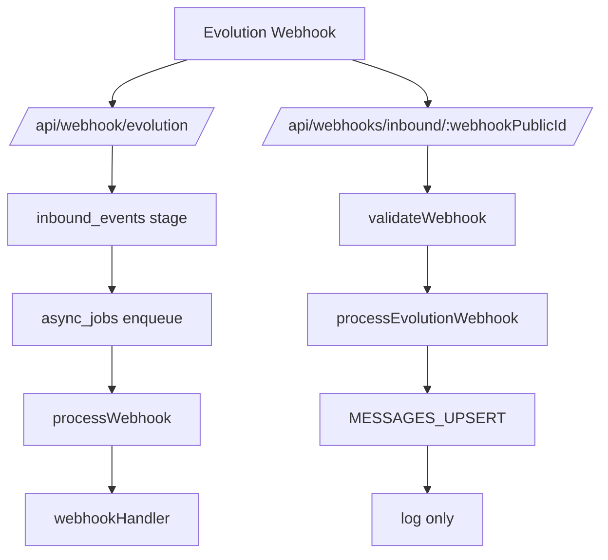
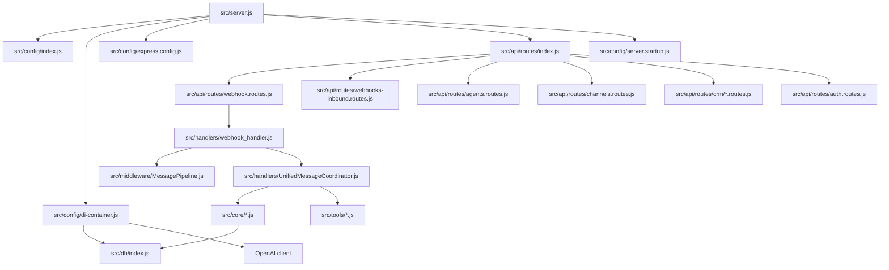
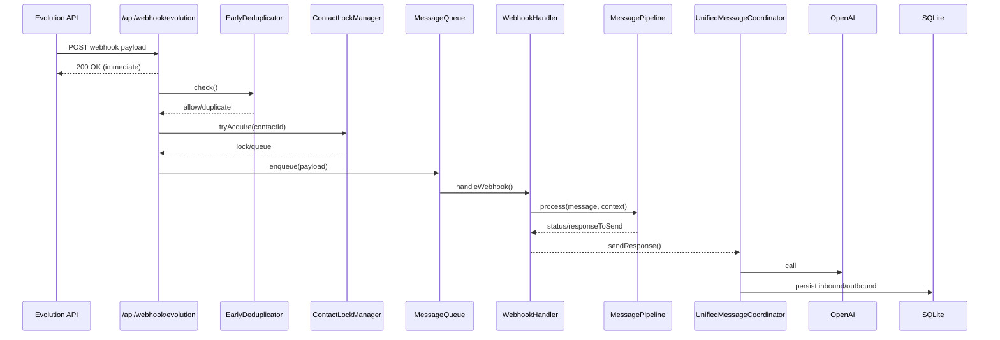
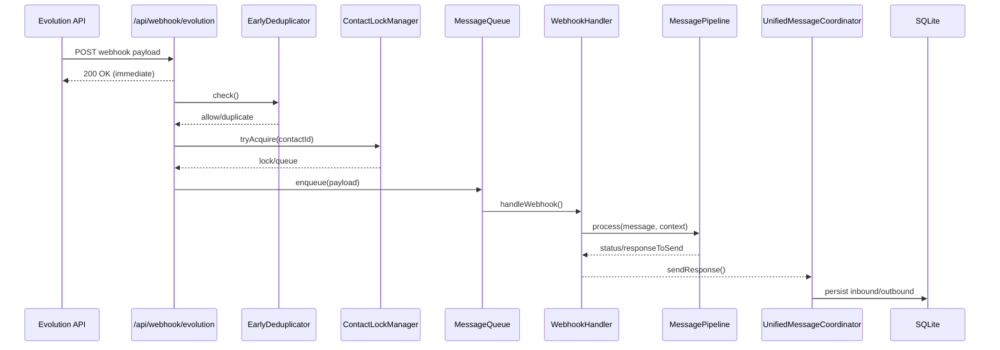
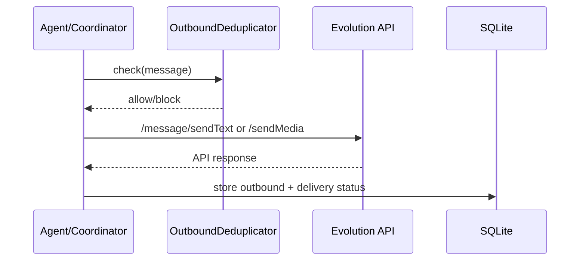
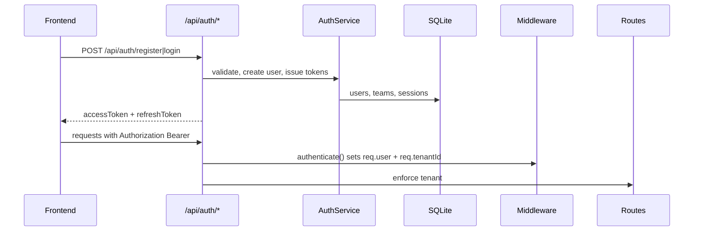

---
# Source: docs/analysis/00-inventory.md

# ETAPA 0 — Inventario

## 1) Estrutura do repo (pastas principais)

- `src/` — backend Node/Express, dominio, serviços, handlers, DB, automations, inteligência.
- `apps/web-vite/` — frontend React Router (Vite) com base `/app`.
- `apps/web/` — frontend Next.js (App Router) com base `/`.
- `public/` — assets estáticos e build servido pelo backend.
- `prompts/` — prompts e templates.
- `src/db/migrations/` e `src/platform/database/migrations/` — migrations SQLite.
- `scripts/`, `test/` — scripts e testes.

## 2) Entrypoints e boot

- Server HTTP: `src/server.js` (boot completo + middlewares + rotas + jobs).
  - Migration runner no boot: `src/server.js:129`.
  - DI container: `src/server.js:143`, `src/config/di-container.js:44`.
  - Express + middlewares: `src/server.js:231`, `src/config/express.config.js:81`.
- Worker: `src/worker.js` (jobs em background). `src/worker.js:118`.
- Start script: `start-orbion.js` (entrypoint de processo externo).
- PM2 config: `ecosystem.config.cjs`.

## 3) Mapa de modulos (pastas → responsabilidade)

- `src/api/routes/` — rotas Express.
- `src/api/controllers/` — controladores auxiliares.
- `src/middleware/` — auth, tenant, validação, rate limit.
- `src/services/` — regras de negocio e integrações (OAuth, jobs, entitlement).
- `src/repositories/` — acesso a dados (SQLite).
- `src/db/` — conexão, transações, migrations runner.
- `src/handlers/` — pipeline de mensagens e webhook.
- `src/tools/` — utilitarios de integração (WhatsApp, calendar, etc.).
- `src/automation/` — engines e cadências.
- `src/intelligence/` — IA, orquestracao, prompts.
- `src/platform/` e `src/scalable/` — camadas paralelas (runtime/experimentos).


---
# Source: docs/analysis/01-backend-express.md

# ETAPA 1 — Backend (Express)

## 1) Boot e montagem de rotas

- Boot e middlewares estao em `src/server.js` com `configureExpress(app)` e `app.use('/', routes)`; DI container e injetado em `app.set('container', container)` para middlewares/handlers acessarem o container. Evidencia: `src/server.js:231-257`.
- Todas as rotas Express sao agregadas por `src/api/routes/index.js` e montadas em ordem explicita (webhook, auth, agents, channels, webhooks-inbound, crm, etc.). Evidencia: `src/api/routes/index.js:60-105`.
- SPA fallback para `/app/*` e servido pelo backend (Vite app) apos rotas e antes do 404. Evidencia: `src/config/express.config.js:124-138`.

## 2) Mapa completo de rotas

- A tabela completa (404 rotas detectadas) esta em `docs/analysis/01-backend-routes.md` (copia do inventario automatico).
- Duplicidade relevante detectada: `/api/agents/my` e definido duas vezes no mesmo arquivo. Evidencia: `src/api/routes/agents.routes.js:181-202` e `src/api/routes/agents.routes.js:344-365`.

## 3) Rotas criticas (auth / integrations / webhook)

- Webhook Evolution legado: `POST /api/webhook/evolution` com staging + fila persistente, mas ainda mantendo locks em memoria e fallback para processamento imediato. Evidencia: `src/api/routes/webhook.routes.js:58-196`.
- Webhook multi-tenant: `POST /api/webhooks/inbound/:webhookPublicId` com validacao de secret. Evidencia: `src/api/routes/webhooks-inbound.routes.js:20-89` e `src/services/IntegrationService.js:586-654`.
- Evolution via dashboard (one-click): endpoints em `src/api/routes/channels.routes.js` para conectar, status, qrcode e disconnect. Evidencia: `src/api/routes/channels.routes.js:17-223`.
- Evolution legacy via agents: endpoints em `src/api/routes/agents.routes.js` usam `getEvolutionManager()` (scalable module). Evidencia: `src/api/routes/agents.routes.js:475-725`.

## 4) Riscos imediatos no mapa de rotas

- Dois pontos de entrada para webhooks (legacy + multi-tenant) coexistem. Isso exige cutover claro para evitar fluxo dividido. Evidencia: `src/api/routes/index.js:61-103`.
- O handler multi-tenant nao encaminha `MESSAGES_UPSERT` para o pipeline principal (so log). Evidencia: `src/api/routes/webhooks-inbound.routes.js:154-162`.
- Ha rotas de Evolution em dois modulos diferentes (channels vs agents), o que tende a gerar comportamentos divergentes se o frontend usar o endpoint errado. Evidencia: `src/api/routes/channels.routes.js:17-223` e `src/api/routes/agents.routes.js:475-725`.


---
# Source: docs/analysis/01-backend-routes.md

# Backend API Map (Express)

Total routes parsed: 404

| METHOD | PATH | FILE | HANDLER | MIDDLEWARES | VALIDATIONS | TENANT | DI/CONTAINER | DB DIRECT | DUPLICATE |
|---|---|---|---|---|---|---|---|---|---|
| GET | '/api/activities' | src/api/routes/activities.routes.js | inline | optionalAuth | - |  |  | yes |  |
| GET | '/api/activities/timeline' | src/api/routes/activities.routes.js | inline | optionalAuth | - |  |  | yes |  |
| GET | '/api/activities/overdue' | src/api/routes/activities.routes.js | inline | optionalAuth | - |  |  | yes |  |
| GET | '/api/activities/today' | src/api/routes/activities.routes.js | inline | optionalAuth | - |  |  | yes |  |
| GET | '/api/activities/upcoming' | src/api/routes/activities.routes.js | inline | optionalAuth | - |  |  | yes |  |
| GET | '/api/activities/stats' | src/api/routes/activities.routes.js | inline | optionalAuth | - |  |  | yes |  |
| GET | '/api/activities/:id' | src/api/routes/activities.routes.js | inline | - | - |  |  | yes |  |
| POST | '/api/activities' | src/api/routes/activities.routes.js | inline | optionalAuth | - |  |  | yes |  |
| PUT | '/api/activities/:id' | src/api/routes/activities.routes.js | inline | - | - |  |  | yes |  |
| PUT | '/api/activities/:id/complete' | src/api/routes/activities.routes.js | inline | - | - |  |  | yes |  |
| PUT | '/api/activities/:id/reschedule' | src/api/routes/activities.routes.js | inline | - | - |  |  | yes |  |
| DELETE | '/api/activities/:id' | src/api/routes/activities.routes.js | inline | - | - |  |  | yes |  |
| GET | '/api/health' | src/api/routes/admin.routes.js | inline | - | - |  |  |  |  |
| GET | '/api/stats' | src/api/routes/admin.routes.js | inline | - | - |  |  |  |  |
| POST | '/api/admin/clear-cache' | src/api/routes/admin.routes.js | inline | - | - |  |  |  |  |
| GET | '/api/admin/handlers-health' | src/api/routes/admin.routes.js | inline | - | - |  |  |  |  |
| GET | '/api/admin/system-health' | src/api/routes/admin.routes.js | inline | - | - |  |  |  |  |
| GET | '/api/admin/error-stats' | src/api/routes/admin.routes.js | inline | - | - |  |  |  |  |
| POST | '/api/admin/clear-old-errors' | src/api/routes/admin.routes.js | inline | - | - |  |  |  |  |
| GET | '/api/admin/coordinator/stats' | src/api/routes/admin.routes.js | inline | - | - |  |  |  |  |
| POST | '/api/admin/coordinator/emergency-cleanup' | src/api/routes/admin.routes.js | inline | - | - |  |  |  |  |
| GET | '/api/admin/audio/stats' | src/api/routes/admin.routes.js | inline | - | - |  |  |  |  |
| GET | '/api/admin/audio/status/:messageId' | src/api/routes/admin.routes.js | inline | - | - |  |  |  |  |
| GET | '/api/admin/context/stats' | src/api/routes/admin.routes.js | inline | - | - |  |  |  |  |
| GET | '/api/agents' | src/api/routes/agents.routes.js | inline | - | - | yes |  | yes |  |
| GET | '/api/agents/my' | src/api/routes/agents.routes.js | inline | authenticate, tenantContext | - | yes |  | yes | yes |
| GET | '/api/agents/:agentId' | src/api/routes/agents.routes.js | inline | validateAgentId | validateAgentId | yes |  | yes |  |
| POST | '/api/agents' | src/api/routes/agents.routes.js | inline | requireManager | - | yes |  | yes |  |
| PUT | '/api/agents/:agentId' | src/api/routes/agents.routes.js | inline | requireManager, validateAgentId | validateAgentId | yes |  | yes |  |
| DELETE | '/api/agents/:agentId' | src/api/routes/agents.routes.js | inline | requireManager, validateAgentId | validateAgentId | yes |  | yes |  |
| GET | '/api/admin/agents' | src/api/routes/agents.routes.js | inline | - | - | yes |  | yes |  |
| GET | '/api/agents/my' | src/api/routes/agents.routes.js | inline | authenticate, tenantContext | - | yes |  | yes | yes |
| GET | '/api/agents/:agentId/permissions' | src/api/routes/agents.routes.js | inline | authenticate, tenantContext, validateAgentId | validateAgentId | yes |  | yes |  |
| POST | '/api/agents/:agentId/duplicate' | src/api/routes/agents.routes.js | inline | authenticate, tenantContext, requireManager, validateAgentId, sanitizeInput | validateAgentId, sanitizeInput | yes |  | yes |  |
| GET | '/api/agents/:agentId/evolution/status' | src/api/routes/agents.routes.js | inline | authenticate, validateAgentId | validateAgentId | yes |  | yes |  |
| POST | '/api/agents/:agentId/evolution/create' | src/api/routes/agents.routes.js | inline | authenticate, tenantContext, requireManager, validateAgentId | validateAgentId | yes |  | yes |  |
| GET | '/api/agents/:agentId/evolution/qrcode' | src/api/routes/agents.routes.js | inline | authenticate, validateAgentId | validateAgentId | yes |  | yes |  |
| POST | '/api/agents/:agentId/evolution/disconnect' | src/api/routes/agents.routes.js | inline | authenticate, requireManager, validateAgentId | validateAgentId | yes |  | yes |  |
| DELETE | '/api/agents/:agentId/evolution' | src/api/routes/agents.routes.js | inline | authenticate, requireManager, validateAgentId | validateAgentId | yes |  | yes |  |
| GET | '/api/evolution/instances' | src/api/routes/agents.routes.js | inline | authenticate | - | yes |  | yes |  |
| GET | '/api/ai-insights/sentiment' | src/api/routes/ai-insights.routes.js | inline | optionalAuth | - |  |  | yes |  |
| GET | '/api/ai-insights/objections' | src/api/routes/ai-insights.routes.js | inline | optionalAuth | - |  |  | yes |  |
| GET | '/api/ai-insights/best-practices' | src/api/routes/ai-insights.routes.js | inline | optionalAuth | - |  |  | yes |  |
| GET | '/api/ai-insights/agent-performance' | src/api/routes/ai-insights.routes.js | inline | optionalAuth | - |  |  | yes |  |
| GET | '/api/ai-insights/recommendations' | src/api/routes/ai-insights.routes.js | inline | optionalAuth | - |  |  | yes |  |
| GET | '/api/analytics/whatsapp-stats' | src/api/routes/analytics.routes.js | inline | - | - |  |  | yes |  |
| GET | '/api/analytics/agent-metrics' | src/api/routes/analytics.routes.js | inline | - | - |  |  | yes |  |
| GET | '/api/analytics/overview' | src/api/routes/analytics.routes.js | inline | - | - |  |  | yes |  |
| GET | '/api/analytics/top-contacts' | src/api/routes/analytics.routes.js | inline | - | - |  |  | yes |  |
| GET | '/api/analytics/hourly' | src/api/routes/analytics.routes.js | inline | - | - |  |  | yes |  |
| GET | '/api/analytics/p2/stats' | src/api/routes/analytics.routes.js | inline | - | - |  |  | yes |  |
| GET | '/api/analytics/p2/abandonment-patterns' | src/api/routes/analytics.routes.js | inline | - | - |  |  | yes |  |
| GET | '/api/analytics/p2/experiments' | src/api/routes/analytics.routes.js | inline | - | - |  |  | yes |  |
| GET | '/api/analytics/p2/sentiment-summary' | src/api/routes/analytics.routes.js | inline | - | - |  |  | yes |  |
| GET | '/api/analytics/p2/insights-report' | src/api/routes/analytics.routes.js | inline | - | - |  |  | yes |  |
| POST | '/api/analytics/p2/create-experiment' | src/api/routes/analytics.routes.js | inline | - | - |  |  | yes |  |
| GET | '/api/analytics/learning/outcomes' | src/api/routes/analytics.routes.js | inline | - | - |  |  | yes |  |
| GET | '/api/analytics/learning/abandonment-job' | src/api/routes/analytics.routes.js | inline | - | - |  |  | yes |  |
| POST | '/api/analytics/learning/detect-abandonments' | src/api/routes/analytics.routes.js | inline | - | - |  |  | yes |  |
| GET | '/api/analytics/learning/abandonment-hotspots' | src/api/routes/analytics.routes.js | inline | - | - |  |  | yes |  |
| GET | '/api/analytics/learning/full-report' | src/api/routes/analytics.routes.js | inline | - | - |  |  | yes |  |
| GET | '/api/analytics/learning/activity' | src/api/routes/analytics.routes.js | inline | - | - |  |  | yes |  |
| GET | '/api/analytics/optimizer/status' | src/api/routes/analytics.routes.js | inline | - | - |  |  | yes |  |
| POST | '/api/analytics/optimizer/run-cycle' | src/api/routes/analytics.routes.js | inline | - | - |  |  | yes |  |
| GET | '/api/analytics/optimizer/stage-health' | src/api/routes/analytics.routes.js | inline | - | - |  |  | yes |  |
| GET | '/api/analytics/optimizer/optimizations' | src/api/routes/analytics.routes.js | inline | - | - |  |  | yes |  |
| POST | '/api/analytics/optimizer/start' | src/api/routes/analytics.routes.js | inline | - | - |  |  | yes |  |
| POST | '/api/analytics/optimizer/stop' | src/api/routes/analytics.routes.js | inline | - | - |  |  | yes |  |
| POST | '/api/analytics/optimizer/detect-risk' | src/api/routes/analytics.routes.js | inline | - | - |  |  | yes |  |
| GET | '/api/analytics/maturity-level' | src/api/routes/analytics.routes.js | inline | - | - |  |  | yes |  |
| POST | '/api/auth/create-user' | src/api/routes/auth.routes.js | inline | authenticate | - | yes |  | yes |  |
| POST | '/api/auth/login' | src/api/routes/auth.routes.js | inline | - | - | yes |  | yes |  |
| POST | '/api/auth/logout' | src/api/routes/auth.routes.js | inline | authenticate | - | yes |  | yes |  |
| POST | '/api/auth/refresh' | src/api/routes/auth.routes.js | inline | - | - | yes |  | yes |  |
| GET | '/api/auth/me' | src/api/routes/auth.routes.js | inline | authenticate | - | yes |  | yes |  |
| PUT | '/api/auth/password' | src/api/routes/auth.routes.js | inline | authenticate | - | yes |  | yes |  |
| GET | '/api/auth/sessions' | src/api/routes/auth.routes.js | inline | authenticate | - | yes |  | yes |  |
| DELETE | '/api/auth/sessions' | src/api/routes/auth.routes.js | inline | authenticate | - | yes |  | yes |  |
| GET | '/api/auth/entitlements' | src/api/routes/auth.routes.js | inline | authenticate | - | yes |  | yes |  |
| POST | '/api/auth/verify' | src/api/routes/auth.routes.js | inline | - | - | yes |  | yes |  |
| GET | '/api/automations' | src/api/routes/automation.routes.js | inline | - | - |  |  | yes |  |
| GET | '/api/automations/:id' | src/api/routes/automation.routes.js | inline | - | - |  |  | yes |  |
| POST | '/api/automations' | src/api/routes/automation.routes.js | inline | - | - |  |  | yes |  |
| PUT | '/api/automations/:id' | src/api/routes/automation.routes.js | inline | - | - |  |  | yes |  |
| DELETE | '/api/automations/:id' | src/api/routes/automation.routes.js | inline | - | - |  |  | yes |  |
| POST | '/api/automations/:id/toggle' | src/api/routes/automation.routes.js | inline | - | - |  |  | yes |  |
| POST | '/api/automations/:id/run' | src/api/routes/automation.routes.js | inline | - | - |  |  | yes |  |
| GET | '/api/automations/:id/executions' | src/api/routes/automation.routes.js | inline | - | - |  |  | yes |  |
| GET | '/api/automations/executions/recent' | src/api/routes/automation.routes.js | inline | - | - |  |  | yes |  |
| GET | '/api/automations/engine/stats' | src/api/routes/automation.routes.js | inline | - | - |  |  | yes |  |
| POST | '/api/automations/engine/initialize' | src/api/routes/automation.routes.js | inline | - | - |  |  | yes |  |
| GET | '/api/automations/templates' | src/api/routes/automation.routes.js | inline | - | - |  |  | yes |  |
| POST | '/api/automations/templates/:templateId/install' | src/api/routes/automation.routes.js | inline | - | - |  |  | yes |  |
| GET | '/api/cadences' | src/api/routes/cadence.routes.js | inline | - | - |  |  | yes |  |
| GET | '/api/cadences/stats' | src/api/routes/cadence.routes.js | inline | - | - |  |  | yes |  |
| GET | '/api/cadences/pipeline-view' | src/api/routes/cadence.routes.js | inline | - | - |  |  | yes |  |
| GET | '/api/cadences/:id' | src/api/routes/cadence.routes.js | inline | - | - |  |  | yes |  |
| GET | '/api/cadences/:id/steps' | src/api/routes/cadence.routes.js | inline | - | - |  |  | yes |  |
| POST | '/api/cadences/:id/enroll' | src/api/routes/cadence.routes.js | inline | - | - |  |  | yes |  |
| GET | '/api/cadences/enrollments/active' | src/api/routes/cadence.routes.js | inline | - | - |  |  | yes |  |
| PUT | '/api/cadences/enrollments/:id/pause' | src/api/routes/cadence.routes.js | inline | - | - |  |  | yes |  |
| PUT | '/api/cadences/enrollments/:id/resume' | src/api/routes/cadence.routes.js | inline | - | - |  |  | yes |  |
| PUT | '/api/cadences/enrollments/:id/respond' | src/api/routes/cadence.routes.js | inline | - | - |  |  | yes |  |
| GET | '/api/cadences/actions/pending' | src/api/routes/cadence.routes.js | inline | - | - |  |  | yes |  |
| POST | '/api/cadences/actions/execute' | src/api/routes/cadence.routes.js | inline | - | - |  |  | yes |  |
| POST | '/api/cadences/advance-day' | src/api/routes/cadence.routes.js | inline | - | - |  |  | yes |  |
| POST | '/api/calibration/test' | src/api/routes/calibration.routes.js | inline | - | - |  |  |  |  |
| GET | '/api/calibration/status' | src/api/routes/calibration.routes.js | inline | - | - |  |  |  |  |
| POST | '/api/agents/:agentId/channels/evolution/connect' | src/api/routes/channels.routes.js | inline | authenticate, tenantContext | - | yes |  |  |  |
| GET | '/api/agents/:agentId/channels/evolution/status' | src/api/routes/channels.routes.js | inline | authenticate, tenantContext | - | yes |  |  |  |
| GET | '/api/agents/:agentId/channels/evolution/qrcode' | src/api/routes/channels.routes.js | inline | authenticate, tenantContext | - | yes |  |  |  |
| POST | '/api/agents/:agentId/channels/evolution/disconnect' | src/api/routes/channels.routes.js | inline | authenticate, tenantContext | - | yes |  |  |  |
| GET | '/api/integrations' | src/api/routes/channels.routes.js | inline | authenticate, tenantContext | - | yes |  |  |  |
| GET | '/api/integrations/:integrationId' | src/api/routes/channels.routes.js | inline | authenticate, tenantContext | - | yes |  |  |  |
| GET | '/api/integrations/:integrationId/status' | src/api/routes/channels.routes.js | inline | authenticate, tenantContext | - | yes |  |  |  |
| GET | '/api/clientes' | src/api/routes/clientes.routes.js | inline | - | - |  |  | yes |  |
| POST | '/api/clientes/from-opportunity' | src/api/routes/clientes.routes.js | inline | - | - |  |  | yes |  |
| GET | '/api/clientes/:id' | src/api/routes/clientes.routes.js | inline | - | - |  |  | yes |  |
| PUT | '/api/clientes/:id/status' | src/api/routes/clientes.routes.js | inline | - | - |  |  | yes |  |
| POST | '/api/clientes/:id/greeting' | src/api/routes/clientes.routes.js | inline | - | - |  |  | yes |  |
| POST | '/api/clientes/:id/followup' | src/api/routes/clientes.routes.js | inline | - | - |  |  | yes |  |
| GET | '/api/command-center/overview' | src/api/routes/command-center.routes.js | inline | optionalAuth | - |  |  | yes |  |
| GET | '/api/command-center/tasks/urgent' | src/api/routes/command-center.routes.js | inline | optionalAuth | - |  |  | yes |  |
| GET | '/api/command-center/hot-leads' | src/api/routes/command-center.routes.js | inline | optionalAuth | - |  |  | yes |  |
| GET | '/api/command-center/activity-feed' | src/api/routes/command-center.routes.js | inline | optionalAuth | - |  |  | yes |  |
| GET | '/api/command-center/pipeline-summary' | src/api/routes/command-center.routes.js | inline | optionalAuth | - |  |  | yes |  |
| GET | '/api/command-center/performance' | src/api/routes/command-center.routes.js | inline | optionalAuth | - |  |  | yes |  |
| GET | '/api/crm/accounts' | src/api/routes/crm/accounts.routes.js | inline | - | - |  |  |  |  |
| GET | '/api/crm/accounts/stats' | src/api/routes/crm/accounts.routes.js | inline | - | - |  |  |  |  |
| GET | '/api/crm/accounts/:id' | src/api/routes/crm/accounts.routes.js | inline | - | - |  |  |  |  |
| POST | '/api/crm/accounts' | src/api/routes/crm/accounts.routes.js | inline | - | - |  |  |  |  |
| PUT | '/api/crm/accounts/:id' | src/api/routes/crm/accounts.routes.js | inline | - | - |  |  |  |  |
| DELETE | '/api/crm/accounts/:id' | src/api/routes/crm/accounts.routes.js | inline | - | - |  |  |  |  |
| GET | '/api/crm/contacts' | src/api/routes/crm/contacts.routes.js | inline | - | - |  |  |  |  |
| GET | '/api/crm/contacts/stats' | src/api/routes/crm/contacts.routes.js | inline | - | - |  |  |  |  |
| GET | '/api/crm/contacts/:id' | src/api/routes/crm/contacts.routes.js | inline | - | - |  |  |  |  |
| POST | '/api/crm/contacts' | src/api/routes/crm/contacts.routes.js | inline | - | - |  |  |  |  |
| PUT | '/api/crm/contacts/:id' | src/api/routes/crm/contacts.routes.js | inline | - | - |  |  |  |  |
| DELETE | '/api/crm/contacts/:id' | src/api/routes/crm/contacts.routes.js | inline | - | - |  |  |  |  |
| POST | '/api/crm/contacts/:id/consent' | src/api/routes/crm/contacts.routes.js | inline | - | - |  |  |  |  |
| PUT | '/api/crm/contacts/:id/score' | src/api/routes/crm/contacts.routes.js | inline | - | - |  |  |  |  |
| GET | '/crm' | src/api/routes/crm/dashboard.routes.js | inline | - | - |  |  |  |  |
| GET | '/crm/' | src/api/routes/crm/dashboard.routes.js | inline | - | - |  |  |  |  |
| GET | '/crm/leads' | src/api/routes/crm/dashboard.routes.js | inline | - | - |  |  |  |  |
| GET | '/crm/pipeline' | src/api/routes/crm/dashboard.routes.js | inline | - | - |  |  |  |  |
| GET | '/crm/accounts' | src/api/routes/crm/dashboard.routes.js | inline | - | - |  |  |  |  |
| GET | '/crm/contacts' | src/api/routes/crm/dashboard.routes.js | inline | - | - |  |  |  |  |
| GET | '/api/crm/leads' | src/api/routes/crm/leads.routes.js | inline | - | - |  |  |  |  |
| GET | '/api/crm/leads/stats' | src/api/routes/crm/leads.routes.js | inline | - | - |  |  |  |  |
| GET | '/api/crm/leads/:id' | src/api/routes/crm/leads.routes.js | inline | - | - |  |  |  |  |
| POST | '/api/crm/leads' | src/api/routes/crm/leads.routes.js | inline | - | - |  |  |  |  |
| PUT | '/api/crm/leads/:id' | src/api/routes/crm/leads.routes.js | inline | - | - |  |  |  |  |
| DELETE | '/api/crm/leads/:id' | src/api/routes/crm/leads.routes.js | inline | - | - |  |  |  |  |
| PUT | '/api/crm/leads/:id/status' | src/api/routes/crm/leads.routes.js | inline | - | - |  |  |  |  |
| PUT | '/api/crm/leads/:id/bant' | src/api/routes/crm/leads.routes.js | inline | - | - |  |  |  |  |
| POST | '/api/crm/leads/:id/convert' | src/api/routes/crm/leads.routes.js | inline | - | - |  |  |  |  |
| GET | '/api/crm/opportunities' | src/api/routes/crm/opportunities.routes.js | inline | - | - |  |  |  |  |
| GET | '/api/crm/opportunities/pipeline' | src/api/routes/crm/opportunities.routes.js | inline | - | - |  |  |  |  |
| GET | '/api/crm/opportunities/:id' | src/api/routes/crm/opportunities.routes.js | inline | - | - |  |  |  |  |
| POST | '/api/crm/opportunities' | src/api/routes/crm/opportunities.routes.js | inline | - | - |  |  |  |  |
| PUT | '/api/crm/opportunities/:id' | src/api/routes/crm/opportunities.routes.js | inline | - | - |  |  |  |  |
| DELETE | '/api/crm/opportunities/:id' | src/api/routes/crm/opportunities.routes.js | inline | - | - |  |  |  |  |
| PUT | '/api/crm/opportunities/:id/stage' | src/api/routes/crm/opportunities.routes.js | inline | - | - |  |  |  |  |
| POST | '/api/crm/opportunities/:id/win' | src/api/routes/crm/opportunities.routes.js | inline | - | - |  |  |  |  |
| POST | '/api/crm/opportunities/:id/lose' | src/api/routes/crm/opportunities.routes.js | inline | - | - |  |  |  |  |
| POST | '/api/crm/opportunities/:id/products' | src/api/routes/crm/opportunities.routes.js | inline | - | - |  |  |  |  |
| DELETE | '/api/crm/opportunities/:id/products/:productId' | src/api/routes/crm/opportunities.routes.js | inline | - | - |  |  |  |  |
| GET | '/api/integrations/crm/:provider/oauth/start' | src/api/routes/crm-integration.routes.js | inline | authenticate, tenantContext | - | yes |  | yes |  |
| GET | '/api/integrations/oauth/callback/:provider' | src/api/routes/crm-integration.routes.js | inline | - | - | yes |  | yes |  |
| POST | '/api/integrations/:integrationId/disconnect' | src/api/routes/crm-integration.routes.js | inline | authenticate, tenantContext | - | yes |  | yes |  |
| POST | '/api/integrations/:integrationId/sync' | src/api/routes/crm-integration.routes.js | inline | authenticate, tenantContext | - | yes |  | yes |  |
| GET | '/api/integrations/:integrationId/pipelines' | src/api/routes/crm-integration.routes.js | inline | authenticate, tenantContext | - | yes |  | yes |  |
| POST | '/api/integrations/:integrationId/leads' | src/api/routes/crm-integration.routes.js | inline | authenticate, tenantContext | - | yes |  | yes |  |
| GET | '/api/integrations/:integrationId/test' | src/api/routes/crm-integration.routes.js | inline | authenticate, tenantContext | - | yes |  | yes |  |
| GET | '/' | src/api/routes/dashboard.routes.js | inline | - | - |  |  |  | yes |
| POST | '/api/tts/elevenlabs' | src/api/routes/dashboard.routes.js | inline | - | - |  |  |  |  |
| POST | '/api/chat' | src/api/routes/dashboard.routes.js | inline | - | - |  |  |  |  |
| POST | '/api/dashboard/voice-navigate' | src/api/routes/dashboard.routes.js | inline | - | - |  |  |  |  |
| POST | '/api/dashboard/execute-navigation' | src/api/routes/dashboard.routes.js | inline | - | - |  |  |  |  |
| GET | '/api/dashboard/voice-commands' | src/api/routes/dashboard.routes.js | inline | - | - |  |  |  |  |
| GET | '/api/debug/sheets' | src/api/routes/debug.routes.js | inline | - | - |  |  |  |  |
| GET | '/api/email-optin/status' | src/api/routes/email-optin.routes.js | inline | - | - |  |  | yes |  |
| GET | '/api/email-optin/stats' | src/api/routes/email-optin.routes.js | inline | - | - |  |  | yes |  |
| POST | '/api/email-optin/start' | src/api/routes/email-optin.routes.js | inline | - | - |  |  | yes |  |
| POST | '/api/email-optin/stop' | src/api/routes/email-optin.routes.js | inline | - | - |  |  | yes |  |
| POST | '/api/email-optin/pause' | src/api/routes/email-optin.routes.js | inline | - | - |  |  | yes |  |
| POST | '/api/email-optin/resume' | src/api/routes/email-optin.routes.js | inline | - | - |  |  | yes |  |
| POST | '/api/email-optin/import' | src/api/routes/email-optin.routes.js | inline | - | - |  |  | yes |  |
| POST | '/api/email-optin/send-single' | src/api/routes/email-optin.routes.js | inline | - | - |  |  | yes |  |
| GET | '/api/email-optin/pending' | src/api/routes/email-optin.routes.js | inline | - | - |  |  | yes |  |
| GET | '/api/email-optin/sent' | src/api/routes/email-optin.routes.js | inline | - | - |  |  | yes |  |
| GET | '/api/email-optin/eligible' | src/api/routes/email-optin.routes.js | inline | - | - |  |  | yes |  |
| POST | '/api/email-optin/config' | src/api/routes/email-optin.routes.js | inline | - | - |  |  | yes |  |
| POST | '/api/email-optin/mark-eligible' | src/api/routes/email-optin.routes.js | inline | - | - |  |  | yes |  |
| GET | '/api/forecasting/pipeline-weighted' | src/api/routes/forecasting.routes.js | inline | optionalAuth | - |  |  | yes |  |
| GET | '/api/forecasting/scenarios' | src/api/routes/forecasting.routes.js | inline | optionalAuth | - |  |  | yes |  |
| GET | '/api/forecasting/velocity' | src/api/routes/forecasting.routes.js | inline | optionalAuth | - |  |  | yes |  |
| GET | '/api/forecasting/win-rate' | src/api/routes/forecasting.routes.js | inline | optionalAuth | - |  |  | yes |  |
| GET | '/api/forecasting/trends' | src/api/routes/forecasting.routes.js | inline | optionalAuth | - |  |  | yes |  |
| GET | '/api/forecasting/monthly' | src/api/routes/forecasting.routes.js | inline | optionalAuth | - |  |  | yes |  |
| GET | '/api/funil/bant' | src/api/routes/funil.routes.js | inline | - | - |  |  | yes |  |
| GET | '/api/funil/stats' | src/api/routes/funil.routes.js | inline | - | - |  |  | yes |  |
| GET | '/api/funil/bant/:contactId' | src/api/routes/funil.routes.js | inline | - | - |  |  | yes |  |
| POST | '/api/leads/update-stage' | src/api/routes/funil.routes.js | inline | - | - |  |  | yes | yes |
| POST | '/api/funil/cleanup-prospecting' | src/api/routes/funil.routes.js | inline | - | - |  |  | yes |  |
| POST | '/api/funil/sheets-sync/enable' | src/api/routes/funil.routes.js | inline | - | - |  |  | yes |  |
| POST | '/api/funil/sheets-sync/disable' | src/api/routes/funil.routes.js | inline | - | - |  |  | yes |  |
| POST | '/api/funil/sync-to-sheets' | src/api/routes/funil.routes.js | inline | - | - |  |  | yes |  |
| GET | '/api/funil/pipeline-unificado' | src/api/routes/funil.routes.js | inline | - | - |  |  | yes |  |
| POST | '/api/leads/ingest' | src/api/routes/funil.routes.js | inline | - | - |  |  | yes |  |
| GET | '/api/leads/ingest/stats' | src/api/routes/funil.routes.js | inline | - | - |  |  | yes |  |
| GET | '/api/google/auth-url' | src/api/routes/google/calendar.routes.js | inline | - | - |  |  |  |  |
| GET | '/api/google/auth-status' | src/api/routes/google/calendar.routes.js | inline | - | - |  |  |  |  |
| GET | '/auth/google' | src/api/routes/google/calendar.routes.js | inline | - | - |  |  |  |  |
| GET | '/oauth2callback' | src/api/routes/google/calendar.routes.js | inline | - | - |  |  |  |  |
| GET | '/api/calendar/status' | src/api/routes/google/calendar.routes.js | inline | - | - |  |  |  |  |
| GET | '/api/events' | src/api/routes/google/calendar.routes.js | inline | - | - |  |  |  |  |
| POST | '/api/events' | src/api/routes/google/calendar.routes.js | inline | - | - |  |  |  |  |
| PUT | '/api/events/:eventId' | src/api/routes/google/calendar.routes.js | inline | - | - |  |  |  |  |
| DELETE | '/api/events/:eventId' | src/api/routes/google/calendar.routes.js | inline | - | - |  |  |  |  |
| GET | '/api/calendar/free-slots' | src/api/routes/google/calendar.routes.js | inline | - | - |  |  |  |  |
| POST | '/api/calendar/suggest-times' | src/api/routes/google/calendar.routes.js | inline | - | - |  |  |  |  |
| GET | '/api/leads' | src/api/routes/google/sheets.routes.js | inline | - | - |  |  |  | yes |
| GET | '/api/dashboard/leads' | src/api/routes/google/sheets.routes.js | inline | - | - |  |  |  |  |
| GET | '/health' | src/api/routes/health.routes.js | inline | - | - |  | yes |  | yes |
| GET | '/health/detailed' | src/api/routes/health.routes.js | inline | - | - |  | yes |  |  |
| GET | '/health/ready' | src/api/routes/health.routes.js | inline | - | - |  | yes |  |  |
| GET | '/health/live' | src/api/routes/health.routes.js | inline | - | - |  | yes |  |  |
| GET | '/api/version' | src/api/routes/health.routes.js | inline | - | - |  | yes |  | yes |
| GET | '/api/scoring/rules' | src/api/routes/lead-scoring.routes.js | inline | - | - |  |  | yes |  |
| GET | '/api/scoring/rules/:id' | src/api/routes/lead-scoring.routes.js | inline | - | - |  |  | yes |  |
| POST | '/api/scoring/rules' | src/api/routes/lead-scoring.routes.js | inline | - | - |  |  | yes |  |
| PUT | '/api/scoring/rules/:id' | src/api/routes/lead-scoring.routes.js | inline | - | - |  |  | yes |  |
| DELETE | '/api/scoring/rules/:id' | src/api/routes/lead-scoring.routes.js | inline | - | - |  |  | yes |  |
| PUT | '/api/scoring/rules/:id/toggle' | src/api/routes/lead-scoring.routes.js | inline | - | - |  |  | yes |  |
| POST | '/api/scoring/calculate/:leadId' | src/api/routes/lead-scoring.routes.js | inline | - | - |  |  | yes |  |
| POST | '/api/scoring/calculate-all' | src/api/routes/lead-scoring.routes.js | inline | - | - |  |  | yes |  |
| GET | '/api/scoring/leaderboard' | src/api/routes/lead-scoring.routes.js | inline | - | - |  |  | yes |  |
| GET | '/api/scoring/lead/:leadId' | src/api/routes/lead-scoring.routes.js | inline | - | - |  |  | yes |  |
| GET | '/api/scoring/lead/:leadId/history' | src/api/routes/lead-scoring.routes.js | inline | - | - |  |  | yes |  |
| GET | '/api/scoring/stats' | src/api/routes/lead-scoring.routes.js | inline | - | - |  |  | yes |  |
| GET | '/api/learning/report' | src/api/routes/learning.routes.js | inline | - | - |  |  | yes |  |
| GET | '/api/learning/patterns' | src/api/routes/learning.routes.js | inline | - | - |  |  | yes |  |
| GET | '/api/learning/score/:contactId' | src/api/routes/learning.routes.js | inline | - | - |  |  | yes |  |
| GET | '/api/learning/intelligence/dashboard' | src/api/routes/learning.routes.js | inline | - | - |  |  | yes |  |
| GET | '/api/learning/adaptations' | src/api/routes/learning.routes.js | inline | - | - |  |  | yes |  |
| GET | '/api/learning/abandonment-patterns' | src/api/routes/learning.routes.js | inline | - | - |  |  | yes |  |
| POST | '/api/learning/patterns/refresh' | src/api/routes/learning.routes.js | inline | - | - |  |  | yes |  |
| GET | '/api/learning/experiments' | src/api/routes/learning.routes.js | inline | - | - |  |  | yes |  |
| POST | '/api/meetings/transcriptions/fetch-by-event' | src/api/routes/meetings.routes.js | inline | - | - |  |  |  |  |
| POST | '/api/meetings/transcriptions/fetch-by-type' | src/api/routes/meetings.routes.js | inline | - | - |  |  |  |  |
| POST | '/api/meetings/transcriptions/fetch-recent' | src/api/routes/meetings.routes.js | inline | - | - |  |  |  |  |
| GET | '/api/meetings/transcriptions/:id' | src/api/routes/meetings.routes.js | inline | - | - |  |  |  |  |
| GET | '/api/meetings/transcriptions' | src/api/routes/meetings.routes.js | inline | - | - |  |  |  |  |
| POST | '/api/meetings/analyze/:transcriptionId' | src/api/routes/meetings.routes.js | inline | - | - |  |  |  |  |
| POST | '/api/meetings/analyze/quick' | src/api/routes/meetings.routes.js | inline | - | - |  |  |  |  |
| GET | '/api/meetings/analysis/:id' | src/api/routes/meetings.routes.js | inline | - | - |  |  |  |  |
| GET | '/api/meetings/analysis/by-meeting/:meetingId' | src/api/routes/meetings.routes.js | inline | - | - |  |  |  |  |
| GET | '/api/meetings/scores/excellent' | src/api/routes/meetings.routes.js | inline | - | - |  |  |  |  |
| GET | '/api/meetings/scores/bant-qualified' | src/api/routes/meetings.routes.js | inline | - | - |  |  |  |  |
| GET | '/api/meetings/scores/stats' | src/api/routes/meetings.routes.js | inline | - | - |  |  |  |  |
| GET | '/api/meetings/insights/high-priority' | src/api/routes/meetings.routes.js | inline | - | - |  |  |  |  |
| PATCH | '/api/meetings/insights/:id/status' | src/api/routes/meetings.routes.js | inline | - | - |  |  |  |  |
| GET | '/api/meetings/insights/stats' | src/api/routes/meetings.routes.js | inline | - | - |  |  |  |  |
| GET | '/api/meetings/auth/google/url' | src/api/routes/meetings.routes.js | inline | - | - |  |  |  |  |
| POST | '/api/meetings/auth/google/callback' | src/api/routes/meetings.routes.js | inline | - | - |  |  |  |  |
| GET | '/api/metrics' | src/api/routes/metrics.routes.js | inline | - | - |  |  |  |  |
| GET | '/api/metrics/summary' | src/api/routes/metrics.routes.js | inline | - | - |  |  |  |  |
| POST | '/api/metrics/reset' | src/api/routes/metrics.routes.js | inline | - | - |  |  |  |  |
| GET | '/api/notifications' | src/api/routes/notifications.routes.js | inline | optionalAuth | - |  |  | yes |  |
| GET | '/api/notifications/unread-count' | src/api/routes/notifications.routes.js | inline | optionalAuth | - |  |  | yes |  |
| GET | '/api/notifications/:id' | src/api/routes/notifications.routes.js | inline | - | - |  |  | yes |  |
| POST | '/api/notifications' | src/api/routes/notifications.routes.js | inline | - | - |  |  | yes |  |
| POST | '/api/notifications/broadcast' | src/api/routes/notifications.routes.js | inline | - | - |  |  | yes |  |
| PUT | '/api/notifications/:id/read' | src/api/routes/notifications.routes.js | inline | - | - |  |  | yes |  |
| PUT | '/api/notifications/read-all' | src/api/routes/notifications.routes.js | inline | optionalAuth | - |  |  | yes |  |
| DELETE | '/api/notifications/:id' | src/api/routes/notifications.routes.js | inline | - | - |  |  | yes |  |
| DELETE | '/api/notifications/old' | src/api/routes/notifications.routes.js | inline | - | - |  |  | yes |  |
| GET | '/api/notifications/preferences' | src/api/routes/notifications.routes.js | inline | optionalAuth | - |  |  | yes |  |
| PUT | '/api/notifications/preferences' | src/api/routes/notifications.routes.js | inline | optionalAuth | - |  |  | yes |  |
| GET | '/api/pipeline' | src/api/routes/pipeline.routes.js | inline | - | - |  |  | yes |  |
| GET | '/api/pipeline/stats' | src/api/routes/pipeline.routes.js | inline | - | - |  |  | yes |  |
| POST | '/api/pipeline' | src/api/routes/pipeline.routes.js | inline | - | - |  |  | yes |  |
| PUT | '/api/pipeline/:id/stage' | src/api/routes/pipeline.routes.js | inline | - | - |  |  | yes |  |
| PUT | '/api/pipeline/:id' | src/api/routes/pipeline.routes.js | inline | - | - |  |  | yes |  |
| GET | '/api/pipeline/:id' | src/api/routes/pipeline.routes.js | inline | - | - |  |  | yes |  |
| GET | '/api/ports/status' | src/api/routes/ports.routes.js | inline | - | - |  |  |  |  |
| GET | '/api/ports/available' | src/api/routes/ports.routes.js | inline | - | - |  |  |  |  |
| POST | '/api/ports/release/:port' | src/api/routes/ports.routes.js | inline | - | - |  |  |  |  |
| POST | '/api/prospecting/start' | src/api/routes/prospecting.routes.js | inline | optionalAuth | - |  |  |  |  |
| POST | '/api/prospecting/stop' | src/api/routes/prospecting.routes.js | inline | optionalAuth | - |  |  |  |  |
| POST | '/api/prospecting/pause' | src/api/routes/prospecting.routes.js | inline | optionalAuth | - |  |  |  |  |
| POST | '/api/prospecting/resume' | src/api/routes/prospecting.routes.js | inline | optionalAuth | - |  |  |  |  |
| GET | '/api/prospecting/status' | src/api/routes/prospecting.routes.js | inline | optionalAuth | - |  |  |  |  |
| GET | '/api/prospecting/metrics' | src/api/routes/prospecting.routes.js | inline | optionalAuth | - |  |  |  |  |
| GET | '/api/prospecting/history' | src/api/routes/prospecting.routes.js | inline | optionalAuth | - |  |  |  |  |
| POST | '/api/prospecting/config' | src/api/routes/prospecting.routes.js | inline | optionalAuth | - |  |  |  |  |
| POST | '/api/prospecting/template' | src/api/routes/prospecting.routes.js | inline | optionalAuth | - |  |  |  |  |
| POST | '/api/prospecting/manual' | src/api/routes/prospecting.routes.js | inline | optionalAuth | - |  |  |  |  |
| POST | '/api/prospecting/test' | src/api/routes/prospecting.routes.js | inline | optionalAuth | - |  |  |  |  |
| POST | '/api/prospecting/reset' | src/api/routes/prospecting.routes.js | inline | optionalAuth | - |  |  |  |  |
| GET | '/api/prospecting/sync/status' | src/api/routes/prospecting.routes.js | inline | optionalAuth | - |  |  |  |  |
| POST | '/api/prospecting/sync/now' | src/api/routes/prospecting.routes.js | inline | optionalAuth | - |  |  |  |  |
| GET | '/api/prospecting/prospects/stats' | src/api/routes/prospecting.routes.js | inline | optionalAuth | - |  |  |  |  |
| GET | '/api/reports/summary' | src/api/routes/reports.routes.js | inline | optionalAuth | - |  |  | yes |  |
| GET | '/api/reports/templates' | src/api/routes/reports.routes.js | inline | - | - |  |  | yes |  |
| POST | '/api/reports/generate' | src/api/routes/reports.routes.js | inline | optionalAuth | - |  |  | yes |  |
| GET | '/api/reports/export/:format' | src/api/routes/reports.routes.js | inline | optionalAuth | - |  |  | yes |  |
| GET | '/api/team/users' | src/api/routes/team.routes.js | inline | - | - |  |  | yes |  |
| GET | '/api/team/users/:id' | src/api/routes/team.routes.js | inline | - | - |  |  | yes |  |
| POST | '/api/team/users' | src/api/routes/team.routes.js | inline | - | - |  |  | yes |  |
| PUT | '/api/team/users/:id' | src/api/routes/team.routes.js | inline | - | - |  |  | yes |  |
| DELETE | '/api/team/users/:id' | src/api/routes/team.routes.js | inline | - | - |  |  | yes |  |
| GET | '/api/team/users/:id/performance' | src/api/routes/team.routes.js | inline | - | - |  |  | yes |  |
| GET | '/api/team/leaderboard' | src/api/routes/team.routes.js | inline | - | - |  |  | yes |  |
| GET | '/api/teams' | src/api/routes/team.routes.js | inline | - | - |  |  | yes |  |
| GET | '/api/team/teams' | src/api/routes/team.routes.js | inline | - | - |  |  | yes |  |
| GET | '/api/team/teams/:id' | src/api/routes/team.routes.js | inline | - | - |  |  | yes |  |
| POST | '/api/team/teams' | src/api/routes/team.routes.js | inline | - | - |  |  | yes |  |
| PUT | '/api/team/teams/:id' | src/api/routes/team.routes.js | inline | - | - |  |  | yes |  |
| DELETE | '/api/team/teams/:id' | src/api/routes/team.routes.js | inline | - | - |  |  | yes |  |
| POST | '/api/team/teams/:id/members' | src/api/routes/team.routes.js | inline | - | - |  |  | yes |  |
| DELETE | '/api/team/teams/:id/members/:userId' | src/api/routes/team.routes.js | inline | - | - |  |  | yes |  |
| GET | '/api/team/teams/:id/performance' | src/api/routes/team.routes.js | inline | - | - |  |  | yes |  |
| GET | '/api/version' | src/api/routes/version.routes.js | inline | - | - |  | yes | yes | yes |
| GET | '/api/version/short' | src/api/routes/version.routes.js | inline | - | - |  | yes | yes |  |
| GET | '/health/version' | src/api/routes/version.routes.js | inline | - | - |  | yes | yes |  |
| POST | '/api/webhook/evolution' | src/api/routes/webhook.routes.js | inline | rateLimitWebhook, validateWebhookRequest | validateWebhookRequest |  |  | yes |  |
| GET | '/api/webhook/health' | src/api/routes/webhook.routes.js | inline | - | - |  |  | yes |  |
| GET | '/api/webhook/coordinator/stats' | src/api/routes/webhook.routes.js | inline | - | - |  |  | yes |  |
| POST | '/api/webhook/coordinator/emergency-cleanup' | src/api/routes/webhook.routes.js | inline | - | - |  |  | yes |  |
| POST | '/api/webhooks/inbound/:webhookPublicId' | src/api/routes/webhooks-inbound.routes.js | inline | - | - |  |  | yes |  |
| POST | '/api/website/contact' | src/api/routes/website.routes.js | inline | - | - |  |  |  |  |
| POST | '/api/website/newsletter' | src/api/routes/website.routes.js | inline | - | - |  |  |  |  |
| GET | '/api/website/health' | src/api/routes/website.routes.js | inline | - | - |  |  |  |  |
| POST | '/api/whatsapp/send' | src/api/routes/whatsapp.routes.js | inline | - | - |  |  |  |  |
| POST | '/api/campaign/run' | src/api/routes/whatsapp.routes.js | inline | - | - |  |  |  |  |
| GET | '/api/whatsapp/campaign-status' | src/api/routes/whatsapp.routes.js | inline | - | - |  |  |  |  |
| POST | '/api/whatsapp/intelligent-campaign' | src/api/routes/whatsapp.routes.js | inline | - | - |  |  |  |  |
| GET | '/api/leads' | src/api/routes/whatsapp.routes.js | inline | - | - |  |  |  | yes |
| POST | '/api/leads/update-stage' | src/api/routes/whatsapp.routes.js | inline | - | - |  |  |  | yes |
| GET | '/' | src/platform/api/routes/agents.routes.js | inline | - | - |  |  |  | yes |
| GET | '/:id' | src/platform/api/routes/agents.routes.js | inline | - | - |  |  |  | yes |
| POST | '/' | src/platform/api/routes/agents.routes.js | inline | - | - |  |  |  | yes |
| PUT | '/:id' | src/platform/api/routes/agents.routes.js | inline | - | - |  |  |  | yes |
| DELETE | '/:id' | src/platform/api/routes/agents.routes.js | inline | - | - |  |  |  | yes |
| POST | '/preview' | src/platform/api/routes/agents.routes.js | inline | - | - |  |  |  |  |
| GET | '/:id/prompt' | src/platform/api/routes/agents.routes.js | inline | - | - |  |  |  |  |
| GET | '/:id/state' | src/platform/api/routes/agents.routes.js | inline | - | - |  |  |  |  |
| POST | '/from-template' | src/platform/api/routes/agents.routes.js | inline | - | - |  |  |  | yes |
| GET | '/templates/list' | src/platform/api/routes/agents.routes.js | inline | - | - |  |  |  |  |
| POST | '/process' | src/platform/api/routes/runtime.routes.js | inline | - | - |  |  |  |  |
| POST | '/chat' | src/platform/api/routes/runtime.routes.js | inline | - | - |  |  |  |  |
| POST | '/simulate' | src/platform/api/routes/runtime.routes.js | inline | - | - |  |  |  |  |
| GET | '/states' | src/platform/api/routes/runtime.routes.js | inline | - | - |  |  |  |  |
| POST | '/qualify' | src/platform/api/routes/runtime.routes.js | inline | - | - |  |  |  |  |
| POST | '/extract' | src/platform/api/routes/runtime.routes.js | inline | - | - |  |  |  |  |
| GET | '/questions/:stage' | src/platform/api/routes/runtime.routes.js | inline | - | - |  |  |  |  |
| POST | '/webhook' | src/platform/api/routes/runtime.routes.js | inline | - | - |  |  |  |  |
| GET | '/' | src/scalable/agents/AgentApiRoutes.js | inline | - | - |  |  |  | yes |
| GET | '/stats' | src/scalable/agents/AgentApiRoutes.js | inline | - | - |  |  |  |  |
| GET | '/types' | src/scalable/agents/AgentApiRoutes.js | inline | - | - |  |  |  |  |
| GET | '/statuses' | src/scalable/agents/AgentApiRoutes.js | inline | - | - |  |  |  |  |
| GET | '/templates' | src/scalable/agents/AgentApiRoutes.js | inline | - | - |  |  |  |  |
| GET | '/templates/fields' | src/scalable/agents/AgentApiRoutes.js | inline | - | - |  |  |  |  |
| GET | '/templates/:templateId' | src/scalable/agents/AgentApiRoutes.js | inline | - | - |  |  |  |  |
| POST | '/templates/:templateId/preview' | src/scalable/agents/AgentApiRoutes.js | inline | - | - |  |  |  |  |
| POST | '/templates/:templateId/create' | src/scalable/agents/AgentApiRoutes.js | inline | - | - |  |  |  |  |
| POST | '/templates/:templateId/validate' | src/scalable/agents/AgentApiRoutes.js | inline | - | - |  |  |  |  |
| GET | '/:id' | src/scalable/agents/AgentApiRoutes.js | inline | - | - |  |  |  | yes |
| POST | '/' | src/scalable/agents/AgentApiRoutes.js | inline | - | - |  |  |  | yes |
| POST | '/from-template' | src/scalable/agents/AgentApiRoutes.js | inline | - | - |  |  |  | yes |
| PUT | '/:id' | src/scalable/agents/AgentApiRoutes.js | inline | - | - |  |  |  | yes |
| PATCH | '/:id' | src/scalable/agents/AgentApiRoutes.js | inline | - | - |  |  |  |  |
| DELETE | '/:id' | src/scalable/agents/AgentApiRoutes.js | inline | - | - |  |  |  | yes |
| POST | '/:id/activate' | src/scalable/agents/AgentApiRoutes.js | inline | - | - |  |  |  |  |
| POST | '/:id/pause' | src/scalable/agents/AgentApiRoutes.js | inline | - | - |  |  |  |  |
| POST | '/:id/disable' | src/scalable/agents/AgentApiRoutes.js | inline | - | - |  |  |  |  |
| POST | '/:id/test' | src/scalable/agents/AgentApiRoutes.js | inline | - | - |  |  |  |  |
| POST | '/:id/duplicate' | src/scalable/agents/AgentApiRoutes.js | inline | - | - |  |  |  |  |
| PUT | '/:id/system-prompt' | src/scalable/agents/AgentApiRoutes.js | inline | - | - |  |  |  |  |
| PUT | '/:id/prompts' | src/scalable/agents/AgentApiRoutes.js | inline | - | - |  |  |  |  |
| PUT | '/:id/message-templates' | src/scalable/agents/AgentApiRoutes.js | inline | - | - |  |  |  |  |
| PUT | '/:id/behavior' | src/scalable/agents/AgentApiRoutes.js | inline | - | - |  |  |  |  |
| PUT | '/:id/ai-config' | src/scalable/agents/AgentApiRoutes.js | inline | - | - |  |  |  |  |
| PUT | '/:id/integrations' | src/scalable/agents/AgentApiRoutes.js | inline | - | - |  |  |  |  |
| GET | '/:id/metrics' | src/scalable/agents/AgentApiRoutes.js | inline | - | - |  |  |  |  |
| POST | '/:id/metrics' | src/scalable/agents/AgentApiRoutes.js | inline | - | - |  |  |  |  |
| POST | '/:id/metrics/increment' | src/scalable/agents/AgentApiRoutes.js | inline | - | - |  |  |  |  |
| GET | '/tenant/:tenantId' | src/scalable/agents/AgentApiRoutes.js | inline | - | - |  |  |  |  |
| GET | '/tenant/:tenantId/stats' | src/scalable/agents/AgentApiRoutes.js | inline | - | - |  |  |  |  |
| GET | '/dashboard' | src/scalable/admin/AdminApiRoutes.js | inline | - | - |  |  | yes |  |
| GET | '/tenants' | src/scalable/admin/AdminApiRoutes.js | inline | - | - |  |  | yes |  |
| GET | '/tenants/:id' | src/scalable/admin/AdminApiRoutes.js | inline | - | - |  |  | yes |  |
| POST | '/tenants' | src/scalable/admin/AdminApiRoutes.js | inline | - | - |  |  | yes |  |
| PATCH | '/tenants/:id' | src/scalable/admin/AdminApiRoutes.js | inline | - | - |  |  | yes |  |
| POST | '/tenants/:id/suspend' | src/scalable/admin/AdminApiRoutes.js | inline | - | - |  |  | yes |  |
| POST | '/tenants/:id/activate' | src/scalable/admin/AdminApiRoutes.js | inline | - | - |  |  | yes |  |
| POST | '/tenants/:id/upgrade' | src/scalable/admin/AdminApiRoutes.js | inline | - | - |  |  | yes |  |
| GET | '/metrics/overview' | src/scalable/admin/AdminApiRoutes.js | inline | - | - |  |  | yes |  |
| GET | '/metrics/messages' | src/scalable/admin/AdminApiRoutes.js | inline | - | - |  |  | yes |  |
| POST | '/operations/reset-daily-usage' | src/scalable/admin/AdminApiRoutes.js | inline | - | - |  |  | yes |  |
| POST | '/operations/broadcast' | src/scalable/admin/AdminApiRoutes.js | inline | - | - |  |  | yes |  |
| GET | '/health' | src/scalable/admin/AdminApiRoutes.js | inline | - | - |  |  | yes | yes |

## Duplicate Route Keys (method+path)

- GET '/api/agents/my' (count=2)
- GET '/' (count=3)
- POST '/api/leads/update-stage' (count=2)
- GET '/api/leads' (count=2)
- GET '/health' (count=2)
- GET '/api/version' (count=2)
- GET '/:id' (count=2)
- POST '/' (count=2)
- PUT '/:id' (count=2)
- DELETE '/:id' (count=2)
- POST '/from-template' (count=2)


---
# Source: docs/analysis/02-webhook-pipeline.md

# ETAPA 2 — Webhook / Pipeline

## 1) Entry points (dois caminhos ativos)

- Legacy Evolution webhook: `POST /api/webhook/evolution` em `src/api/routes/webhook.routes.js`. Este caminho tem gates de dedup, lock por contato e enfileiramento persistente (async_jobs). Evidencia: `src/api/routes/webhook.routes.js:58-196`.
- Multi-tenant inbound webhook: `POST /api/webhooks/inbound/:webhookPublicId` em `src/api/routes/webhooks-inbound.routes.js`. Valida secret via `IntegrationService.validateWebhook`. Evidencia: `src/api/routes/webhooks-inbound.routes.js:20-89` e `src/services/IntegrationService.js:586-654`.

## 2) Pipeline inbound (o que esta implementado)

- Staging persistente de webhooks: `inbound_events` com idempotencia por (provider, provider_event_id). Evidencia: `src/db/migrations/031_inbound_events.sql`.
- Job queue persistente: `async_jobs` (enqueue/dequeue/lock per contact). Evidencia: `src/services/AsyncJobsService.js:73-174` e `src/db/migrations/032_async_jobs.sql`.
- O webhook legacy usa staging + async_jobs, mas ainda inclui EarlyDeduplicator e ContactLockManager (memoria). Evidencia: `src/api/routes/webhook.routes.js:70-196`.

## 3) Pontos onde o fluxo e interrompido

- No multi-tenant webhook, eventos `MESSAGES_UPSERT` nao sao encaminhados para o pipeline principal (apenas log). Evidencia: `src/api/routes/webhooks-inbound.routes.js:154-162`.
- Como resultado, se o Evolution estiver configurado para chamar o endpoint multi-tenant, mensagens podem nao virar inbound_event/job.

## 4) Riscos observados

- Duplo fluxo de webhook (legacy vs multi-tenant) pode deixar mensagens fora do pipeline canônico se a integracao estiver apontando para o endpoint errado. Evidencia: `src/api/routes/index.js:61-103`.
- Apesar do staging, ainda ha locks/queues em memoria no webhook legacy, com fallback para processamento imediato quando enqueue falha. Evidencia: `src/api/routes/webhook.routes.js:134-196`.

## 5) Melhorias sugeridas (nao implementadas)

- Definir um unico endpoint canônico para Evolution (ou via `webhookPublicId` ou via /api/webhook/evolution) e eliminar o segundo.
- Fazer `MESSAGES_UPSERT` chamar o mesmo pipeline (staging + job) usado no legacy.
- Remover locks em memoria quando async_jobs estiver 100% estabilizado.


---
# Source: docs/analysis/03-jobs-worker.md

# ETAPA 3 — Jobs / Worker

## 1) Jobs iniciados pelo server

- `startAbandonmentDetectionJob()` e iniciado no boot HTTP. Evidencia: `src/server.js:265-274`.
- `startProspectSyncJob()` e iniciado no boot HTTP (a cada 30 min). Evidencia: `src/server.js:276-282`.
- `getAutoOptimizer().start()` e iniciado no boot HTTP. Evidencia: `src/server.js:284-288`.
- `getDataSyncService().initialize()` e iniciado no boot HTTP. Evidencia: `src/server.js:269-273`.

## 2) Jobs iniciados pelo worker

- `src/worker.js` inicializa o mesmo conjunto de jobs (Cadence, Prospecting, Abandonment, Prospect Sync, AutoOptimizer, DataSync). Evidencia: `src/worker.js:118-195`.

## 3) Risco de duplicidade

- Se o server HTTP e o worker forem executados simultaneamente, os jobs sao iniciados duas vezes (server + worker). Isso pode gerar execucao duplicada de cadencias, sync e detectores. Evidencia: `src/server.js:207-288` e `src/worker.js:138-195`.

## 4) Observacoes

- O worker possui stop handlers para engines, mas o server nao separa claramente o modo (API vs worker). Evidencia: `src/worker.js:80-100`.


---
# Source: docs/analysis/04-frontends.md

# ETAPA 4 — Frontend(s)

## 1) Apps encontradas

- `apps/web-vite/` (React Router + Vite). Base router `/app`. Evidencia: `apps/web-vite/src/App.tsx:80-111`.
- `apps/web/` (Next.js App Router). Base `/`. Evidencia: `apps/web/src/lib/api.ts:1-2` e estrutura em `apps/web/src/app/*`.

## 2) Como chamam o backend (API client)

- Vite: base default `/api` (ou `VITE_API_URL`). Auth via token no localStorage e redireciona para `/app/login` quando 401. Evidencia: `apps/web-vite/src/lib/api.ts:1-47`.
- Next: base default `/api` (ou `NEXT_PUBLIC_API_URL`). Auth via token no localStorage e redireciona para `/login` quando 401. Evidencia: `apps/web/src/lib/api.ts:1-49`.

## 3) Rotas principais (Vite)

- Mapa de paginas (dashboard, inbox, agents, integrations, etc.) em `apps/web-vite/src/App.tsx`. Evidencia: `apps/web-vite/src/App.tsx:91-110`.
- SPA fallback servido pelo backend somente para `/app/*`. Evidencia: `src/config/express.config.js:124-129`.

## 4) Fluxo de integracoes no frontend (Evolution)

- Pagina Integrations chama `/api/integrations` e tenta `/api/whatsapp/status` (nao existe no backend). Evidencia: `apps/web-vite/src/pages/Integrations.tsx:120-141`.
- Conectar Evolution via dashboard usa `POST /api/agents/default/channels/evolution/connect`. Isso depende de existir um agentId valido ("default" nao e garantido). Evidencia: `apps/web-vite/src/pages/Integrations.tsx:183-209` e `src/api/routes/channels.routes.js:23-57`.
- AgentDetail usa endpoints que nao existem no backend atual: `POST /api/agents/evolution/qrcode` e `GET /api/agents/evolution/status/:instanceName` (faltam `:agentId`). Evidencia: `apps/web-vite/src/pages/AgentDetail.tsx:294-333` e comparacao com `src/api/routes/agents.routes.js:476-623`.

## 5) Implicacoes

- O dashboard pode conectar Evolution somente se usar um agentId valido e o endpoint correto. Hoje ha mismatch de endpoints em pelo menos uma tela (AgentDetail).


---
# Source: docs/analysis/05-data-integrations.md

# ETAPA 5 — Dados e Integracoes

## 1) Tabelas e migrations (SQLite)

- Migrations estao em `src/db/migrations/` e incluem tabelas de CRM (accounts, contacts, leads, opportunities), mensagens, usuarios, teams, integracoes e jobs. Evidencia: `src/db/migrations/001_create_accounts.sql` ate `src/db/migrations/038_add_users_preferences_column.sql`.
- Staging e jobs persistentes existem: `inbound_events` (idempotencia e retry) e `async_jobs`. Evidencia: `src/db/migrations/031_inbound_events.sql` e `src/db/migrations/032_async_jobs.sql`.
- Multi-tenancy foi adicionada por migration dedicada. Evidencia: `src/db/migrations/025_multi_tenancy.sql`.

## 2) Integracao Evolution (WhatsApp)

- One-click connect (dashboard) usa `IntegrationService.connectEvolutionForAgent`, que cria integration, binding, instancia Evolution e configura webhook publico. Evidencia: `src/services/IntegrationService.js:291-415`.
- Evolution Provider faz create/connect/get status e configura eventos (inclui `MESSAGES_UPSERT`). Evidencia: `src/providers/EvolutionProvider.js:70-132` e `src/providers/EvolutionProvider.js:158-205`.
- Endpoints de dashboard para Evolution estao em `src/api/routes/channels.routes.js`. Evidencia: `src/api/routes/channels.routes.js:23-181`.

Status funcional (codigo):
- Existe fluxo completo backend para conectar Evolution e obter QR code.
- A funcao de webhook multi-tenant valida secret via header `X-Webhook-Secret`. Evidencia: `src/services/IntegrationService.js:586-654`.
- Risco atual: `MESSAGES_UPSERT` no webhook multi-tenant nao encaminha para o pipeline principal. Evidencia: `src/api/routes/webhooks-inbound.routes.js:154-162`.

## 3) Integracoes CRM (Kommo, HubSpot, Pipedrive)

- OAuth start/callback e disconnect estao em `src/api/routes/crm-integration.routes.js`. Evidencia: `src/api/routes/crm-integration.routes.js:22-222`.
- Kommo possui provider real; HubSpot/Pipedrive estao com TODO no token exchange. Evidencia: `src/api/routes/crm-integration.routes.js:175-181`.

## 4) Google OAuth / Calendar

- Rotas de Google auth e calendar existem em `src/api/routes/google/calendar.routes.js` (montadas no router principal). Evidencia: `src/api/routes/index.js:20-22` e `src/api/routes/index.js:71-72`.

## 5) OpenAI

- Cliente OpenAI e resolvido via DI no boot. Evidencia: `src/server.js:150-152`.
- Uso detalhado esta em `src/intelligence/` e `src/agents/` (nao expandido aqui).

## 6) Integracoes no frontend (estado atual)

- Vite Integrations page chama `/api/integrations` (ok), mas consulta `/api/whatsapp/status` que nao existe no backend. Evidencia: `apps/web-vite/src/pages/Integrations.tsx:120-141`.
- Evolution connect no frontend depende de `agentId` valido. Endpoint correto existe no backend, mas o front usa `default` como id. Evidencia: `apps/web-vite/src/pages/Integrations.tsx:183-209` e `src/api/routes/channels.routes.js:23-57`.
- AgentDetail usa endpoints inexistentes (`/api/agents/evolution/qrcode`). Evidencia: `apps/web-vite/src/pages/AgentDetail.tsx:294-333`.


---
# Source: docs/analysis/06-deliverables.md

# ETAPA 6 — Diagramas e Lista de Acoes

## 1) Mermaid — Boot

```mermaid
graph TD
  A[src/server.js] --> B[runMigrations]
  A --> C[getContainer]
  A --> D[express()]
  D --> E[configureExpress]
  E --> F[routes index]
  F --> G[SPA fallback /app/*]
  G --> H[404 handler]
  H --> I[startServer]
  I --> J[start jobs]
```

Evidencias: `src/server.js:123-305`, `src/config/express.config.js:81-138`, `src/api/routes/index.js:60-105`.

## 2) Mermaid — Webhook inbound



Evidencias: `src/api/routes/webhook.routes.js:58-196`, `src/api/routes/webhooks-inbound.routes.js:20-170`, `src/services/IntegrationService.js:586-654`, `src/db/migrations/031_inbound_events.sql`, `src/services/AsyncJobsService.js:73-174`.

## 3) Mermaid — Comunicacao FE/BE (Vite)

```mermaid
graph TD
  FE[apps/web-vite /app] --> API[/api/*]
  API --> BE[Express routes]
  BE --> DB[SQLite]
  FE --> SPA[/app/* fallback]
```

Evidencias: `apps/web-vite/src/App.tsx:80-111`, `apps/web-vite/src/lib/api.ts:1-47`, `src/config/express.config.js:124-129`.

## 4) Acoes priorizadas (P0/P1/P2)

P0
- MESSAGES_UPSERT nao entra no pipeline quando o endpoint ativo e `/api/webhooks/inbound/:webhookPublicId`. Evidencia: `src/api/routes/webhooks-inbound.routes.js:154-162`.
- Frontend usa endpoints inexistentes para Evolution (ex.: `/api/agents/evolution/qrcode`), bloqueando conexao via dashboard em parte das telas. Evidencia: `apps/web-vite/src/pages/AgentDetail.tsx:294-333` vs `src/api/routes/agents.routes.js:586-623`.

P1
- Rotas duplicadas para `/api/agents/my` no backend podem causar override silencioso. Evidencia: `src/api/routes/agents.routes.js:181-202` e `src/api/routes/agents.routes.js:344-365`.
- Server e worker iniciam os mesmos jobs, criando risco de execucao duplicada. Evidencia: `src/server.js:207-288` e `src/worker.js:138-195`.

P2
- Dois fluxos de webhook (legacy vs multi-tenant) aumentam complexidade e tornam cutover confuso. Evidencia: `src/api/routes/index.js:61-103`.


---
# Source: docs/analysis/ACTION_PLAN_COMPLETE.md

# Action Plan Completo — Todas as Correcoes Mapeadas

Baseado nos artefatos e resumos em `docs/analysis/`, incluindo:
- `docs/analysis/ARTIFACTS_RISKS_AND_BLOCKERS.md`
- `docs/analysis/ARTIFACTS_FE_BE_CONTRACT_DIFF.md`
- `docs/analysis/ARTIFACTS_DB_SCHEMA_AND_QUERIES.md`
- `docs/analysis/ARTIFACTS_MULTITENANT_AUDIT_REAL.md`

## P0 — Quebra/risco alto

1) Webhook multi-tenant: `MESSAGES_UPSERT` nao entra no pipeline
- Corrigir `webhooks-inbound.routes.js` para encaminhar eventos processaveis ao pipeline canonico (staging + async_jobs).
- Evidencia: `src/api/routes/webhooks-inbound.routes.js:154-162`.

2) Cutover de webhook (legacy vs multi-tenant)
- Definir um unico endpoint Evolution ativo e desativar o outro para evitar mensagens fora do pipeline.
- Evidencia: `src/api/routes/index.js:61-103`.

3) Frontend Evolution com endpoints inexistentes
- Corrigir chamadas no Vite: AgentDetail usa endpoints sem `:agentId`.
- Evidencia: `apps/web-vite/src/pages/AgentDetail.tsx:294-333` vs `src/api/routes/agents.routes.js:586-623`.

4) `agentId` default no front quebra conexao
- Integrations usa `default` como id; deve usar um agent real.
- Evidencia: `apps/web-vite/src/pages/Integrations.tsx:183-209`.

5) Ponto de entrada externo sem pipeline persistente
- Garantir que webhook externo sempre grava `inbound_events` e cria `async_jobs`.
- Evidencia: `src/db/migrations/031_inbound_events.sql`, `src/services/AsyncJobsService.js:73-174`.

## P1 — Estabilidade e consistencia

6) Duplicidade de rota `/api/agents/my`
- Remover duplicata para evitar override silencioso.
- Evidencia: `src/api/routes/agents.routes.js:181-202` e `src/api/routes/agents.routes.js:344-365`.

7) Jobs duplicados (server vs worker)
- Isolar jobs no worker ou criar flag para desativar no server.
- Evidencia: `src/server.js:207-288`, `src/worker.js:138-195`.

8) CRM OAuth incompleto (HubSpot/Pipedrive)
- Implementar token exchange, storage e revoke.
- Evidencia: `src/api/routes/crm-integration.routes.js:175-181`.

9) Contrato FE ↔ BE inconsistente
- Ajustar endpoints faltantes e duplicados (rotas que o frontend chama e o backend nao expõe).
- Evidencia: `docs/analysis/ARTIFACTS_FE_BE_CONTRACT_DIFF.md`.

10) Multi-tenancy com queries sem filtro
- Revisar queries listadas e adicionar filtro por `tenant_id`/`team_id` onde aplicavel.
- Evidencia: `docs/analysis/ARTIFACTS_MULTITENANT_AUDIT_REAL.md`.

## P2 — Qualidade e manutencao

11) Locks em memoria coexistem com fila persistente
- Remover EarlyDeduplicator/ContactLockManager quando async_jobs estiver estavel.
- Evidencia: `src/api/routes/webhook.routes.js:134-196`.

12) Duas apps frontend com bases diferentes
- Definir app oficial e ajustar build/serving (Vite `/app` vs Next `/`).
- Evidencia: `apps/web-vite/src/App.tsx:80-111`, `apps/web/src/lib/api.ts:1-49`.

13) Observabilidade parcial
- Incluir correlation id (request/job/event) nas rotas e jobs criticos.
- Evidencia: `docs/analysis/ARTIFACTS_OBSERVABILITY_MAP.md`.

14) Indices faltantes em tabelas quentes
- Adicionar indices em tabelas de mensagens/conversas/leads conforme mapa de hot tables.
- Evidencia: `docs/analysis/ARTIFACTS_HOT_TABLES_INDEXES.md`.

15) Segredos em plaintext
- Avaliar criptografia de `secrets_json` e `webhook_secret`.
- Evidencia: `docs/analysis/ARTIFACTS_SECURITY_OPS.md`.

## Validacao

- Webhook inbound gera `inbound_events` e `async_jobs` em todos os eventos relevantes.
- Dashboard conecta Evolution via endpoints corrigidos, com QR code e status.
- Jobs nao rodam em duplicidade (server vs worker).
- FE chama apenas endpoints existentes.
- Queries multi-tenant passam por filtro correto.


---
# Source: docs/analysis/ACTION_PLAN.md

# Action Plan — Correcoes Prioritarias

Objetivo: fechar os pontos criticos levantados nos MDs (ETAPA + ARTIFACTS + EXEC_SUMMARY).

## P0 — Corrigir agora (quebra/risco alto)

1) Webhook multi-tenant: garantir que `MESSAGES_UPSERT` entra no pipeline
- O que fazer: criar um handler canônico para Evolution e chamar o mesmo fluxo do webhook legacy (staging -> async_jobs -> process). Remover log-only.
- Arquivos: `src/api/routes/webhooks-inbound.routes.js`, `src/api/routes/webhook.routes.js`, `src/services/InboundEventsService.js`, `src/services/AsyncJobsService.js`.
- Evidencias: `src/api/routes/webhooks-inbound.routes.js:154-162`.
- Resultado esperado: eventos `MESSAGES_UPSERT` geram `inbound_events` + `async_jobs`.

2) Padronizar endpoint Evolution no frontend
- O que fazer: alinhar UI ao endpoint ativo (channels routes) e remover chamadas inexistentes.
- Arquivos: `apps/web-vite/src/pages/AgentDetail.tsx`, `apps/web-vite/src/pages/Integrations.tsx`.
- Evidencias: `apps/web-vite/src/pages/AgentDetail.tsx:294-333` vs `src/api/routes/channels.routes.js:23-181`.
- Resultado esperado: conexao via dashboard funciona com `agentId` real.

3) Definir endpoint canônico de webhook (cutover)
- O que fazer: decidir se Evolution aponta para `/api/webhooks/inbound/:webhookPublicId` ou `/api/webhook/evolution`. Desativar o outro caminho.
- Arquivos: `src/api/routes/index.js`, `src/api/routes/webhook.routes.js`, `src/api/routes/webhooks-inbound.routes.js`.
- Evidencias: `src/api/routes/index.js:61-103`.
- Resultado esperado: nenhum webhook fora do pipeline principal.

4) Corrigir `agentId` default no front
- O que fazer: usar `agentId` real do usuario (contexto/selecionado) em `/api/agents/:agentId/channels/evolution/connect`.
- Arquivos: `apps/web-vite/src/pages/Integrations.tsx`.
- Evidencias: `apps/web-vite/src/pages/Integrations.tsx:183-209`.
- Resultado esperado: conexao com agent correto, sem 404.

## P1 — Estabilidade e consistencia

5) Remover duplicidade de rota `/api/agents/my`
- O que fazer: manter apenas uma definicao e garantir ordem correta.
- Arquivo: `src/api/routes/agents.routes.js`.
- Evidencias: `src/api/routes/agents.routes.js:181-202` e `src/api/routes/agents.routes.js:344-365`.

6) Separar execucao de jobs (server vs worker)
- O que fazer: rodar jobs somente no worker (ou criar flag `RUN_JOBS=false` no server).
- Arquivos: `src/server.js`, `src/worker.js`.
- Evidencias: `src/server.js:207-288`, `src/worker.js:138-195`.

7) Completar CRM OAuth (HubSpot/Pipedrive)
- O que fazer: implementar exchange de tokens e storage/revoke.
- Arquivos: `src/api/routes/crm-integration.routes.js`, providers CRM.
- Evidencias: `src/api/routes/crm-integration.routes.js:175-181`.

## P2 — Qualidade e manutencao

8) Remover locks em memoria quando async_jobs estiver estavel
- O que fazer: eliminar EarlyDeduplicator/ContactLockManager e depender de async_jobs + constraints.
- Arquivos: `src/api/routes/webhook.routes.js`, `src/services/AsyncJobsService.js`.
- Evidencias: `src/api/routes/webhook.routes.js:134-196`.

9) Definir app frontend principal (Vite vs Next)
- O que fazer: escolher qual app sera servida em producao, ajustar build/paths.
- Arquivos: `apps/web-vite/`, `apps/web/`, `src/config/express.config.js`.
- Evidencias: `apps/web-vite/src/App.tsx:80-111`, `apps/web/src/lib/api.ts:1-49`.

## Validacao (checklist)

- Enviar `MESSAGES_UPSERT` real e confirmar `inbound_events` + `async_jobs`.
- Conectar Evolution via dashboard com `agentId` real e obter QR code.
- Validar que apenas um endpoint de webhook esta ativo.
- Rodar server sem duplicar jobs (ver logs de inicializacao).
- Conferir CRM OAuth (Kommo/HubSpot/Pipedrive) em ambiente de teste.


---
# Source: docs/analysis/ARTIFACTS_ALL_FINDINGS_CHECKLIST.md

# All Findings Checklist (P0/P1/P2/P3)

This checklist consolidates findings from all generated artifacts.
Each item includes: severity, impact, evidence, and suggested action.

## P0 (Critical)

- [ ] **Webhook public inbound drops Evolution messages**
  - Impact: inbound messages never reach processing when Evolution points to `/api/webhooks/inbound/:webhookPublicId`.
  - Evidence: `src/api/routes/webhooks-inbound.routes.js:154` (no forward to pipeline).
  - Action: route `MESSAGES_UPSERT` to main pipeline (`/api/webhook/evolution` handler).

- [ ] **Webhook active path uses in-memory queue/locks (no persistence)**
  - Impact: restarts drop messages; no durable retries.
  - Evidence: `src/api/routes/webhook.routes.js:50`; staging exists but not wired (`src/services/InboundEventsService.js:51`, `src/services/AsyncJobsService.js:73`).
  - Action: cut over to `inbound_events` + `async_jobs` in the active webhook path.

- [ ] **Deploy drift (baked image, no source mount)**
  - Impact: production can run stale code.
  - Evidence: `Dockerfile:23`, `docker-compose.yml:114`.
  - Action: build/tag per commit and redeploy (or mount source in non-prod).

- [ ] **Migrations not executed on startup**
  - Impact: schema drift causes runtime failures.
  - Evidence: `src/server.js:131`, `src/db/migrate.js` not invoked.
  - Action: run migrations at boot; fail hard on error.

- [ ] **Tenant filter missing in webhook transaction path**
  - Impact: cross-tenant data leakage or wrong updates.
  - Evidence: `src/handlers/WebhookTransactionManager.js:65`.
  - Action: resolve tenant from integration; enforce tenant filter on reads/writes.

## P1 (High)

- [ ] **Frontend (web-vite) Evolution connect uses invalid agentId**
  - Impact: connection fails or binds to non-existent agent.
  - Evidence: `apps/web-vite/src/pages/Integrations.tsx:187` uses `/api/agents/default/...`.
  - Action: pass real agentId from UI and align with backend route `/api/agents/:agentId/...`.

- [ ] **Frontend (web-vite) uses legacy Evolution QR/status endpoints**
  - Impact: QR/status polling fails.
  - Evidence: `apps/web-vite/src/pages/AgentDetail.tsx:299`, `apps/web-vite/src/pages/AgentDetail.tsx:319`.
  - Action: update UI to `/api/agents/:agentId/channels/evolution/*`.

- [ ] **Frontend (web-vite) checks `/api/whatsapp/status` (missing route)**
  - Impact: integration status always appears disconnected.
  - Evidence: `apps/web-vite/src/pages/Integrations.tsx:136`.
  - Action: switch to `/api/agents/:agentId/channels/evolution/status`.

- [ ] **Frontend (apps/web) expects endpoints not present in backend**
  - Impact: Next app shows empty data/errors.
  - Evidence: `apps/web/src/lib/api.ts:45`, `apps/web/src/lib/api.ts:74`.
  - Action: align Next app API paths with backend or add API shims.

- [ ] **OAuth token encryption fallback is weak**
  - Impact: tokens could be decrypted if default key used.
  - Evidence: `src/services/IntegrationOAuthService.js:12`.
  - Action: require `INTEGRATION_ENCRYPTION_KEY` and remove default fallback.

## P2 (Medium)

- [ ] **Dual outbound paths to Evolution (tools vs adapter)**
  - Impact: inconsistent retry/metrics and subtle behavior differences.
  - Evidence: `src/tools/whatsapp.js:157`, `src/infrastructure/adapters/WhatsAppAdapter.js:40`.
  - Action: consolidate on a single send path.

- [ ] **Multiple runtime stacks (legacy/platform/scalable)**
  - Impact: unclear active routes and schema; harder maintenance.
  - Evidence: `src/api/routes/*`, `src/platform/api/routes/*`, `src/scalable/*`.
  - Action: document active stack and deprecate inactive ones.

- [ ] **Duplicate/overriding routes**
  - Impact: handler order can change behavior across environments.
  - Evidence: `ARTIFACTS_BACKEND_API_MAP.md` (duplicate method+path list).
  - Action: remove duplicates or merge handlers.

- [ ] **Observability fragmented (console vs logger)**
  - Impact: incomplete telemetry; hard incident debugging.
  - Evidence: `ARTIFACTS_OBSERVABILITY_MAP.md`.
  - Action: standardize on logger with correlation ids.

- [ ] **Jobs started in both server and worker**
  - Impact: duplicate job execution.
  - Evidence: `ARTIFACTS_JOBS_SCHEDULE.md`.
  - Action: run background jobs only in worker process.

- [ ] **CRM inbound webhooks not implemented**
  - Impact: CRM events ignored.
  - Evidence: `src/api/routes/webhooks-inbound.routes.js:173`.
  - Action: implement provider-specific webhook handlers.

- [ ] **Google Calendar token storage is file-based**
  - Impact: unclear tenant isolation; operational fragility.
  - Evidence: `src/api/routes/google/calendar.routes.js:45`.
  - Action: move token storage to DB keyed by tenant.

## P3 (Lower)

- [ ] **Environment defaults can create wrong webhook URLs**
  - Impact: webhook points to localhost in prod if `PUBLIC_BASE_URL` not set.
  - Evidence: `src/services/IntegrationService.js:400`.
  - Action: require `PUBLIC_BASE_URL` in production.

- [ ] **Contract drift between front and backend**
  - Impact: silent UI failures.
  - Evidence: `ARTIFACTS_FRONT_BACK_CONTRACT.md`.
  - Action: create a shared API contract or typed client.

- [ ] **Hot tables may need more tenant+date indexes**
  - Impact: SQLite slowdowns at scale.
  - Evidence: `ARTIFACTS_HOT_TABLES_INDEXES.md`.
  - Action: add composite indexes on hot read paths.


---
# Source: docs/analysis/ARTIFACTS_BACKEND_API_MAP.md

# Backend API Map (Express)

Total routes parsed: 404

| METHOD | PATH | FILE | HANDLER | MIDDLEWARES | VALIDATIONS | TENANT | DI/CONTAINER | DB DIRECT | DUPLICATE |
|---|---|---|---|---|---|---|---|---|---|
| GET | '/api/activities' | src/api/routes/activities.routes.js | inline | optionalAuth | - |  |  | yes |  |
| GET | '/api/activities/timeline' | src/api/routes/activities.routes.js | inline | optionalAuth | - |  |  | yes |  |
| GET | '/api/activities/overdue' | src/api/routes/activities.routes.js | inline | optionalAuth | - |  |  | yes |  |
| GET | '/api/activities/today' | src/api/routes/activities.routes.js | inline | optionalAuth | - |  |  | yes |  |
| GET | '/api/activities/upcoming' | src/api/routes/activities.routes.js | inline | optionalAuth | - |  |  | yes |  |
| GET | '/api/activities/stats' | src/api/routes/activities.routes.js | inline | optionalAuth | - |  |  | yes |  |
| GET | '/api/activities/:id' | src/api/routes/activities.routes.js | inline | - | - |  |  | yes |  |
| POST | '/api/activities' | src/api/routes/activities.routes.js | inline | optionalAuth | - |  |  | yes |  |
| PUT | '/api/activities/:id' | src/api/routes/activities.routes.js | inline | - | - |  |  | yes |  |
| PUT | '/api/activities/:id/complete' | src/api/routes/activities.routes.js | inline | - | - |  |  | yes |  |
| PUT | '/api/activities/:id/reschedule' | src/api/routes/activities.routes.js | inline | - | - |  |  | yes |  |
| DELETE | '/api/activities/:id' | src/api/routes/activities.routes.js | inline | - | - |  |  | yes |  |
| GET | '/api/health' | src/api/routes/admin.routes.js | inline | - | - |  |  |  |  |
| GET | '/api/stats' | src/api/routes/admin.routes.js | inline | - | - |  |  |  |  |
| POST | '/api/admin/clear-cache' | src/api/routes/admin.routes.js | inline | - | - |  |  |  |  |
| GET | '/api/admin/handlers-health' | src/api/routes/admin.routes.js | inline | - | - |  |  |  |  |
| GET | '/api/admin/system-health' | src/api/routes/admin.routes.js | inline | - | - |  |  |  |  |
| GET | '/api/admin/error-stats' | src/api/routes/admin.routes.js | inline | - | - |  |  |  |  |
| POST | '/api/admin/clear-old-errors' | src/api/routes/admin.routes.js | inline | - | - |  |  |  |  |
| GET | '/api/admin/coordinator/stats' | src/api/routes/admin.routes.js | inline | - | - |  |  |  |  |
| POST | '/api/admin/coordinator/emergency-cleanup' | src/api/routes/admin.routes.js | inline | - | - |  |  |  |  |
| GET | '/api/admin/audio/stats' | src/api/routes/admin.routes.js | inline | - | - |  |  |  |  |
| GET | '/api/admin/audio/status/:messageId' | src/api/routes/admin.routes.js | inline | - | - |  |  |  |  |
| GET | '/api/admin/context/stats' | src/api/routes/admin.routes.js | inline | - | - |  |  |  |  |
| GET | '/api/agents' | src/api/routes/agents.routes.js | inline | - | - | yes |  | yes |  |
| GET | '/api/agents/my' | src/api/routes/agents.routes.js | inline | authenticate, tenantContext | - | yes |  | yes | yes |
| GET | '/api/agents/:agentId' | src/api/routes/agents.routes.js | inline | validateAgentId | validateAgentId | yes |  | yes |  |
| POST | '/api/agents' | src/api/routes/agents.routes.js | inline | requireManager | - | yes |  | yes |  |
| PUT | '/api/agents/:agentId' | src/api/routes/agents.routes.js | inline | requireManager, validateAgentId | validateAgentId | yes |  | yes |  |
| DELETE | '/api/agents/:agentId' | src/api/routes/agents.routes.js | inline | requireManager, validateAgentId | validateAgentId | yes |  | yes |  |
| GET | '/api/admin/agents' | src/api/routes/agents.routes.js | inline | - | - | yes |  | yes |  |
| GET | '/api/agents/my' | src/api/routes/agents.routes.js | inline | authenticate, tenantContext | - | yes |  | yes | yes |
| GET | '/api/agents/:agentId/permissions' | src/api/routes/agents.routes.js | inline | authenticate, tenantContext, validateAgentId | validateAgentId | yes |  | yes |  |
| POST | '/api/agents/:agentId/duplicate' | src/api/routes/agents.routes.js | inline | authenticate, tenantContext, requireManager, validateAgentId, sanitizeInput | validateAgentId, sanitizeInput | yes |  | yes |  |
| GET | '/api/agents/:agentId/evolution/status' | src/api/routes/agents.routes.js | inline | authenticate, validateAgentId | validateAgentId | yes |  | yes |  |
| POST | '/api/agents/:agentId/evolution/create' | src/api/routes/agents.routes.js | inline | authenticate, tenantContext, requireManager, validateAgentId | validateAgentId | yes |  | yes |  |
| GET | '/api/agents/:agentId/evolution/qrcode' | src/api/routes/agents.routes.js | inline | authenticate, validateAgentId | validateAgentId | yes |  | yes |  |
| POST | '/api/agents/:agentId/evolution/disconnect' | src/api/routes/agents.routes.js | inline | authenticate, requireManager, validateAgentId | validateAgentId | yes |  | yes |  |
| DELETE | '/api/agents/:agentId/evolution' | src/api/routes/agents.routes.js | inline | authenticate, requireManager, validateAgentId | validateAgentId | yes |  | yes |  |
| GET | '/api/evolution/instances' | src/api/routes/agents.routes.js | inline | authenticate | - | yes |  | yes |  |
| GET | '/api/ai-insights/sentiment' | src/api/routes/ai-insights.routes.js | inline | optionalAuth | - |  |  | yes |  |
| GET | '/api/ai-insights/objections' | src/api/routes/ai-insights.routes.js | inline | optionalAuth | - |  |  | yes |  |
| GET | '/api/ai-insights/best-practices' | src/api/routes/ai-insights.routes.js | inline | optionalAuth | - |  |  | yes |  |
| GET | '/api/ai-insights/agent-performance' | src/api/routes/ai-insights.routes.js | inline | optionalAuth | - |  |  | yes |  |
| GET | '/api/ai-insights/recommendations' | src/api/routes/ai-insights.routes.js | inline | optionalAuth | - |  |  | yes |  |
| GET | '/api/analytics/whatsapp-stats' | src/api/routes/analytics.routes.js | inline | - | - |  |  | yes |  |
| GET | '/api/analytics/agent-metrics' | src/api/routes/analytics.routes.js | inline | - | - |  |  | yes |  |
| GET | '/api/analytics/overview' | src/api/routes/analytics.routes.js | inline | - | - |  |  | yes |  |
| GET | '/api/analytics/top-contacts' | src/api/routes/analytics.routes.js | inline | - | - |  |  | yes |  |
| GET | '/api/analytics/hourly' | src/api/routes/analytics.routes.js | inline | - | - |  |  | yes |  |
| GET | '/api/analytics/p2/stats' | src/api/routes/analytics.routes.js | inline | - | - |  |  | yes |  |
| GET | '/api/analytics/p2/abandonment-patterns' | src/api/routes/analytics.routes.js | inline | - | - |  |  | yes |  |
| GET | '/api/analytics/p2/experiments' | src/api/routes/analytics.routes.js | inline | - | - |  |  | yes |  |
| GET | '/api/analytics/p2/sentiment-summary' | src/api/routes/analytics.routes.js | inline | - | - |  |  | yes |  |
| GET | '/api/analytics/p2/insights-report' | src/api/routes/analytics.routes.js | inline | - | - |  |  | yes |  |
| POST | '/api/analytics/p2/create-experiment' | src/api/routes/analytics.routes.js | inline | - | - |  |  | yes |  |
| GET | '/api/analytics/learning/outcomes' | src/api/routes/analytics.routes.js | inline | - | - |  |  | yes |  |
| GET | '/api/analytics/learning/abandonment-job' | src/api/routes/analytics.routes.js | inline | - | - |  |  | yes |  |
| POST | '/api/analytics/learning/detect-abandonments' | src/api/routes/analytics.routes.js | inline | - | - |  |  | yes |  |
| GET | '/api/analytics/learning/abandonment-hotspots' | src/api/routes/analytics.routes.js | inline | - | - |  |  | yes |  |
| GET | '/api/analytics/learning/full-report' | src/api/routes/analytics.routes.js | inline | - | - |  |  | yes |  |
| GET | '/api/analytics/learning/activity' | src/api/routes/analytics.routes.js | inline | - | - |  |  | yes |  |
| GET | '/api/analytics/optimizer/status' | src/api/routes/analytics.routes.js | inline | - | - |  |  | yes |  |
| POST | '/api/analytics/optimizer/run-cycle' | src/api/routes/analytics.routes.js | inline | - | - |  |  | yes |  |
| GET | '/api/analytics/optimizer/stage-health' | src/api/routes/analytics.routes.js | inline | - | - |  |  | yes |  |
| GET | '/api/analytics/optimizer/optimizations' | src/api/routes/analytics.routes.js | inline | - | - |  |  | yes |  |
| POST | '/api/analytics/optimizer/start' | src/api/routes/analytics.routes.js | inline | - | - |  |  | yes |  |
| POST | '/api/analytics/optimizer/stop' | src/api/routes/analytics.routes.js | inline | - | - |  |  | yes |  |
| POST | '/api/analytics/optimizer/detect-risk' | src/api/routes/analytics.routes.js | inline | - | - |  |  | yes |  |
| GET | '/api/analytics/maturity-level' | src/api/routes/analytics.routes.js | inline | - | - |  |  | yes |  |
| POST | '/api/auth/create-user' | src/api/routes/auth.routes.js | inline | authenticate | - | yes |  | yes |  |
| POST | '/api/auth/login' | src/api/routes/auth.routes.js | inline | - | - | yes |  | yes |  |
| POST | '/api/auth/logout' | src/api/routes/auth.routes.js | inline | authenticate | - | yes |  | yes |  |
| POST | '/api/auth/refresh' | src/api/routes/auth.routes.js | inline | - | - | yes |  | yes |  |
| GET | '/api/auth/me' | src/api/routes/auth.routes.js | inline | authenticate | - | yes |  | yes |  |
| PUT | '/api/auth/password' | src/api/routes/auth.routes.js | inline | authenticate | - | yes |  | yes |  |
| GET | '/api/auth/sessions' | src/api/routes/auth.routes.js | inline | authenticate | - | yes |  | yes |  |
| DELETE | '/api/auth/sessions' | src/api/routes/auth.routes.js | inline | authenticate | - | yes |  | yes |  |
| GET | '/api/auth/entitlements' | src/api/routes/auth.routes.js | inline | authenticate | - | yes |  | yes |  |
| POST | '/api/auth/verify' | src/api/routes/auth.routes.js | inline | - | - | yes |  | yes |  |
| GET | '/api/automations' | src/api/routes/automation.routes.js | inline | - | - |  |  | yes |  |
| GET | '/api/automations/:id' | src/api/routes/automation.routes.js | inline | - | - |  |  | yes |  |
| POST | '/api/automations' | src/api/routes/automation.routes.js | inline | - | - |  |  | yes |  |
| PUT | '/api/automations/:id' | src/api/routes/automation.routes.js | inline | - | - |  |  | yes |  |
| DELETE | '/api/automations/:id' | src/api/routes/automation.routes.js | inline | - | - |  |  | yes |  |
| POST | '/api/automations/:id/toggle' | src/api/routes/automation.routes.js | inline | - | - |  |  | yes |  |
| POST | '/api/automations/:id/run' | src/api/routes/automation.routes.js | inline | - | - |  |  | yes |  |
| GET | '/api/automations/:id/executions' | src/api/routes/automation.routes.js | inline | - | - |  |  | yes |  |
| GET | '/api/automations/executions/recent' | src/api/routes/automation.routes.js | inline | - | - |  |  | yes |  |
| GET | '/api/automations/engine/stats' | src/api/routes/automation.routes.js | inline | - | - |  |  | yes |  |
| POST | '/api/automations/engine/initialize' | src/api/routes/automation.routes.js | inline | - | - |  |  | yes |  |
| GET | '/api/automations/templates' | src/api/routes/automation.routes.js | inline | - | - |  |  | yes |  |
| POST | '/api/automations/templates/:templateId/install' | src/api/routes/automation.routes.js | inline | - | - |  |  | yes |  |
| GET | '/api/cadences' | src/api/routes/cadence.routes.js | inline | - | - |  |  | yes |  |
| GET | '/api/cadences/stats' | src/api/routes/cadence.routes.js | inline | - | - |  |  | yes |  |
| GET | '/api/cadences/pipeline-view' | src/api/routes/cadence.routes.js | inline | - | - |  |  | yes |  |
| GET | '/api/cadences/:id' | src/api/routes/cadence.routes.js | inline | - | - |  |  | yes |  |
| GET | '/api/cadences/:id/steps' | src/api/routes/cadence.routes.js | inline | - | - |  |  | yes |  |
| POST | '/api/cadences/:id/enroll' | src/api/routes/cadence.routes.js | inline | - | - |  |  | yes |  |
| GET | '/api/cadences/enrollments/active' | src/api/routes/cadence.routes.js | inline | - | - |  |  | yes |  |
| PUT | '/api/cadences/enrollments/:id/pause' | src/api/routes/cadence.routes.js | inline | - | - |  |  | yes |  |
| PUT | '/api/cadences/enrollments/:id/resume' | src/api/routes/cadence.routes.js | inline | - | - |  |  | yes |  |
| PUT | '/api/cadences/enrollments/:id/respond' | src/api/routes/cadence.routes.js | inline | - | - |  |  | yes |  |
| GET | '/api/cadences/actions/pending' | src/api/routes/cadence.routes.js | inline | - | - |  |  | yes |  |
| POST | '/api/cadences/actions/execute' | src/api/routes/cadence.routes.js | inline | - | - |  |  | yes |  |
| POST | '/api/cadences/advance-day' | src/api/routes/cadence.routes.js | inline | - | - |  |  | yes |  |
| POST | '/api/calibration/test' | src/api/routes/calibration.routes.js | inline | - | - |  |  |  |  |
| GET | '/api/calibration/status' | src/api/routes/calibration.routes.js | inline | - | - |  |  |  |  |
| POST | '/api/agents/:agentId/channels/evolution/connect' | src/api/routes/channels.routes.js | inline | authenticate, tenantContext | - | yes |  |  |  |
| GET | '/api/agents/:agentId/channels/evolution/status' | src/api/routes/channels.routes.js | inline | authenticate, tenantContext | - | yes |  |  |  |
| GET | '/api/agents/:agentId/channels/evolution/qrcode' | src/api/routes/channels.routes.js | inline | authenticate, tenantContext | - | yes |  |  |  |
| POST | '/api/agents/:agentId/channels/evolution/disconnect' | src/api/routes/channels.routes.js | inline | authenticate, tenantContext | - | yes |  |  |  |
| GET | '/api/integrations' | src/api/routes/channels.routes.js | inline | authenticate, tenantContext | - | yes |  |  |  |
| GET | '/api/integrations/:integrationId' | src/api/routes/channels.routes.js | inline | authenticate, tenantContext | - | yes |  |  |  |
| GET | '/api/integrations/:integrationId/status' | src/api/routes/channels.routes.js | inline | authenticate, tenantContext | - | yes |  |  |  |
| GET | '/api/clientes' | src/api/routes/clientes.routes.js | inline | - | - |  |  | yes |  |
| POST | '/api/clientes/from-opportunity' | src/api/routes/clientes.routes.js | inline | - | - |  |  | yes |  |
| GET | '/api/clientes/:id' | src/api/routes/clientes.routes.js | inline | - | - |  |  | yes |  |
| PUT | '/api/clientes/:id/status' | src/api/routes/clientes.routes.js | inline | - | - |  |  | yes |  |
| POST | '/api/clientes/:id/greeting' | src/api/routes/clientes.routes.js | inline | - | - |  |  | yes |  |
| POST | '/api/clientes/:id/followup' | src/api/routes/clientes.routes.js | inline | - | - |  |  | yes |  |
| GET | '/api/command-center/overview' | src/api/routes/command-center.routes.js | inline | optionalAuth | - |  |  | yes |  |
| GET | '/api/command-center/tasks/urgent' | src/api/routes/command-center.routes.js | inline | optionalAuth | - |  |  | yes |  |
| GET | '/api/command-center/hot-leads' | src/api/routes/command-center.routes.js | inline | optionalAuth | - |  |  | yes |  |
| GET | '/api/command-center/activity-feed' | src/api/routes/command-center.routes.js | inline | optionalAuth | - |  |  | yes |  |
| GET | '/api/command-center/pipeline-summary' | src/api/routes/command-center.routes.js | inline | optionalAuth | - |  |  | yes |  |
| GET | '/api/command-center/performance' | src/api/routes/command-center.routes.js | inline | optionalAuth | - |  |  | yes |  |
| GET | '/api/crm/accounts' | src/api/routes/crm/accounts.routes.js | inline | - | - |  |  |  |  |
| GET | '/api/crm/accounts/stats' | src/api/routes/crm/accounts.routes.js | inline | - | - |  |  |  |  |
| GET | '/api/crm/accounts/:id' | src/api/routes/crm/accounts.routes.js | inline | - | - |  |  |  |  |
| POST | '/api/crm/accounts' | src/api/routes/crm/accounts.routes.js | inline | - | - |  |  |  |  |
| PUT | '/api/crm/accounts/:id' | src/api/routes/crm/accounts.routes.js | inline | - | - |  |  |  |  |
| DELETE | '/api/crm/accounts/:id' | src/api/routes/crm/accounts.routes.js | inline | - | - |  |  |  |  |
| GET | '/api/crm/contacts' | src/api/routes/crm/contacts.routes.js | inline | - | - |  |  |  |  |
| GET | '/api/crm/contacts/stats' | src/api/routes/crm/contacts.routes.js | inline | - | - |  |  |  |  |
| GET | '/api/crm/contacts/:id' | src/api/routes/crm/contacts.routes.js | inline | - | - |  |  |  |  |
| POST | '/api/crm/contacts' | src/api/routes/crm/contacts.routes.js | inline | - | - |  |  |  |  |
| PUT | '/api/crm/contacts/:id' | src/api/routes/crm/contacts.routes.js | inline | - | - |  |  |  |  |
| DELETE | '/api/crm/contacts/:id' | src/api/routes/crm/contacts.routes.js | inline | - | - |  |  |  |  |
| POST | '/api/crm/contacts/:id/consent' | src/api/routes/crm/contacts.routes.js | inline | - | - |  |  |  |  |
| PUT | '/api/crm/contacts/:id/score' | src/api/routes/crm/contacts.routes.js | inline | - | - |  |  |  |  |
| GET | '/crm' | src/api/routes/crm/dashboard.routes.js | inline | - | - |  |  |  |  |
| GET | '/crm/' | src/api/routes/crm/dashboard.routes.js | inline | - | - |  |  |  |  |
| GET | '/crm/leads' | src/api/routes/crm/dashboard.routes.js | inline | - | - |  |  |  |  |
| GET | '/crm/pipeline' | src/api/routes/crm/dashboard.routes.js | inline | - | - |  |  |  |  |
| GET | '/crm/accounts' | src/api/routes/crm/dashboard.routes.js | inline | - | - |  |  |  |  |
| GET | '/crm/contacts' | src/api/routes/crm/dashboard.routes.js | inline | - | - |  |  |  |  |
| GET | '/api/crm/leads' | src/api/routes/crm/leads.routes.js | inline | - | - |  |  |  |  |
| GET | '/api/crm/leads/stats' | src/api/routes/crm/leads.routes.js | inline | - | - |  |  |  |  |
| GET | '/api/crm/leads/:id' | src/api/routes/crm/leads.routes.js | inline | - | - |  |  |  |  |
| POST | '/api/crm/leads' | src/api/routes/crm/leads.routes.js | inline | - | - |  |  |  |  |
| PUT | '/api/crm/leads/:id' | src/api/routes/crm/leads.routes.js | inline | - | - |  |  |  |  |
| DELETE | '/api/crm/leads/:id' | src/api/routes/crm/leads.routes.js | inline | - | - |  |  |  |  |
| PUT | '/api/crm/leads/:id/status' | src/api/routes/crm/leads.routes.js | inline | - | - |  |  |  |  |
| PUT | '/api/crm/leads/:id/bant' | src/api/routes/crm/leads.routes.js | inline | - | - |  |  |  |  |
| POST | '/api/crm/leads/:id/convert' | src/api/routes/crm/leads.routes.js | inline | - | - |  |  |  |  |
| GET | '/api/crm/opportunities' | src/api/routes/crm/opportunities.routes.js | inline | - | - |  |  |  |  |
| GET | '/api/crm/opportunities/pipeline' | src/api/routes/crm/opportunities.routes.js | inline | - | - |  |  |  |  |
| GET | '/api/crm/opportunities/:id' | src/api/routes/crm/opportunities.routes.js | inline | - | - |  |  |  |  |
| POST | '/api/crm/opportunities' | src/api/routes/crm/opportunities.routes.js | inline | - | - |  |  |  |  |
| PUT | '/api/crm/opportunities/:id' | src/api/routes/crm/opportunities.routes.js | inline | - | - |  |  |  |  |
| DELETE | '/api/crm/opportunities/:id' | src/api/routes/crm/opportunities.routes.js | inline | - | - |  |  |  |  |
| PUT | '/api/crm/opportunities/:id/stage' | src/api/routes/crm/opportunities.routes.js | inline | - | - |  |  |  |  |
| POST | '/api/crm/opportunities/:id/win' | src/api/routes/crm/opportunities.routes.js | inline | - | - |  |  |  |  |
| POST | '/api/crm/opportunities/:id/lose' | src/api/routes/crm/opportunities.routes.js | inline | - | - |  |  |  |  |
| POST | '/api/crm/opportunities/:id/products' | src/api/routes/crm/opportunities.routes.js | inline | - | - |  |  |  |  |
| DELETE | '/api/crm/opportunities/:id/products/:productId' | src/api/routes/crm/opportunities.routes.js | inline | - | - |  |  |  |  |
| GET | '/api/integrations/crm/:provider/oauth/start' | src/api/routes/crm-integration.routes.js | inline | authenticate, tenantContext | - | yes |  | yes |  |
| GET | '/api/integrations/oauth/callback/:provider' | src/api/routes/crm-integration.routes.js | inline | - | - | yes |  | yes |  |
| POST | '/api/integrations/:integrationId/disconnect' | src/api/routes/crm-integration.routes.js | inline | authenticate, tenantContext | - | yes |  | yes |  |
| POST | '/api/integrations/:integrationId/sync' | src/api/routes/crm-integration.routes.js | inline | authenticate, tenantContext | - | yes |  | yes |  |
| GET | '/api/integrations/:integrationId/pipelines' | src/api/routes/crm-integration.routes.js | inline | authenticate, tenantContext | - | yes |  | yes |  |
| POST | '/api/integrations/:integrationId/leads' | src/api/routes/crm-integration.routes.js | inline | authenticate, tenantContext | - | yes |  | yes |  |
| GET | '/api/integrations/:integrationId/test' | src/api/routes/crm-integration.routes.js | inline | authenticate, tenantContext | - | yes |  | yes |  |
| GET | '/' | src/api/routes/dashboard.routes.js | inline | - | - |  |  |  | yes |
| POST | '/api/tts/elevenlabs' | src/api/routes/dashboard.routes.js | inline | - | - |  |  |  |  |
| POST | '/api/chat' | src/api/routes/dashboard.routes.js | inline | - | - |  |  |  |  |
| POST | '/api/dashboard/voice-navigate' | src/api/routes/dashboard.routes.js | inline | - | - |  |  |  |  |
| POST | '/api/dashboard/execute-navigation' | src/api/routes/dashboard.routes.js | inline | - | - |  |  |  |  |
| GET | '/api/dashboard/voice-commands' | src/api/routes/dashboard.routes.js | inline | - | - |  |  |  |  |
| GET | '/api/debug/sheets' | src/api/routes/debug.routes.js | inline | - | - |  |  |  |  |
| GET | '/api/email-optin/status' | src/api/routes/email-optin.routes.js | inline | - | - |  |  | yes |  |
| GET | '/api/email-optin/stats' | src/api/routes/email-optin.routes.js | inline | - | - |  |  | yes |  |
| POST | '/api/email-optin/start' | src/api/routes/email-optin.routes.js | inline | - | - |  |  | yes |  |
| POST | '/api/email-optin/stop' | src/api/routes/email-optin.routes.js | inline | - | - |  |  | yes |  |
| POST | '/api/email-optin/pause' | src/api/routes/email-optin.routes.js | inline | - | - |  |  | yes |  |
| POST | '/api/email-optin/resume' | src/api/routes/email-optin.routes.js | inline | - | - |  |  | yes |  |
| POST | '/api/email-optin/import' | src/api/routes/email-optin.routes.js | inline | - | - |  |  | yes |  |
| POST | '/api/email-optin/send-single' | src/api/routes/email-optin.routes.js | inline | - | - |  |  | yes |  |
| GET | '/api/email-optin/pending' | src/api/routes/email-optin.routes.js | inline | - | - |  |  | yes |  |
| GET | '/api/email-optin/sent' | src/api/routes/email-optin.routes.js | inline | - | - |  |  | yes |  |
| GET | '/api/email-optin/eligible' | src/api/routes/email-optin.routes.js | inline | - | - |  |  | yes |  |
| POST | '/api/email-optin/config' | src/api/routes/email-optin.routes.js | inline | - | - |  |  | yes |  |
| POST | '/api/email-optin/mark-eligible' | src/api/routes/email-optin.routes.js | inline | - | - |  |  | yes |  |
| GET | '/api/forecasting/pipeline-weighted' | src/api/routes/forecasting.routes.js | inline | optionalAuth | - |  |  | yes |  |
| GET | '/api/forecasting/scenarios' | src/api/routes/forecasting.routes.js | inline | optionalAuth | - |  |  | yes |  |
| GET | '/api/forecasting/velocity' | src/api/routes/forecasting.routes.js | inline | optionalAuth | - |  |  | yes |  |
| GET | '/api/forecasting/win-rate' | src/api/routes/forecasting.routes.js | inline | optionalAuth | - |  |  | yes |  |
| GET | '/api/forecasting/trends' | src/api/routes/forecasting.routes.js | inline | optionalAuth | - |  |  | yes |  |
| GET | '/api/forecasting/monthly' | src/api/routes/forecasting.routes.js | inline | optionalAuth | - |  |  | yes |  |
| GET | '/api/funil/bant' | src/api/routes/funil.routes.js | inline | - | - |  |  | yes |  |
| GET | '/api/funil/stats' | src/api/routes/funil.routes.js | inline | - | - |  |  | yes |  |
| GET | '/api/funil/bant/:contactId' | src/api/routes/funil.routes.js | inline | - | - |  |  | yes |  |
| POST | '/api/leads/update-stage' | src/api/routes/funil.routes.js | inline | - | - |  |  | yes | yes |
| POST | '/api/funil/cleanup-prospecting' | src/api/routes/funil.routes.js | inline | - | - |  |  | yes |  |
| POST | '/api/funil/sheets-sync/enable' | src/api/routes/funil.routes.js | inline | - | - |  |  | yes |  |
| POST | '/api/funil/sheets-sync/disable' | src/api/routes/funil.routes.js | inline | - | - |  |  | yes |  |
| POST | '/api/funil/sync-to-sheets' | src/api/routes/funil.routes.js | inline | - | - |  |  | yes |  |
| GET | '/api/funil/pipeline-unificado' | src/api/routes/funil.routes.js | inline | - | - |  |  | yes |  |
| POST | '/api/leads/ingest' | src/api/routes/funil.routes.js | inline | - | - |  |  | yes |  |
| GET | '/api/leads/ingest/stats' | src/api/routes/funil.routes.js | inline | - | - |  |  | yes |  |
| GET | '/api/google/auth-url' | src/api/routes/google/calendar.routes.js | inline | - | - |  |  |  |  |
| GET | '/api/google/auth-status' | src/api/routes/google/calendar.routes.js | inline | - | - |  |  |  |  |
| GET | '/auth/google' | src/api/routes/google/calendar.routes.js | inline | - | - |  |  |  |  |
| GET | '/oauth2callback' | src/api/routes/google/calendar.routes.js | inline | - | - |  |  |  |  |
| GET | '/api/calendar/status' | src/api/routes/google/calendar.routes.js | inline | - | - |  |  |  |  |
| GET | '/api/events' | src/api/routes/google/calendar.routes.js | inline | - | - |  |  |  |  |
| POST | '/api/events' | src/api/routes/google/calendar.routes.js | inline | - | - |  |  |  |  |
| PUT | '/api/events/:eventId' | src/api/routes/google/calendar.routes.js | inline | - | - |  |  |  |  |
| DELETE | '/api/events/:eventId' | src/api/routes/google/calendar.routes.js | inline | - | - |  |  |  |  |
| GET | '/api/calendar/free-slots' | src/api/routes/google/calendar.routes.js | inline | - | - |  |  |  |  |
| POST | '/api/calendar/suggest-times' | src/api/routes/google/calendar.routes.js | inline | - | - |  |  |  |  |
| GET | '/api/leads' | src/api/routes/google/sheets.routes.js | inline | - | - |  |  |  | yes |
| GET | '/api/dashboard/leads' | src/api/routes/google/sheets.routes.js | inline | - | - |  |  |  |  |
| GET | '/health' | src/api/routes/health.routes.js | inline | - | - |  | yes |  | yes |
| GET | '/health/detailed' | src/api/routes/health.routes.js | inline | - | - |  | yes |  |  |
| GET | '/health/ready' | src/api/routes/health.routes.js | inline | - | - |  | yes |  |  |
| GET | '/health/live' | src/api/routes/health.routes.js | inline | - | - |  | yes |  |  |
| GET | '/api/version' | src/api/routes/health.routes.js | inline | - | - |  | yes |  | yes |
| GET | '/api/scoring/rules' | src/api/routes/lead-scoring.routes.js | inline | - | - |  |  | yes |  |
| GET | '/api/scoring/rules/:id' | src/api/routes/lead-scoring.routes.js | inline | - | - |  |  | yes |  |
| POST | '/api/scoring/rules' | src/api/routes/lead-scoring.routes.js | inline | - | - |  |  | yes |  |
| PUT | '/api/scoring/rules/:id' | src/api/routes/lead-scoring.routes.js | inline | - | - |  |  | yes |  |
| DELETE | '/api/scoring/rules/:id' | src/api/routes/lead-scoring.routes.js | inline | - | - |  |  | yes |  |
| PUT | '/api/scoring/rules/:id/toggle' | src/api/routes/lead-scoring.routes.js | inline | - | - |  |  | yes |  |
| POST | '/api/scoring/calculate/:leadId' | src/api/routes/lead-scoring.routes.js | inline | - | - |  |  | yes |  |
| POST | '/api/scoring/calculate-all' | src/api/routes/lead-scoring.routes.js | inline | - | - |  |  | yes |  |
| GET | '/api/scoring/leaderboard' | src/api/routes/lead-scoring.routes.js | inline | - | - |  |  | yes |  |
| GET | '/api/scoring/lead/:leadId' | src/api/routes/lead-scoring.routes.js | inline | - | - |  |  | yes |  |
| GET | '/api/scoring/lead/:leadId/history' | src/api/routes/lead-scoring.routes.js | inline | - | - |  |  | yes |  |
| GET | '/api/scoring/stats' | src/api/routes/lead-scoring.routes.js | inline | - | - |  |  | yes |  |
| GET | '/api/learning/report' | src/api/routes/learning.routes.js | inline | - | - |  |  | yes |  |
| GET | '/api/learning/patterns' | src/api/routes/learning.routes.js | inline | - | - |  |  | yes |  |
| GET | '/api/learning/score/:contactId' | src/api/routes/learning.routes.js | inline | - | - |  |  | yes |  |
| GET | '/api/learning/intelligence/dashboard' | src/api/routes/learning.routes.js | inline | - | - |  |  | yes |  |
| GET | '/api/learning/adaptations' | src/api/routes/learning.routes.js | inline | - | - |  |  | yes |  |
| GET | '/api/learning/abandonment-patterns' | src/api/routes/learning.routes.js | inline | - | - |  |  | yes |  |
| POST | '/api/learning/patterns/refresh' | src/api/routes/learning.routes.js | inline | - | - |  |  | yes |  |
| GET | '/api/learning/experiments' | src/api/routes/learning.routes.js | inline | - | - |  |  | yes |  |
| POST | '/api/meetings/transcriptions/fetch-by-event' | src/api/routes/meetings.routes.js | inline | - | - |  |  |  |  |
| POST | '/api/meetings/transcriptions/fetch-by-type' | src/api/routes/meetings.routes.js | inline | - | - |  |  |  |  |
| POST | '/api/meetings/transcriptions/fetch-recent' | src/api/routes/meetings.routes.js | inline | - | - |  |  |  |  |
| GET | '/api/meetings/transcriptions/:id' | src/api/routes/meetings.routes.js | inline | - | - |  |  |  |  |
| GET | '/api/meetings/transcriptions' | src/api/routes/meetings.routes.js | inline | - | - |  |  |  |  |
| POST | '/api/meetings/analyze/:transcriptionId' | src/api/routes/meetings.routes.js | inline | - | - |  |  |  |  |
| POST | '/api/meetings/analyze/quick' | src/api/routes/meetings.routes.js | inline | - | - |  |  |  |  |
| GET | '/api/meetings/analysis/:id' | src/api/routes/meetings.routes.js | inline | - | - |  |  |  |  |
| GET | '/api/meetings/analysis/by-meeting/:meetingId' | src/api/routes/meetings.routes.js | inline | - | - |  |  |  |  |
| GET | '/api/meetings/scores/excellent' | src/api/routes/meetings.routes.js | inline | - | - |  |  |  |  |
| GET | '/api/meetings/scores/bant-qualified' | src/api/routes/meetings.routes.js | inline | - | - |  |  |  |  |
| GET | '/api/meetings/scores/stats' | src/api/routes/meetings.routes.js | inline | - | - |  |  |  |  |
| GET | '/api/meetings/insights/high-priority' | src/api/routes/meetings.routes.js | inline | - | - |  |  |  |  |
| PATCH | '/api/meetings/insights/:id/status' | src/api/routes/meetings.routes.js | inline | - | - |  |  |  |  |
| GET | '/api/meetings/insights/stats' | src/api/routes/meetings.routes.js | inline | - | - |  |  |  |  |
| GET | '/api/meetings/auth/google/url' | src/api/routes/meetings.routes.js | inline | - | - |  |  |  |  |
| POST | '/api/meetings/auth/google/callback' | src/api/routes/meetings.routes.js | inline | - | - |  |  |  |  |
| GET | '/api/metrics' | src/api/routes/metrics.routes.js | inline | - | - |  |  |  |  |
| GET | '/api/metrics/summary' | src/api/routes/metrics.routes.js | inline | - | - |  |  |  |  |
| POST | '/api/metrics/reset' | src/api/routes/metrics.routes.js | inline | - | - |  |  |  |  |
| GET | '/api/notifications' | src/api/routes/notifications.routes.js | inline | optionalAuth | - |  |  | yes |  |
| GET | '/api/notifications/unread-count' | src/api/routes/notifications.routes.js | inline | optionalAuth | - |  |  | yes |  |
| GET | '/api/notifications/:id' | src/api/routes/notifications.routes.js | inline | - | - |  |  | yes |  |
| POST | '/api/notifications' | src/api/routes/notifications.routes.js | inline | - | - |  |  | yes |  |
| POST | '/api/notifications/broadcast' | src/api/routes/notifications.routes.js | inline | - | - |  |  | yes |  |
| PUT | '/api/notifications/:id/read' | src/api/routes/notifications.routes.js | inline | - | - |  |  | yes |  |
| PUT | '/api/notifications/read-all' | src/api/routes/notifications.routes.js | inline | optionalAuth | - |  |  | yes |  |
| DELETE | '/api/notifications/:id' | src/api/routes/notifications.routes.js | inline | - | - |  |  | yes |  |
| DELETE | '/api/notifications/old' | src/api/routes/notifications.routes.js | inline | - | - |  |  | yes |  |
| GET | '/api/notifications/preferences' | src/api/routes/notifications.routes.js | inline | optionalAuth | - |  |  | yes |  |
| PUT | '/api/notifications/preferences' | src/api/routes/notifications.routes.js | inline | optionalAuth | - |  |  | yes |  |
| GET | '/api/pipeline' | src/api/routes/pipeline.routes.js | inline | - | - |  |  | yes |  |
| GET | '/api/pipeline/stats' | src/api/routes/pipeline.routes.js | inline | - | - |  |  | yes |  |
| POST | '/api/pipeline' | src/api/routes/pipeline.routes.js | inline | - | - |  |  | yes |  |
| PUT | '/api/pipeline/:id/stage' | src/api/routes/pipeline.routes.js | inline | - | - |  |  | yes |  |
| PUT | '/api/pipeline/:id' | src/api/routes/pipeline.routes.js | inline | - | - |  |  | yes |  |
| GET | '/api/pipeline/:id' | src/api/routes/pipeline.routes.js | inline | - | - |  |  | yes |  |
| GET | '/api/ports/status' | src/api/routes/ports.routes.js | inline | - | - |  |  |  |  |
| GET | '/api/ports/available' | src/api/routes/ports.routes.js | inline | - | - |  |  |  |  |
| POST | '/api/ports/release/:port' | src/api/routes/ports.routes.js | inline | - | - |  |  |  |  |
| POST | '/api/prospecting/start' | src/api/routes/prospecting.routes.js | inline | optionalAuth | - |  |  |  |  |
| POST | '/api/prospecting/stop' | src/api/routes/prospecting.routes.js | inline | optionalAuth | - |  |  |  |  |
| POST | '/api/prospecting/pause' | src/api/routes/prospecting.routes.js | inline | optionalAuth | - |  |  |  |  |
| POST | '/api/prospecting/resume' | src/api/routes/prospecting.routes.js | inline | optionalAuth | - |  |  |  |  |
| GET | '/api/prospecting/status' | src/api/routes/prospecting.routes.js | inline | optionalAuth | - |  |  |  |  |
| GET | '/api/prospecting/metrics' | src/api/routes/prospecting.routes.js | inline | optionalAuth | - |  |  |  |  |
| GET | '/api/prospecting/history' | src/api/routes/prospecting.routes.js | inline | optionalAuth | - |  |  |  |  |
| POST | '/api/prospecting/config' | src/api/routes/prospecting.routes.js | inline | optionalAuth | - |  |  |  |  |
| POST | '/api/prospecting/template' | src/api/routes/prospecting.routes.js | inline | optionalAuth | - |  |  |  |  |
| POST | '/api/prospecting/manual' | src/api/routes/prospecting.routes.js | inline | optionalAuth | - |  |  |  |  |
| POST | '/api/prospecting/test' | src/api/routes/prospecting.routes.js | inline | optionalAuth | - |  |  |  |  |
| POST | '/api/prospecting/reset' | src/api/routes/prospecting.routes.js | inline | optionalAuth | - |  |  |  |  |
| GET | '/api/prospecting/sync/status' | src/api/routes/prospecting.routes.js | inline | optionalAuth | - |  |  |  |  |
| POST | '/api/prospecting/sync/now' | src/api/routes/prospecting.routes.js | inline | optionalAuth | - |  |  |  |  |
| GET | '/api/prospecting/prospects/stats' | src/api/routes/prospecting.routes.js | inline | optionalAuth | - |  |  |  |  |
| GET | '/api/reports/summary' | src/api/routes/reports.routes.js | inline | optionalAuth | - |  |  | yes |  |
| GET | '/api/reports/templates' | src/api/routes/reports.routes.js | inline | - | - |  |  | yes |  |
| POST | '/api/reports/generate' | src/api/routes/reports.routes.js | inline | optionalAuth | - |  |  | yes |  |
| GET | '/api/reports/export/:format' | src/api/routes/reports.routes.js | inline | optionalAuth | - |  |  | yes |  |
| GET | '/api/team/users' | src/api/routes/team.routes.js | inline | - | - |  |  | yes |  |
| GET | '/api/team/users/:id' | src/api/routes/team.routes.js | inline | - | - |  |  | yes |  |
| POST | '/api/team/users' | src/api/routes/team.routes.js | inline | - | - |  |  | yes |  |
| PUT | '/api/team/users/:id' | src/api/routes/team.routes.js | inline | - | - |  |  | yes |  |
| DELETE | '/api/team/users/:id' | src/api/routes/team.routes.js | inline | - | - |  |  | yes |  |
| GET | '/api/team/users/:id/performance' | src/api/routes/team.routes.js | inline | - | - |  |  | yes |  |
| GET | '/api/team/leaderboard' | src/api/routes/team.routes.js | inline | - | - |  |  | yes |  |
| GET | '/api/teams' | src/api/routes/team.routes.js | inline | - | - |  |  | yes |  |
| GET | '/api/team/teams' | src/api/routes/team.routes.js | inline | - | - |  |  | yes |  |
| GET | '/api/team/teams/:id' | src/api/routes/team.routes.js | inline | - | - |  |  | yes |  |
| POST | '/api/team/teams' | src/api/routes/team.routes.js | inline | - | - |  |  | yes |  |
| PUT | '/api/team/teams/:id' | src/api/routes/team.routes.js | inline | - | - |  |  | yes |  |
| DELETE | '/api/team/teams/:id' | src/api/routes/team.routes.js | inline | - | - |  |  | yes |  |
| POST | '/api/team/teams/:id/members' | src/api/routes/team.routes.js | inline | - | - |  |  | yes |  |
| DELETE | '/api/team/teams/:id/members/:userId' | src/api/routes/team.routes.js | inline | - | - |  |  | yes |  |
| GET | '/api/team/teams/:id/performance' | src/api/routes/team.routes.js | inline | - | - |  |  | yes |  |
| GET | '/api/version' | src/api/routes/version.routes.js | inline | - | - |  | yes | yes | yes |
| GET | '/api/version/short' | src/api/routes/version.routes.js | inline | - | - |  | yes | yes |  |
| GET | '/health/version' | src/api/routes/version.routes.js | inline | - | - |  | yes | yes |  |
| POST | '/api/webhook/evolution' | src/api/routes/webhook.routes.js | inline | rateLimitWebhook, validateWebhookRequest | validateWebhookRequest |  |  | yes |  |
| GET | '/api/webhook/health' | src/api/routes/webhook.routes.js | inline | - | - |  |  | yes |  |
| GET | '/api/webhook/coordinator/stats' | src/api/routes/webhook.routes.js | inline | - | - |  |  | yes |  |
| POST | '/api/webhook/coordinator/emergency-cleanup' | src/api/routes/webhook.routes.js | inline | - | - |  |  | yes |  |
| POST | '/api/webhooks/inbound/:webhookPublicId' | src/api/routes/webhooks-inbound.routes.js | inline | - | - |  |  | yes |  |
| POST | '/api/website/contact' | src/api/routes/website.routes.js | inline | - | - |  |  |  |  |
| POST | '/api/website/newsletter' | src/api/routes/website.routes.js | inline | - | - |  |  |  |  |
| GET | '/api/website/health' | src/api/routes/website.routes.js | inline | - | - |  |  |  |  |
| POST | '/api/whatsapp/send' | src/api/routes/whatsapp.routes.js | inline | - | - |  |  |  |  |
| POST | '/api/campaign/run' | src/api/routes/whatsapp.routes.js | inline | - | - |  |  |  |  |
| GET | '/api/whatsapp/campaign-status' | src/api/routes/whatsapp.routes.js | inline | - | - |  |  |  |  |
| POST | '/api/whatsapp/intelligent-campaign' | src/api/routes/whatsapp.routes.js | inline | - | - |  |  |  |  |
| GET | '/api/leads' | src/api/routes/whatsapp.routes.js | inline | - | - |  |  |  | yes |
| POST | '/api/leads/update-stage' | src/api/routes/whatsapp.routes.js | inline | - | - |  |  |  | yes |
| GET | '/' | src/platform/api/routes/agents.routes.js | inline | - | - |  |  |  | yes |
| GET | '/:id' | src/platform/api/routes/agents.routes.js | inline | - | - |  |  |  | yes |
| POST | '/' | src/platform/api/routes/agents.routes.js | inline | - | - |  |  |  | yes |
| PUT | '/:id' | src/platform/api/routes/agents.routes.js | inline | - | - |  |  |  | yes |
| DELETE | '/:id' | src/platform/api/routes/agents.routes.js | inline | - | - |  |  |  | yes |
| POST | '/preview' | src/platform/api/routes/agents.routes.js | inline | - | - |  |  |  |  |
| GET | '/:id/prompt' | src/platform/api/routes/agents.routes.js | inline | - | - |  |  |  |  |
| GET | '/:id/state' | src/platform/api/routes/agents.routes.js | inline | - | - |  |  |  |  |
| POST | '/from-template' | src/platform/api/routes/agents.routes.js | inline | - | - |  |  |  | yes |
| GET | '/templates/list' | src/platform/api/routes/agents.routes.js | inline | - | - |  |  |  |  |
| POST | '/process' | src/platform/api/routes/runtime.routes.js | inline | - | - |  |  |  |  |
| POST | '/chat' | src/platform/api/routes/runtime.routes.js | inline | - | - |  |  |  |  |
| POST | '/simulate' | src/platform/api/routes/runtime.routes.js | inline | - | - |  |  |  |  |
| GET | '/states' | src/platform/api/routes/runtime.routes.js | inline | - | - |  |  |  |  |
| POST | '/qualify' | src/platform/api/routes/runtime.routes.js | inline | - | - |  |  |  |  |
| POST | '/extract' | src/platform/api/routes/runtime.routes.js | inline | - | - |  |  |  |  |
| GET | '/questions/:stage' | src/platform/api/routes/runtime.routes.js | inline | - | - |  |  |  |  |
| POST | '/webhook' | src/platform/api/routes/runtime.routes.js | inline | - | - |  |  |  |  |
| GET | '/' | src/scalable/agents/AgentApiRoutes.js | inline | - | - |  |  |  | yes |
| GET | '/stats' | src/scalable/agents/AgentApiRoutes.js | inline | - | - |  |  |  |  |
| GET | '/types' | src/scalable/agents/AgentApiRoutes.js | inline | - | - |  |  |  |  |
| GET | '/statuses' | src/scalable/agents/AgentApiRoutes.js | inline | - | - |  |  |  |  |
| GET | '/templates' | src/scalable/agents/AgentApiRoutes.js | inline | - | - |  |  |  |  |
| GET | '/templates/fields' | src/scalable/agents/AgentApiRoutes.js | inline | - | - |  |  |  |  |
| GET | '/templates/:templateId' | src/scalable/agents/AgentApiRoutes.js | inline | - | - |  |  |  |  |
| POST | '/templates/:templateId/preview' | src/scalable/agents/AgentApiRoutes.js | inline | - | - |  |  |  |  |
| POST | '/templates/:templateId/create' | src/scalable/agents/AgentApiRoutes.js | inline | - | - |  |  |  |  |
| POST | '/templates/:templateId/validate' | src/scalable/agents/AgentApiRoutes.js | inline | - | - |  |  |  |  |
| GET | '/:id' | src/scalable/agents/AgentApiRoutes.js | inline | - | - |  |  |  | yes |
| POST | '/' | src/scalable/agents/AgentApiRoutes.js | inline | - | - |  |  |  | yes |
| POST | '/from-template' | src/scalable/agents/AgentApiRoutes.js | inline | - | - |  |  |  | yes |
| PUT | '/:id' | src/scalable/agents/AgentApiRoutes.js | inline | - | - |  |  |  | yes |
| PATCH | '/:id' | src/scalable/agents/AgentApiRoutes.js | inline | - | - |  |  |  |  |
| DELETE | '/:id' | src/scalable/agents/AgentApiRoutes.js | inline | - | - |  |  |  | yes |
| POST | '/:id/activate' | src/scalable/agents/AgentApiRoutes.js | inline | - | - |  |  |  |  |
| POST | '/:id/pause' | src/scalable/agents/AgentApiRoutes.js | inline | - | - |  |  |  |  |
| POST | '/:id/disable' | src/scalable/agents/AgentApiRoutes.js | inline | - | - |  |  |  |  |
| POST | '/:id/test' | src/scalable/agents/AgentApiRoutes.js | inline | - | - |  |  |  |  |
| POST | '/:id/duplicate' | src/scalable/agents/AgentApiRoutes.js | inline | - | - |  |  |  |  |
| PUT | '/:id/system-prompt' | src/scalable/agents/AgentApiRoutes.js | inline | - | - |  |  |  |  |
| PUT | '/:id/prompts' | src/scalable/agents/AgentApiRoutes.js | inline | - | - |  |  |  |  |
| PUT | '/:id/message-templates' | src/scalable/agents/AgentApiRoutes.js | inline | - | - |  |  |  |  |
| PUT | '/:id/behavior' | src/scalable/agents/AgentApiRoutes.js | inline | - | - |  |  |  |  |
| PUT | '/:id/ai-config' | src/scalable/agents/AgentApiRoutes.js | inline | - | - |  |  |  |  |
| PUT | '/:id/integrations' | src/scalable/agents/AgentApiRoutes.js | inline | - | - |  |  |  |  |
| GET | '/:id/metrics' | src/scalable/agents/AgentApiRoutes.js | inline | - | - |  |  |  |  |
| POST | '/:id/metrics' | src/scalable/agents/AgentApiRoutes.js | inline | - | - |  |  |  |  |
| POST | '/:id/metrics/increment' | src/scalable/agents/AgentApiRoutes.js | inline | - | - |  |  |  |  |
| GET | '/tenant/:tenantId' | src/scalable/agents/AgentApiRoutes.js | inline | - | - |  |  |  |  |
| GET | '/tenant/:tenantId/stats' | src/scalable/agents/AgentApiRoutes.js | inline | - | - |  |  |  |  |
| GET | '/dashboard' | src/scalable/admin/AdminApiRoutes.js | inline | - | - |  |  | yes |  |
| GET | '/tenants' | src/scalable/admin/AdminApiRoutes.js | inline | - | - |  |  | yes |  |
| GET | '/tenants/:id' | src/scalable/admin/AdminApiRoutes.js | inline | - | - |  |  | yes |  |
| POST | '/tenants' | src/scalable/admin/AdminApiRoutes.js | inline | - | - |  |  | yes |  |
| PATCH | '/tenants/:id' | src/scalable/admin/AdminApiRoutes.js | inline | - | - |  |  | yes |  |
| POST | '/tenants/:id/suspend' | src/scalable/admin/AdminApiRoutes.js | inline | - | - |  |  | yes |  |
| POST | '/tenants/:id/activate' | src/scalable/admin/AdminApiRoutes.js | inline | - | - |  |  | yes |  |
| POST | '/tenants/:id/upgrade' | src/scalable/admin/AdminApiRoutes.js | inline | - | - |  |  | yes |  |
| GET | '/metrics/overview' | src/scalable/admin/AdminApiRoutes.js | inline | - | - |  |  | yes |  |
| GET | '/metrics/messages' | src/scalable/admin/AdminApiRoutes.js | inline | - | - |  |  | yes |  |
| POST | '/operations/reset-daily-usage' | src/scalable/admin/AdminApiRoutes.js | inline | - | - |  |  | yes |  |
| POST | '/operations/broadcast' | src/scalable/admin/AdminApiRoutes.js | inline | - | - |  |  | yes |  |
| GET | '/health' | src/scalable/admin/AdminApiRoutes.js | inline | - | - |  |  | yes | yes |

## Duplicate Route Keys (method+path)

- GET '/api/agents/my' (count=2)
- GET '/' (count=3)
- POST '/api/leads/update-stage' (count=2)
- GET '/api/leads' (count=2)
- GET '/health' (count=2)
- GET '/api/version' (count=2)
- GET '/:id' (count=2)
- POST '/' (count=2)
- PUT '/:id' (count=2)
- DELETE '/:id' (count=2)
- POST '/from-template' (count=2)


---
# Source: docs/analysis/ARTIFACTS_COMMUNICATION_MAP.md

# Communication Map A–E (Auto-Generated)

## A) Dependency Graph (Imports)

- Nodes: 361
- Edges: 741

### A.1 Folder-to-Folder Import Edges (Top 30)

- scalable -> scalable: 42
- api -> api: 41
- platform -> platform: 41
- api -> services: 21
- intelligence -> intelligence: 20
- utils -> utils: 20
- api -> middleware: 18
- api -> utils: 16
- api -> models: 16
- services -> db: 16
- services -> utils: 16
- api -> db: 14
- agents -> agents: 12
- v2 -> v2: 12
- agents -> utils: 11
- api -> tools: 11
- api -> intelligence: 11
- domain -> domain: 11
- tools -> tools: 11
- tools -> root: 11
- agents -> intelligence: 10
- automation -> utils: 10
- automation -> automation: 10
- domain -> utils: 10
- intelligence -> db: 10
- intelligence -> utils: 9
- models -> models: 9
- api -> handlers: 8
- services -> tools: 8
- config -> utils: 7

### A.2 Cycles (Static Import Analysis)

1. src/security/SimpleBotDetector.js -> src/automation/CadenceEngine.js
2. src/config/retry.config.js -> src/utils/retry.js

### A.3 Top 20 Central Files (In+Out Degree)

| Rank | File | In | Out | Total |
|---:|---|---:|---:|---:|
| 1 | src/db/index.js | 53 | 0 | 53 |
| 2 | src/api/routes/index.js | 1 | 41 | 42 |
| 3 | src/utils/logger-wrapper.js | 34 | 1 | 35 |
| 4 | src/utils/errors/index.js | 29 | 0 | 29 |
| 5 | src/config/di-container.js | 3 | 25 | 28 |
| 6 | src/db/connection.js | 22 | 3 | 25 |
| 7 | src/memory.js | 21 | 1 | 22 |
| 8 | src/services/ServiceLocator.js | 1 | 21 | 22 |
| 9 | src/api/routes/webhook.routes.js | 1 | 19 | 20 |
| 10 | src/tools/whatsapp.js | 14 | 5 | 19 |
| 11 | src/intelligence/IntelligenceOrchestrator.js | 4 | 14 | 18 |
| 12 | src/automation/ProspectingEngine.js | 4 | 13 | 17 |
| 13 | src/automation/CadenceEngine.js | 6 | 8 | 14 |
| 14 | src/handlers/webhook_handler.js | 3 | 11 | 14 |
| 15 | src/middleware/auth.middleware.js | 13 | 1 | 14 |
| 16 | src/utils/logger.enhanced.js | 13 | 1 | 14 |
| 17 | src/agents/agent_hub.js | 1 | 12 | 13 |
| 18 | src/server.js | 0 | 13 | 13 |
| 19 | src/agents/sdr_agent.js | 1 | 11 | 12 |
| 20 | src/repositories/lead.repository.js | 10 | 2 | 12 |

### A.4 Mermaid – Boot Graph



### A.5 Mermaid – Message Pipeline Graph (Evolution)



## B) Express Routes Map

Total routes parsed: 341

| METHOD | PATH | MIDDLEWARE CHAIN | HANDLER | FILE | SERVICES (imported) | REPOS/MODELS (imported) |
|---|---|---|---|---|---|---|
| GET | '/api/activities' | optionalAuth | inline | src/api/routes/activities.routes.js | - | models/Activity.js |
| GET | '/api/activities/timeline' | optionalAuth | inline | src/api/routes/activities.routes.js | - | models/Activity.js |
| GET | '/api/activities/overdue' | optionalAuth | inline | src/api/routes/activities.routes.js | - | models/Activity.js |
| GET | '/api/activities/today' | optionalAuth | inline | src/api/routes/activities.routes.js | - | models/Activity.js |
| GET | '/api/activities/upcoming' | optionalAuth | inline | src/api/routes/activities.routes.js | - | models/Activity.js |
| GET | '/api/activities/stats' | optionalAuth | inline | src/api/routes/activities.routes.js | - | models/Activity.js |
| GET | '/api/activities/:id' | - | inline | src/api/routes/activities.routes.js | - | models/Activity.js |
| POST | '/api/activities' | optionalAuth | inline | src/api/routes/activities.routes.js | - | models/Activity.js |
| PUT | '/api/activities/:id' | - | inline | src/api/routes/activities.routes.js | - | models/Activity.js |
| PUT | '/api/activities/:id/complete' | - | inline | src/api/routes/activities.routes.js | - | models/Activity.js |
| PUT | '/api/activities/:id/reschedule' | - | inline | src/api/routes/activities.routes.js | - | models/Activity.js |
| DELETE | '/api/activities/:id' | - | inline | src/api/routes/activities.routes.js | - | models/Activity.js |
| GET | '/api/health' | - | inline | src/api/routes/admin.routes.js | - | - |
| GET | '/api/stats' | - | inline | src/api/routes/admin.routes.js | - | - |
| POST | '/api/admin/clear-cache' | - | inline | src/api/routes/admin.routes.js | - | - |
| GET | '/api/admin/handlers-health' | - | inline | src/api/routes/admin.routes.js | - | - |
| GET | '/api/admin/system-health' | - | inline | src/api/routes/admin.routes.js | - | - |
| GET | '/api/admin/error-stats' | - | inline | src/api/routes/admin.routes.js | - | - |
| POST | '/api/admin/clear-old-errors' | - | inline | src/api/routes/admin.routes.js | - | - |
| GET | '/api/admin/coordinator/stats' | - | inline | src/api/routes/admin.routes.js | - | - |
| POST | '/api/admin/coordinator/emergency-cleanup' | - | inline | src/api/routes/admin.routes.js | - | - |
| GET | '/api/admin/audio/stats' | - | inline | src/api/routes/admin.routes.js | - | - |
| GET | '/api/admin/audio/status/:messageId' | - | inline | src/api/routes/admin.routes.js | - | - |
| GET | '/api/admin/context/stats' | - | inline | src/api/routes/admin.routes.js | - | - |
| GET | '/api/agents' | - | inline | src/api/routes/agents.routes.js | - | repositories/agent.repository.js |
| GET | '/api/agents/my' | authenticate, tenantContext | inline | src/api/routes/agents.routes.js | - | repositories/agent.repository.js |
| GET | '/api/agents/:agentId' | validateAgentId | inline | src/api/routes/agents.routes.js | - | repositories/agent.repository.js |
| POST | '/api/agents' | requireManager | inline | src/api/routes/agents.routes.js | - | repositories/agent.repository.js |
| PUT | '/api/agents/:agentId' | requireManager, validateAgentId | inline | src/api/routes/agents.routes.js | - | repositories/agent.repository.js |
| DELETE | '/api/agents/:agentId' | requireManager, validateAgentId | inline | src/api/routes/agents.routes.js | - | repositories/agent.repository.js |
| GET | '/api/admin/agents' | - | inline | src/api/routes/agents.routes.js | - | repositories/agent.repository.js |
| GET | '/api/agents/my' | authenticate, tenantContext | inline | src/api/routes/agents.routes.js | - | repositories/agent.repository.js |
| GET | '/api/agents/:agentId/permissions' | authenticate, tenantContext, validateAgentId | inline | src/api/routes/agents.routes.js | - | repositories/agent.repository.js |
| POST | '/api/agents/:agentId/duplicate' | authenticate, tenantContext, requireManager, validateAgentId, sanitizeInput | inline | src/api/routes/agents.routes.js | - | repositories/agent.repository.js |
| GET | '/api/agents/:agentId/evolution/status' | authenticate, validateAgentId | inline | src/api/routes/agents.routes.js | - | repositories/agent.repository.js |
| POST | '/api/agents/:agentId/evolution/create' | authenticate, tenantContext, requireManager, validateAgentId | inline | src/api/routes/agents.routes.js | - | repositories/agent.repository.js |
| GET | '/api/agents/:agentId/evolution/qrcode' | authenticate, validateAgentId | inline | src/api/routes/agents.routes.js | - | repositories/agent.repository.js |
| POST | '/api/agents/:agentId/evolution/disconnect' | authenticate, requireManager, validateAgentId | inline | src/api/routes/agents.routes.js | - | repositories/agent.repository.js |
| DELETE | '/api/agents/:agentId/evolution' | authenticate, requireManager, validateAgentId | inline | src/api/routes/agents.routes.js | - | repositories/agent.repository.js |
| GET | '/api/evolution/instances' | authenticate | inline | src/api/routes/agents.routes.js | - | repositories/agent.repository.js |
| GET | '/api/ai-insights/sentiment' | optionalAuth | inline | src/api/routes/ai-insights.routes.js | - | - |
| GET | '/api/ai-insights/objections' | optionalAuth | inline | src/api/routes/ai-insights.routes.js | - | - |
| GET | '/api/ai-insights/best-practices' | optionalAuth | inline | src/api/routes/ai-insights.routes.js | - | - |
| GET | '/api/ai-insights/agent-performance' | optionalAuth | inline | src/api/routes/ai-insights.routes.js | - | - |
| GET | '/api/ai-insights/recommendations' | optionalAuth | inline | src/api/routes/ai-insights.routes.js | - | - |
| GET | '/api/analytics/whatsapp-stats' | - | inline | src/api/routes/analytics.routes.js | services/AbandonmentDetectionJob.js | - |
| GET | '/api/analytics/agent-metrics' | - | inline | src/api/routes/analytics.routes.js | services/AbandonmentDetectionJob.js | - |
| GET | '/api/analytics/overview' | - | inline | src/api/routes/analytics.routes.js | services/AbandonmentDetectionJob.js | - |
| GET | '/api/analytics/top-contacts' | - | inline | src/api/routes/analytics.routes.js | services/AbandonmentDetectionJob.js | - |
| GET | '/api/analytics/hourly' | - | inline | src/api/routes/analytics.routes.js | services/AbandonmentDetectionJob.js | - |
| GET | '/api/analytics/p2/stats' | - | inline | src/api/routes/analytics.routes.js | services/AbandonmentDetectionJob.js | - |
| GET | '/api/analytics/p2/abandonment-patterns' | - | inline | src/api/routes/analytics.routes.js | services/AbandonmentDetectionJob.js | - |
| GET | '/api/analytics/p2/experiments' | - | inline | src/api/routes/analytics.routes.js | services/AbandonmentDetectionJob.js | - |
| GET | '/api/analytics/p2/sentiment-summary' | - | inline | src/api/routes/analytics.routes.js | services/AbandonmentDetectionJob.js | - |
| GET | '/api/analytics/p2/insights-report' | - | inline | src/api/routes/analytics.routes.js | services/AbandonmentDetectionJob.js | - |
| POST | '/api/analytics/p2/create-experiment' | - | inline | src/api/routes/analytics.routes.js | services/AbandonmentDetectionJob.js | - |
| GET | '/api/analytics/learning/outcomes' | - | inline | src/api/routes/analytics.routes.js | services/AbandonmentDetectionJob.js | - |
| GET | '/api/analytics/learning/abandonment-job' | - | inline | src/api/routes/analytics.routes.js | services/AbandonmentDetectionJob.js | - |
| POST | '/api/analytics/learning/detect-abandonments' | - | inline | src/api/routes/analytics.routes.js | services/AbandonmentDetectionJob.js | - |
| GET | '/api/analytics/learning/abandonment-hotspots' | - | inline | src/api/routes/analytics.routes.js | services/AbandonmentDetectionJob.js | - |
| GET | '/api/analytics/learning/full-report' | - | inline | src/api/routes/analytics.routes.js | services/AbandonmentDetectionJob.js | - |
| GET | '/api/analytics/learning/activity' | - | inline | src/api/routes/analytics.routes.js | services/AbandonmentDetectionJob.js | - |
| GET | '/api/analytics/optimizer/status' | - | inline | src/api/routes/analytics.routes.js | services/AbandonmentDetectionJob.js | - |
| POST | '/api/analytics/optimizer/run-cycle' | - | inline | src/api/routes/analytics.routes.js | services/AbandonmentDetectionJob.js | - |
| GET | '/api/analytics/optimizer/stage-health' | - | inline | src/api/routes/analytics.routes.js | services/AbandonmentDetectionJob.js | - |
| GET | '/api/analytics/optimizer/optimizations' | - | inline | src/api/routes/analytics.routes.js | services/AbandonmentDetectionJob.js | - |
| POST | '/api/analytics/optimizer/start' | - | inline | src/api/routes/analytics.routes.js | services/AbandonmentDetectionJob.js | - |
| POST | '/api/analytics/optimizer/stop' | - | inline | src/api/routes/analytics.routes.js | services/AbandonmentDetectionJob.js | - |
| POST | '/api/analytics/optimizer/detect-risk' | - | inline | src/api/routes/analytics.routes.js | services/AbandonmentDetectionJob.js | - |
| GET | '/api/analytics/maturity-level' | - | inline | src/api/routes/analytics.routes.js | services/AbandonmentDetectionJob.js | - |
| POST | '/api/auth/create-user' | authenticate | inline | src/api/routes/auth.routes.js | services/AuthService.js, services/EntitlementService.js | - |
| POST | '/api/auth/login' | - | inline | src/api/routes/auth.routes.js | services/AuthService.js, services/EntitlementService.js | - |
| POST | '/api/auth/logout' | authenticate | inline | src/api/routes/auth.routes.js | services/AuthService.js, services/EntitlementService.js | - |
| POST | '/api/auth/refresh' | - | inline | src/api/routes/auth.routes.js | services/AuthService.js, services/EntitlementService.js | - |
| GET | '/api/auth/me' | authenticate | inline | src/api/routes/auth.routes.js | services/AuthService.js, services/EntitlementService.js | - |
| PUT | '/api/auth/password' | authenticate | inline | src/api/routes/auth.routes.js | services/AuthService.js, services/EntitlementService.js | - |
| GET | '/api/auth/sessions' | authenticate | inline | src/api/routes/auth.routes.js | services/AuthService.js, services/EntitlementService.js | - |
| DELETE | '/api/auth/sessions' | authenticate | inline | src/api/routes/auth.routes.js | services/AuthService.js, services/EntitlementService.js | - |
| GET | '/api/auth/entitlements' | authenticate | inline | src/api/routes/auth.routes.js | services/AuthService.js, services/EntitlementService.js | - |
| POST | '/api/auth/verify' | - | inline | src/api/routes/auth.routes.js | services/AuthService.js, services/EntitlementService.js | - |
| GET | '/api/automations' | - | inline | src/api/routes/automation.routes.js | - | - |
| GET | '/api/automations/:id' | - | inline | src/api/routes/automation.routes.js | - | - |
| POST | '/api/automations' | - | inline | src/api/routes/automation.routes.js | - | - |
| PUT | '/api/automations/:id' | - | inline | src/api/routes/automation.routes.js | - | - |
| DELETE | '/api/automations/:id' | - | inline | src/api/routes/automation.routes.js | - | - |
| POST | '/api/automations/:id/toggle' | - | inline | src/api/routes/automation.routes.js | - | - |
| POST | '/api/automations/:id/run' | - | inline | src/api/routes/automation.routes.js | - | - |
| GET | '/api/automations/:id/executions' | - | inline | src/api/routes/automation.routes.js | - | - |
| GET | '/api/automations/executions/recent' | - | inline | src/api/routes/automation.routes.js | - | - |
| GET | '/api/automations/engine/stats' | - | inline | src/api/routes/automation.routes.js | - | - |
| POST | '/api/automations/engine/initialize' | - | inline | src/api/routes/automation.routes.js | - | - |
| GET | '/api/automations/templates' | - | inline | src/api/routes/automation.routes.js | - | - |
| POST | '/api/automations/templates/:templateId/install' | - | inline | src/api/routes/automation.routes.js | - | - |
| GET | '/api/cadences' | - | inline | src/api/routes/cadence.routes.js | - | - |
| GET | '/api/cadences/stats' | - | inline | src/api/routes/cadence.routes.js | - | - |
| GET | '/api/cadences/pipeline-view' | - | inline | src/api/routes/cadence.routes.js | - | - |
| GET | '/api/cadences/:id' | - | inline | src/api/routes/cadence.routes.js | - | - |
| GET | '/api/cadences/:id/steps' | - | inline | src/api/routes/cadence.routes.js | - | - |
| POST | '/api/cadences/:id/enroll' | - | inline | src/api/routes/cadence.routes.js | - | - |
| GET | '/api/cadences/enrollments/active' | - | inline | src/api/routes/cadence.routes.js | - | - |
| PUT | '/api/cadences/enrollments/:id/pause' | - | inline | src/api/routes/cadence.routes.js | - | - |
| PUT | '/api/cadences/enrollments/:id/resume' | - | inline | src/api/routes/cadence.routes.js | - | - |
| PUT | '/api/cadences/enrollments/:id/respond' | - | inline | src/api/routes/cadence.routes.js | - | - |
| GET | '/api/cadences/actions/pending' | - | inline | src/api/routes/cadence.routes.js | - | - |
| POST | '/api/cadences/actions/execute' | - | inline | src/api/routes/cadence.routes.js | - | - |
| POST | '/api/cadences/advance-day' | - | inline | src/api/routes/cadence.routes.js | - | - |
| POST | '/api/calibration/test' | - | inline | src/api/routes/calibration.routes.js | - | - |
| GET | '/api/calibration/status' | - | inline | src/api/routes/calibration.routes.js | - | - |
| POST | '/api/agents/:agentId/channels/evolution/connect' | authenticate, tenantContext | inline | src/api/routes/channels.routes.js | services/IntegrationService.js, services/EntitlementService.js | - |
| GET | '/api/agents/:agentId/channels/evolution/status' | authenticate, tenantContext | inline | src/api/routes/channels.routes.js | services/IntegrationService.js, services/EntitlementService.js | - |
| GET | '/api/agents/:agentId/channels/evolution/qrcode' | authenticate, tenantContext | inline | src/api/routes/channels.routes.js | services/IntegrationService.js, services/EntitlementService.js | - |
| POST | '/api/agents/:agentId/channels/evolution/disconnect' | authenticate, tenantContext | inline | src/api/routes/channels.routes.js | services/IntegrationService.js, services/EntitlementService.js | - |
| GET | '/api/integrations' | authenticate, tenantContext | inline | src/api/routes/channels.routes.js | services/IntegrationService.js, services/EntitlementService.js | - |
| GET | '/api/integrations/:integrationId' | authenticate, tenantContext | inline | src/api/routes/channels.routes.js | services/IntegrationService.js, services/EntitlementService.js | - |
| GET | '/api/integrations/:integrationId/status' | authenticate, tenantContext | inline | src/api/routes/channels.routes.js | services/IntegrationService.js, services/EntitlementService.js | - |
| GET | '/api/clientes' | - | inline | src/api/routes/clientes.routes.js | - | repositories/lead.repository.js, models/Notification.js |
| POST | '/api/clientes/from-opportunity' | - | inline | src/api/routes/clientes.routes.js | - | repositories/lead.repository.js, models/Notification.js |
| GET | '/api/clientes/:id' | - | inline | src/api/routes/clientes.routes.js | - | repositories/lead.repository.js, models/Notification.js |
| PUT | '/api/clientes/:id/status' | - | inline | src/api/routes/clientes.routes.js | - | repositories/lead.repository.js, models/Notification.js |
| POST | '/api/clientes/:id/greeting' | - | inline | src/api/routes/clientes.routes.js | - | repositories/lead.repository.js, models/Notification.js |
| POST | '/api/clientes/:id/followup' | - | inline | src/api/routes/clientes.routes.js | - | repositories/lead.repository.js, models/Notification.js |
| GET | '/api/command-center/overview' | optionalAuth | inline | src/api/routes/command-center.routes.js | - | - |
| GET | '/api/command-center/tasks/urgent' | optionalAuth | inline | src/api/routes/command-center.routes.js | - | - |
| GET | '/api/command-center/hot-leads' | optionalAuth | inline | src/api/routes/command-center.routes.js | - | - |
| GET | '/api/command-center/activity-feed' | optionalAuth | inline | src/api/routes/command-center.routes.js | - | - |
| GET | '/api/command-center/pipeline-summary' | optionalAuth | inline | src/api/routes/command-center.routes.js | - | - |
| GET | '/api/command-center/performance' | optionalAuth | inline | src/api/routes/command-center.routes.js | - | - |
| GET | '/api/crm/accounts' | - | inline | src/api/routes/crm/accounts.routes.js | - | models/Account.js |
| GET | '/api/crm/accounts/stats' | - | inline | src/api/routes/crm/accounts.routes.js | - | models/Account.js |
| GET | '/api/crm/accounts/:id' | - | inline | src/api/routes/crm/accounts.routes.js | - | models/Account.js |
| POST | '/api/crm/accounts' | - | inline | src/api/routes/crm/accounts.routes.js | - | models/Account.js |
| PUT | '/api/crm/accounts/:id' | - | inline | src/api/routes/crm/accounts.routes.js | - | models/Account.js |
| DELETE | '/api/crm/accounts/:id' | - | inline | src/api/routes/crm/accounts.routes.js | - | models/Account.js |
| GET | '/api/crm/contacts' | - | inline | src/api/routes/crm/contacts.routes.js | - | models/Contact.js |
| GET | '/api/crm/contacts/stats' | - | inline | src/api/routes/crm/contacts.routes.js | - | models/Contact.js |
| GET | '/api/crm/contacts/:id' | - | inline | src/api/routes/crm/contacts.routes.js | - | models/Contact.js |
| POST | '/api/crm/contacts' | - | inline | src/api/routes/crm/contacts.routes.js | - | models/Contact.js |
| PUT | '/api/crm/contacts/:id' | - | inline | src/api/routes/crm/contacts.routes.js | - | models/Contact.js |
| DELETE | '/api/crm/contacts/:id' | - | inline | src/api/routes/crm/contacts.routes.js | - | models/Contact.js |
| POST | '/api/crm/contacts/:id/consent' | - | inline | src/api/routes/crm/contacts.routes.js | - | models/Contact.js |
| PUT | '/api/crm/contacts/:id/score' | - | inline | src/api/routes/crm/contacts.routes.js | - | models/Contact.js |
| GET | '/crm' | - | inline | src/api/routes/crm/dashboard.routes.js | - | - |
| GET | '/crm/' | - | inline | src/api/routes/crm/dashboard.routes.js | - | - |
| GET | '/crm/leads' | - | inline | src/api/routes/crm/dashboard.routes.js | - | - |
| GET | '/crm/pipeline' | - | inline | src/api/routes/crm/dashboard.routes.js | - | - |
| GET | '/crm/accounts' | - | inline | src/api/routes/crm/dashboard.routes.js | - | - |
| GET | '/crm/contacts' | - | inline | src/api/routes/crm/dashboard.routes.js | - | - |
| GET | '/api/crm/leads' | - | inline | src/api/routes/crm/leads.routes.js | - | models/Lead.js |
| GET | '/api/crm/leads/stats' | - | inline | src/api/routes/crm/leads.routes.js | - | models/Lead.js |
| GET | '/api/crm/leads/:id' | - | inline | src/api/routes/crm/leads.routes.js | - | models/Lead.js |
| POST | '/api/crm/leads' | - | inline | src/api/routes/crm/leads.routes.js | - | models/Lead.js |
| PUT | '/api/crm/leads/:id' | - | inline | src/api/routes/crm/leads.routes.js | - | models/Lead.js |
| DELETE | '/api/crm/leads/:id' | - | inline | src/api/routes/crm/leads.routes.js | - | models/Lead.js |
| PUT | '/api/crm/leads/:id/status' | - | inline | src/api/routes/crm/leads.routes.js | - | models/Lead.js |
| PUT | '/api/crm/leads/:id/bant' | - | inline | src/api/routes/crm/leads.routes.js | - | models/Lead.js |
| POST | '/api/crm/leads/:id/convert' | - | inline | src/api/routes/crm/leads.routes.js | - | models/Lead.js |
| GET | '/api/crm/opportunities' | - | inline | src/api/routes/crm/opportunities.routes.js | - | models/Opportunity.js |
| GET | '/api/crm/opportunities/pipeline' | - | inline | src/api/routes/crm/opportunities.routes.js | - | models/Opportunity.js |
| GET | '/api/crm/opportunities/:id' | - | inline | src/api/routes/crm/opportunities.routes.js | - | models/Opportunity.js |
| POST | '/api/crm/opportunities' | - | inline | src/api/routes/crm/opportunities.routes.js | - | models/Opportunity.js |
| PUT | '/api/crm/opportunities/:id' | - | inline | src/api/routes/crm/opportunities.routes.js | - | models/Opportunity.js |
| DELETE | '/api/crm/opportunities/:id' | - | inline | src/api/routes/crm/opportunities.routes.js | - | models/Opportunity.js |
| PUT | '/api/crm/opportunities/:id/stage' | - | inline | src/api/routes/crm/opportunities.routes.js | - | models/Opportunity.js |
| POST | '/api/crm/opportunities/:id/win' | - | inline | src/api/routes/crm/opportunities.routes.js | - | models/Opportunity.js |
| POST | '/api/crm/opportunities/:id/lose' | - | inline | src/api/routes/crm/opportunities.routes.js | - | models/Opportunity.js |
| POST | '/api/crm/opportunities/:id/products' | - | inline | src/api/routes/crm/opportunities.routes.js | - | models/Opportunity.js |
| DELETE | '/api/crm/opportunities/:id/products/:productId' | - | inline | src/api/routes/crm/opportunities.routes.js | - | models/Opportunity.js |
| GET | '/api/integrations/crm/:provider/oauth/start' | authenticate, tenantContext | inline | src/api/routes/crm-integration.routes.js | services/IntegrationService.js, services/IntegrationOAuthService.js, services/EntitlementService.js | - |
| GET | '/api/integrations/oauth/callback/:provider' | - | inline | src/api/routes/crm-integration.routes.js | services/IntegrationService.js, services/IntegrationOAuthService.js, services/EntitlementService.js | - |
| POST | '/api/integrations/:integrationId/disconnect' | authenticate, tenantContext | inline | src/api/routes/crm-integration.routes.js | services/IntegrationService.js, services/IntegrationOAuthService.js, services/EntitlementService.js | - |
| POST | '/api/integrations/:integrationId/sync' | authenticate, tenantContext | inline | src/api/routes/crm-integration.routes.js | services/IntegrationService.js, services/IntegrationOAuthService.js, services/EntitlementService.js | - |
| GET | '/api/integrations/:integrationId/pipelines' | authenticate, tenantContext | inline | src/api/routes/crm-integration.routes.js | services/IntegrationService.js, services/IntegrationOAuthService.js, services/EntitlementService.js | - |
| POST | '/api/integrations/:integrationId/leads' | authenticate, tenantContext | inline | src/api/routes/crm-integration.routes.js | services/IntegrationService.js, services/IntegrationOAuthService.js, services/EntitlementService.js | - |
| GET | '/api/integrations/:integrationId/test' | authenticate, tenantContext | inline | src/api/routes/crm-integration.routes.js | services/IntegrationService.js, services/IntegrationOAuthService.js, services/EntitlementService.js | - |
| GET | '/' | - | inline | src/api/routes/dashboard.routes.js | - | - |
| POST | '/api/tts/elevenlabs' | - | inline | src/api/routes/dashboard.routes.js | - | - |
| POST | '/api/chat' | - | inline | src/api/routes/dashboard.routes.js | - | - |
| POST | '/api/dashboard/voice-navigate' | - | inline | src/api/routes/dashboard.routes.js | - | - |
| POST | '/api/dashboard/execute-navigation' | - | inline | src/api/routes/dashboard.routes.js | - | - |
| GET | '/api/dashboard/voice-commands' | - | inline | src/api/routes/dashboard.routes.js | - | - |
| GET | '/api/debug/sheets' | - | inline | src/api/routes/debug.routes.js | - | - |
| GET | '/api/email-optin/status' | - | inline | src/api/routes/email-optin.routes.js | - | - |
| GET | '/api/email-optin/stats' | - | inline | src/api/routes/email-optin.routes.js | - | - |
| POST | '/api/email-optin/start' | - | inline | src/api/routes/email-optin.routes.js | - | - |
| POST | '/api/email-optin/stop' | - | inline | src/api/routes/email-optin.routes.js | - | - |
| POST | '/api/email-optin/pause' | - | inline | src/api/routes/email-optin.routes.js | - | - |
| POST | '/api/email-optin/resume' | - | inline | src/api/routes/email-optin.routes.js | - | - |
| POST | '/api/email-optin/import' | - | inline | src/api/routes/email-optin.routes.js | - | - |
| POST | '/api/email-optin/send-single' | - | inline | src/api/routes/email-optin.routes.js | - | - |
| GET | '/api/email-optin/pending' | - | inline | src/api/routes/email-optin.routes.js | - | - |
| GET | '/api/email-optin/sent' | - | inline | src/api/routes/email-optin.routes.js | - | - |
| GET | '/api/email-optin/eligible' | - | inline | src/api/routes/email-optin.routes.js | - | - |
| POST | '/api/email-optin/config' | - | inline | src/api/routes/email-optin.routes.js | - | - |
| POST | '/api/email-optin/mark-eligible' | - | inline | src/api/routes/email-optin.routes.js | - | - |
| GET | '/api/forecasting/pipeline-weighted' | optionalAuth | inline | src/api/routes/forecasting.routes.js | - | - |
| GET | '/api/forecasting/scenarios' | optionalAuth | inline | src/api/routes/forecasting.routes.js | - | - |
| GET | '/api/forecasting/velocity' | optionalAuth | inline | src/api/routes/forecasting.routes.js | - | - |
| GET | '/api/forecasting/win-rate' | optionalAuth | inline | src/api/routes/forecasting.routes.js | - | - |
| GET | '/api/forecasting/trends' | optionalAuth | inline | src/api/routes/forecasting.routes.js | - | - |
| GET | '/api/forecasting/monthly' | optionalAuth | inline | src/api/routes/forecasting.routes.js | - | - |
| GET | '/api/funil/bant' | - | inline | src/api/routes/funil.routes.js | - | repositories/lead.repository.js |
| GET | '/api/funil/stats' | - | inline | src/api/routes/funil.routes.js | - | repositories/lead.repository.js |
| GET | '/api/funil/bant/:contactId' | - | inline | src/api/routes/funil.routes.js | - | repositories/lead.repository.js |
| POST | '/api/leads/update-stage' | - | inline | src/api/routes/funil.routes.js | - | repositories/lead.repository.js |
| POST | '/api/funil/cleanup-prospecting' | - | inline | src/api/routes/funil.routes.js | - | repositories/lead.repository.js |
| POST | '/api/funil/sheets-sync/enable' | - | inline | src/api/routes/funil.routes.js | - | repositories/lead.repository.js |
| POST | '/api/funil/sheets-sync/disable' | - | inline | src/api/routes/funil.routes.js | - | repositories/lead.repository.js |
| POST | '/api/funil/sync-to-sheets' | - | inline | src/api/routes/funil.routes.js | - | repositories/lead.repository.js |
| GET | '/api/funil/pipeline-unificado' | - | inline | src/api/routes/funil.routes.js | - | repositories/lead.repository.js |
| POST | '/api/leads/ingest' | - | inline | src/api/routes/funil.routes.js | - | repositories/lead.repository.js |
| GET | '/api/leads/ingest/stats' | - | inline | src/api/routes/funil.routes.js | - | repositories/lead.repository.js |
| GET | '/api/google/auth-url' | - | inline | src/api/routes/google/calendar.routes.js | - | - |
| GET | '/api/google/auth-status' | - | inline | src/api/routes/google/calendar.routes.js | - | - |
| GET | '/auth/google' | - | inline | src/api/routes/google/calendar.routes.js | - | - |
| GET | '/oauth2callback' | - | inline | src/api/routes/google/calendar.routes.js | - | - |
| GET | '/api/calendar/status' | - | inline | src/api/routes/google/calendar.routes.js | - | - |
| GET | '/api/events' | - | inline | src/api/routes/google/calendar.routes.js | - | - |
| POST | '/api/events' | - | inline | src/api/routes/google/calendar.routes.js | - | - |
| PUT | '/api/events/:eventId' | - | inline | src/api/routes/google/calendar.routes.js | - | - |
| DELETE | '/api/events/:eventId' | - | inline | src/api/routes/google/calendar.routes.js | - | - |
| GET | '/api/calendar/free-slots' | - | inline | src/api/routes/google/calendar.routes.js | - | - |
| POST | '/api/calendar/suggest-times' | - | inline | src/api/routes/google/calendar.routes.js | - | - |
| GET | '/api/leads' | - | inline | src/api/routes/google/sheets.routes.js | - | - |
| GET | '/api/dashboard/leads' | - | inline | src/api/routes/google/sheets.routes.js | - | - |
| GET | '/health' | - | inline | src/api/routes/health.routes.js | services/HealthCheckService.js | - |
| GET | '/health/detailed' | - | inline | src/api/routes/health.routes.js | services/HealthCheckService.js | - |
| GET | '/health/ready' | - | inline | src/api/routes/health.routes.js | services/HealthCheckService.js | - |
| GET | '/health/live' | - | inline | src/api/routes/health.routes.js | services/HealthCheckService.js | - |
| GET | '/api/version' | - | inline | src/api/routes/health.routes.js | services/HealthCheckService.js | - |
| GET | '/api/scoring/rules' | - | inline | src/api/routes/lead-scoring.routes.js | - | models/ScoringRule.js, models/Lead.js |
| GET | '/api/scoring/rules/:id' | - | inline | src/api/routes/lead-scoring.routes.js | - | models/ScoringRule.js, models/Lead.js |
| POST | '/api/scoring/rules' | - | inline | src/api/routes/lead-scoring.routes.js | - | models/ScoringRule.js, models/Lead.js |
| PUT | '/api/scoring/rules/:id' | - | inline | src/api/routes/lead-scoring.routes.js | - | models/ScoringRule.js, models/Lead.js |
| DELETE | '/api/scoring/rules/:id' | - | inline | src/api/routes/lead-scoring.routes.js | - | models/ScoringRule.js, models/Lead.js |
| PUT | '/api/scoring/rules/:id/toggle' | - | inline | src/api/routes/lead-scoring.routes.js | - | models/ScoringRule.js, models/Lead.js |
| POST | '/api/scoring/calculate/:leadId' | - | inline | src/api/routes/lead-scoring.routes.js | - | models/ScoringRule.js, models/Lead.js |
| POST | '/api/scoring/calculate-all' | - | inline | src/api/routes/lead-scoring.routes.js | - | models/ScoringRule.js, models/Lead.js |
| GET | '/api/scoring/leaderboard' | - | inline | src/api/routes/lead-scoring.routes.js | - | models/ScoringRule.js, models/Lead.js |
| GET | '/api/scoring/lead/:leadId' | - | inline | src/api/routes/lead-scoring.routes.js | - | models/ScoringRule.js, models/Lead.js |
| GET | '/api/scoring/lead/:leadId/history' | - | inline | src/api/routes/lead-scoring.routes.js | - | models/ScoringRule.js, models/Lead.js |
| GET | '/api/scoring/stats' | - | inline | src/api/routes/lead-scoring.routes.js | - | models/ScoringRule.js, models/Lead.js |
| GET | '/api/learning/report' | - | inline | src/api/routes/learning.routes.js | - | - |
| GET | '/api/learning/patterns' | - | inline | src/api/routes/learning.routes.js | - | - |
| GET | '/api/learning/score/:contactId' | - | inline | src/api/routes/learning.routes.js | - | - |
| GET | '/api/learning/intelligence/dashboard' | - | inline | src/api/routes/learning.routes.js | - | - |
| GET | '/api/learning/adaptations' | - | inline | src/api/routes/learning.routes.js | - | - |
| GET | '/api/learning/abandonment-patterns' | - | inline | src/api/routes/learning.routes.js | - | - |
| POST | '/api/learning/patterns/refresh' | - | inline | src/api/routes/learning.routes.js | - | - |
| GET | '/api/learning/experiments' | - | inline | src/api/routes/learning.routes.js | - | - |
| POST | '/api/meetings/transcriptions/fetch-by-event' | - | inline | src/api/routes/meetings.routes.js | services/meetings/MeetingTranscriptionService.js, services/meetings/MeetingAnalysisService.js | models/MeetingTranscription.js, models/MeetingAnalysis.js, models/MeetingScore.js, models/MeetingInsight.js |
| POST | '/api/meetings/transcriptions/fetch-by-type' | - | inline | src/api/routes/meetings.routes.js | services/meetings/MeetingTranscriptionService.js, services/meetings/MeetingAnalysisService.js | models/MeetingTranscription.js, models/MeetingAnalysis.js, models/MeetingScore.js, models/MeetingInsight.js |
| POST | '/api/meetings/transcriptions/fetch-recent' | - | inline | src/api/routes/meetings.routes.js | services/meetings/MeetingTranscriptionService.js, services/meetings/MeetingAnalysisService.js | models/MeetingTranscription.js, models/MeetingAnalysis.js, models/MeetingScore.js, models/MeetingInsight.js |
| GET | '/api/meetings/transcriptions/:id' | - | inline | src/api/routes/meetings.routes.js | services/meetings/MeetingTranscriptionService.js, services/meetings/MeetingAnalysisService.js | models/MeetingTranscription.js, models/MeetingAnalysis.js, models/MeetingScore.js, models/MeetingInsight.js |
| GET | '/api/meetings/transcriptions' | - | inline | src/api/routes/meetings.routes.js | services/meetings/MeetingTranscriptionService.js, services/meetings/MeetingAnalysisService.js | models/MeetingTranscription.js, models/MeetingAnalysis.js, models/MeetingScore.js, models/MeetingInsight.js |
| POST | '/api/meetings/analyze/:transcriptionId' | - | inline | src/api/routes/meetings.routes.js | services/meetings/MeetingTranscriptionService.js, services/meetings/MeetingAnalysisService.js | models/MeetingTranscription.js, models/MeetingAnalysis.js, models/MeetingScore.js, models/MeetingInsight.js |
| POST | '/api/meetings/analyze/quick' | - | inline | src/api/routes/meetings.routes.js | services/meetings/MeetingTranscriptionService.js, services/meetings/MeetingAnalysisService.js | models/MeetingTranscription.js, models/MeetingAnalysis.js, models/MeetingScore.js, models/MeetingInsight.js |
| GET | '/api/meetings/analysis/:id' | - | inline | src/api/routes/meetings.routes.js | services/meetings/MeetingTranscriptionService.js, services/meetings/MeetingAnalysisService.js | models/MeetingTranscription.js, models/MeetingAnalysis.js, models/MeetingScore.js, models/MeetingInsight.js |
| GET | '/api/meetings/analysis/by-meeting/:meetingId' | - | inline | src/api/routes/meetings.routes.js | services/meetings/MeetingTranscriptionService.js, services/meetings/MeetingAnalysisService.js | models/MeetingTranscription.js, models/MeetingAnalysis.js, models/MeetingScore.js, models/MeetingInsight.js |
| GET | '/api/meetings/scores/excellent' | - | inline | src/api/routes/meetings.routes.js | services/meetings/MeetingTranscriptionService.js, services/meetings/MeetingAnalysisService.js | models/MeetingTranscription.js, models/MeetingAnalysis.js, models/MeetingScore.js, models/MeetingInsight.js |
| GET | '/api/meetings/scores/bant-qualified' | - | inline | src/api/routes/meetings.routes.js | services/meetings/MeetingTranscriptionService.js, services/meetings/MeetingAnalysisService.js | models/MeetingTranscription.js, models/MeetingAnalysis.js, models/MeetingScore.js, models/MeetingInsight.js |
| GET | '/api/meetings/scores/stats' | - | inline | src/api/routes/meetings.routes.js | services/meetings/MeetingTranscriptionService.js, services/meetings/MeetingAnalysisService.js | models/MeetingTranscription.js, models/MeetingAnalysis.js, models/MeetingScore.js, models/MeetingInsight.js |
| GET | '/api/meetings/insights/high-priority' | - | inline | src/api/routes/meetings.routes.js | services/meetings/MeetingTranscriptionService.js, services/meetings/MeetingAnalysisService.js | models/MeetingTranscription.js, models/MeetingAnalysis.js, models/MeetingScore.js, models/MeetingInsight.js |
| PATCH | '/api/meetings/insights/:id/status' | - | inline | src/api/routes/meetings.routes.js | services/meetings/MeetingTranscriptionService.js, services/meetings/MeetingAnalysisService.js | models/MeetingTranscription.js, models/MeetingAnalysis.js, models/MeetingScore.js, models/MeetingInsight.js |
| GET | '/api/meetings/insights/stats' | - | inline | src/api/routes/meetings.routes.js | services/meetings/MeetingTranscriptionService.js, services/meetings/MeetingAnalysisService.js | models/MeetingTranscription.js, models/MeetingAnalysis.js, models/MeetingScore.js, models/MeetingInsight.js |
| GET | '/api/meetings/auth/google/url' | - | inline | src/api/routes/meetings.routes.js | services/meetings/MeetingTranscriptionService.js, services/meetings/MeetingAnalysisService.js | models/MeetingTranscription.js, models/MeetingAnalysis.js, models/MeetingScore.js, models/MeetingInsight.js |
| POST | '/api/meetings/auth/google/callback' | - | inline | src/api/routes/meetings.routes.js | services/meetings/MeetingTranscriptionService.js, services/meetings/MeetingAnalysisService.js | models/MeetingTranscription.js, models/MeetingAnalysis.js, models/MeetingScore.js, models/MeetingInsight.js |
| GET | '/api/metrics' | - | inline | src/api/routes/metrics.routes.js | services/PerformanceMonitor.js | - |
| GET | '/api/metrics/summary' | - | inline | src/api/routes/metrics.routes.js | services/PerformanceMonitor.js | - |
| POST | '/api/metrics/reset' | - | inline | src/api/routes/metrics.routes.js | services/PerformanceMonitor.js | - |
| GET | '/api/notifications' | optionalAuth | inline | src/api/routes/notifications.routes.js | - | models/Notification.js |
| GET | '/api/notifications/unread-count' | optionalAuth | inline | src/api/routes/notifications.routes.js | - | models/Notification.js |
| GET | '/api/notifications/:id' | - | inline | src/api/routes/notifications.routes.js | - | models/Notification.js |
| POST | '/api/notifications' | - | inline | src/api/routes/notifications.routes.js | - | models/Notification.js |
| POST | '/api/notifications/broadcast' | - | inline | src/api/routes/notifications.routes.js | - | models/Notification.js |
| PUT | '/api/notifications/:id/read' | - | inline | src/api/routes/notifications.routes.js | - | models/Notification.js |
| PUT | '/api/notifications/read-all' | optionalAuth | inline | src/api/routes/notifications.routes.js | - | models/Notification.js |
| DELETE | '/api/notifications/:id' | - | inline | src/api/routes/notifications.routes.js | - | models/Notification.js |
| DELETE | '/api/notifications/old' | - | inline | src/api/routes/notifications.routes.js | - | models/Notification.js |
| GET | '/api/notifications/preferences' | optionalAuth | inline | src/api/routes/notifications.routes.js | - | models/Notification.js |
| PUT | '/api/notifications/preferences' | optionalAuth | inline | src/api/routes/notifications.routes.js | - | models/Notification.js |
| GET | '/api/pipeline' | - | inline | src/api/routes/pipeline.routes.js | - | repositories/lead.repository.js |
| GET | '/api/pipeline/stats' | - | inline | src/api/routes/pipeline.routes.js | - | repositories/lead.repository.js |
| POST | '/api/pipeline' | - | inline | src/api/routes/pipeline.routes.js | - | repositories/lead.repository.js |
| PUT | '/api/pipeline/:id/stage' | - | inline | src/api/routes/pipeline.routes.js | - | repositories/lead.repository.js |
| PUT | '/api/pipeline/:id' | - | inline | src/api/routes/pipeline.routes.js | - | repositories/lead.repository.js |
| GET | '/api/pipeline/:id' | - | inline | src/api/routes/pipeline.routes.js | - | repositories/lead.repository.js |
| GET | '/api/ports/status' | - | inline | src/api/routes/ports.routes.js | - | - |
| GET | '/api/ports/available' | - | inline | src/api/routes/ports.routes.js | - | - |
| POST | '/api/ports/release/:port' | - | inline | src/api/routes/ports.routes.js | - | - |
| POST | '/api/prospecting/start' | optionalAuth | inline | src/api/routes/prospecting.routes.js | services/ProspectSyncJob.js, services/ProspectImportService.js | - |
| POST | '/api/prospecting/stop' | optionalAuth | inline | src/api/routes/prospecting.routes.js | services/ProspectSyncJob.js, services/ProspectImportService.js | - |
| POST | '/api/prospecting/pause' | optionalAuth | inline | src/api/routes/prospecting.routes.js | services/ProspectSyncJob.js, services/ProspectImportService.js | - |
| POST | '/api/prospecting/resume' | optionalAuth | inline | src/api/routes/prospecting.routes.js | services/ProspectSyncJob.js, services/ProspectImportService.js | - |
| GET | '/api/prospecting/status' | optionalAuth | inline | src/api/routes/prospecting.routes.js | services/ProspectSyncJob.js, services/ProspectImportService.js | - |
| GET | '/api/prospecting/metrics' | optionalAuth | inline | src/api/routes/prospecting.routes.js | services/ProspectSyncJob.js, services/ProspectImportService.js | - |
| GET | '/api/prospecting/history' | optionalAuth | inline | src/api/routes/prospecting.routes.js | services/ProspectSyncJob.js, services/ProspectImportService.js | - |
| POST | '/api/prospecting/config' | optionalAuth | inline | src/api/routes/prospecting.routes.js | services/ProspectSyncJob.js, services/ProspectImportService.js | - |
| POST | '/api/prospecting/template' | optionalAuth | inline | src/api/routes/prospecting.routes.js | services/ProspectSyncJob.js, services/ProspectImportService.js | - |
| POST | '/api/prospecting/manual' | optionalAuth | inline | src/api/routes/prospecting.routes.js | services/ProspectSyncJob.js, services/ProspectImportService.js | - |
| POST | '/api/prospecting/test' | optionalAuth | inline | src/api/routes/prospecting.routes.js | services/ProspectSyncJob.js, services/ProspectImportService.js | - |
| POST | '/api/prospecting/reset' | optionalAuth | inline | src/api/routes/prospecting.routes.js | services/ProspectSyncJob.js, services/ProspectImportService.js | - |
| GET | '/api/prospecting/sync/status' | optionalAuth | inline | src/api/routes/prospecting.routes.js | services/ProspectSyncJob.js, services/ProspectImportService.js | - |
| POST | '/api/prospecting/sync/now' | optionalAuth | inline | src/api/routes/prospecting.routes.js | services/ProspectSyncJob.js, services/ProspectImportService.js | - |
| GET | '/api/prospecting/prospects/stats' | optionalAuth | inline | src/api/routes/prospecting.routes.js | services/ProspectSyncJob.js, services/ProspectImportService.js | - |
| GET | '/api/reports/summary' | optionalAuth | inline | src/api/routes/reports.routes.js | - | - |
| GET | '/api/reports/templates' | - | inline | src/api/routes/reports.routes.js | - | - |
| POST | '/api/reports/generate' | optionalAuth | inline | src/api/routes/reports.routes.js | - | - |
| GET | '/api/reports/export/:format' | optionalAuth | inline | src/api/routes/reports.routes.js | - | - |
| GET | '/api/team/users' | - | inline | src/api/routes/team.routes.js | services/AuthService.js | models/User.js, models/Team.js |
| GET | '/api/team/users/:id' | - | inline | src/api/routes/team.routes.js | services/AuthService.js | models/User.js, models/Team.js |
| POST | '/api/team/users' | - | inline | src/api/routes/team.routes.js | services/AuthService.js | models/User.js, models/Team.js |
| PUT | '/api/team/users/:id' | - | inline | src/api/routes/team.routes.js | services/AuthService.js | models/User.js, models/Team.js |
| DELETE | '/api/team/users/:id' | - | inline | src/api/routes/team.routes.js | services/AuthService.js | models/User.js, models/Team.js |
| GET | '/api/team/users/:id/performance' | - | inline | src/api/routes/team.routes.js | services/AuthService.js | models/User.js, models/Team.js |
| GET | '/api/team/leaderboard' | - | inline | src/api/routes/team.routes.js | services/AuthService.js | models/User.js, models/Team.js |
| GET | '/api/teams' | - | inline | src/api/routes/team.routes.js | services/AuthService.js | models/User.js, models/Team.js |
| GET | '/api/team/teams' | - | inline | src/api/routes/team.routes.js | services/AuthService.js | models/User.js, models/Team.js |
| GET | '/api/team/teams/:id' | - | inline | src/api/routes/team.routes.js | services/AuthService.js | models/User.js, models/Team.js |
| POST | '/api/team/teams' | - | inline | src/api/routes/team.routes.js | services/AuthService.js | models/User.js, models/Team.js |
| PUT | '/api/team/teams/:id' | - | inline | src/api/routes/team.routes.js | services/AuthService.js | models/User.js, models/Team.js |
| DELETE | '/api/team/teams/:id' | - | inline | src/api/routes/team.routes.js | services/AuthService.js | models/User.js, models/Team.js |
| POST | '/api/team/teams/:id/members' | - | inline | src/api/routes/team.routes.js | services/AuthService.js | models/User.js, models/Team.js |
| DELETE | '/api/team/teams/:id/members/:userId' | - | inline | src/api/routes/team.routes.js | services/AuthService.js | models/User.js, models/Team.js |
| GET | '/api/team/teams/:id/performance' | - | inline | src/api/routes/team.routes.js | services/AuthService.js | models/User.js, models/Team.js |
| GET | '/api/version' | - | inline | src/api/routes/version.routes.js | - | - |
| GET | '/api/version/short' | - | inline | src/api/routes/version.routes.js | - | - |
| GET | '/health/version' | - | inline | src/api/routes/version.routes.js | - | - |
| POST | '/api/webhook/evolution' | rateLimitWebhook, validateWebhookRequest | inline | src/api/routes/webhook.routes.js | services/ConversationContextService.js, services/CadenceIntegrationService.js, services/EntitlementService.js | - |
| GET | '/api/webhook/health' | - | inline | src/api/routes/webhook.routes.js | services/ConversationContextService.js, services/CadenceIntegrationService.js, services/EntitlementService.js | - |
| GET | '/api/webhook/coordinator/stats' | - | inline | src/api/routes/webhook.routes.js | services/ConversationContextService.js, services/CadenceIntegrationService.js, services/EntitlementService.js | - |
| POST | '/api/webhook/coordinator/emergency-cleanup' | - | inline | src/api/routes/webhook.routes.js | services/ConversationContextService.js, services/CadenceIntegrationService.js, services/EntitlementService.js | - |
| POST | '/api/webhooks/inbound/:webhookPublicId' | - | inline | src/api/routes/webhooks-inbound.routes.js | services/IntegrationService.js | - |
| POST | '/api/website/contact' | - | inline | src/api/routes/website.routes.js | - | models/Lead.js |
| POST | '/api/website/newsletter' | - | inline | src/api/routes/website.routes.js | - | models/Lead.js |
| GET | '/api/website/health' | - | inline | src/api/routes/website.routes.js | - | models/Lead.js |
| POST | '/api/whatsapp/send' | - | inline | src/api/routes/whatsapp.routes.js | - | repositories/lead.repository.js |
| POST | '/api/campaign/run' | - | inline | src/api/routes/whatsapp.routes.js | - | repositories/lead.repository.js |
| GET | '/api/whatsapp/campaign-status' | - | inline | src/api/routes/whatsapp.routes.js | - | repositories/lead.repository.js |
| POST | '/api/whatsapp/intelligent-campaign' | - | inline | src/api/routes/whatsapp.routes.js | - | repositories/lead.repository.js |
| GET | '/api/leads' | - | inline | src/api/routes/whatsapp.routes.js | - | repositories/lead.repository.js |
| POST | '/api/leads/update-stage' | - | inline | src/api/routes/whatsapp.routes.js | - | repositories/lead.repository.js |

### B.1 Route-to-DB Map (Direct SQL in Route Files)

| FILE | TABLES (direct SQL only) |
|---|---|
| src/api/routes/ai-insights.routes.js | whatsapp_messages, meetings, activities, leads, opportunities |
| src/api/routes/analytics.routes.js | whatsapp_messages |
| src/api/routes/cadence.routes.js | cadences, cadence_enrollments, leads, pipeline_stages |
| src/api/routes/command-center.routes.js | activities, meetings, leads, whatsapp_messages |
| src/api/routes/email-optin.routes.js | leads |
| src/api/routes/forecasting.routes.js | opportunities |
| src/api/routes/funil.routes.js | leads, whatsapp_messages, lead_states, pipeline_stages, cadence_enrollments |
| src/api/routes/notifications.routes.js | notifications |
| src/api/routes/pipeline.routes.js | leads, meetings |
| src/api/routes/reports.routes.js | leads, opportunities, activities |
| src/api/routes/webhook.routes.js | leads, whatsapp_messages |
| src/api/routes/webhooks-inbound.routes.js | integrations |

## C) Webhook End-to-End Trace

Evidence references are in the main response. See Mermaid in A.5 for the Evolution path.


## D) Multi-Tenant SQL Audit (No tenant/team filter)

Findings: 261

| FILE | LINE | TABLES | SQL (truncated) |
|---|---:|---|---|
| src/api/routes/ai-insights.routes.js | 116 | whatsapp_messages | SELECT message_text, phone_number, timestamp FROM whatsapp_messages WHERE timestamp > datetime('now', '-' \|\| ? \|\| ' days') AND from_me = 0 AND message_text IS NOT NULL |
| src/api/routes/ai-insights.routes.js | 318 | meetings | SELECT COUNT(*) as scheduled FROM meetings WHERE created_at > datetime('now', '-' \|\| ? \|\| ' days') |
| src/api/routes/ai-insights.routes.js | 373 | activities | SELECT COUNT(*) as count FROM activities WHERE status IN ('pending', 'in_progress') AND due_date < date('now') |
| src/api/routes/ai-insights.routes.js | 391 | leads | SELECT COUNT(*) as count FROM leads l LEFT JOIN lead_scores ls ON l.id = ls.lead_id WHERE (ls.total_score >= 70 OR l.bant_score >= 70) AND l.status NOT IN ('convertido', 'desqualificado') AND l.ultimo |
| src/api/routes/ai-insights.routes.js | 412 | opportunities | SELECT COUNT(*) as count FROM opportunities WHERE status = 'aberta' AND updated_at < datetime('now', '-7 days') |
| src/api/routes/ai-insights.routes.js | 431 | meetings | SELECT COUNT(*) as count FROM meetings WHERE date(data_inicio) = date('now') |
| src/api/routes/analytics.routes.js | 32 | whatsapp_messages | SELECT COUNT(*) as count FROM whatsapp_messages WHERE from_me = 1 |
| src/api/routes/analytics.routes.js | 33 | whatsapp_messages | SELECT COUNT(*) as count FROM whatsapp_messages WHERE from_me = 0 |
| src/api/routes/analytics.routes.js | 108 | whatsapp_messages | SELECT COUNT(*) as count FROM whatsapp_messages WHERE from_me = 1 |
| src/api/routes/analytics.routes.js | 109 | whatsapp_messages | SELECT COUNT(*) as count FROM whatsapp_messages WHERE from_me = 0 |
| src/api/routes/analytics.routes.js | 112 | whatsapp_messages | SELECT COUNT(DISTINCT phone_number) as count FROM whatsapp_messages WHERE from_me = 1 GROUP BY phone_number HAVING COUNT(*) >= 2 |
| src/api/routes/cadence.routes.js | 32 | cadence_enrollments, cadences | SELECT c.*, (SELECT COUNT(*) FROM cadence_enrollments WHERE cadence_id = c.id AND status = 'active') as active_enrollments, (SELECT COUNT(*) FROM cadence_enrollments WHERE cadence_id = c.id AND status |
| src/api/routes/cadence.routes.js | 58 | cadence_enrollments | SELECT COUNT(*) as count FROM cadence_enrollments WHERE status = 'active' |
| src/api/routes/cadence.routes.js | 59 | cadence_enrollments | SELECT COUNT(*) as count FROM cadence_enrollments WHERE status = 'responded' |
| src/api/routes/cadence.routes.js | 60 | cadence_enrollments | SELECT COUNT(*) as count FROM cadence_enrollments WHERE status = 'completed' |
| src/api/routes/cadence.routes.js | 61 | cadence_enrollments | SELECT COUNT(*) as count FROM cadence_enrollments WHERE status = 'converted' |
| src/api/routes/cadence.routes.js | 67 | cadence_enrollments | SELECT AVG(first_response_day) as avg_day FROM cadence_enrollments WHERE first_response_day IS NOT NULL |
| src/api/routes/cadence.routes.js | 73 | cadence_enrollments | SELECT first_response_channel as channel, COUNT(*) as count FROM cadence_enrollments WHERE first_response_channel IS NOT NULL GROUP BY first_response_channel |
| src/api/routes/cadence.routes.js | 80 | cadence_enrollments | SELECT response_type, COUNT(*) as count FROM cadence_enrollments WHERE response_type IS NOT NULL GROUP BY response_type |
| src/api/routes/cadence.routes.js | 87 | cadence_enrollments | SELECT first_response_day as day, COUNT(*) as count FROM cadence_enrollments WHERE first_response_day IS NOT NULL GROUP BY first_response_day ORDER BY first_response_day |
| src/api/routes/cadence.routes.js | 95 | leads, pipeline_stages | SELECT ps.name as stage, ps.color, COUNT(l.id) as count FROM pipeline_stages ps LEFT JOIN leads l ON l.stage_id = ps.id WHERE ps.pipeline_id = 'pipeline_outbound_solar' GROUP BY ps.id ORDER BY ps.posi |
| src/api/routes/cadence.routes.js | 135 | pipeline_stages | SELECT * FROM pipeline_stages WHERE pipeline_id = 'pipeline_outbound_solar' ORDER BY position |
| src/api/routes/cadence.routes.js | 186 | cadences | SELECT * FROM cadences WHERE id = ? |
| src/api/routes/cadence.routes.js | 256 | cadence_enrollments | SELECT * FROM cadence_enrollments WHERE cadence_id = ? AND lead_id = ? AND status IN ('active', 'paused') |
| src/api/routes/cadence.routes.js | 272 | cadence_enrollments | INSERT INTO cadence_enrollments (id, cadence_id, lead_id, status, current_day, enrolled_by, started_at) VALUES (?, ?, ?, 'active', 1, ?, datetime('now')) |
| src/api/routes/cadence.routes.js | 278 | leads | UPDATE leads SET cadence_id = ?, cadence_status = 'active', cadence_started_at = datetime('now'), cadence_day = 1, stage_id = 'stage_em_cadencia', stage_entered_at = datetime('now'), updated_at = date |
| src/api/routes/cadence.routes.js | 367 | cadence_enrollments | UPDATE cadence_enrollments SET status = 'paused', paused_at = datetime('now'), pause_reason = ? WHERE id = ? |
| src/api/routes/cadence.routes.js | 374 | cadence_enrollments | SELECT lead_id FROM cadence_enrollments WHERE id = ? |
| src/api/routes/cadence.routes.js | 376 | leads | UPDATE leads SET cadence_status = 'paused', updated_at = datetime('now') WHERE id = ? |
| src/api/routes/cadence.routes.js | 400 | cadence_enrollments | UPDATE cadence_enrollments SET status = 'active', paused_at = NULL, pause_reason = NULL WHERE id = ? |
| src/api/routes/cadence.routes.js | 406 | cadence_enrollments | SELECT lead_id FROM cadence_enrollments WHERE id = ? |
| src/api/routes/cadence.routes.js | 408 | leads | UPDATE leads SET cadence_status = 'active', updated_at = datetime('now') WHERE id = ? |
| src/api/routes/cadence.routes.js | 433 | cadence_enrollments | SELECT * FROM cadence_enrollments WHERE id = ? |
| src/api/routes/cadence.routes.js | 439 | cadence_enrollments | UPDATE cadence_enrollments SET status = 'responded', responded_at = datetime('now'), first_response_channel = ?, first_response_day = current_day, response_type = ? WHERE id = ? |
| src/api/routes/cadence.routes.js | 450 | leads | UPDATE leads SET cadence_status = 'responded', first_response_at = datetime('now'), first_response_channel = ?, response_type = ?, stage_id = 'stage_respondeu', stage_entered_at = datetime('now'), upd |
| src/api/routes/cadence.routes.js | 574 | cadence_enrollments | SELECT * FROM cadence_enrollments WHERE id = ? |
| src/api/routes/cadence.routes.js | 592 | cadence_enrollments | UPDATE cadence_enrollments SET messages_sent = messages_sent + 1 WHERE id = ? |
| src/api/routes/cadence.routes.js | 594 | cadence_enrollments | UPDATE cadence_enrollments SET emails_sent = emails_sent + 1 WHERE id = ? |
| src/api/routes/cadence.routes.js | 596 | cadence_enrollments | UPDATE cadence_enrollments SET calls_made = calls_made + 1 WHERE id = ? |
| src/api/routes/cadence.routes.js | 600 | leads | UPDATE leads SET cadence_last_action_at = datetime('now'), cadence_attempt_count = cadence_attempt_count + 1, updated_at = datetime('now') WHERE id = ? |
| src/api/routes/cadence.routes.js | 631 | cadence_enrollments, cadences | SELECT e.*, c.duration_days FROM cadence_enrollments e JOIN cadences c ON e.cadence_id = c.id WHERE e.status = 'active' |
| src/api/routes/cadence.routes.js | 646 | cadence_enrollments | UPDATE cadence_enrollments SET status = 'completed', completed_at = datetime('now'), completion_reason = 'No response after full cadence' WHERE id = ? |
| src/api/routes/cadence.routes.js | 652 | leads | UPDATE leads SET cadence_status = 'completed', stage_id = 'stage_nutricao', stage_entered_at = datetime('now'), in_nurture_flow = 1, nurture_started_at = datetime('now'), updated_at = datetime('now')  |
| src/api/routes/cadence.routes.js | 671 | cadence_enrollments | UPDATE cadence_enrollments SET current_day = ? WHERE id = ? |
| src/api/routes/cadence.routes.js | 675 | leads | UPDATE leads SET cadence_day = ?, updated_at = datetime('now') WHERE id = ? |
| src/api/routes/command-center.routes.js | 70 | activities, meetings | ) THEN 1 ELSE 0 END) as overdue FROM activities `); const activities = activitiesStmt.get(); // Meetings today const meetingsStmt = db.prepare(` SELECT COUNT(*) as count FROM meetings WHERE date(data_ |
| src/api/routes/command-center.routes.js | 191 | leads, whatsapp_messages | , optionalAuth, (req, res) => { const db = getDb(); try { const { limit = 10, minScore = 60 } = req.query; const stmt = db.prepare(` SELECT l.*, ls.total_score, ls.classification as grade, ls.firmogra |
| src/api/routes/email-optin.routes.js | 283 | leads | SELECT l.*, e.sent_at as email_sent_at, e.message_id as email_message_id FROM leads l LEFT JOIN email_optins e ON e.email = l.email WHERE l.whatsapp_eligible = 1 AND l.cadence_status = 'not_started' O |
| src/api/routes/email-optin.routes.js | 336 | leads | UPDATE leads SET whatsapp_eligible = 1, stage_id = 'stage_lead_novo', updated_at = datetime('now') WHERE email_optin_status = 'sent' AND whatsapp_eligible = 0 |
| src/api/routes/email-optin.routes.js | 348 | leads | UPDATE leads SET whatsapp_eligible = 1, stage_id = 'stage_lead_novo', updated_at = datetime('now') WHERE email = ? AND whatsapp_eligible = 0 |
| src/api/routes/forecasting.routes.js | 183 | opportunities | SELECT AVG(valor) as avg_deal FROM opportunities WHERE status = 'ganha' AND data_fechamento > datetime('now', '-90 days') |
| src/api/routes/forecasting.routes.js | 192 | opportunities | SELECT AVG(ciclo_venda_dias) as avg_cycle FROM opportunities WHERE status = 'ganha' AND data_fechamento > datetime('now', '-90 days') AND ciclo_venda_dias IS NOT NULL |
| src/api/routes/forecasting.routes.js | 202 | opportunities | SELECT COUNT(*) as count FROM opportunities WHERE status = 'aberta' |
| src/api/routes/funil.routes.js | 321 | leads, whatsapp_messages | SELECT DISTINCT l.whatsapp FROM leads l WHERE EXISTS ( SELECT 1 FROM whatsapp_messages wm WHERE wm.phone_number = l.whatsapp ) |
| src/api/routes/funil.routes.js | 436 | leads, whatsapp_messages, lead_states, pipeline_stages | SELECT l.*, ps.name as stage_name, ps.color as stage_color, (SELECT COUNT(*) FROM whatsapp_messages WHERE phone_number = l.whatsapp) as total_messages, (SELECT MAX(created_at) FROM whatsapp_messages W |
| src/api/routes/funil.routes.js | 540 | leads, whatsapp_messages, cadence_enrollments, pipeline_stages | SELECT l.*, ps.name as stage_name, ps.color as stage_color, ps.position as stage_position, ce.current_day as enrollment_day, ce.status as enrollment_status, (SELECT COUNT(*) FROM whatsapp_messages WHE |
| src/api/routes/funil.routes.js | 559 | pipeline_stages | SELECT * FROM pipeline_stages ORDER BY position |
| src/api/routes/funil.routes.js | 718 | leads | SELECT id, stage_id FROM leads WHERE telefone = ? |
| src/api/routes/funil.routes.js | 848 | leads | SELECT COUNT(*) as count FROM leads WHERE origem = 'instagram_prospector' |
| src/api/routes/funil.routes.js | 849 | leads | SELECT COUNT(*) as count FROM leads WHERE origem = 'instagram_prospector' AND DATE(created_at) = DATE('now') |
| src/api/routes/funil.routes.js | 850 | leads | SELECT COUNT(*) as count FROM leads WHERE origem = 'instagram_prospector' AND created_at >= datetime('now', '-7 days') |
| src/api/routes/notifications.routes.js | 258 | notifications | Delete old notifications error: |
| src/api/routes/pipeline.routes.js | 40 | leads, meetings | SELECT DISTINCT l.id FROM leads l INNER JOIN meetings m ON m.lead_id = l.id WHERE m.status NOT IN ('cancelada', 'cancelled') |
| src/api/routes/reports.routes.js | 29 | leads | SELECT COUNT(*) as total, SUM(CASE WHEN status = 'convertido' THEN 1 ELSE 0 END) as converted FROM leads |
| src/api/routes/reports.routes.js | 44 | opportunities | SELECT COUNT(*) as total, SUM(valor) as total_value, SUM(CASE WHEN status = 'ganha' THEN 1 ELSE 0 END) as won FROM opportunities |
| src/api/routes/reports.routes.js | 60 | activities | SELECT COUNT(*) as total, SUM(CASE WHEN status = 'concluida' THEN 1 ELSE 0 END) as completed FROM activities |
| src/api/routes/webhook.routes.js | 488 | whatsapp_messages | , blocked: true, blockReason: entitlements.reason, billingStatus: entitlements.billingStatus, daysRemaining: entitlements.daysRemaining, timestamp: Date.now() }; } // Increment message count for usage |
| src/automation/CadenceEngine.js | 166 | leads | SELECT telefone FROM leads WHERE id = ? |
| src/automation/CadenceEngine.js | 173 | cadences | SELECT id FROM cadences WHERE is_default = 1 AND is_active = 1 LIMIT 1 |
| src/automation/CadenceEngine.js | 182 | cadence_enrollments | SELECT id FROM cadence_enrollments WHERE cadence_id = ? AND lead_id = ? AND status IN ('active', 'paused') |
| src/automation/CadenceEngine.js | 193 | cadence_enrollments | INSERT INTO cadence_enrollments (cadence_id, lead_id, status, current_day, enrolled_by, started_at) VALUES (?, ?, 'active', 1, ?, datetime('now')) |
| src/automation/CadenceEngine.js | 201 | leads | UPDATE leads SET cadence_id = ?, cadence_status = 'active', cadence_started_at = datetime('now'), cadence_day = 1, pipeline_id = 'pipeline_outbound_solar', stage_id = 'stage_em_cadencia', stage_entere |
| src/automation/CadenceEngine.js | 262 | leads, cadence_enrollments | SELECT e.*, l.nome, l.empresa, l.telefone, l.email, l.cidade FROM cadence_enrollments e JOIN leads l ON e.lead_id = l.id WHERE e.id = ? |
| src/automation/CadenceEngine.js | 296 | cadence_enrollments | SELECT 1 FROM cadence_enrollments WHERE id = ? AND last_response_at IS NOT NULL |
| src/automation/CadenceEngine.js | 330 | cadence_enrollments | , { error: error.message, enrollmentId }); return { success: false, error: error.message }; } // FIX: Removed db.close() - using singleton connection } /** * Execute a single cadence action (send What |
| src/automation/CadenceEngine.js | 355 | leads | ) WHERE id = ? `).run(enrollment.id); // 2. FIX: Update leads table cadence_status (was missing!) db.prepare(` UPDATE leads SET cadence_status = |
| src/automation/CadenceEngine.js | 460 | leads | ).run(enrollment.id); } // Update lead db.prepare(` UPDATE leads SET cadence_last_action_at = datetime( |
| src/automation/CadenceEngine.js | 582 | cadence_enrollments, cadences | , error); return { success: false, error: error.message }; } } /** * Advance all active enrollments to the next day */ async advanceAllEnrollments() { const db = this.getDb(); try { const enrollments  |
| src/automation/CadenceEngine.js | 597 | cadence_enrollments | `).all(); let advanced = 0; let completed = 0; for (const enrollment of enrollments) { const nextDay = enrollment.current_day + 1; if (nextDay > enrollment.duration_days) { // Cadence completed - move |
| src/automation/CadenceEngine.js | 611 | leads | WHERE id = ? `).run(enrollment.id); // Get lead data for sheets sync const lead = db.prepare(` SELECT nome, empresa, telefone, email FROM leads WHERE id = ? `).get(enrollment.lead_id); db.prepare(` UP |
| src/automation/CadenceEngine.js | 684 | cadence_enrollments | SELECT id FROM cadence_enrollments WHERE status = 'active' |
| src/automation/CadenceEngine.js | 730 | cadence_enrollments | SELECT * FROM cadence_enrollments WHERE lead_id = ? AND status = 'active' ORDER BY enrolled_at DESC LIMIT 1 |
| src/automation/CadenceEngine.js | 742 | cadence_enrollments | UPDATE cadence_enrollments SET status = 'responded', responded_at = datetime('now'), last_response_at = datetime('now'), first_response_channel = ?, first_response_day = current_day, response_type = ? |
| src/automation/CadenceEngine.js | 754 | leads | UPDATE leads SET cadence_status = 'responded', first_response_at = datetime('now'), first_response_channel = ?, response_type = ?, stage_id = 'stage_respondeu', stage_entered_at = datetime('now'), upd |
| src/automation/CadenceEngine.js | 773 | leads | SELECT nome, empresa, telefone, email FROM leads WHERE id = ? |
| src/automation/CadenceEngine.js | 827 | leads, cadence_enrollments | SELECT ce.id, ce.lead_id FROM cadence_enrollments ce JOIN leads l ON ce.lead_id = l.id WHERE l.telefone LIKE ? AND ce.status = 'active' ORDER BY ce.enrolled_at DESC LIMIT 1 |
| src/automation/CadenceEngine.js | 840 | cadence_enrollments | UPDATE cadence_enrollments SET status = 'stopped', completion_reason = 'bot_detected', completed_at = datetime('now'), updated_at = datetime('now') WHERE id = ? |
| src/automation/CadenceEngine.js | 850 | leads | UPDATE leads SET cadence_status = 'stopped', stage_id = 'stage_bot_bloqueado', stage_entered_at = datetime('now'), updated_at = datetime('now') WHERE id = ? |
| src/automation/CadenceEngine.js | 883 | leads, cadence_enrollments | SELECT ce.id FROM cadence_enrollments ce JOIN leads l ON ce.lead_id = l.id WHERE l.telefone LIKE ? AND ce.status = 'active' ORDER BY ce.enrolled_at DESC LIMIT 1 |
| src/automation/CadenceEngine.js | 891 | cadence_enrollments | UPDATE cadence_enrollments SET last_response_at = datetime('now'), updated_at = datetime('now') WHERE id = ? |
| src/automation/EmailOptInEngine.js | 570 | leads | SELECT id FROM leads WHERE telefone = ? |
| src/automation/EmailOptInEngine.js | 574 | leads | UPDATE leads SET email = ?, email_optin_status = 'sent', email_optin_sent_at = datetime('now'), whatsapp_eligible = 0, updated_at = datetime('now') WHERE telefone = ? |
| src/automation/EmailOptInEngine.js | 587 | leads | INSERT INTO leads (telefone, email, nome, empresa, fonte, stage_id, cadence_status, email_optin_status, email_optin_sent_at, whatsapp_eligible) VALUES (?, ?, ?, ?, 'instagram', 'stage_email_optin', 'n |
| src/automation/EmailOptInEngine.js | 613 | leads | UPDATE leads SET whatsapp_eligible = 1, stage_id = 'stage_lead_novo', updated_at = datetime('now') WHERE email_optin_status = 'sent' AND email_optin_sent_at IS NOT NULL AND whatsapp_eligible = 0 AND d |
| src/automation/EmailOptInEngine.js | 722 | leads | SELECT COUNT(*) as c FROM leads WHERE whatsapp_eligible = 1 |
| src/automation/EmailOptInEngine.js | 723 | leads | SELECT COUNT(*) as c FROM leads WHERE email_optin_status = 'sent' |
| src/automation/ProspectingEngine.js | 466 | leads | SELECT l.*, l.telefone as telefone_normalizado, l.nome as _nome, l.empresa as _empresa, l.cidade as _cidade, l.email as _email FROM leads l WHERE l.whatsapp_eligible = 1 AND l.cadence_status = 'not_st |
| src/automation/ProspectingEngine.js | 561 | leads | SELECT p.* FROM prospect_leads p WHERE p.status = 'pendente' AND p.telefone_normalizado IS NOT NULL AND p.telefone_normalizado != '' AND NOT EXISTS ( SELECT 1 FROM leads l WHERE l.telefone = p.telefon |
| src/automation/ProspectingEngine.js | 807 | leads | SELECT id, stage_id FROM leads WHERE telefone = ? LIMIT 1 |
| src/automation/ProspectingEngine.js | 824 | leads, cadence_enrollments | SELECT 1 FROM cadence_actions_log cal JOIN cadence_enrollments ce ON cal.enrollment_id = ce.id JOIN leads l ON ce.lead_id = l.id WHERE l.telefone = ? AND cal.action_type = 'send_message' AND cal.statu |
| src/automation/ProspectingEngine.js | 844 | leads, cadence_enrollments | SELECT 1 FROM cadence_enrollments e JOIN leads l ON e.lead_id = l.id WHERE l.telefone = ? LIMIT 1 |
| src/automation/ProspectingEngine.js | 861 | whatsapp_messages | SELECT 1 FROM whatsapp_messages WHERE phone_number = ? LIMIT 1 |
| src/automation/engine.js | 277 | leads | SELECT * FROM leads WHERE status NOT IN ('convertido', 'desqualificado') |
| src/automation/engine.js | 283 | meetings | SELECT * FROM meetings WHERE status = 'agendada' |
| src/automation/engine.js | 289 | opportunities | SELECT * FROM opportunities WHERE status = 'aberta' |
| src/automation/engine.js | 295 | leads | SELECT * FROM leads WHERE status = "novo" |
| src/automation/engine.js | 567 | leads | UPDATE leads SET status = ?, updated_at = datetime('now') WHERE id = ? |
| src/automation/engine.js | 584 | leads | UPDATE leads SET custom_fields = json_set(COALESCE(custom_fields, '{}'), '$.next_followup', ?) WHERE id = ? |
| src/db/migrations/003_prospect_leads.js | 22 | leads | CREATE TABLE IF NOT EXISTS prospect_leads ( id TEXT PRIMARY KEY DEFAULT (lower(hex(randomblob(16)))), -- Dados básicos do lead empresa TEXT NOT NULL, nome TEXT, cnpj TEXT, segmento TEXT, porte TEXT, f |
| src/db/migrations/003_prospect_leads.js | 91 | leads | CREATE TABLE IF NOT EXISTS prospect_history ( id TEXT PRIMARY KEY DEFAULT (lower(hex(randomblob(16)))), prospect_id TEXT NOT NULL, lead_id TEXT, -- ID na tabela leads (após conversão) action TEXT NOT  |
| src/handlers/WebhookTransactionManager.js | 65 | leads | SELECT id, stage_id, cadence_status, cadence_day, first_response_at FROM leads WHERE telefone = ? OR whatsapp = ? ORDER BY created_at DESC LIMIT 1 |
| src/handlers/WebhookTransactionManager.js | 74 | leads | t exist const newLeadId = `lead_${Date.now()}_${Math.random().toString(36).substr(2, 9)}`; db.prepare(` INSERT INTO leads ( id, telefone, whatsapp, stage_id, cadence_status, response_type, first_respo |
| src/handlers/WebhookTransactionManager.js | 91 | leads | }; } const leadId = lead.id; const previousStage = lead.stage_id; const wasFirstResponse = !lead.first_response_at; // 2. Update lead stage and status const updateStmt = db.prepare(` UPDATE leads SET  |
| src/handlers/WebhookTransactionManager.js | 121 | cadence_enrollments | )) `).run( `ph_${Date.now()}_${Math.random().toString(36).substr(2, 6)}`, leadId, previousStage ); } // 4. Update cadence enrollment if exists const enrollment = db.prepare(` SELECT id, current_day FR |
| src/handlers/WebhookTransactionManager.js | 133 | cadence_enrollments | ORDER BY enrolled_at DESC LIMIT 1 `).get(leadId); if (enrollment) { db.prepare(` UPDATE cadence_enrollments SET status = |
| src/handlers/WebhookTransactionManager.js | 229 | leads | } = meetingData; try { const db = getDatabase(); const result = withTransaction(db, () => { // Find lead const lead = db.prepare(` SELECT id, stage_id FROM leads WHERE telefone = ? OR whatsapp = ? LIM |
| src/handlers/WebhookTransactionManager.js | 247 | leads | ; const previousStage = lead.stage_id; // Update lead db.prepare(` UPDATE leads SET stage_id = ?, cadence_status = |
| src/handlers/WebhookTransactionManager.js | 257 | cadence_enrollments | ) WHERE id = ? `).run(newStage, meetingId, lead.id); // Stop cadence enrollment db.prepare(` UPDATE cadence_enrollments SET status = |
| src/handlers/WebhookTransactionManager.js | 305 | leads | , { contactId, error: error.message }); return { success: false, error: error.message, rolledBack: true }; } } /** * Process lead qualification (BANT score update) in a transaction * * @param {string} |
| src/handlers/WebhookTransactionManager.js | 351 | leads | : lead.stage_id; // Update lead with BANT data db.prepare(` UPDATE leads SET bant_score = ?, bant_budget = COALESCE(?, bant_budget), bant_authority = COALESCE(?, bant_authority), bant_need = COALESCE( |
| src/handlers/persistence_manager.js | 309 | whatsapp_messages | ) { const cutoffDate = new Date(); cutoffDate.setDate(cutoffDate.getDate() - daysOld); // FIX: Usar API correta do better-sqlite3 (prepare().run()) e coluna correta (created_at) const stmt = db.prepar |
| src/handlers/webhook_handler.js | 413 | leads | , error: error.message, stack: error.stack }; } } /** * Verifica se é evento de mensagem * * FIX: Aceitar messages.update quando contém mensagem real do usuário * * Evolution API pode enviar: * - mess |
| src/intelligence/ConversationSupervisor.js | 272 | whatsapp_messages | SELECT role, content, created_at FROM whatsapp_messages WHERE contact_id = ? ORDER BY created_at ASC |
| src/intelligence/ConversationSupervisor.js | 354 | whatsapp_messages | SELECT DISTINCT contact_id FROM whatsapp_messages WHERE created_at >= ? AND contact_id IS NOT NULL |
| src/intelligence/ConversationSupervisor.js | 483 | whatsapp_messages | SELECT role, content as text FROM whatsapp_messages WHERE contact_id = ? ORDER BY created_at DESC LIMIT ? |
| src/learning/conversation_analytics.js | 209 | whatsapp_messages | SELECT message_text, from_me FROM whatsapp_messages WHERE phone_number = ? ORDER BY created_at LIMIT 20 |
| src/memory.js | 356 | whatsapp_messages | INSERT INTO whatsapp_messages(phone_number, message_text, from_me, message_type) VALUES(?, ?, ?, ?) |
| src/memory.js | 373 | whatsapp_messages | SELECT message_text as text, from_me as fromMe, message_type, created_at FROM whatsapp_messages WHERE phone_number = ? ORDER BY created_at DESC LIMIT ? |
| src/memory.js | 1156 | whatsapp_messages | INSERT INTO whatsapp_messages (phone_number, message_text, from_me, message_type) VALUES (?, ?, ?, ?) |
| src/models/Account.js | 51 | contacts | SELECT * FROM contacts WHERE account_id = ? |
| src/models/Account.js | 52 | opportunities | SELECT * FROM opportunities WHERE account_id = ? |
| src/models/Account.js | 73 | accounts | SELECT tipo, COUNT(*) as count FROM accounts GROUP BY tipo |
| src/models/Account.js | 78 | accounts | SELECT setor, COUNT(*) as count FROM accounts WHERE setor IS NOT NULL GROUP BY setor ORDER BY count DESC LIMIT 10 |
| src/models/Activity.js | 55 | activities | SELECT * FROM activities WHERE assigned_to = ? |
| src/models/Activity.js | 79 | leads, contacts, opportunities, activities | SELECT a.*, l.nome as lead_name, c.nome as contact_name, o.nome as opportunity_name FROM activities a LEFT JOIN leads l ON a.lead_id = l.id LEFT JOIN contacts c ON a.contact_id = c.id LEFT JOIN opport |
| src/models/Activity.js | 106 | leads, contacts, opportunities, activities | s activities */ findToday(userId = null) { const db = this.getDb(); try { let query = ` SELECT a.*, l.nome as lead_name, c.nome as contact_name, o.nome as opportunity_name FROM activities a LEFT JOIN  |
| src/models/Activity.js | 127 | leads, contacts, opportunities, activities | ; const stmt = db.prepare(query); return stmt.all(...params); } catch (error) { throw error; } } /** * Find upcoming activities */ findUpcoming(userId = null, { days = 7, limit = 50 } = {}) { const db |
| src/models/Activity.js | 218 | activities | ; params.push(limit, offset); const stmt = db.prepare(query); return stmt.all(...params); } catch (error) { throw error; } } /** * Mark activity as completed */ complete(activityId, resultado = null)  |
| src/models/Contact.js | 34 | contacts | SELECT * FROM contacts WHERE email = ? |
| src/models/Contact.js | 47 | contacts | SELECT * FROM contacts WHERE whatsapp = ? |
| src/models/Contact.js | 80 | accounts | SELECT * FROM accounts WHERE id = ? |
| src/models/Contact.js | 84 | activities | SELECT * FROM activities WHERE contact_id = ? ORDER BY created_at DESC LIMIT 10 |
| src/models/Contact.js | 92 | opportunities | SELECT * FROM opportunities WHERE contact_id = ? ORDER BY created_at DESC |
| src/models/Contact.js | 118 | contacts | SELECT COUNT(*) as count FROM contacts WHERE is_decisor = 1 |
| src/models/Contact.js | 119 | contacts | SELECT senioridade, COUNT(*) as count FROM contacts WHERE senioridade IS NOT NULL GROUP BY senioridade |
| src/models/Contact.js | 125 | contacts | SELECT status, COUNT(*) as count FROM contacts GROUP BY status |
| src/models/Contact.js | 143 | contacts | UPDATE contacts SET score = score + ?, updated_at = datetime('now') WHERE id = ? |
| src/models/Lead.js | 73 | activities | SELECT * FROM activities WHERE lead_id = ? ORDER BY created_at DESC LIMIT 10 |
| src/models/Lead.js | 87 | opportunities | SELECT * FROM opportunities WHERE id = ? |
| src/models/Lead.js | 90 | accounts | SELECT * FROM accounts WHERE id = ? |
| src/models/Lead.js | 93 | contacts | SELECT * FROM contacts WHERE id = ? |
| src/models/Lead.js | 177 | leads | SELECT COUNT(*) as count FROM leads WHERE converted = 1 |
| src/models/Lead.js | 178 | leads | SELECT status, COUNT(*) as count FROM leads GROUP BY status |
| src/models/Lead.js | 183 | leads | SELECT origem, COUNT(*) as count FROM leads WHERE origem IS NOT NULL GROUP BY origem |
| src/models/Lead.js | 189 | leads | SELECT AVG(bant_score) as avg_score FROM leads WHERE bant_score > 0 |
| src/models/Notification.js | 19 | notifications | SELECT * FROM notifications WHERE user_id = ? |
| src/models/Notification.js | 45 | notifications | SELECT COUNT(*) as count FROM notifications WHERE user_id = ? AND is_read = 0 |
| src/models/Notification.js | 97 | notifications | UPDATE notifications SET is_read = 1, read_at = datetime('now') WHERE user_id = ? AND is_read = 0 |
| src/models/Notification.js | 115 | notifications | SELECT * FROM notifications WHERE user_id = ? AND type = ? ORDER BY created_at DESC LIMIT ? OFFSET ? |
| src/models/Notification.js | 133 | notifications | SELECT * FROM notifications WHERE entity_type = ? AND entity_id = ? ORDER BY created_at DESC |
| src/models/Notification.js | 150 | notifications | DELETE FROM notifications WHERE created_at < datetime('now', '-' \|\| ? \|\| ' days') AND is_read = 1 |
| src/models/Notification.js | 168 | notifications | INSERT INTO notifications (id, user_id, type, title, message, priority, entity_type, entity_id, action_url) VALUES (?, ?, ?, ?, ?, ?, ?, ?, ?) |
| src/models/Opportunity.js | 73 | accounts | SELECT * FROM accounts WHERE id = ? |
| src/models/Opportunity.js | 78 | contacts | SELECT * FROM contacts WHERE id = ? |
| src/models/Opportunity.js | 82 | activities | SELECT * FROM activities WHERE opportunity_id = ? ORDER BY created_at DESC LIMIT 20 |
| src/models/Opportunity.js | 272 | opportunities | SELECT AVG(ciclo_venda_dias) as avg_days FROM opportunities WHERE status = 'ganha' AND ciclo_venda_dias IS NOT NULL |
| src/models/User.js | 182 | leads | SELECT COUNT(*) as total FROM leads WHERE owner_id = ? ${dateFilter} |
| src/repositories/agent.repository.js | 40 | agents | , error); return []; } } /** * Find agent by ID */ findById(agentId) { const db = getDatabase(); try { const agent = db.prepare(` SELECT * FROM agents WHERE id = ? `).get(agentId); return agent ? this |
| src/repositories/agent.repository.js | 141 | agents | ); db.prepare(` INSERT INTO agents (${columns}) VALUES (${placeholders}) `).run(...Object.values(agent)); return this._parseAgent(agent); } catch (error) { console.error( |
| src/repositories/agent.repository.js | 205 | agents | ); } db.prepare(` UPDATE agents SET status = |
| src/repositories/agent.repository.js | 249 | agents | , error); throw error; } } /** * Update agent metrics */ updateMetrics(agentId, metricsUpdate) { const db = getDatabase(); try { const agent = this.findById(agentId); if (!agent) return false; const c |
| src/repositories/agent.repository.js | 273 | agents | , error); return false; } } /** * Update last active timestamp */ updateLastActive(agentId) { const db = getDatabase(); try { db.prepare(` UPDATE agents SET last_active_at = ? WHERE id = ? `).run(new  |
| src/repositories/agent.repository.js | 309 | agents | , error); return 0; } } /** * Get all agents (admin only) */ findAll() { const db = getDatabase(); try { const agents = db.prepare(` SELECT * FROM agents WHERE status != |
| src/repositories/lead.repository.js | 184 | leads | ); const values = Object.values(leadData); const stmt = db.prepare(` INSERT INTO leads (${columns.join( |
| src/repositories/lead.repository.js | 206 | leads | ).get(id); } /** * Find lead by phone number */ findByPhone(phone) { const db = this.getDb(); const normalized = normalizePhone(phone); return db.prepare(` SELECT * FROM leads WHERE telefone = ? OR wh |
| src/repositories/lead.repository.js | 252 | leads | ); const values = [...Object.values(cleanData), id]; db.prepare(`UPDATE leads SET ${setClause} WHERE id = ?`).run(...values); // Queue for Sheets sync this.queueSheetsSync(id, |
| src/repositories/lead.repository.js | 305 | leads | } = options; return db.prepare(` SELECT * FROM leads ORDER BY ${orderBy} ${order} LIMIT ? OFFSET ? `).all(limit, offset); } /** * Get leads by stage (for funil) */ findByStage(stageId, options = {}) { |
| src/repositories/lead.repository.js | 332 | leads | ) { const db = this.getDb(); return db.prepare(` SELECT * FROM leads WHERE pipeline_id = ? ORDER BY stage_entered_at DESC `).all(pipelineId); } /** * Get funil leads grouped by stage (for dashboard) * |
| src/repositories/lead.repository.js | 344 | leads, pipeline_stages | ) { const db = this.getDb(); // Get all stages const stages = db.prepare(` SELECT * FROM pipeline_stages WHERE pipeline_id = ? ORDER BY position ASC `).all(pipelineId); // Get leads for each stage con |
| src/repositories/lead.repository.js | 383 | leads | ); // Get total - use pipeline_id only if column exists let total = 0; if (hasPipelineId) { total = db.prepare(`SELECT COUNT(*) as count FROM leads WHERE pipeline_id = ?`).get(pipelineId)?.count \|\| 0; |
| src/repositories/lead.repository.js | 437 | leads | `).get()?.count \|\| 0; const lost = db.prepare(`SELECT COUNT(*) as count FROM leads WHERE stage_id = |
| src/repositories/lead.repository.js | 438 | leads | `).get()?.count \|\| 0; const conversionRate = total > 0 ? ((won / total) * 100).toFixed(2) : 0; const responseRate = total > 0 ? ((responded / total) * 100).toFixed(2) : 0; return { total, byStage, byC |
| src/repositories/lead.repository.js | 509 | leads, opportunities | ) { return this.getFunnelLeads(pipelineId); } /** * Add pipeline opportunity (for pipeline.routes.js compatibility) */ addPipelineOpportunity(data) { return this.create(data); } /** * Update pipeline  |
| src/scalable/admin/AdminApiRoutes.js | 303 | whatsapp_messages | SELECT DATE(created_at) as date, COUNT(*) as total, SUM(CASE WHEN direction = 'outgoing' THEN 1 ELSE 0 END) as sent, SUM(CASE WHEN direction = 'incoming' THEN 1 ELSE 0 END) as received FROM whatsapp_m |
| src/scalable/admin/AdminApiRoutes.js | 438 | whatsapp_messages, meetings | SELECT (SELECT COUNT(*) FROM tenants) as totalTenants, (SELECT COUNT(*) FROM leads) as totalLeads, (SELECT COUNT(*) FROM whatsapp_messages WHERE created_at >= datetime('now', '-${days} days')) as mess |
| src/scalable/agents/AgentConfigService.js | 81 | agent_configs | UPDATE agent_configs SET is_active = 0 WHERE agent_id = ? |
| src/scalable/agents/AgentConfigService.js | 123 | agent_configs | SELECT * FROM agent_configs WHERE agent_id = ? AND is_active = 1 ORDER BY version DESC LIMIT 1 |
| src/scalable/agents/AgentConfigService.js | 199 | agent_configs | SELECT id, version, is_active, created_at, created_by FROM agent_configs WHERE agent_id = ? ORDER BY version DESC |
| src/scalable/agents/AgentConfigService.js | 216 | agent_configs | SELECT * FROM agent_configs WHERE agent_id = ? AND version = ? |
| src/scalable/agents/AgentConfigService.js | 237 | agent_configs | DELETE FROM agent_configs WHERE agent_id = ? |
| src/scalable/agents/AgentConfigService.js | 494 | agent_configs | SELECT MAX(version) as max_version FROM agent_configs WHERE agent_id = ? |
| src/scalable/agents/AgentService.js | 102 | agents | SELECT * FROM agents WHERE id = ? |
| src/scalable/agents/AgentService.js | 165 | agents | SELECT * FROM agents WHERE 1=1 |
| src/scalable/agents/AgentService.js | 225 | agents, integrations | UPDATE agents SET name = ?, slug = ?, type = ?, status = ?, persona = ?, system_prompt = ?, prompts = ?, message_templates = ?, behavior = ?, ai_config = ?, integrations = ?, knowledge_base = ?, metri |
| src/scalable/agents/AgentService.js | 280 | agents | DELETE FROM agents WHERE id = ? |
| src/security/OptOutInterceptor.js | 76 | leads | UPDATE leads SET cadence_status = 'opt_out', stage_id = 'stage_perdeu', updated_at = datetime('now'), notes = COALESCE(notes, '') \|\| ' \| OPT-OUT: ' \|\| datetime('now') WHERE telefone LIKE ? OR whatsapp |
| src/security/OptOutInterceptor.js | 172 | leads | SELECT 1 FROM leads WHERE (telefone LIKE ? OR whatsapp LIKE ?) AND cadence_status = 'opt_out' LIMIT 1 |
| src/services/AsyncJobsService.js | 138 | async_jobs | UPDATE async_jobs SET status = 'processing', locked_by = ?, locked_at = datetime('now'), started_at = datetime('now') WHERE id = ( SELECT id FROM async_jobs WHERE status = 'pending' AND datetime(sched |
| src/services/AsyncJobsService.js | 186 | async_jobs | UPDATE async_jobs SET status = 'completed', result_json = ?, completed_at = datetime('now'), locked_by = NULL, locked_at = NULL WHERE id = ? |
| src/services/AsyncJobsService.js | 211 | async_jobs | SELECT retry_count FROM async_jobs WHERE id = ? |

- ...and 61 more.

## E) Deploy/Migrations/DB Notes

- Dockerfile bakes source into the image; compose mounts only data/uploads/logs/credentials.
- DATABASE_PATH configured to /app/data/orbion.db in compose; local default is ./orbion.db.


---
# Source: docs/analysis/ARTIFACTS_DATA_FLOW.md

# Runtime Data Flow Maps

## Flow 1: Inbound webhook → staging → job queue → worker → messages/conversations



**Who calls who (active path)**
- `src/api/routes/webhook.routes.js:50` → `processWebhook()` → `src/handlers/webhook_handler.js:56`
- `src/handlers/webhook_handler.js:117` → `src/middleware/MessagePipeline.js`
- `src/handlers/webhook_handler.js:166` → `src/handlers/UnifiedMessageCoordinator.js`
- `src/handlers/UnifiedMessageCoordinator.js:204` → `src/tools/whatsapp.js` / `src/messaging/MediaSender.js` (Evolution API send)

**Staging/queue components (exist, not wired in this path)**
- `src/services/InboundEventsService.js:51` stages into `inbound_events`
- `src/services/AsyncJobsService.js:73` enqueues into `async_jobs`
- Migrations: `src/db/migrations/031_inbound_events.sql:20`, `src/db/migrations/032_async_jobs.sql:21`

**Alternate inbound path (multi-tenant)**
- `src/api/routes/webhooks-inbound.routes.js:20` validates secret and routes by provider.
- Note: Evolution `MESSAGES_UPSERT` currently does not forward into the main pipeline.
  Evidence: `src/api/routes/webhooks-inbound.routes.js:154`.

---

## Flow 2: Outbound message → provider send → status update



**Who calls who (primary path)**
- `src/handlers/UnifiedMessageCoordinator.js:204` → `_sendWithRetry()` → `src/tools/whatsapp.js:157`
- `src/tools/whatsapp.js:235` → Evolution API `/message/sendText/{instance}`
- `src/handlers/UnifiedMessageCoordinator.js:204` → `simpleBotDetector.recordOutgoingMessage()`

**Alternate path (adapter)**
- `src/infrastructure/adapters/WhatsAppAdapter.js:40` sends to Evolution API via axios.

**Delivery tracking**
- `src/services/DeliveryTrackingService.js:92` handles delivery updates from webhook.

---

## Flow 3: Auth (register/login/refresh/logout) → tenant resolution → route guard



**Who calls who**
- `src/api/routes/auth.routes.js` → `src/services/AuthService.js`
- `src/middleware/auth.middleware.js:21` sets `req.tenantId` from JWT
- `src/middleware/tenant.middleware.js:18` sets `req.tenantId` for routes that use it


---
# Source: docs/analysis/ARTIFACTS_DB_SCHEMA_AND_QUERIES.md

# DB Schema and Queries

## Tables from Migrations

| TABLE | MIGRATIONS |
|---|---|
| accounts | src/db/migrations/001_create_accounts.sql |
| contacts | src/db/migrations/002_create_contacts.sql, src/platform/database/migrations/001_initial_schema.sql |
| leads | src/db/migrations/003_create_leads.sql |
| opportunities | src/db/migrations/004_create_opportunities.sql |
| activities | src/db/migrations/005_create_activities.sql, src/db/migrations/017_extend_activities.sql |
| crm_messages | src/db/migrations/006_create_messages.sql |
| meetings | src/db/migrations/007_create_meetings.sql |
| products | src/db/migrations/008_create_products.sql |
| opportunity_products | src/db/migrations/008_create_products.sql |
| custom_field_definitions | src/db/migrations/009_create_custom_fields.sql |
| workflows | src/db/migrations/010_create_workflows.sql |
| workflow_actions | src/db/migrations/010_create_workflows.sql |
| workflow_executions | src/db/migrations/010_create_workflows.sql |
| meeting_transcriptions | src/db/migrations/011_create_meeting_analysis_tables.sql |
| meeting_analysis | src/db/migrations/011_create_meeting_analysis_tables.sql |
| meeting_scores | src/db/migrations/011_create_meeting_analysis_tables.sql |
| meeting_insights | src/db/migrations/011_create_meeting_analysis_tables.sql |
| automations | src/db/migrations/012_create_automations.sql |
| automation_executions | src/db/migrations/012_create_automations.sql |
| users | src/db/migrations/013_create_users.sql, src/platform/database/migrations/001_initial_schema.sql |
| teams | src/db/migrations/014_create_teams.sql |
| user_teams | src/db/migrations/014_create_teams.sql |
| notifications | src/db/migrations/015_create_notifications.sql |
| notification_preferences | src/db/migrations/015_create_notifications.sql |
| scoring_rules | src/db/migrations/016_create_scoring_rules.sql |
| lead_scores | src/db/migrations/016_create_scoring_rules.sql |
| score_history | src/db/migrations/016_create_scoring_rules.sql |
| sessions | src/db/migrations/018_create_sessions.sql |
| auth_audit_log | src/db/migrations/018_create_sessions.sql |
| password_reset_tokens | src/db/migrations/018_create_sessions.sql |
| pipelines | src/db/migrations/019_create_pipeline_stages.sql |
| pipeline_stages | src/db/migrations/019_create_pipeline_stages.sql |
| loss_reasons | src/db/migrations/019_create_pipeline_stages.sql |
| pipeline_history | src/db/migrations/019_create_pipeline_stages.sql |
| cadences | src/db/migrations/020_extend_leads_cadence.sql |
| cadence_steps | src/db/migrations/020_extend_leads_cadence.sql |
| cadence_enrollments | src/db/migrations/020_extend_leads_cadence.sql |
| cadence_actions_log | src/db/migrations/020_extend_leads_cadence.sql |
| response_templates | src/db/migrations/021_insert_cadence_steps.sql, src/platform/database/migrations/001_initial_schema.sql |
| agents | src/db/migrations/025_multi_tenancy.sql, src/platform/database/migrations/001_initial_schema.sql |
| agent_versions | src/db/migrations/025_multi_tenancy.sql, src/db/migrations/036_agent_versions_immutability.sql, src/platform/database/migrations/001_initial_schema.sql |
| integrations | src/db/migrations/025_multi_tenancy.sql, src/db/migrations/025_multi_tenancy_simple.sql, src/platform/database/migrations/001_initial_schema.sql |
| integration_bindings | src/db/migrations/025_multi_tenancy.sql |
| user_trial_grants | src/db/migrations/028_trial_billing.sql |
| subscription_plans | src/db/migrations/028_trial_billing.sql |
| billing_events | src/db/migrations/028_trial_billing.sql |
| usage_metrics | src/db/migrations/028_trial_billing.sql |
| oauth_states | src/db/migrations/030_crm_integration.sql |
| crm_sync_cursors | src/db/migrations/030_crm_integration.sql |
| crm_mappings | src/db/migrations/030_crm_integration.sql |
| crm_sync_jobs | src/db/migrations/030_crm_integration.sql |
| crm_field_mappings | src/db/migrations/030_crm_integration.sql |
| inbound_events | src/db/migrations/031_inbound_events.sql |
| async_jobs | src/db/migrations/032_async_jobs.sql |
| conversation_contexts | src/db/migrations/035_conversation_contexts.sql |
| tenants | src/platform/database/migrations/001_initial_schema.sql |
| conversations | src/platform/database/migrations/001_initial_schema.sql |
| messages | src/platform/database/migrations/001_initial_schema.sql |
| tool_calls | src/platform/database/migrations/001_initial_schema.sql |
| knowledge_docs | src/platform/database/migrations/001_initial_schema.sql |
| scheduled_meetings | src/platform/database/migrations/001_initial_schema.sql |
| handoff_sessions | src/platform/database/migrations/001_initial_schema.sql |
| audit_logs | src/platform/database/migrations/001_initial_schema.sql |
| agent_metrics | src/platform/database/migrations/001_initial_schema.sql |
| webhooks | src/platform/database/migrations/001_initial_schema.sql |
| webhook_deliveries | src/platform/database/migrations/001_initial_schema.sql |

## Foreign Keys (from migrations)

| FILE | COLUMN | REFERENCES |
|---|---|---|
| src/db/migrations/002_create_contacts.sql | account_id | accounts(id) |
| src/db/migrations/003_create_leads.sql | opportunity_id | opportunities(id) |
| src/db/migrations/003_create_leads.sql | account_id | accounts(id) |
| src/db/migrations/003_create_leads.sql | contact_id | contacts(id) |
| src/db/migrations/004_create_opportunities.sql | account_id | accounts(id) |
| src/db/migrations/004_create_opportunities.sql | contact_id | contacts(id) |
| src/db/migrations/004_create_opportunities.sql | lead_id | leads(id) |
| src/db/migrations/005_create_activities.sql | lead_id | leads(id) |
| src/db/migrations/005_create_activities.sql | contact_id | contacts(id) |
| src/db/migrations/005_create_activities.sql | account_id | accounts(id) |
| src/db/migrations/005_create_activities.sql | opportunity_id | opportunities(id) |
| src/db/migrations/006_create_messages.sql | contact_id | contacts(id) |
| src/db/migrations/006_create_messages.sql | lead_id | leads(id) |
| src/db/migrations/006_create_messages.sql | account_id | accounts(id) |
| src/db/migrations/006_create_messages.sql | opportunity_id | opportunities(id) |
| src/db/migrations/006_create_messages.sql | activity_id | activities(id) |
| src/db/migrations/007_create_meetings.sql | activity_id | activities(id) |
| src/db/migrations/007_create_meetings.sql | account_id | accounts(id) |
| src/db/migrations/007_create_meetings.sql | contact_id | contacts(id) |
| src/db/migrations/007_create_meetings.sql | opportunity_id | opportunities(id) |
| src/db/migrations/007_create_meetings.sql | lead_id | leads(id) |
| src/db/migrations/008_create_products.sql | opportunity_id | opportunities(id) |
| src/db/migrations/008_create_products.sql | product_id | products(id) |
| src/db/migrations/010_create_workflows.sql | workflow_id | workflows(id) |
| src/db/migrations/010_create_workflows.sql | workflow_id | workflows(id) |
| src/db/migrations/011_create_meeting_analysis_tables.sql | meeting_id | meetings(id) |
| src/db/migrations/011_create_meeting_analysis_tables.sql | account_id | accounts(id) |
| src/db/migrations/011_create_meeting_analysis_tables.sql | contact_id | contacts(id) |
| src/db/migrations/011_create_meeting_analysis_tables.sql | opportunity_id | opportunities(id) |
| src/db/migrations/011_create_meeting_analysis_tables.sql | transcription_id | meeting_transcriptions(id) |
| src/db/migrations/011_create_meeting_analysis_tables.sql | meeting_id | meetings(id) |
| src/db/migrations/011_create_meeting_analysis_tables.sql | analysis_id | meeting_analysis(id) |
| src/db/migrations/011_create_meeting_analysis_tables.sql | meeting_id | meetings(id) |
| src/db/migrations/011_create_meeting_analysis_tables.sql | analysis_id | meeting_analysis(id) |
| src/db/migrations/011_create_meeting_analysis_tables.sql | meeting_id | meetings(id) |
| src/db/migrations/012_create_automations.sql | automation_id | automations(id) |
| src/db/migrations/014_create_teams.sql | manager_id | users(id) |
| src/db/migrations/014_create_teams.sql | user_id | users(id) |
| src/db/migrations/014_create_teams.sql | team_id | teams(id) |
| src/db/migrations/015_create_notifications.sql | user_id | users(id) |
| src/db/migrations/015_create_notifications.sql | user_id | users(id) |
| src/db/migrations/016_create_scoring_rules.sql | lead_id | leads(id) |
| src/db/migrations/016_create_scoring_rules.sql | lead_id | leads(id) |
| src/db/migrations/017_extend_activities.sql | lead_id | leads(id) |
| src/db/migrations/017_extend_activities.sql | contact_id | contacts(id) |
| src/db/migrations/017_extend_activities.sql | account_id | accounts(id) |
| src/db/migrations/017_extend_activities.sql | opportunity_id | opportunities(id) |
| src/db/migrations/017_extend_activities.sql | owner_id | users(id) |
| src/db/migrations/017_extend_activities.sql | assigned_to | users(id) |
| src/db/migrations/018_create_sessions.sql | user_id | users(id) |
| src/db/migrations/018_create_sessions.sql | user_id | users(id) |
| src/db/migrations/018_create_sessions.sql | user_id | users(id) |
| src/db/migrations/019_create_pipeline_stages.sql | pipeline_id | pipelines(id) |
| src/db/migrations/019_create_pipeline_stages.sql | lead_id | leads(id) |
| src/db/migrations/019_create_pipeline_stages.sql | from_stage_id | pipeline_stages(id) |
| src/db/migrations/019_create_pipeline_stages.sql | to_stage_id | pipeline_stages(id) |
| src/db/migrations/019_create_pipeline_stages.sql | loss_reason_id | loss_reasons(id) |
| src/db/migrations/020_extend_leads_cadence.sql | cadence_id | cadences(id) |
| src/db/migrations/020_extend_leads_cadence.sql | cadence_id | cadences(id) |
| src/db/migrations/020_extend_leads_cadence.sql | lead_id | leads(id) |
| src/db/migrations/020_extend_leads_cadence.sql | enrollment_id | cadence_enrollments(id) |
| src/db/migrations/020_extend_leads_cadence.sql | step_id | cadence_steps(id) |
| src/db/migrations/020_extend_leads_cadence.sql | lead_id | leads(id) |
| src/db/migrations/025_multi_tenancy.sql | agent_id | agents(id) |
| src/db/migrations/025_multi_tenancy.sql | agent_id | agents(id) |
| src/db/migrations/025_multi_tenancy.sql | integration_id | integrations(id) |
| src/db/migrations/028_trial_billing.sql | user_id | users(id) |
| src/db/migrations/028_trial_billing.sql | team_id | teams(id) |
| src/db/migrations/028_trial_billing.sql | team_id | teams(id) |
| src/db/migrations/030_crm_integration.sql | tenant_id | teams(id) |
| src/db/migrations/030_crm_integration.sql | integration_id | integrations(id) |
| src/db/migrations/030_crm_integration.sql | tenant_id | teams(id) |
| src/db/migrations/030_crm_integration.sql | integration_id | integrations(id) |
| src/db/migrations/030_crm_integration.sql | tenant_id | teams(id) |
| src/db/migrations/030_crm_integration.sql | integration_id | integrations(id) |
| src/db/migrations/030_crm_integration.sql | tenant_id | teams(id) |
| src/db/migrations/030_crm_integration.sql | integration_id | integrations(id) |
| src/db/migrations/030_crm_integration.sql | tenant_id | teams(id) |
| src/db/migrations/030_crm_integration.sql | integration_id | integrations(id) |
| src/db/migrations/036_agent_versions_immutability.sql | agent_id | agents(id) |

## Indexes / Constraints

| FILE | INDEX | TABLE | COLUMNS | UNIQUE |
|---|---|---|---|---|
| src/db/migrations/001_add_performance_indexes.sql | idx_whatsapp_messages_phone_created | whatsapp_messages | phone_number, created_at DESC |  |
| src/db/migrations/001_add_performance_indexes.sql | idx_whatsapp_messages_from_me | whatsapp_messages | from_me |  |
| src/db/migrations/001_add_performance_indexes.sql | idx_enhanced_conversation_states_phone | enhanced_conversation_states | phone_number |  |
| src/db/migrations/001_add_performance_indexes.sql | idx_enhanced_conversation_states_agent | enhanced_conversation_states | current_agent |  |
| src/db/migrations/001_add_performance_indexes.sql | idx_enhanced_conversation_states_bant_stage | enhanced_conversation_states | bant_stage |  |
| src/db/migrations/001_add_performance_indexes.sql | idx_enhanced_conversation_states_updated | enhanced_conversation_states | updated_at DESC |  |
| src/db/migrations/001_add_performance_indexes.sql | idx_memory_key | memory | key |  |
| src/db/migrations/001_add_performance_indexes.sql | idx_bot_blocks_phone | bot_blocks | phone_number |  |
| src/db/migrations/001_add_performance_indexes.sql | idx_bot_blocks_blocked_at | bot_blocks | blocked_at DESC |  |
| src/db/migrations/001_add_performance_indexes.sql | idx_agent_metrics_agent_created | agent_metrics | agent_name, created_at DESC |  |
| src/db/migrations/001_add_performance_indexes.sql | idx_agent_metrics_phone | agent_metrics | phone_number |  |
| src/db/migrations/001_add_performance_indexes.sql | idx_enhanced_metrics_phone_logged | enhanced_metrics | phone_number, logged_at DESC |  |
| src/db/migrations/001_add_performance_indexes.sql | idx_enhanced_metrics_states | enhanced_metrics | state_from, state_to |  |
| src/db/migrations/001_create_accounts.sql | idx_accounts_cnpj | accounts | cnpj |  |
| src/db/migrations/001_create_accounts.sql | idx_accounts_tipo | accounts | tipo |  |
| src/db/migrations/001_create_accounts.sql | idx_accounts_setor | accounts | setor |  |
| src/db/migrations/001_create_accounts.sql | idx_accounts_owner | accounts | owner_id |  |
| src/db/migrations/001_create_accounts.sql | idx_accounts_created | accounts | created_at |  |
| src/db/migrations/002_create_contacts.sql | idx_contacts_account | contacts | account_id |  |
| src/db/migrations/002_create_contacts.sql | idx_contacts_email | contacts | email |  |
| src/db/migrations/002_create_contacts.sql | idx_contacts_whatsapp | contacts | whatsapp |  |
| src/db/migrations/002_create_contacts.sql | idx_contacts_senioridade | contacts | senioridade |  |
| src/db/migrations/002_create_contacts.sql | idx_contacts_score | contacts | score |  |
| src/db/migrations/002_create_contacts.sql | idx_contacts_status | contacts | status |  |
| src/db/migrations/002_create_contacts.sql | idx_contacts_is_decisor | contacts | is_decisor |  |
| src/db/migrations/003_create_leads.sql | idx_leads_email | leads | email |  |
| src/db/migrations/003_create_leads.sql | idx_leads_whatsapp | leads | whatsapp |  |
| src/db/migrations/003_create_leads.sql | idx_leads_status | leads | status |  |
| src/db/migrations/003_create_leads.sql | idx_leads_origem | leads | origem |  |
| src/db/migrations/003_create_leads.sql | idx_leads_score | leads | score |  |
| src/db/migrations/003_create_leads.sql | idx_leads_owner | leads | owner_id |  |
| src/db/migrations/003_create_leads.sql | idx_leads_converted | leads | converted |  |
| src/db/migrations/003_create_leads.sql | idx_leads_created | leads | created_at |  |
| src/db/migrations/004_create_opportunities.sql | idx_opportunities_account | opportunities | account_id |  |
| src/db/migrations/004_create_opportunities.sql | idx_opportunities_contact | opportunities | contact_id |  |
| src/db/migrations/004_create_opportunities.sql | idx_opportunities_stage | opportunities | stage |  |
| src/db/migrations/004_create_opportunities.sql | idx_opportunities_status | opportunities | status |  |
| src/db/migrations/004_create_opportunities.sql | idx_opportunities_owner | opportunities | owner_id |  |
| src/db/migrations/004_create_opportunities.sql | idx_opportunities_valor | opportunities | valor |  |
| src/db/migrations/004_create_opportunities.sql | idx_opportunities_close_date | opportunities | data_fechamento_prevista |  |
| src/db/migrations/004_create_opportunities.sql | idx_opportunities_created | opportunities | created_at |  |
| src/db/migrations/005_create_activities.sql | idx_activities_tipo | activities | tipo |  |
| src/db/migrations/005_create_activities.sql | idx_activities_status | activities | status |  |
| src/db/migrations/005_create_activities.sql | idx_activities_lead | activities | lead_id |  |
| src/db/migrations/005_create_activities.sql | idx_activities_contact | activities | contact_id |  |
| src/db/migrations/005_create_activities.sql | idx_activities_account | activities | account_id |  |
| src/db/migrations/005_create_activities.sql | idx_activities_opportunity | activities | opportunity_id |  |
| src/db/migrations/005_create_activities.sql | idx_activities_owner | activities | owner_id |  |
| src/db/migrations/005_create_activities.sql | idx_activities_data_agendada | activities | data_agendada |  |
| src/db/migrations/005_create_activities.sql | idx_activities_prioridade | activities | prioridade |  |
| src/db/migrations/005_create_activities.sql | idx_activities_created | activities | created_at |  |
| src/db/migrations/005_create_activities.sql | idx_activities_related | activities | related_to_type, related_to_id |  |
| src/db/migrations/005_delivery_tracking.sql | idx_cadence_actions_message_id | cadence_actions_log | message_id |  |
| src/db/migrations/005_delivery_tracking.sql | idx_cadence_actions_delivery_status | cadence_actions_log | delivery_status |  |
| src/db/migrations/006_create_messages.sql | idx_crm_messages_contact | crm_messages | contact_id |  |
| src/db/migrations/006_create_messages.sql | idx_crm_messages_lead | crm_messages | lead_id |  |
| src/db/migrations/006_create_messages.sql | idx_crm_messages_account | crm_messages | account_id |  |
| src/db/migrations/006_create_messages.sql | idx_crm_messages_opportunity | crm_messages | opportunity_id |  |
| src/db/migrations/006_create_messages.sql | idx_crm_messages_canal | crm_messages | canal |  |
| src/db/migrations/006_create_messages.sql | idx_crm_messages_status | crm_messages | status |  |
| src/db/migrations/006_create_messages.sql | idx_crm_messages_sent | crm_messages | sent_at |  |
| src/db/migrations/006_create_messages.sql | idx_crm_messages_whatsapp_id | crm_messages | whatsapp_message_id |  |
| src/db/migrations/006_create_messages.sql | idx_crm_messages_campanha | crm_messages | campanha_id |  |
| src/db/migrations/007_add_last_response_at.sql | idx_cadence_enrollments_last_response | cadence_enrollments | last_response_at |  |
| src/db/migrations/007_create_meetings.sql | idx_meetings_activity | meetings | activity_id |  |
| src/db/migrations/007_create_meetings.sql | idx_meetings_account | meetings | account_id |  |
| src/db/migrations/007_create_meetings.sql | idx_meetings_contact | meetings | contact_id |  |
| src/db/migrations/007_create_meetings.sql | idx_meetings_opportunity | meetings | opportunity_id |  |
| src/db/migrations/007_create_meetings.sql | idx_meetings_data_inicio | meetings | data_inicio |  |
| src/db/migrations/007_create_meetings.sql | idx_meetings_status | meetings | status |  |
| src/db/migrations/007_create_meetings.sql | idx_meetings_organizador | meetings | organizador_id |  |
| src/db/migrations/007_create_meetings.sql | idx_meetings_google_event | meetings | google_event_id |  |
| src/db/migrations/007_create_meetings.sql | idx_meetings_created | meetings | created_at |  |
| src/db/migrations/008_create_products.sql | idx_products_codigo | products | codigo |  |
| src/db/migrations/008_create_products.sql | idx_products_categoria | products | categoria |  |
| src/db/migrations/008_create_products.sql | idx_products_ativo | products | ativo |  |
| src/db/migrations/008_create_products.sql | idx_products_tipo | products | tipo |  |
| src/db/migrations/008_create_products.sql | idx_products_created | products | created_at |  |
| src/db/migrations/008_create_products.sql | idx_opp_products_opportunity | opportunity_products | opportunity_id |  |
| src/db/migrations/008_create_products.sql | idx_opp_products_product | opportunity_products | product_id |  |
| src/db/migrations/009_create_custom_fields.sql | idx_custom_field_defs_entidade | custom_field_definitions | entidade |  |
| src/db/migrations/009_create_custom_fields.sql | idx_custom_field_defs_ativo | custom_field_definitions | ativo |  |
| src/db/migrations/009_create_custom_fields.sql | idx_custom_field_defs_ordem | custom_field_definitions | ordem |  |
| src/db/migrations/010_create_workflows.sql | idx_workflows_entidade | workflows | trigger_entidade |  |
| src/db/migrations/010_create_workflows.sql | idx_workflows_ativo | workflows | ativo |  |
| src/db/migrations/010_create_workflows.sql | idx_workflows_prioridade | workflows | prioridade |  |
| src/db/migrations/010_create_workflows.sql | idx_workflow_actions_workflow | workflow_actions | workflow_id |  |
| src/db/migrations/010_create_workflows.sql | idx_workflow_actions_ordem | workflow_actions | ordem |  |
| src/db/migrations/010_create_workflows.sql | idx_workflow_actions_ativo | workflow_actions | ativo |  |
| src/db/migrations/010_create_workflows.sql | idx_workflow_executions_workflow | workflow_executions | workflow_id |  |
| src/db/migrations/010_create_workflows.sql | idx_workflow_executions_status | workflow_executions | status |  |
| src/db/migrations/010_create_workflows.sql | idx_workflow_executions_entidade | workflow_executions | entidade_tipo, entidade_id |  |
| src/db/migrations/010_create_workflows.sql | idx_workflow_executions_created | workflow_executions | created_at |  |
| src/db/migrations/011_create_meeting_analysis_tables.sql | idx_mt_meeting | meeting_transcriptions | meeting_id |  |
| src/db/migrations/011_create_meeting_analysis_tables.sql | idx_mt_google_event | meeting_transcriptions | google_event_id |  |
| src/db/migrations/011_create_meeting_analysis_tables.sql | idx_mt_status | meeting_transcriptions | status |  |
| src/db/migrations/011_create_meeting_analysis_tables.sql | idx_mt_data_reuniao | meeting_transcriptions | data_reuniao |  |
| src/db/migrations/011_create_meeting_analysis_tables.sql | idx_mt_created | meeting_transcriptions | created_at |  |
| src/db/migrations/011_create_meeting_analysis_tables.sql | idx_ma_transcription | meeting_analysis | transcription_id |  |
| src/db/migrations/011_create_meeting_analysis_tables.sql | idx_ma_meeting | meeting_analysis | meeting_id |  |
| src/db/migrations/011_create_meeting_analysis_tables.sql | idx_ma_resultado | meeting_analysis | resultado_previsto |  |
| src/db/migrations/011_create_meeting_analysis_tables.sql | idx_ma_sentimento | meeting_analysis | sentimento_geral |  |
| src/db/migrations/011_create_meeting_analysis_tables.sql | idx_ma_created | meeting_analysis | created_at |  |
| src/db/migrations/011_create_meeting_analysis_tables.sql | idx_ms_analysis | meeting_scores | analysis_id |  |
| src/db/migrations/011_create_meeting_analysis_tables.sql | idx_ms_meeting | meeting_scores | meeting_id |  |
| src/db/migrations/011_create_meeting_analysis_tables.sql | idx_ms_score_total | meeting_scores | score_total |  |
| src/db/migrations/011_create_meeting_analysis_tables.sql | idx_ms_metodologia | meeting_scores | metodologia_primaria |  |
| src/db/migrations/011_create_meeting_analysis_tables.sql | idx_ms_created | meeting_scores | created_at |  |
| src/db/migrations/011_create_meeting_analysis_tables.sql | idx_mi_analysis | meeting_insights | analysis_id |  |
| src/db/migrations/011_create_meeting_analysis_tables.sql | idx_mi_meeting | meeting_insights | meeting_id |  |
| src/db/migrations/011_create_meeting_analysis_tables.sql | idx_mi_tipo | meeting_insights | tipo |  |
| src/db/migrations/011_create_meeting_analysis_tables.sql | idx_mi_prioridade | meeting_insights | prioridade |  |
| src/db/migrations/011_create_meeting_analysis_tables.sql | idx_mi_status | meeting_insights | status |  |
| src/db/migrations/011_create_meeting_analysis_tables.sql | idx_mi_created | meeting_insights | created_at |  |
| src/db/migrations/012_create_automations.sql | idx_automations_enabled | automations | enabled |  |
| src/db/migrations/012_create_automations.sql | idx_automations_category | automations | category |  |
| src/db/migrations/012_create_automations.sql | idx_automation_executions_automation | automation_executions | automation_id |  |
| src/db/migrations/012_create_automations.sql | idx_automation_executions_status | automation_executions | status |  |
| src/db/migrations/012_create_automations.sql | idx_automation_executions_date | automation_executions | executed_at |  |
| src/db/migrations/013_create_users.sql | idx_users_email | users | email |  |
| src/db/migrations/013_create_users.sql | idx_users_team | users | team_id |  |
| src/db/migrations/013_create_users.sql | idx_users_role | users | role |  |
| src/db/migrations/013_create_users.sql | idx_users_active | users | is_active |  |
| src/db/migrations/014_create_teams.sql | idx_teams_manager | teams | manager_id |  |
| src/db/migrations/014_create_teams.sql | idx_teams_active | teams | is_active |  |
| src/db/migrations/014_create_teams.sql | idx_user_teams_user | user_teams | user_id |  |
| src/db/migrations/014_create_teams.sql | idx_user_teams_team | user_teams | team_id |  |
| src/db/migrations/015_create_notifications.sql | idx_notifications_user | notifications | user_id |  |
| src/db/migrations/015_create_notifications.sql | idx_notifications_type | notifications | type |  |
| src/db/migrations/015_create_notifications.sql | idx_notifications_priority | notifications | priority |  |
| src/db/migrations/015_create_notifications.sql | idx_notifications_read | notifications | is_read |  |
| src/db/migrations/015_create_notifications.sql | idx_notifications_created | notifications | created_at |  |
| src/db/migrations/015_create_notifications.sql | idx_notifications_entity | notifications | entity_type, entity_id |  |
| src/db/migrations/016_create_scoring_rules.sql | idx_scoring_rules_active | scoring_rules | is_active |  |
| src/db/migrations/016_create_scoring_rules.sql | idx_scoring_rules_category | scoring_rules | category |  |
| src/db/migrations/016_create_scoring_rules.sql | idx_scoring_rules_field | scoring_rules | field |  |
| src/db/migrations/016_create_scoring_rules.sql | idx_lead_scores_lead | lead_scores | lead_id |  |
| src/db/migrations/016_create_scoring_rules.sql | idx_lead_scores_grade | lead_scores | grade |  |
| src/db/migrations/016_create_scoring_rules.sql | idx_lead_scores_total | lead_scores | total_score DESC |  |
| src/db/migrations/016_create_scoring_rules.sql | idx_score_history_lead | score_history | lead_id |  |
| src/db/migrations/016_create_scoring_rules.sql | idx_score_history_created | score_history | created_at |  |
| src/db/migrations/017_extend_activities.sql | idx_activities_lead | activities | lead_id |  |
| src/db/migrations/017_extend_activities.sql | idx_activities_contact | activities | contact_id |  |
| src/db/migrations/017_extend_activities.sql | idx_activities_account | activities | account_id |  |
| src/db/migrations/017_extend_activities.sql | idx_activities_opportunity | activities | opportunity_id |  |
| src/db/migrations/017_extend_activities.sql | idx_activities_tipo | activities | tipo |  |
| src/db/migrations/017_extend_activities.sql | idx_activities_status | activities | status |  |
| src/db/migrations/017_extend_activities.sql | idx_activities_priority | activities | priority |  |
| src/db/migrations/017_extend_activities.sql | idx_activities_due_date | activities | due_date |  |
| src/db/migrations/017_extend_activities.sql | idx_activities_owner | activities | owner_id |  |
| src/db/migrations/017_extend_activities.sql | idx_activities_assigned | activities | assigned_to |  |
| src/db/migrations/017_extend_activities.sql | idx_activities_created | activities | created_at |  |
| src/db/migrations/018_create_sessions.sql | idx_sessions_user | sessions | user_id |  |
| src/db/migrations/018_create_sessions.sql | idx_sessions_token | sessions | token |  |
| src/db/migrations/018_create_sessions.sql | idx_sessions_refresh | sessions | refresh_token |  |
| src/db/migrations/018_create_sessions.sql | idx_sessions_valid | sessions | is_valid |  |
| src/db/migrations/018_create_sessions.sql | idx_sessions_expires | sessions | expires_at |  |
| src/db/migrations/018_create_sessions.sql | idx_auth_audit_user | auth_audit_log | user_id |  |
| src/db/migrations/018_create_sessions.sql | idx_auth_audit_event | auth_audit_log | event_type |  |
| src/db/migrations/018_create_sessions.sql | idx_auth_audit_created | auth_audit_log | created_at |  |
| src/db/migrations/018_create_sessions.sql | idx_password_reset_user | password_reset_tokens | user_id |  |
| src/db/migrations/018_create_sessions.sql | idx_password_reset_token | password_reset_tokens | token |  |
| src/db/migrations/019_create_pipeline_stages.sql | idx_pipeline_stages_pipeline | pipeline_stages | pipeline_id |  |
| src/db/migrations/019_create_pipeline_stages.sql | idx_pipeline_stages_slug | pipeline_stages | slug |  |
| src/db/migrations/019_create_pipeline_stages.sql | idx_pipeline_stages_position | pipeline_stages | pipeline_id, position |  |
| src/db/migrations/019_create_pipeline_stages.sql | idx_pipeline_history_lead | pipeline_history | lead_id |  |
| src/db/migrations/019_create_pipeline_stages.sql | idx_pipeline_history_date | pipeline_history | created_at |  |
| src/db/migrations/020_add_company_sector_to_users.sql | idx_users_company | users | company |  |
| src/db/migrations/020_add_company_sector_to_users.sql | idx_users_sector | users | sector |  |
| src/db/migrations/020_extend_leads_cadence.sql | idx_leads_pipeline | leads | pipeline_id |  |
| src/db/migrations/020_extend_leads_cadence.sql | idx_leads_stage | leads | stage_id |  |
| src/db/migrations/020_extend_leads_cadence.sql | idx_leads_cadence_status | leads | cadence_status |  |
| src/db/migrations/020_extend_leads_cadence.sql | idx_leads_cadence_day | leads | cadence_day |  |
| src/db/migrations/020_extend_leads_cadence.sql | idx_leads_cadence_next | leads | cadence_next_action_at |  |
| src/db/migrations/020_extend_leads_cadence.sql | idx_leads_response_type | leads | response_type |  |
| src/db/migrations/020_extend_leads_cadence.sql | idx_leads_status_digital | leads | status_digital |  |
| src/db/migrations/020_extend_leads_cadence.sql | idx_cadence_steps_cadence | cadence_steps | cadence_id |  |
| src/db/migrations/020_extend_leads_cadence.sql | idx_cadence_steps_day | cadence_steps | cadence_id, day |  |
| src/db/migrations/020_extend_leads_cadence.sql | idx_cadence_enrollments_lead | cadence_enrollments | lead_id |  |
| src/db/migrations/020_extend_leads_cadence.sql | idx_cadence_enrollments_status | cadence_enrollments | status |  |
| src/db/migrations/020_extend_leads_cadence.sql | idx_cadence_enrollments_cadence | cadence_enrollments | cadence_id |  |
| src/db/migrations/020_extend_leads_cadence.sql | idx_cadence_actions_enrollment | cadence_actions_log | enrollment_id |  |
| src/db/migrations/020_extend_leads_cadence.sql | idx_cadence_actions_lead | cadence_actions_log | lead_id |  |
| src/db/migrations/020_extend_leads_cadence.sql | idx_cadence_actions_scheduled | cadence_actions_log | scheduled_at |  |
| src/db/migrations/020_extend_leads_cadence.sql | idx_cadence_actions_status | cadence_actions_log | status |  |
| src/db/migrations/021_insert_cadence_steps.sql | idx_response_templates_type | response_templates | response_type |  |
| src/db/migrations/025_multi_tenancy.sql | idx_leads_tenant_id | leads | tenant_id |  |
| src/db/migrations/025_multi_tenancy.sql | idx_accounts_tenant_id | accounts | tenant_id |  |
| src/db/migrations/025_multi_tenancy.sql | idx_contacts_tenant_id | contacts | tenant_id |  |
| src/db/migrations/025_multi_tenancy.sql | idx_opportunities_tenant_id | opportunities | tenant_id |  |
| src/db/migrations/025_multi_tenancy.sql | idx_activities_tenant_id | activities | tenant_id |  |
| src/db/migrations/025_multi_tenancy.sql | idx_whatsapp_messages_tenant_id | whatsapp_messages | tenant_id |  |
| src/db/migrations/025_multi_tenancy.sql | idx_pipelines_tenant_id | pipelines | tenant_id |  |
| src/db/migrations/025_multi_tenancy.sql | idx_agents_tenant_id | agents | tenant_id |  |
| src/db/migrations/025_multi_tenancy.sql | idx_agents_status | agents | status |  |
| src/db/migrations/025_multi_tenancy.sql | idx_agents_type | agents | type |  |
| src/db/migrations/025_multi_tenancy.sql | idx_agent_versions_agent_id | agent_versions | agent_id |  |
| src/db/migrations/025_multi_tenancy.sql | idx_agent_versions_tenant_id | agent_versions | tenant_id |  |
| src/db/migrations/025_multi_tenancy.sql | idx_integrations_tenant_id | integrations | tenant_id |  |
| src/db/migrations/025_multi_tenancy.sql | idx_integrations_provider | integrations | provider |  |
| src/db/migrations/025_multi_tenancy.sql | idx_integrations_instance_name | integrations | instance_name |  |
| src/db/migrations/025_multi_tenancy.sql | idx_integration_bindings_tenant_id | integration_bindings | tenant_id |  |
| src/db/migrations/025_multi_tenancy.sql | idx_integration_bindings_agent_id | integration_bindings | agent_id |  |
| src/db/migrations/025_multi_tenancy.sql | idx_integration_bindings_integration_id | integration_bindings | integration_id |  |
| src/db/migrations/025_multi_tenancy_simple.sql | idx_whatsapp_messages_tenant_id | whatsapp_messages | tenant_id |  |
| src/db/migrations/025_multi_tenancy_simple.sql | idx_integrations_tenant_id | integrations | tenant_id |  |
| src/db/migrations/025_multi_tenancy_simple.sql | idx_integrations_provider | integrations | provider |  |
| src/db/migrations/025_multi_tenancy_simple.sql | idx_integrations_instance_name | integrations | instance_name |  |
| src/db/migrations/028_trial_billing.sql | idx_user_trial_grants_user | user_trial_grants | user_id |  |
| src/db/migrations/028_trial_billing.sql | idx_user_trial_grants_email | user_trial_grants | email |  |
| src/db/migrations/028_trial_billing.sql | idx_billing_events_team | billing_events | team_id |  |
| src/db/migrations/028_trial_billing.sql | idx_billing_events_type | billing_events | event_type |  |
| src/db/migrations/028_trial_billing.sql | idx_billing_events_created | billing_events | created_at |  |
| src/db/migrations/028_trial_billing.sql | idx_usage_metrics_team | usage_metrics | team_id |  |
| src/db/migrations/028_trial_billing.sql | idx_usage_metrics_period | usage_metrics | period_start, period_end |  |
| src/db/migrations/029_integration_webhook_fields.sql | idx_integrations_webhook_public_id | integrations | json_extract(config_json, '$.webhook_public_id' |  |
| src/db/migrations/030_crm_integration.sql | idx_oauth_states_state | oauth_states | state |  |
| src/db/migrations/030_crm_integration.sql | idx_oauth_states_tenant | oauth_states | tenant_id |  |
| src/db/migrations/030_crm_integration.sql | idx_oauth_states_expires | oauth_states | expires_at |  |
| src/db/migrations/030_crm_integration.sql | idx_crm_sync_cursors_integration | crm_sync_cursors | integration_id |  |
| src/db/migrations/030_crm_integration.sql | idx_crm_mappings_integration | crm_mappings | integration_id |  |
| src/db/migrations/030_crm_integration.sql | idx_crm_mappings_local | crm_mappings | local_id |  |
| src/db/migrations/030_crm_integration.sql | idx_crm_mappings_remote | crm_mappings | remote_id |  |
| src/db/migrations/030_crm_integration.sql | idx_crm_mappings_entity | crm_mappings | entity |  |
| src/db/migrations/030_crm_integration.sql | idx_crm_sync_jobs_integration | crm_sync_jobs | integration_id |  |
| src/db/migrations/030_crm_integration.sql | idx_crm_sync_jobs_status | crm_sync_jobs | status |  |
| src/db/migrations/030_crm_integration.sql | idx_crm_sync_jobs_scheduled | crm_sync_jobs | scheduled_at |  |
| src/db/migrations/030_crm_integration.sql | idx_crm_field_mappings_integration | crm_field_mappings | integration_id |  |
| src/db/migrations/030_crm_integration.sql | idx_integrations_provider_status | integrations | provider, status |  |
| src/db/migrations/031_inbound_events.sql | idx_inbound_events_idempotency | inbound_events | provider, provider_event_id | yes |
| src/db/migrations/031_inbound_events.sql | idx_inbound_events_status | inbound_events | status |  |
| src/db/migrations/031_inbound_events.sql | idx_inbound_events_tenant | inbound_events | tenant_id, created_at DESC |  |
| src/db/migrations/031_inbound_events.sql | idx_inbound_events_contact | inbound_events | contact_phone, created_at DESC |  |
| src/db/migrations/031_inbound_events.sql | idx_inbound_events_processing_timeout | inbound_events | processing_started_at |  |
| src/db/migrations/031_inbound_events.sql | idx_inbound_events_retry | inbound_events | next_retry_at |  |
| src/db/migrations/032_async_jobs.sql | idx_async_jobs_pending | async_jobs | priority DESC, scheduled_for ASC |  |
| src/db/migrations/032_async_jobs.sql | idx_async_jobs_contact_lock | async_jobs | contact_id, status |  |
| src/db/migrations/032_async_jobs.sql | idx_async_jobs_retry | async_jobs | next_retry_at |  |
| src/db/migrations/032_async_jobs.sql | idx_async_jobs_timeout | async_jobs | locked_at |  |
| src/db/migrations/032_async_jobs.sql | idx_async_jobs_tenant | async_jobs | tenant_id, created_at DESC |  |
| src/db/migrations/032_async_jobs.sql | idx_async_jobs_type | async_jobs | job_type, status |  |
| src/db/migrations/032_async_jobs.sql | idx_async_jobs_contact_history | async_jobs | contact_id, created_at DESC |  |
| src/db/migrations/033_provider_message_id.sql | idx_whatsapp_messages_provider_id | whatsapp_messages | provider_message_id |  |
| src/db/migrations/033_provider_message_id.sql | idx_whatsapp_messages_delivery | whatsapp_messages | delivery_status, from_me |  |
| src/db/migrations/034_race_condition_fixes.sql | idx_leads_unique_phone | leads | telefone | yes |
| src/db/migrations/034_race_condition_fixes.sql | idx_leads_unique_whatsapp | leads | whatsapp | yes |
| src/db/migrations/034_race_condition_fixes.sql | idx_messages_unique_provider_id | whatsapp_messages | provider_message_id | yes |
| src/db/migrations/034_race_condition_fixes.sql | idx_inbound_events_unique_provider | inbound_events | provider, provider_event_id | yes |
| src/db/migrations/034_race_condition_fixes.sql | idx_leads_cadence_status | leads | cadence_status, stage_id |  |
| src/db/migrations/034_race_condition_fixes.sql | idx_messages_recent_by_contact | whatsapp_messages | phone_number, created_at DESC |  |
| src/db/migrations/034_race_condition_fixes.sql | idx_jobs_contact_processing | async_jobs | contact_id |  |
| src/db/migrations/035_conversation_contexts.sql | idx_conversation_contexts_phone | conversation_contexts | phone |  |
| src/db/migrations/035_conversation_contexts.sql | idx_conversation_contexts_lead | conversation_contexts | lead_id |  |
| src/db/migrations/035_conversation_contexts.sql | idx_conversation_contexts_tenant | conversation_contexts | tenant_id, created_at DESC |  |
| src/db/migrations/035_conversation_contexts.sql | idx_conversation_contexts_unique_lead | conversation_contexts | lead_id | yes |
| src/db/migrations/036_agent_versions_immutability.sql | idx_agent_versions_active | agent_versions | agent_id, is_active |  |
| src/db/migrations/036_agent_versions_immutability.sql | idx_agent_versions_order | agent_versions | agent_id, version_number DESC |  |
| src/db/migrations/036_anti_abuse_enhancements.sql | idx_user_trial_grants_ip | user_trial_grants | ip_address |  |
| src/db/migrations/036_anti_abuse_enhancements.sql | idx_user_trial_grants_normalized_email | user_trial_grants | normalized_email |  |
| src/db/migrations/036_anti_abuse_enhancements.sql | idx_user_trial_grants_created | user_trial_grants | created_at |  |
| src/db/migrations/037_webhook_public_id_column.sql | idx_integrations_webhook_public_id_unique | integrations | webhook_public_id | yes |
| src/platform/database/migrations/002_update_agent_types.sql | idx_agents_template | agents | template_id |  |
| src/platform/database/migrations/002_update_agent_types.sql | idx_agents_spin | agents | spin_enabled |  |
| src/platform/database/migrations/002_update_agent_types.sql | idx_agents_scheduling | agents | auto_scheduling |  |

## Query Map (table -> files)

- meetings: src/api/routes/ai-insights.routes.js, src/api/routes/command-center.routes.js, src/api/routes/pipeline.routes.js, src/automation/engine.js, src/scalable/admin/AdminApiRoutes.js
- activities: src/api/routes/ai-insights.routes.js, src/api/routes/command-center.routes.js, src/api/routes/reports.routes.js, src/models/Activity.js, src/models/Contact.js, src/models/Lead.js, src/models/Opportunity.js
- leads: src/api/routes/ai-insights.routes.js, src/api/routes/cadence.routes.js, src/api/routes/command-center.routes.js, src/api/routes/email-optin.routes.js, src/api/routes/funil.routes.js, src/api/routes/pipeline.routes.js, src/api/routes/reports.routes.js, src/api/routes/webhook.routes.js, src/automation/CadenceEngine.js, src/automation/EmailOptInEngine.js, src/automation/ProspectingEngine.js, src/automation/engine.js, src/db/migrations/003_prospect_leads.js, src/handlers/WebhookTransactionManager.js, src/handlers/webhook_handler.js, src/models/Activity.js, src/models/Lead.js, src/models/User.js, src/repositories/lead.repository.js, src/scalable/admin/AdminApiRoutes.js, src/security/OptOutInterceptor.js, src/services/CadenceIntegrationService.js, src/services/DataSyncService.js, src/services/ProspectImportService.js
- lead_scores: src/api/routes/ai-insights.routes.js, src/api/routes/command-center.routes.js, src/models/ScoringRule.js, src/tools/lead_scoring_system.js
- opportunities: src/api/routes/ai-insights.routes.js, src/api/routes/forecasting.routes.js, src/api/routes/reports.routes.js, src/automation/engine.js, src/models/Account.js, src/models/Activity.js, src/models/Contact.js, src/models/Lead.js, src/models/Opportunity.js, src/models/Team.js, src/repositories/lead.repository.js
- sessions: src/api/routes/auth.routes.js, src/services/AuthService.js
- automations: src/api/routes/automation.routes.js, src/automation/engine.js, src/automation/followup/installer.js
- automation_executions: src/api/routes/automation.routes.js, src/automation/engine.js, src/automation/followup/installer.js
- cadences: src/api/routes/cadence.routes.js, src/automation/CadenceEngine.js
- cadence_enrollments: src/api/routes/cadence.routes.js, src/api/routes/funil.routes.js, src/automation/CadenceEngine.js, src/automation/ProspectingEngine.js, src/handlers/WebhookTransactionManager.js, src/services/CadenceIntegrationService.js, src/services/DataSyncService.js
- pipeline_stages: src/api/routes/cadence.routes.js, src/api/routes/funil.routes.js, src/repositories/lead.repository.js
- cadence_steps: src/api/routes/cadence.routes.js, src/automation/CadenceEngine.js, src/services/DataSyncService.js
- pipeline_history: src/api/routes/cadence.routes.js, src/automation/CadenceEngine.js, src/handlers/WebhookTransactionManager.js, src/repositories/lead.repository.js, src/services/CadenceIntegrationService.js
- cadence_actions_log: src/api/routes/cadence.routes.js, src/automation/CadenceEngine.js, src/automation/ProspectingEngine.js, src/services/DataSyncService.js, src/services/DeliveryTrackingService.js
- notifications: src/api/routes/notifications.routes.js, src/models/Notification.js, src/scalable/admin/AdminApiRoutes.js
- integrations: src/api/routes/webhooks-inbound.routes.js, src/scalable/agents/AgentService.js, src/services/EntitlementService.js, src/services/IntegrationOAuthService.js, src/services/IntegrationService.js
- agents: src/config/AgentConfigLoader.js, src/platform/database/repositories/AgentRepository.js, src/repositories/agent.repository.js, src/scalable/agents/AgentConfigService.js, src/scalable/agents/AgentService.js, src/services/EntitlementService.js, src/services/IntegrationService.js
- tenants: src/config/AgentConfigLoader.js, src/scalable/admin/AdminApiRoutes.js, src/scalable/tenant/TenantService.js
- messages: src/domain/entities/Conversation.js, src/memory.js, src/platform/database/repositories/ConversationRepository.js
- agent_metrics: src/memory.js
- contacts: src/models/Account.js, src/models/Activity.js, src/models/Contact.js, src/models/Lead.js, src/models/Opportunity.js
- accounts: src/models/Account.js, src/models/Contact.js, src/models/Lead.js, src/models/Opportunity.js
- meeting_analysis: src/models/MeetingAnalysis.js
- meeting_insights: src/models/MeetingInsight.js
- meeting_scores: src/models/MeetingScore.js
- meeting_transcriptions: src/models/MeetingTranscription.js
- notification_preferences: src/models/Notification.js
- products: src/models/Opportunity.js
- opportunity_products: src/models/Opportunity.js
- scoring_rules: src/models/ScoringRule.js
- score_history: src/models/ScoringRule.js
- users: src/models/Team.js, src/models/User.js
- user_teams: src/models/Team.js, src/models/User.js
- teams: src/models/Team.js, src/models/User.js, src/services/AuthService.js, src/services/EntitlementService.js
- conversations: src/platform/database/repositories/AgentRepository.js, src/platform/database/repositories/ConversationRepository.js
- async_jobs: src/services/AsyncJobsService.js
- billing_events: src/services/AuthService.js, src/services/EntitlementService.js
- auth_audit_log: src/services/AuthService.js
- usage_metrics: src/services/EntitlementService.js
- user_trial_grants: src/services/EntitlementService.js
- inbound_events: src/services/InboundEventsService.js
- oauth_states: src/services/IntegrationOAuthService.js
- integration_bindings: src/services/IntegrationService.js
- agent_versions: src/services/PromptCacheService.js

## Multi-tenant SQL Audit (no tenant/team filter)

Findings: 380

| FILE | LINE | TABLES | SQL (truncated) |
|---|---:|---|---|
| src/api/routes/ai-insights.routes.js | 318 | meetings | SELECT COUNT(*) as scheduled FROM meetings WHERE created_at > datetime('now', '-' \|\| ? \|\| ' days') |
| src/api/routes/ai-insights.routes.js | 373 | activities | SELECT COUNT(*) as count FROM activities WHERE status IN ('pending', 'in_progress') AND due_date < date('now') |
| src/api/routes/ai-insights.routes.js | 391 | leads, lead_scores | SELECT COUNT(*) as count FROM leads l LEFT JOIN lead_scores ls ON l.id = ls.lead_id WHERE (ls.total_score >= 70 OR l.bant_score >= 70) AND l.status NOT IN ('convertido', 'desqualificado') AND l.ultimo |
| src/api/routes/ai-insights.routes.js | 412 | opportunities | SELECT COUNT(*) as count FROM opportunities WHERE status = 'aberta' AND updated_at < datetime('now', '-7 days') |
| src/api/routes/ai-insights.routes.js | 431 | meetings | SELECT COUNT(*) as count FROM meetings WHERE date(data_inicio) = date('now') |
| src/api/routes/auth.routes.js | 511 | sessions | Delete sessions error: |
| src/api/routes/automation.routes.js | 24 | automations, automation_executions | SELECT a.*, (SELECT COUNT(*) FROM automation_executions WHERE automation_id = a.id) as total_executions, (SELECT COUNT(*) FROM automation_executions WHERE automation_id = a.id AND status = 'success')  |
| src/api/routes/automation.routes.js | 59 | automations | SELECT * FROM automations WHERE id = ? |
| src/api/routes/automation.routes.js | 218 | automation_executions | SELECT * FROM automation_executions WHERE automation_id = ? ORDER BY executed_at DESC LIMIT ? |
| src/api/routes/cadence.routes.js | 32 | cadences, cadence_enrollments | SELECT c.*, (SELECT COUNT(*) FROM cadence_enrollments WHERE cadence_id = c.id AND status = 'active') as active_enrollments, (SELECT COUNT(*) FROM cadence_enrollments WHERE cadence_id = c.id AND status |
| src/api/routes/cadence.routes.js | 58 | cadence_enrollments | SELECT COUNT(*) as count FROM cadence_enrollments WHERE status = 'active' |
| src/api/routes/cadence.routes.js | 59 | cadence_enrollments | SELECT COUNT(*) as count FROM cadence_enrollments WHERE status = 'responded' |
| src/api/routes/cadence.routes.js | 60 | cadence_enrollments | SELECT COUNT(*) as count FROM cadence_enrollments WHERE status = 'completed' |
| src/api/routes/cadence.routes.js | 61 | cadence_enrollments | SELECT COUNT(*) as count FROM cadence_enrollments WHERE status = 'converted' |
| src/api/routes/cadence.routes.js | 67 | cadence_enrollments | SELECT AVG(first_response_day) as avg_day FROM cadence_enrollments WHERE first_response_day IS NOT NULL |
| src/api/routes/cadence.routes.js | 73 | cadence_enrollments | SELECT first_response_channel as channel, COUNT(*) as count FROM cadence_enrollments WHERE first_response_channel IS NOT NULL GROUP BY first_response_channel |
| src/api/routes/cadence.routes.js | 80 | cadence_enrollments | SELECT response_type, COUNT(*) as count FROM cadence_enrollments WHERE response_type IS NOT NULL GROUP BY response_type |
| src/api/routes/cadence.routes.js | 87 | cadence_enrollments | SELECT first_response_day as day, COUNT(*) as count FROM cadence_enrollments WHERE first_response_day IS NOT NULL GROUP BY first_response_day ORDER BY first_response_day |
| src/api/routes/cadence.routes.js | 95 | leads, pipeline_stages | SELECT ps.name as stage, ps.color, COUNT(l.id) as count FROM pipeline_stages ps LEFT JOIN leads l ON l.stage_id = ps.id WHERE ps.pipeline_id = 'pipeline_outbound_solar' GROUP BY ps.id ORDER BY ps.posi |
| src/api/routes/cadence.routes.js | 135 | pipeline_stages | SELECT * FROM pipeline_stages WHERE pipeline_id = 'pipeline_outbound_solar' ORDER BY position |
| src/api/routes/cadence.routes.js | 186 | cadences | SELECT * FROM cadences WHERE id = ? |
| src/api/routes/cadence.routes.js | 191 | cadence_steps | SELECT * FROM cadence_steps WHERE cadence_id = ? ORDER BY day, step_order |
| src/api/routes/cadence.routes.js | 215 | cadence_steps | SELECT * FROM cadence_steps WHERE cadence_id = ? ORDER BY day, step_order |
| src/api/routes/cadence.routes.js | 256 | cadence_enrollments | SELECT * FROM cadence_enrollments WHERE cadence_id = ? AND lead_id = ? AND status IN ('active', 'paused') |
| src/api/routes/cadence.routes.js | 272 | cadence_enrollments | INSERT INTO cadence_enrollments (id, cadence_id, lead_id, status, current_day, enrolled_by, started_at) VALUES (?, ?, ?, 'active', 1, ?, datetime('now')) |
| src/api/routes/cadence.routes.js | 278 | leads | UPDATE leads SET cadence_id = ?, cadence_status = 'active', cadence_started_at = datetime('now'), cadence_day = 1, stage_id = 'stage_em_cadencia', stage_entered_at = datetime('now'), updated_at = date |
| src/api/routes/cadence.routes.js | 291 | pipeline_history | INSERT INTO pipeline_history (id, lead_id, from_stage_id, to_stage_id, moved_by, reason) VALUES (?, ?, 'stage_lead_novo', 'stage_em_cadencia', ?, 'Enrolled in cadence') |
| src/api/routes/cadence.routes.js | 367 | cadence_enrollments | UPDATE cadence_enrollments SET status = 'paused', paused_at = datetime('now'), pause_reason = ? WHERE id = ? |
| src/api/routes/cadence.routes.js | 374 | cadence_enrollments | SELECT lead_id FROM cadence_enrollments WHERE id = ? |
| src/api/routes/cadence.routes.js | 376 | leads | UPDATE leads SET cadence_status = 'paused', updated_at = datetime('now') WHERE id = ? |
| src/api/routes/cadence.routes.js | 400 | cadence_enrollments | UPDATE cadence_enrollments SET status = 'active', paused_at = NULL, pause_reason = NULL WHERE id = ? |
| src/api/routes/cadence.routes.js | 406 | cadence_enrollments | SELECT lead_id FROM cadence_enrollments WHERE id = ? |
| src/api/routes/cadence.routes.js | 408 | leads | UPDATE leads SET cadence_status = 'active', updated_at = datetime('now') WHERE id = ? |
| src/api/routes/cadence.routes.js | 433 | cadence_enrollments | SELECT * FROM cadence_enrollments WHERE id = ? |
| src/api/routes/cadence.routes.js | 439 | cadence_enrollments | UPDATE cadence_enrollments SET status = 'responded', responded_at = datetime('now'), first_response_channel = ?, first_response_day = current_day, response_type = ? WHERE id = ? |
| src/api/routes/cadence.routes.js | 450 | leads | UPDATE leads SET cadence_status = 'responded', first_response_at = datetime('now'), first_response_channel = ?, response_type = ?, stage_id = 'stage_respondeu', stage_entered_at = datetime('now'), upd |
| src/api/routes/cadence.routes.js | 463 | pipeline_history | INSERT INTO pipeline_history (id, lead_id, from_stage_id, to_stage_id, moved_by, reason) VALUES (?, ?, 'stage_em_cadencia', 'stage_respondeu', 'system', 'Lead responded to cadence') |
| src/api/routes/cadence.routes.js | 511 | cadence_steps | SELECT * FROM cadence_steps WHERE cadence_id = ? AND day = ? AND is_active = 1 ORDER BY step_order |
| src/api/routes/cadence.routes.js | 519 | cadence_actions_log | SELECT id FROM cadence_actions_log WHERE enrollment_id = ? AND step_id = ? AND day = ? AND status IN ('sent', 'delivered') |
| src/api/routes/cadence.routes.js | 574 | cadence_enrollments | SELECT * FROM cadence_enrollments WHERE id = ? |
| src/api/routes/cadence.routes.js | 575 | cadence_steps | SELECT * FROM cadence_steps WHERE id = ? |
| src/api/routes/cadence.routes.js | 584 | cadence_actions_log | INSERT INTO cadence_actions_log (id, enrollment_id, step_id, lead_id, action_type, channel, day, status, content_sent, executed_at) VALUES (?, ?, ?, ?, ?, ?, ?, 'sent', ?, datetime('now')) |
| src/api/routes/cadence.routes.js | 592 | cadence_enrollments | UPDATE cadence_enrollments SET messages_sent = messages_sent + 1 WHERE id = ? |
| src/api/routes/cadence.routes.js | 594 | cadence_enrollments | UPDATE cadence_enrollments SET emails_sent = emails_sent + 1 WHERE id = ? |
| src/api/routes/cadence.routes.js | 596 | cadence_enrollments | UPDATE cadence_enrollments SET calls_made = calls_made + 1 WHERE id = ? |
| src/api/routes/cadence.routes.js | 600 | leads | UPDATE leads SET cadence_last_action_at = datetime('now'), cadence_attempt_count = cadence_attempt_count + 1, updated_at = datetime('now') WHERE id = ? |
| src/api/routes/cadence.routes.js | 631 | cadences, cadence_enrollments | SELECT e.*, c.duration_days FROM cadence_enrollments e JOIN cadences c ON e.cadence_id = c.id WHERE e.status = 'active' |
| src/api/routes/cadence.routes.js | 646 | cadence_enrollments | UPDATE cadence_enrollments SET status = 'completed', completed_at = datetime('now'), completion_reason = 'No response after full cadence' WHERE id = ? |
| src/api/routes/cadence.routes.js | 652 | leads | UPDATE leads SET cadence_status = 'completed', stage_id = 'stage_nutricao', stage_entered_at = datetime('now'), in_nurture_flow = 1, nurture_started_at = datetime('now'), updated_at = datetime('now')  |
| src/api/routes/cadence.routes.js | 663 | pipeline_history | INSERT INTO pipeline_history (id, lead_id, from_stage_id, to_stage_id, moved_by, reason) VALUES (?, ?, 'stage_em_cadencia', 'stage_nutricao', 'system', 'Cadence completed without response') |
| src/api/routes/cadence.routes.js | 671 | cadence_enrollments | UPDATE cadence_enrollments SET current_day = ? WHERE id = ? |
| src/api/routes/cadence.routes.js | 675 | leads | UPDATE leads SET cadence_day = ?, updated_at = datetime('now') WHERE id = ? |
| src/api/routes/command-center.routes.js | 70 | activities, meetings | ) THEN 1 ELSE 0 END) as overdue FROM activities `); const activities = activitiesStmt.get(); // Meetings today const meetingsStmt = db.prepare(` SELECT COUNT(*) as count FROM meetings WHERE date(data_ |
| src/api/routes/command-center.routes.js | 191 | leads, lead_scores | , optionalAuth, (req, res) => { const db = getDb(); try { const { limit = 10, minScore = 60 } = req.query; const stmt = db.prepare(` SELECT l.*, ls.total_score, ls.classification as grade, ls.firmogra |
| src/api/routes/email-optin.routes.js | 283 | leads | SELECT l.*, e.sent_at as email_sent_at, e.message_id as email_message_id FROM leads l LEFT JOIN email_optins e ON e.email = l.email WHERE l.whatsapp_eligible = 1 AND l.cadence_status = 'not_started' O |
| src/api/routes/email-optin.routes.js | 336 | leads | UPDATE leads SET whatsapp_eligible = 1, stage_id = 'stage_lead_novo', updated_at = datetime('now') WHERE email_optin_status = 'sent' AND whatsapp_eligible = 0 |
| src/api/routes/email-optin.routes.js | 348 | leads | UPDATE leads SET whatsapp_eligible = 1, stage_id = 'stage_lead_novo', updated_at = datetime('now') WHERE email = ? AND whatsapp_eligible = 0 |
| src/api/routes/forecasting.routes.js | 183 | opportunities | SELECT AVG(valor) as avg_deal FROM opportunities WHERE status = 'ganha' AND data_fechamento > datetime('now', '-90 days') |
| src/api/routes/forecasting.routes.js | 192 | opportunities | SELECT AVG(ciclo_venda_dias) as avg_cycle FROM opportunities WHERE status = 'ganha' AND data_fechamento > datetime('now', '-90 days') AND ciclo_venda_dias IS NOT NULL |
| src/api/routes/forecasting.routes.js | 202 | opportunities | SELECT COUNT(*) as count FROM opportunities WHERE status = 'aberta' |
| src/api/routes/funil.routes.js | 321 | leads | SELECT DISTINCT l.whatsapp FROM leads l WHERE EXISTS ( SELECT 1 FROM whatsapp_messages wm WHERE wm.phone_number = l.whatsapp ) |
| src/api/routes/funil.routes.js | 436 | leads, pipeline_stages | SELECT l.*, ps.name as stage_name, ps.color as stage_color, (SELECT COUNT(*) FROM whatsapp_messages WHERE phone_number = l.whatsapp) as total_messages, (SELECT MAX(created_at) FROM whatsapp_messages W |
| src/api/routes/funil.routes.js | 540 | leads, pipeline_stages, cadence_enrollments | SELECT l.*, ps.name as stage_name, ps.color as stage_color, ps.position as stage_position, ce.current_day as enrollment_day, ce.status as enrollment_status, (SELECT COUNT(*) FROM whatsapp_messages WHE |
| src/api/routes/funil.routes.js | 559 | pipeline_stages | SELECT * FROM pipeline_stages ORDER BY position |
| src/api/routes/funil.routes.js | 718 | leads | SELECT id, stage_id FROM leads WHERE telefone = ? |
| src/api/routes/funil.routes.js | 848 | leads | SELECT COUNT(*) as count FROM leads WHERE origem = 'instagram_prospector' |
| src/api/routes/funil.routes.js | 849 | leads | SELECT COUNT(*) as count FROM leads WHERE origem = 'instagram_prospector' AND DATE(created_at) = DATE('now') |
| src/api/routes/funil.routes.js | 850 | leads | SELECT COUNT(*) as count FROM leads WHERE origem = 'instagram_prospector' AND created_at >= datetime('now', '-7 days') |
| src/api/routes/notifications.routes.js | 258 | notifications | Delete old notifications error: |
| src/api/routes/pipeline.routes.js | 40 | leads, meetings | SELECT DISTINCT l.id FROM leads l INNER JOIN meetings m ON m.lead_id = l.id WHERE m.status NOT IN ('cancelada', 'cancelled') |
| src/api/routes/reports.routes.js | 29 | leads | SELECT COUNT(*) as total, SUM(CASE WHEN status = 'convertido' THEN 1 ELSE 0 END) as converted FROM leads |
| src/api/routes/reports.routes.js | 44 | opportunities | SELECT COUNT(*) as total, SUM(valor) as total_value, SUM(CASE WHEN status = 'ganha' THEN 1 ELSE 0 END) as won FROM opportunities |
| src/api/routes/reports.routes.js | 60 | activities | SELECT COUNT(*) as total, SUM(CASE WHEN status = 'concluida' THEN 1 ELSE 0 END) as completed FROM activities |
| src/automation/CadenceEngine.js | 166 | leads | SELECT telefone FROM leads WHERE id = ? |
| src/automation/CadenceEngine.js | 173 | cadences | SELECT id FROM cadences WHERE is_default = 1 AND is_active = 1 LIMIT 1 |
| src/automation/CadenceEngine.js | 182 | cadence_enrollments | SELECT id FROM cadence_enrollments WHERE cadence_id = ? AND lead_id = ? AND status IN ('active', 'paused') |
| src/automation/CadenceEngine.js | 193 | cadence_enrollments | INSERT INTO cadence_enrollments (cadence_id, lead_id, status, current_day, enrolled_by, started_at) VALUES (?, ?, 'active', 1, ?, datetime('now')) |
| src/automation/CadenceEngine.js | 201 | leads | UPDATE leads SET cadence_id = ?, cadence_status = 'active', cadence_started_at = datetime('now'), cadence_day = 1, pipeline_id = 'pipeline_outbound_solar', stage_id = 'stage_em_cadencia', stage_entere |
| src/automation/CadenceEngine.js | 215 | pipeline_history | INSERT INTO pipeline_history (id, lead_id, from_stage_id, to_stage_id, moved_by, reason) VALUES (?, ?, 'stage_lead_novo', 'stage_em_cadencia', ?, 'Auto-enrolled in cadence D1') |
| src/automation/CadenceEngine.js | 232 | cadence_steps | SELECT id FROM cadence_steps WHERE cadence_id = ? AND day = 1 AND channel = 'whatsapp' LIMIT 1 |
| src/automation/CadenceEngine.js | 240 | cadence_actions_log | INSERT INTO cadence_actions_log (id, enrollment_id, step_id, lead_id, action_type, channel, day, status, content_sent, executed_at) VALUES (?, ?, ?, ?, 'send_message', 'whatsapp', 1, 'sent', 'Sent by  |
| src/automation/CadenceEngine.js | 262 | leads, cadence_enrollments | SELECT e.*, l.nome, l.empresa, l.telefone, l.email, l.cidade FROM cadence_enrollments e JOIN leads l ON e.lead_id = l.id WHERE e.id = ? |
| src/automation/CadenceEngine.js | 274 | cadence_steps | SELECT * FROM cadence_steps WHERE cadence_id = ? AND day = ? AND is_active = 1 ORDER BY step_order |
| src/automation/CadenceEngine.js | 284 | cadence_actions_log | SELECT id FROM cadence_actions_log WHERE enrollment_id = ? AND step_id = ? AND day = ? AND status IN ('sent', 'delivered') |
| src/automation/CadenceEngine.js | 296 | cadence_enrollments | SELECT 1 FROM cadence_enrollments WHERE id = ? AND last_response_at IS NOT NULL |
| src/automation/CadenceEngine.js | 308 | cadence_actions_log | ) { // Log task as pending for human action const actionId = `act_${Date.now()}_${Math.random().toString(36).substr(2, 9)}`; db.prepare(` INSERT INTO cadence_actions_log (id, enrollment_id, step_id, l |
| src/automation/CadenceEngine.js | 330 | cadence_enrollments | , { error: error.message, enrollmentId }); return { success: false, error: error.message }; } // FIX: Removed db.close() - using singleton connection } /** * Execute a single cadence action (send What |
| src/automation/CadenceEngine.js | 355 | leads | ) WHERE id = ? `).run(enrollment.id); // 2. FIX: Update leads table cadence_status (was missing!) db.prepare(` UPDATE leads SET cadence_status = |
| src/automation/CadenceEngine.js | 365 | pipeline_history | ) WHERE id = ? `).run(enrollment.lead_id); // 3. Log pipeline movement db.prepare(` INSERT INTO pipeline_history (id, lead_id, from_stage_id, to_stage_id, moved_by, reason) VALUES (?, ?, |
| src/automation/CadenceEngine.js | 409 | cadence_actions_log | , contextError.message); // Continue with default template } } // Personalize message content (only if not using intelligent follow-up) const personalizedContent = usedIntelligentFollowUp ? finalConte |
| src/automation/CadenceEngine.js | 438 | cadence_actions_log | ; db.prepare(` UPDATE cadence_actions_log SET status = ?, executed_at = datetime( |
| src/automation/CadenceEngine.js | 460 | leads | ).run(enrollment.id); } // Update lead db.prepare(` UPDATE leads SET cadence_last_action_at = datetime( |
| src/automation/CadenceEngine.js | 582 | cadences, cadence_enrollments | , error); return { success: false, error: error.message }; } } /** * Advance all active enrollments to the next day */ async advanceAllEnrollments() { const db = this.getDb(); try { const enrollments  |
| src/automation/CadenceEngine.js | 597 | cadence_enrollments | `).all(); let advanced = 0; let completed = 0; for (const enrollment of enrollments) { const nextDay = enrollment.current_day + 1; if (nextDay > enrollment.duration_days) { // Cadence completed - move |
| src/automation/CadenceEngine.js | 611 | leads | WHERE id = ? `).run(enrollment.id); // Get lead data for sheets sync const lead = db.prepare(` SELECT nome, empresa, telefone, email FROM leads WHERE id = ? `).get(enrollment.lead_id); db.prepare(` UP |
| src/automation/CadenceEngine.js | 628 | pipeline_history | ) WHERE id = ? `).run(enrollment.lead_id); db.prepare(` INSERT INTO pipeline_history (id, lead_id, from_stage_id, to_stage_id, moved_by, reason) VALUES (?, ?, |
| src/automation/CadenceEngine.js | 684 | cadence_enrollments | SELECT id FROM cadence_enrollments WHERE status = 'active' |
| src/automation/CadenceEngine.js | 730 | cadence_enrollments | SELECT * FROM cadence_enrollments WHERE lead_id = ? AND status = 'active' ORDER BY enrolled_at DESC LIMIT 1 |
| src/automation/CadenceEngine.js | 742 | cadence_enrollments | UPDATE cadence_enrollments SET status = 'responded', responded_at = datetime('now'), last_response_at = datetime('now'), first_response_channel = ?, first_response_day = current_day, response_type = ? |
| src/automation/CadenceEngine.js | 754 | leads | UPDATE leads SET cadence_status = 'responded', first_response_at = datetime('now'), first_response_channel = ?, response_type = ?, stage_id = 'stage_respondeu', stage_entered_at = datetime('now'), upd |
| src/automation/CadenceEngine.js | 767 | pipeline_history | INSERT INTO pipeline_history (id, lead_id, from_stage_id, to_stage_id, moved_by, reason) VALUES (?, ?, 'stage_em_cadencia', 'stage_respondeu', 'system', 'Lead responded to cadence') |
| src/automation/CadenceEngine.js | 773 | leads | SELECT nome, empresa, telefone, email FROM leads WHERE id = ? |
| src/automation/CadenceEngine.js | 827 | leads, cadence_enrollments | SELECT ce.id, ce.lead_id FROM cadence_enrollments ce JOIN leads l ON ce.lead_id = l.id WHERE l.telefone LIKE ? AND ce.status = 'active' ORDER BY ce.enrolled_at DESC LIMIT 1 |
| src/automation/CadenceEngine.js | 840 | cadence_enrollments | UPDATE cadence_enrollments SET status = 'stopped', completion_reason = 'bot_detected', completed_at = datetime('now'), updated_at = datetime('now') WHERE id = ? |
| src/automation/CadenceEngine.js | 850 | leads | UPDATE leads SET cadence_status = 'stopped', stage_id = 'stage_bot_bloqueado', stage_entered_at = datetime('now'), updated_at = datetime('now') WHERE id = ? |
| src/automation/CadenceEngine.js | 860 | pipeline_history | INSERT INTO pipeline_history (id, lead_id, from_stage_id, to_stage_id, moved_by, reason) VALUES (?, ?, 'stage_em_cadencia', 'stage_bot_bloqueado', 'bot_detector', 'Bot detected - cadence stopped proac |
| src/automation/CadenceEngine.js | 883 | leads, cadence_enrollments | SELECT ce.id FROM cadence_enrollments ce JOIN leads l ON ce.lead_id = l.id WHERE l.telefone LIKE ? AND ce.status = 'active' ORDER BY ce.enrolled_at DESC LIMIT 1 |
| src/automation/CadenceEngine.js | 891 | cadence_enrollments | UPDATE cadence_enrollments SET last_response_at = datetime('now'), updated_at = datetime('now') WHERE id = ? |
| src/automation/EmailOptInEngine.js | 570 | leads | SELECT id FROM leads WHERE telefone = ? |
| src/automation/EmailOptInEngine.js | 574 | leads | UPDATE leads SET email = ?, email_optin_status = 'sent', email_optin_sent_at = datetime('now'), whatsapp_eligible = 0, updated_at = datetime('now') WHERE telefone = ? |
| src/automation/EmailOptInEngine.js | 587 | leads | INSERT INTO leads (telefone, email, nome, empresa, fonte, stage_id, cadence_status, email_optin_status, email_optin_sent_at, whatsapp_eligible) VALUES (?, ?, ?, ?, 'instagram', 'stage_email_optin', 'n |
| src/automation/EmailOptInEngine.js | 613 | leads | UPDATE leads SET whatsapp_eligible = 1, stage_id = 'stage_lead_novo', updated_at = datetime('now') WHERE email_optin_status = 'sent' AND email_optin_sent_at IS NOT NULL AND whatsapp_eligible = 0 AND d |
| src/automation/EmailOptInEngine.js | 722 | leads | SELECT COUNT(*) as c FROM leads WHERE whatsapp_eligible = 1 |
| src/automation/EmailOptInEngine.js | 723 | leads | SELECT COUNT(*) as c FROM leads WHERE email_optin_status = 'sent' |
| src/automation/ProspectingEngine.js | 466 | leads | SELECT l.*, l.telefone as telefone_normalizado, l.nome as _nome, l.empresa as _empresa, l.cidade as _cidade, l.email as _email FROM leads l WHERE l.whatsapp_eligible = 1 AND l.cadence_status = 'not_st |
| src/automation/ProspectingEngine.js | 561 | leads | SELECT p.* FROM prospect_leads p WHERE p.status = 'pendente' AND p.telefone_normalizado IS NOT NULL AND p.telefone_normalizado != '' AND NOT EXISTS ( SELECT 1 FROM leads l WHERE l.telefone = p.telefon |
| src/automation/ProspectingEngine.js | 807 | leads | SELECT id, stage_id FROM leads WHERE telefone = ? LIMIT 1 |
| src/automation/ProspectingEngine.js | 824 | leads, cadence_enrollments, cadence_actions_log | SELECT 1 FROM cadence_actions_log cal JOIN cadence_enrollments ce ON cal.enrollment_id = ce.id JOIN leads l ON ce.lead_id = l.id WHERE l.telefone = ? AND cal.action_type = 'send_message' AND cal.statu |
| src/automation/ProspectingEngine.js | 844 | leads, cadence_enrollments | SELECT 1 FROM cadence_enrollments e JOIN leads l ON e.lead_id = l.id WHERE l.telefone = ? LIMIT 1 |
| src/automation/engine.js | 88 | automations | SELECT * FROM automations WHERE enabled = 1 |
| src/automation/engine.js | 277 | leads | SELECT * FROM leads WHERE status NOT IN ('convertido', 'desqualificado') |
| src/automation/engine.js | 283 | meetings | SELECT * FROM meetings WHERE status = 'agendada' |
| src/automation/engine.js | 289 | opportunities | SELECT * FROM opportunities WHERE status = 'aberta' |
| src/automation/engine.js | 295 | leads | SELECT * FROM leads WHERE status = "novo" |
| src/automation/engine.js | 567 | leads | UPDATE leads SET status = ?, updated_at = datetime('now') WHERE id = ? |
| src/automation/engine.js | 584 | leads | UPDATE leads SET custom_fields = json_set(COALESCE(custom_fields, '{}'), '$.next_followup', ?) WHERE id = ? |
| src/automation/engine.js | 614 | automation_executions | INSERT INTO automation_executions (id, automation_id, status, matched_count, results, duration_ms, error, executed_at) VALUES (?, ?, ?, ?, ?, ?, ?, datetime('now')) |
| src/automation/engine.js | 641 | automations | INSERT INTO automations (id, name, description, trigger_config, conditions, actions, enabled, created_at) VALUES (?, ?, ?, ?, ?, ?, ?, datetime('now')) |
| src/automation/engine.js | 680 | automations | DELETE FROM automations WHERE id = ? |
| src/automation/engine.js | 694 | automations | UPDATE automations SET name = ?, description = ?, trigger_config = ?, conditions = ?, actions = ?, enabled = ?, updated_at = datetime('now') WHERE id = ? |
| src/automation/engine.js | 731 | automations | UPDATE automations SET enabled = ? WHERE id = ? |
| src/automation/followup/installer.js | 30 | automations | SELECT COUNT(*) as count FROM automations WHERE name = ? |
| src/automation/followup/installer.js | 58 | automations | DELETE FROM automations WHERE name = ? |
| src/automation/followup/installer.js | 64 | automations | INSERT INTO automations ( id, name, description, trigger_config, conditions, actions, enabled, category, created_at ) VALUES (?, ?, ?, ?, ?, ?, 1, ?, datetime('now')) |
| src/automation/followup/installer.js | 154 | automations | DELETE FROM automations WHERE category = 'follow_up' |
| src/automation/followup/installer.js | 181 | automations, automation_executions | SELECT id, name, enabled, created_at, (SELECT COUNT(*) FROM automation_executions WHERE automation_id = automations.id) as executions FROM automations WHERE category = 'follow_up' ORDER BY created_at  |
| src/db/migrations/003_prospect_leads.js | 22 | leads | CREATE TABLE IF NOT EXISTS prospect_leads ( id TEXT PRIMARY KEY DEFAULT (lower(hex(randomblob(16)))), -- Dados básicos do lead empresa TEXT NOT NULL, nome TEXT, cnpj TEXT, segmento TEXT, porte TEXT, f |
| src/db/migrations/003_prospect_leads.js | 91 | leads | CREATE TABLE IF NOT EXISTS prospect_history ( id TEXT PRIMARY KEY DEFAULT (lower(hex(randomblob(16)))), prospect_id TEXT NOT NULL, lead_id TEXT, -- ID na tabela leads (após conversão) action TEXT NOT  |
| src/domain/entities/Conversation.js | 297 | messages | }`; } /** * Get message count * @returns {number} Total messages */ getMessageCount() { return this.messages.length; } /** * Get user message count * @returns {number} User messages */ getUserMessageC |
| src/domain/entities/Conversation.js | 425 | messages | }); } this.metadata = { ...this.metadata, ...metadata }; this.touch(); return this; } /** * Touch the entity (update timestamp) */ touch() { this.updatedAt = new Date(); } /** * Get conversation stati |
| src/handlers/WebhookTransactionManager.js | 65 | leads | SELECT id, stage_id, cadence_status, cadence_day, first_response_at FROM leads WHERE telefone = ? OR whatsapp = ? ORDER BY created_at DESC LIMIT 1 |
| src/handlers/WebhookTransactionManager.js | 74 | leads | t exist const newLeadId = `lead_${Date.now()}_${Math.random().toString(36).substr(2, 9)}`; db.prepare(` INSERT INTO leads ( id, telefone, whatsapp, stage_id, cadence_status, response_type, first_respo |
| src/handlers/WebhookTransactionManager.js | 91 | leads | }; } const leadId = lead.id; const previousStage = lead.stage_id; const wasFirstResponse = !lead.first_response_at; // 2. Update lead stage and status const updateStmt = db.prepare(` UPDATE leads SET  |
| src/handlers/WebhookTransactionManager.js | 117 | pipeline_history | ) { db.prepare(` INSERT INTO pipeline_history ( id, lead_id, from_stage_id, to_stage_id, moved_by, reason, created_at ) VALUES (?, ?, ?, |
| src/handlers/WebhookTransactionManager.js | 121 | cadence_enrollments | )) `).run( `ph_${Date.now()}_${Math.random().toString(36).substr(2, 6)}`, leadId, previousStage ); } // 4. Update cadence enrollment if exists const enrollment = db.prepare(` SELECT id, current_day FR |
| src/handlers/WebhookTransactionManager.js | 133 | cadence_enrollments | ORDER BY enrolled_at DESC LIMIT 1 `).get(leadId); if (enrollment) { db.prepare(` UPDATE cadence_enrollments SET status = |
| src/handlers/WebhookTransactionManager.js | 229 | leads | } = meetingData; try { const db = getDatabase(); const result = withTransaction(db, () => { // Find lead const lead = db.prepare(` SELECT id, stage_id FROM leads WHERE telefone = ? OR whatsapp = ? LIM |
| src/handlers/WebhookTransactionManager.js | 247 | leads | ; const previousStage = lead.stage_id; // Update lead db.prepare(` UPDATE leads SET stage_id = ?, cadence_status = |
| src/handlers/WebhookTransactionManager.js | 257 | cadence_enrollments | ) WHERE id = ? `).run(newStage, meetingId, lead.id); // Stop cadence enrollment db.prepare(` UPDATE cadence_enrollments SET status = |
| src/handlers/WebhookTransactionManager.js | 268 | pipeline_history | ) `).run(lead.id); // Log pipeline history db.prepare(` INSERT INTO pipeline_history ( id, lead_id, from_stage_id, to_stage_id, moved_by, reason, created_at ) VALUES (?, ?, ?, ?, |
| src/handlers/WebhookTransactionManager.js | 305 | leads | , { contactId, error: error.message }); return { success: false, error: error.message, rolledBack: true }; } } /** * Process lead qualification (BANT score update) in a transaction * * @param {string} |
| src/handlers/WebhookTransactionManager.js | 351 | leads | : lead.stage_id; // Update lead with BANT data db.prepare(` UPDATE leads SET bant_score = ?, bant_budget = COALESCE(?, bant_budget), bant_authority = COALESCE(?, bant_authority), bant_need = COALESCE( |
| src/handlers/WebhookTransactionManager.js | 376 | pipeline_history | ) { db.prepare(` INSERT INTO pipeline_history ( id, lead_id, from_stage_id, to_stage_id, moved_by, reason, created_at ) VALUES (?, ?, ?, |
| src/handlers/webhook_handler.js | 413 | leads | , error: error.message, stack: error.stack }; } } /** * Verifica se é evento de mensagem * * FIX: Aceitar messages.update quando contém mensagem real do usuário * * Evolution API pode enviar: * - mess |
| src/memory.js | 356 | messages | INSERT INTO whatsapp_messages(phone_number, message_text, from_me, message_type) VALUES(?, ?, ?, ?) |
| src/memory.js | 1181 | agent_metrics | INSERT INTO agent_metrics (agent_name, phone_number, event_type, success, metadata) VALUES (?, ?, ?, ?, ?) |
| src/models/Account.js | 51 | contacts | SELECT * FROM contacts WHERE account_id = ? |
| src/models/Account.js | 52 | opportunities | SELECT * FROM opportunities WHERE account_id = ? |
| src/models/Account.js | 73 | accounts | SELECT tipo, COUNT(*) as count FROM accounts GROUP BY tipo |
| src/models/Account.js | 78 | accounts | SELECT setor, COUNT(*) as count FROM accounts WHERE setor IS NOT NULL GROUP BY setor ORDER BY count DESC LIMIT 10 |
| src/models/Activity.js | 55 | activities | SELECT * FROM activities WHERE assigned_to = ? |
| src/models/Activity.js | 79 | contacts, leads, opportunities, activities | SELECT a.*, l.nome as lead_name, c.nome as contact_name, o.nome as opportunity_name FROM activities a LEFT JOIN leads l ON a.lead_id = l.id LEFT JOIN contacts c ON a.contact_id = c.id LEFT JOIN opport |
| src/models/Activity.js | 106 | contacts, leads, opportunities, activities | s activities */ findToday(userId = null) { const db = this.getDb(); try { let query = ` SELECT a.*, l.nome as lead_name, c.nome as contact_name, o.nome as opportunity_name FROM activities a LEFT JOIN  |
| src/models/Activity.js | 127 | contacts, leads, opportunities, activities | ; const stmt = db.prepare(query); return stmt.all(...params); } catch (error) { throw error; } } /** * Find upcoming activities */ findUpcoming(userId = null, { days = 7, limit = 50 } = {}) { const db |
| src/models/Activity.js | 218 | activities | ; params.push(limit, offset); const stmt = db.prepare(query); return stmt.all(...params); } catch (error) { throw error; } } /** * Mark activity as completed */ complete(activityId, resultado = null)  |
| src/models/Contact.js | 34 | contacts | SELECT * FROM contacts WHERE email = ? |
| src/models/Contact.js | 47 | contacts | SELECT * FROM contacts WHERE whatsapp = ? |
| src/models/Contact.js | 80 | accounts | SELECT * FROM accounts WHERE id = ? |
| src/models/Contact.js | 84 | activities | SELECT * FROM activities WHERE contact_id = ? ORDER BY created_at DESC LIMIT 10 |
| src/models/Contact.js | 92 | opportunities | SELECT * FROM opportunities WHERE contact_id = ? ORDER BY created_at DESC |
| src/models/Contact.js | 118 | contacts | SELECT COUNT(*) as count FROM contacts WHERE is_decisor = 1 |
| src/models/Contact.js | 119 | contacts | SELECT senioridade, COUNT(*) as count FROM contacts WHERE senioridade IS NOT NULL GROUP BY senioridade |
| src/models/Contact.js | 125 | contacts | SELECT status, COUNT(*) as count FROM contacts GROUP BY status |
| src/models/Contact.js | 143 | contacts | UPDATE contacts SET score = score + ?, updated_at = datetime('now') WHERE id = ? |
| src/models/Lead.js | 73 | activities | SELECT * FROM activities WHERE lead_id = ? ORDER BY created_at DESC LIMIT 10 |
| src/models/Lead.js | 87 | opportunities | SELECT * FROM opportunities WHERE id = ? |
| src/models/Lead.js | 90 | accounts | SELECT * FROM accounts WHERE id = ? |
| src/models/Lead.js | 93 | contacts | SELECT * FROM contacts WHERE id = ? |
| src/models/Lead.js | 177 | leads | SELECT COUNT(*) as count FROM leads WHERE converted = 1 |
| src/models/Lead.js | 178 | leads | SELECT status, COUNT(*) as count FROM leads GROUP BY status |
| src/models/Lead.js | 183 | leads | SELECT origem, COUNT(*) as count FROM leads WHERE origem IS NOT NULL GROUP BY origem |
| src/models/Lead.js | 189 | leads | SELECT AVG(bant_score) as avg_score FROM leads WHERE bant_score > 0 |
| src/models/MeetingAnalysis.js | 55 | meeting_analysis | INSERT INTO meeting_analysis ( transcription_id, meeting_id, sentimento_geral, sentimento_score, confianca_sentimento, talk_ratio_vendedor, talk_ratio_cliente, talk_ratio_ideal, talk_ratio_deviation,  |
| src/models/MeetingAnalysis.js | 109 | meeting_analysis | SELECT * FROM meeting_analysis WHERE id = ? |
| src/models/MeetingAnalysis.js | 118 | meeting_analysis | SELECT * FROM meeting_analysis WHERE transcription_id = ? |
| src/models/MeetingAnalysis.js | 127 | meeting_analysis | SELECT * FROM meeting_analysis WHERE meeting_id = ? |
| src/models/MeetingAnalysis.js | 136 | meeting_analysis | SELECT * FROM meeting_analysis WHERE resultado_previsto = ? ORDER BY created_at DESC |
| src/models/MeetingAnalysis.js | 149 | meeting_analysis | SELECT * FROM meeting_analysis WHERE probabilidade_fechamento >= ? ORDER BY probabilidade_fechamento DESC |
| src/models/MeetingAnalysis.js | 162 | meeting_analysis | SELECT * FROM meeting_analysis WHERE talk_ratio_deviation > ? ORDER BY talk_ratio_deviation DESC |
| src/models/MeetingAnalysis.js | 234 | meeting_analysis | UPDATE meeting_analysis SET ${fields.join(', ')} WHERE id = ? |
| src/models/MeetingAnalysis.js | 248 | meeting_analysis | DELETE FROM meeting_analysis WHERE id = ? |
| src/models/MeetingInsight.js | 46 | meeting_insights | INSERT INTO meeting_insights ( analysis_id, meeting_id, tipo, categoria, prioridade, titulo, descricao, exemplo_transcricao, acao_recomendada, impacto_esperado, origem, status, metadata ) VALUES (?, ? |
| src/models/MeetingInsight.js | 77 | meeting_insights | SELECT * FROM meeting_insights WHERE id = ? |
| src/models/MeetingInsight.js | 86 | meeting_insights | SELECT * FROM meeting_insights WHERE analysis_id = ? ORDER BY prioridade DESC, created_at DESC |
| src/models/MeetingInsight.js | 99 | meeting_insights | SELECT * FROM meeting_insights WHERE meeting_id = ? ORDER BY prioridade DESC, created_at DESC |
| src/models/MeetingInsight.js | 112 | meeting_insights | SELECT * FROM meeting_insights WHERE tipo = ? ORDER BY created_at DESC |
| src/models/MeetingInsight.js | 125 | meeting_insights | SELECT * FROM meeting_insights WHERE prioridade = 'alta' AND status = 'nova' ORDER BY created_at DESC |
| src/models/MeetingInsight.js | 138 | meeting_insights | SELECT * FROM meeting_insights WHERE status = 'nova' ORDER BY prioridade DESC, created_at DESC |
| src/models/MeetingInsight.js | 151 | meeting_insights | SELECT * FROM meeting_insights WHERE categoria = ? ORDER BY prioridade DESC, created_at DESC |
| src/models/MeetingInsight.js | 180 | meeting_insights | UPDATE meeting_insights SET ${fields.join(', ')} WHERE id = ? |
| src/models/MeetingInsight.js | 237 | meeting_insights | UPDATE meeting_insights SET ${fields.join(', ')} WHERE id = ? |
| src/models/MeetingInsight.js | 251 | meeting_insights | DELETE FROM meeting_insights WHERE id = ? |
| src/models/MeetingScore.js | 84 | meeting_scores | INSERT INTO meeting_scores ( analysis_id, meeting_id, score_total, nota_geral, spin_situation_score, spin_problem_score, spin_implication_score, spin_needpayoff_score, spin_total_score, spin_seguiu_me |
| src/models/MeetingScore.js | 157 | meeting_scores | SELECT * FROM meeting_scores WHERE id = ? |
| src/models/MeetingScore.js | 166 | meeting_scores | SELECT * FROM meeting_scores WHERE analysis_id = ? |
| src/models/MeetingScore.js | 175 | meeting_scores | SELECT * FROM meeting_scores WHERE meeting_id = ? |
| src/models/MeetingScore.js | 184 | meeting_scores | SELECT * FROM meeting_scores WHERE nota_geral = ? ORDER BY score_total DESC |
| src/models/MeetingScore.js | 211 | meeting_scores | SELECT * FROM meeting_scores WHERE spin_seguiu_metodologia = 1 ORDER BY spin_total_score DESC |
| src/models/MeetingScore.js | 224 | meeting_scores | SELECT * FROM meeting_scores WHERE bant_qualificado = 1 ORDER BY bant_total_score DESC |
| src/models/MeetingScore.js | 237 | meeting_scores | SELECT * FROM meeting_scores WHERE metodologia_primaria = ? ORDER BY score_total DESC |
| src/models/MeetingScore.js | 297 | meeting_scores | UPDATE meeting_scores SET ${fields.join(', ')} WHERE id = ? |
| src/models/MeetingScore.js | 311 | meeting_scores | DELETE FROM meeting_scores WHERE id = ? |
| src/models/MeetingTranscription.js | 51 | meeting_transcriptions | INSERT INTO meeting_transcriptions ( meeting_id, account_id, contact_id, opportunity_id, google_event_id, google_drive_file_id, google_doc_url, texto_completo, idioma, duracao_segundos, participantes, |
| src/models/MeetingTranscription.js | 91 | meeting_transcriptions | SELECT * FROM meeting_transcriptions WHERE id = ? |
| src/models/MeetingTranscription.js | 100 | meeting_transcriptions | SELECT * FROM meeting_transcriptions WHERE meeting_id = ? |
| src/models/MeetingTranscription.js | 109 | meeting_transcriptions | SELECT * FROM meeting_transcriptions WHERE google_event_id = ? |
| src/models/MeetingTranscription.js | 118 | meeting_transcriptions | SELECT * FROM meeting_transcriptions WHERE status = 'pending' ORDER BY created_at DESC |
| src/models/MeetingTranscription.js | 135 | meeting_transcriptions | SELECT * FROM meeting_transcriptions WHERE created_at >= ? ORDER BY created_at DESC |
| src/models/MeetingTranscription.js | 148 | meeting_transcriptions | SELECT * FROM meeting_transcriptions WHERE account_id = ? ORDER BY data_reuniao DESC |
| src/models/MeetingTranscription.js | 161 | meeting_transcriptions | UPDATE meeting_transcriptions SET status = ?, error_message = ?, updated_at = datetime('now') WHERE id = ? |
| src/models/MeetingTranscription.js | 205 | meeting_transcriptions | UPDATE meeting_transcriptions SET ${fields.join(', ')} WHERE id = ? |
| src/models/MeetingTranscription.js | 219 | meeting_transcriptions | DELETE FROM meeting_transcriptions WHERE id = ? |
| src/models/Notification.js | 19 | notifications | SELECT * FROM notifications WHERE user_id = ? |
| src/models/Notification.js | 45 | notifications | SELECT COUNT(*) as count FROM notifications WHERE user_id = ? AND is_read = 0 |
| src/models/Notification.js | 97 | notifications | UPDATE notifications SET is_read = 1, read_at = datetime('now') WHERE user_id = ? AND is_read = 0 |
| src/models/Notification.js | 115 | notifications | SELECT * FROM notifications WHERE user_id = ? AND type = ? ORDER BY created_at DESC LIMIT ? OFFSET ? |
| src/models/Notification.js | 133 | notifications | SELECT * FROM notifications WHERE entity_type = ? AND entity_id = ? ORDER BY created_at DESC |
| src/models/Notification.js | 150 | notifications | DELETE FROM notifications WHERE created_at < datetime('now', '-' \|\| ? \|\| ' days') AND is_read = 1 |
| src/models/Notification.js | 168 | notifications | INSERT INTO notifications (id, user_id, type, title, message, priority, entity_type, entity_id, action_url) VALUES (?, ?, ?, ?, ?, ?, ?, ?, ?) |
| src/models/Notification.js | 202 | notification_preferences | SELECT * FROM notification_preferences WHERE user_id = ? |
| src/models/Notification.js | 207 | notification_preferences | INSERT INTO notification_preferences (id, user_id) VALUES (?, ?) |
| src/models/Notification.js | 233 | notification_preferences | UPDATE notification_preferences SET ${updates}, updated_at = datetime('now') WHERE user_id = ? |
| src/models/Opportunity.js | 73 | accounts | SELECT * FROM accounts WHERE id = ? |
| src/models/Opportunity.js | 78 | contacts | SELECT * FROM contacts WHERE id = ? |
| src/models/Opportunity.js | 82 | activities | SELECT * FROM activities WHERE opportunity_id = ? ORDER BY created_at DESC LIMIT 20 |
| src/models/Opportunity.js | 90 | products, opportunity_products | SELECT op.*, p.nome as product_name, p.descricao as product_desc FROM opportunity_products op LEFT JOIN products p ON op.product_id = p.id WHERE op.opportunity_id = ? |
| src/models/Opportunity.js | 154 | opportunity_products | INSERT INTO opportunity_products (opportunity_id, product_id, quantidade, preco_unitario, desconto) VALUES (?, ?, ?, ?, ?) |
| src/models/Opportunity.js | 176 | opportunity_products | DELETE FROM opportunity_products WHERE opportunity_id = ? AND product_id = ? |
| src/models/Opportunity.js | 198 | opportunity_products | SELECT SUM(preco_final) as total FROM opportunity_products WHERE opportunity_id = ? |
| src/models/Opportunity.js | 272 | opportunities | SELECT AVG(ciclo_venda_dias) as avg_days FROM opportunities WHERE status = 'ganha' AND ciclo_venda_dias IS NOT NULL |
| src/models/ScoringRule.js | 42 | scoring_rules | UPDATE scoring_rules SET is_active = ? WHERE id = ? |
| src/models/ScoringRule.js | 57 | lead_scores | SELECT * FROM lead_scores WHERE lead_id = ? |
| src/models/ScoringRule.js | 112 | lead_scores | INSERT INTO lead_scores (id, lead_id, total_score, grade, profile_score, engagement_score, behavior_score, custom_score, rules_matched, calculated_at) VALUES (?, ?, ?, ?, ?, ?, ?, ?, ?, datetime('now' |
| src/models/ScoringRule.js | 141 | score_history | INSERT INTO score_history (id, lead_id, old_score, new_score, old_grade, new_grade, change_reason) VALUES (?, ?, ?, ?, ?, ?, ?) |
| src/models/ScoringRule.js | 237 | score_history | SELECT * FROM score_history WHERE lead_id = ? ORDER BY created_at DESC LIMIT ? |
| src/models/ScoringRule.js | 313 | scoring_rules | SELECT COUNT(*) as total, SUM(is_active) as active FROM scoring_rules |
| src/models/Team.js | 56 | users | SELECT id, name, email, avatar_url FROM users WHERE id = ? |
| src/models/User.js | 19 | users | SELECT * FROM users WHERE email = ? |
| src/models/User.js | 33 | users | SELECT * FROM users WHERE refresh_token = ? |
| src/models/User.js | 98 | users | UPDATE users SET last_login = datetime('now') WHERE id = ? |
| src/models/User.js | 182 | leads | SELECT COUNT(*) as total FROM leads WHERE owner_id = ? ${dateFilter} |
| src/models/User.js | 307 | users | INSERT INTO users (${columns}) VALUES (${placeholders}) |
| src/repositories/agent.repository.js | 40 | agents | , error); return []; } } /** * Find agent by ID */ findById(agentId) { const db = getDatabase(); try { const agent = db.prepare(` SELECT * FROM agents WHERE id = ? `).get(agentId); return agent ? this |
| src/repositories/agent.repository.js | 141 | agents | ); db.prepare(` INSERT INTO agents (${columns}) VALUES (${placeholders}) `).run(...Object.values(agent)); return this._parseAgent(agent); } catch (error) { console.error( |
| src/repositories/agent.repository.js | 205 | agents | ); } db.prepare(` UPDATE agents SET status = |
| src/repositories/agent.repository.js | 249 | agents | , error); throw error; } } /** * Update agent metrics */ updateMetrics(agentId, metricsUpdate) { const db = getDatabase(); try { const agent = this.findById(agentId); if (!agent) return false; const c |
| src/repositories/agent.repository.js | 273 | agents | , error); return false; } } /** * Update last active timestamp */ updateLastActive(agentId) { const db = getDatabase(); try { db.prepare(` UPDATE agents SET last_active_at = ? WHERE id = ? `).run(new  |
| src/repositories/agent.repository.js | 309 | agents | , error); return 0; } } /** * Get all agents (admin only) */ findAll() { const db = getDatabase(); try { const agents = db.prepare(` SELECT * FROM agents WHERE status != |
| src/repositories/lead.repository.js | 184 | leads | ); const values = Object.values(leadData); const stmt = db.prepare(` INSERT INTO leads (${columns.join( |
| src/repositories/lead.repository.js | 206 | leads | ).get(id); } /** * Find lead by phone number */ findByPhone(phone) { const db = this.getDb(); const normalized = normalizePhone(phone); return db.prepare(` SELECT * FROM leads WHERE telefone = ? OR wh |
| src/repositories/lead.repository.js | 252 | leads | ); const values = [...Object.values(cleanData), id]; db.prepare(`UPDATE leads SET ${setClause} WHERE id = ?`).run(...values); // Queue for Sheets sync this.queueSheetsSync(id, |
| src/repositories/lead.repository.js | 305 | leads | } = options; return db.prepare(` SELECT * FROM leads ORDER BY ${orderBy} ${order} LIMIT ? OFFSET ? `).all(limit, offset); } /** * Get leads by stage (for funil) */ findByStage(stageId, options = {}) { |
| src/repositories/lead.repository.js | 332 | leads | ) { const db = this.getDb(); return db.prepare(` SELECT * FROM leads WHERE pipeline_id = ? ORDER BY stage_entered_at DESC `).all(pipelineId); } /** * Get funil leads grouped by stage (for dashboard) * |
| src/repositories/lead.repository.js | 344 | leads, pipeline_stages | ) { const db = this.getDb(); // Get all stages const stages = db.prepare(` SELECT * FROM pipeline_stages WHERE pipeline_id = ? ORDER BY position ASC `).all(pipelineId); // Get leads for each stage con |
| src/repositories/lead.repository.js | 383 | leads | ); // Get total - use pipeline_id only if column exists let total = 0; if (hasPipelineId) { total = db.prepare(`SELECT COUNT(*) as count FROM leads WHERE pipeline_id = ?`).get(pipelineId)?.count \|\| 0; |
| src/repositories/lead.repository.js | 437 | leads | `).get()?.count \|\| 0; const lost = db.prepare(`SELECT COUNT(*) as count FROM leads WHERE stage_id = |
| src/repositories/lead.repository.js | 438 | leads, pipeline_history | `).get()?.count \|\| 0; const conversionRate = total > 0 ? ((won / total) * 100).toFixed(2) : 0; const responseRate = total > 0 ? ((responded / total) * 100).toFixed(2) : 0; return { total, byStage, byC |
| src/repositories/lead.repository.js | 509 | leads, opportunities | ) { return this.getFunnelLeads(pipelineId); } /** * Add pipeline opportunity (for pipeline.routes.js compatibility) */ addPipelineOpportunity(data) { return this.create(data); } /** * Update pipeline  |
| src/scalable/admin/AdminApiRoutes.js | 55 | tenants | SELECT t.name, t.slug, t.status, t.plan, json_extract(t.usage, '$.messagesToday') as messagesToday, json_extract(t.usage, '$.leadsCount') as leadsCount, json_extract(t.metadata, '$.lastActivityAt') as |
| src/scalable/admin/AdminApiRoutes.js | 67 | tenants | SELECT id, name, slug, status, plan, json_extract(usage, '$.messagesToday') as messagesToday FROM tenants WHERE status = 'suspended' OR (status = 'trial' AND trial_ends_at < datetime('now')) OR json_e |
| src/scalable/admin/AdminApiRoutes.js | 438 | meetings | SELECT (SELECT COUNT(*) FROM tenants) as totalTenants, (SELECT COUNT(*) FROM leads) as totalLeads, (SELECT COUNT(*) FROM whatsapp_messages WHERE created_at >= datetime('now', '-${days} days')) as mess |
| src/scalable/admin/AdminApiRoutes.js | 519 | tenants | SELECT id, email, name FROM tenants WHERE 1=1 |
| src/scalable/agents/AgentService.js | 102 | agents | SELECT * FROM agents WHERE id = ? |
| src/scalable/agents/AgentService.js | 165 | agents | SELECT * FROM agents WHERE 1=1 |
| src/scalable/agents/AgentService.js | 225 | agents, integrations | UPDATE agents SET name = ?, slug = ?, type = ?, status = ?, persona = ?, system_prompt = ?, prompts = ?, message_templates = ?, behavior = ?, ai_config = ?, integrations = ?, knowledge_base = ?, metri |
| src/scalable/agents/AgentService.js | 280 | agents | DELETE FROM agents WHERE id = ? |
| src/scalable/tenant/TenantService.js | 45 | tenants | INSERT INTO tenants ( id, name, slug, email, phone, plan, status, trial_ends_at, config, agent_config, usage, metadata, created_at, updated_at ) VALUES (?, ?, ?, ?, ?, ?, ?, ?, ?, ?, ?, ?, ?, ?) |
| src/scalable/tenant/TenantService.js | 86 | tenants | SELECT * FROM tenants WHERE id = ? |
| src/scalable/tenant/TenantService.js | 117 | tenants | SELECT * FROM tenants WHERE slug = ? |
| src/scalable/tenant/TenantService.js | 170 | tenants | SELECT COUNT(*) as total FROM tenants WHERE ${whereClause} |
| src/scalable/tenant/TenantService.js | 176 | tenants | SELECT * FROM tenants WHERE ${whereClause} ORDER BY ${orderBy} ${order} LIMIT ? OFFSET ? |
| src/scalable/tenant/TenantService.js | 229 | tenants | UPDATE tenants SET name = ?, email = ?, phone = ?, plan = ?, status = ?, config = ?, agent_config = ?, updated_at = ? WHERE id = ? |
| src/scalable/tenant/TenantService.js | 263 | tenants | UPDATE tenants SET usage = json_set( usage, '$.messagesToday', COALESCE(json_extract(usage, '$.messagesToday'), 0) + 1, '$.messagesThisMonth', COALESCE(json_extract(usage, '$.messagesThisMonth'), 0) + |
| src/scalable/tenant/TenantService.js | 282 | tenants | UPDATE tenants SET usage = json_set( usage, '$.leadsCount', COALESCE(json_extract(usage, '$.leadsCount'), 0) + 1 ) WHERE id = ? |
| src/scalable/tenant/TenantService.js | 310 | tenants | SELECT plan, COUNT(*) as count FROM tenants GROUP BY plan |
| src/scalable/tenant/TenantService.js | 329 | tenants | UPDATE tenants SET usage = json_set(usage, '$.messagesToday', 0, '$.lastUsageReset', ?) |
| src/security/OptOutInterceptor.js | 76 | leads | UPDATE leads SET cadence_status = 'opt_out', stage_id = 'stage_perdeu', updated_at = datetime('now'), notes = COALESCE(notes, '') \|\| ' \| OPT-OUT: ' \|\| datetime('now') WHERE telefone LIKE ? OR whatsapp |
| src/security/OptOutInterceptor.js | 172 | leads | SELECT 1 FROM leads WHERE (telefone LIKE ? OR whatsapp LIKE ?) AND cadence_status = 'opt_out' LIMIT 1 |
| src/services/AsyncJobsService.js | 138 | async_jobs | UPDATE async_jobs SET status = 'processing', locked_by = ?, locked_at = datetime('now'), started_at = datetime('now') WHERE id = ( SELECT id FROM async_jobs WHERE status = 'pending' AND datetime(sched |
| src/services/AsyncJobsService.js | 186 | async_jobs | UPDATE async_jobs SET status = 'completed', result_json = ?, completed_at = datetime('now'), locked_by = NULL, locked_at = NULL WHERE id = ? |
| src/services/AsyncJobsService.js | 211 | async_jobs | SELECT retry_count FROM async_jobs WHERE id = ? |
| src/services/AsyncJobsService.js | 217 | async_jobs | UPDATE async_jobs SET status = 'failed', error_message = ?, error_stack = ?, retry_count = ?, next_retry_at = datetime('now', '+' \|\| ? \|\| ' seconds'), locked_by = NULL, locked_at = NULL WHERE id = ? |
| src/services/AsyncJobsService.js | 245 | async_jobs | UPDATE async_jobs SET status = 'cancelled' WHERE id = ? AND status = 'pending' |
| src/services/AsyncJobsService.js | 266 | async_jobs | SELECT * FROM async_jobs WHERE status = 'failed' AND retry_count < max_retries AND datetime(next_retry_at) <= datetime('now') ORDER BY priority DESC, next_retry_at ASC LIMIT ? |
| src/services/AsyncJobsService.js | 288 | async_jobs | UPDATE async_jobs SET status = 'pending', next_retry_at = NULL WHERE id = ? AND status = 'failed' AND retry_count < max_retries |
| src/services/AsyncJobsService.js | 307 | async_jobs | UPDATE async_jobs SET status = 'pending', locked_by = NULL, locked_at = NULL, started_at = NULL, retry_count = retry_count + 1, error_message = 'Recovered from timeout' WHERE status = 'processing' AND |
| src/services/AsyncJobsService.js | 333 | async_jobs | SELECT * FROM async_jobs WHERE id = ? |
| src/services/AsyncJobsService.js | 355 | async_jobs | SELECT id, job_type, status, priority, created_at, completed_at, error_message FROM async_jobs WHERE contact_id = ? |
| src/services/AsyncJobsService.js | 381 | async_jobs | SELECT COUNT(*) as count FROM async_jobs WHERE contact_id = ? AND status = 'processing' |
| src/services/AsyncJobsService.js | 420 | async_jobs | SELECT COUNT(*) as count FROM async_jobs WHERE status = 'pending' |
| src/services/AsyncJobsService.js | 426 | async_jobs | SELECT COUNT(*) as count FROM async_jobs WHERE status = 'processing' |
| src/services/AsyncJobsService.js | 447 | async_jobs | DELETE FROM async_jobs WHERE status IN ('completed', 'cancelled') AND datetime(created_at) < datetime('now', '-' \|\| ? \|\| ' days') |
| src/services/AsyncJobsService.js | 540 | async_jobs | UPDATE async_jobs SET status = 'pending', locked_by = NULL, locked_at = NULL, started_at = NULL WHERE locked_by = ? AND status = 'processing' |
| src/services/AuthService.js | 141 | teams | INSERT INTO teams (id, name, description, billing_status, trial_started_at, trial_ends_at, max_agents, max_messages_per_month) VALUES (?, ?, ?, 'trial_expired', datetime('now'), datetime('now'), 1, 0) |
| src/services/AuthService.js | 149 | teams | INSERT INTO teams (id, name, description, billing_status, trial_started_at, trial_ends_at, max_agents, max_messages_per_month) VALUES (?, ?, ?, 'trial', datetime('now'), datetime('now', '+7 days'), 1, |
| src/services/AuthService.js | 316 | sessions | SELECT id, refresh_token FROM sessions WHERE user_id = ? AND refresh_token = ? AND is_valid = 1 AND datetime(refresh_expires_at) > datetime('now') |
| src/services/AuthService.js | 336 | sessions | UPDATE sessions SET token = ?, refresh_token = ?, refresh_expires_at = ?, last_used_at = datetime('now') WHERE id = ? |
| src/services/AuthService.js | 407 | sessions | INSERT INTO sessions (id, user_id, token, refresh_token, device_info, ip_address, user_agent, expires_at, refresh_expires_at) VALUES (?, ?, ?, ?, ?, ?, ?, ?, ?) |
| src/services/AuthService.js | 430 | sessions | UPDATE sessions SET is_valid = 0 WHERE token = ? |
| src/services/AuthService.js | 439 | sessions | UPDATE sessions SET is_valid = 0 WHERE user_id = ? |
| src/services/AuthService.js | 448 | sessions | SELECT * FROM sessions WHERE token = ? AND is_valid = 1 AND datetime(expires_at) > datetime('now') |
| src/services/AuthService.js | 462 | auth_audit_log | INSERT INTO auth_audit_log (id, user_id, event_type, ip_address, user_agent, details) VALUES (?, ?, ?, ?, ?, ?) |
| src/services/AuthService.js | 478 | sessions | s active sessions */ getUserSessions(userId) { const db = this.getDb(); const stmt = db.prepare(` SELECT id, device_info, ip_address, user_agent, created_at, last_used_at, expires_at FROM sessions WHE |
| src/services/AuthService.js | 487 | sessions | ) ORDER BY last_used_at DESC `); return stmt.all(userId); } /** * Remove sensitive data from user object */ sanitizeUser(user) { const { password_hash, refresh_token, ...sanitized } = user; return san |
| src/services/CadenceIntegrationService.js | 329 | leads | SELECT id FROM leads WHERE telefone = ? LIMIT 1 |
| src/services/CadenceIntegrationService.js | 338 | leads | SELECT id FROM leads WHERE telefone LIKE ? LIMIT 1 |
| src/services/CadenceIntegrationService.js | 383 | leads, cadence_enrollments | SELECT ce.id, ce.lead_id, ce.current_day FROM cadence_enrollments ce JOIN leads l ON ce.lead_id = l.id WHERE (l.telefone = ? OR l.telefone LIKE ?) AND ce.status = 'active' ORDER BY ce.enrolled_at DESC |
| src/services/CadenceIntegrationService.js | 408 | cadence_enrollments | UPDATE cadence_enrollments SET status = 'completed', completion_reason = ?, completed_at = datetime('now'), updated_at = datetime('now') WHERE id = ? |
| src/services/CadenceIntegrationService.js | 438 | leads | UPDATE leads SET ${setClause}, updated_at = datetime('now') WHERE id = ? |
| src/services/CadenceIntegrationService.js | 446 | pipeline_history | INSERT INTO pipeline_history (id, lead_id, from_stage_id, to_stage_id, moved_by, reason) VALUES (?, ?, 'stage_em_cadencia', ?, 'system', ?) |
| src/services/DataSyncService.js | 111 | leads, cadence_enrollments | SELECT l.id, l.telefone, l.empresa FROM leads l WHERE l.stage_id = 'stage_em_cadencia' AND l.cadence_status = 'active' AND NOT EXISTS ( SELECT 1 FROM cadence_enrollments ce WHERE ce.lead_id = l.id AND |
| src/services/DataSyncService.js | 125 | cadence_enrollments | INSERT INTO cadence_enrollments ( id, cadence_id, lead_id, status, current_day, enrolled_by, started_at, created_at ) VALUES (?, 'cadence_outbound_solar_15d', ?, 'active', 1, 'data_sync', datetime('no |
| src/services/DataSyncService.js | 134 | cadence_steps | SELECT id FROM cadence_steps WHERE cadence_id = 'cadence_outbound_solar_15d' AND day = 1 AND channel = 'whatsapp' LIMIT 1 |
| src/services/DataSyncService.js | 142 | cadence_actions_log | INSERT INTO cadence_actions_log (id, enrollment_id, step_id, lead_id, action_type, channel, day, status, content_sent, executed_at) VALUES (?, ?, ?, ?, 'send_message', 'whatsapp', 1, 'sent', 'D1 marca |
| src/services/DataSyncService.js | 158 | leads | SELECT p.id, p.telefone_normalizado FROM prospect_leads p WHERE p.status = 'pendente' AND EXISTS ( SELECT 1 FROM leads l WHERE l.telefone = p.telefone_normalizado ) |
| src/services/DataSyncService.js | 184 | leads | SELECT p.* FROM prospect_leads p WHERE p.status = 'enviado' AND NOT EXISTS ( SELECT 1 FROM leads l WHERE l.telefone = p.telefone_normalizado ) |
| src/services/DataSyncService.js | 198 | leads | INSERT INTO leads ( id, nome, empresa, telefone, whatsapp, email, cidade, origem, pipeline_id, stage_id, cadence_status, cadence_day, created_at, updated_at ) VALUES (?, ?, ?, ?, ?, ?, ?, 'prospecção_ |
| src/services/DataSyncService.js | 217 | cadence_enrollments | INSERT INTO cadence_enrollments ( id, cadence_id, lead_id, status, current_day, enrolled_by, started_at, created_at ) VALUES (?, 'cadence_outbound_solar_15d', ?, 'active', 1, 'data_sync', datetime('no |
| src/services/DataSyncService.js | 225 | cadence_steps | SELECT id FROM cadence_steps WHERE cadence_id = 'cadence_outbound_solar_15d' AND day = 1 AND channel = 'whatsapp' LIMIT 1 |
| src/services/DataSyncService.js | 233 | cadence_actions_log | INSERT INTO cadence_actions_log (id, enrollment_id, step_id, lead_id, action_type, channel, day, status, content_sent, executed_at) VALUES (?, ?, ?, ?, 'send_message', 'whatsapp', 1, 'sent', 'D1 envia |
| src/services/DataSyncService.js | 251 | leads | UPDATE leads SET cadence_status = 'active' WHERE stage_id = 'stage_em_cadencia' AND cadence_status != 'active' |
| src/services/DataSyncService.js | 260 | leads | UPDATE leads SET stage_id = 'stage_respondeu' WHERE cadence_status = 'responded' AND stage_id = 'stage_em_cadencia' |
| src/services/DataSyncService.js | 321 | leads, cadence_enrollments | SELECT COUNT(*) as count FROM leads l WHERE l.stage_id = 'stage_em_cadencia' AND l.cadence_status = 'active' AND NOT EXISTS (SELECT 1 FROM cadence_enrollments ce WHERE ce.lead_id = l.id AND ce.status  |
| src/services/DataSyncService.js | 327 | leads | SELECT COUNT(*) as count FROM prospect_leads p WHERE p.status = 'enviado' AND NOT EXISTS (SELECT 1 FROM leads l WHERE l.telefone = p.telefone_normalizado) |
| src/services/DataSyncService.js | 333 | leads | SELECT COUNT(*) as count FROM prospect_leads p WHERE p.status = 'pendente' AND EXISTS (SELECT 1 FROM leads l WHERE l.telefone = p.telefone_normalizado) |
| src/services/DataSyncService.js | 366 | leads, cadence_enrollments, cadence_actions_log | SELECT cal.*, l.telefone, l.empresa FROM cadence_actions_log cal JOIN cadence_enrollments ce ON cal.enrollment_id = ce.id JOIN leads l ON ce.lead_id = l.id WHERE cal.status = 'failed' AND cal.executed |
| src/services/DataSyncService.js | 392 | cadence_actions_log | UPDATE cadence_actions_log SET status = 'sent', executed_at = datetime('now'), retry_count = COALESCE(retry_count, 0) + 1, error_message = NULL WHERE id = ? |
| src/services/DataSyncService.js | 405 | cadence_actions_log | UPDATE cadence_actions_log SET retry_count = COALESCE(retry_count, 0) + 1, error_message = ? WHERE id = ? |
| src/services/DeliveryTrackingService.js | 127 | cadence_actions_log | UPDATE cadence_actions_log SET status = ?, delivery_status = ?, delivery_updated_at = datetime('now') WHERE id = ? |
| src/services/DeliveryTrackingService.js | 245 | cadence_actions_log | SELECT status, delivery_status, delivery_updated_at, executed_at FROM cadence_actions_log WHERE id = ? |
| src/services/EntitlementService.js | 291 | teams | UPDATE teams SET messages_used_this_month = COALESCE(messages_used_this_month, 0) + ? WHERE id = ? |
| src/services/EntitlementService.js | 323 | teams | UPDATE teams SET messages_used_this_month = 0, billing_cycle_start = datetime('now') |
| src/services/EntitlementService.js | 339 | teams | SELECT id, name FROM teams WHERE billing_status = 'trial' AND datetime(trial_ends_at) <= datetime('now') |
| src/services/EntitlementService.js | 350 | teams | UPDATE teams SET billing_status = 'trial_expired' WHERE billing_status = 'trial' AND datetime(trial_ends_at) <= datetime('now') |
| src/services/EntitlementService.js | 423 | user_trial_grants | SELECT COUNT(*) as count FROM user_trial_grants WHERE ip_address = ? AND datetime(created_at) > datetime('now', '-' \|\| ? \|\| ' days') |
| src/services/EntitlementService.js | 455 | user_trial_grants | SELECT * FROM user_trial_grants WHERE user_id = ? OR email = ? OR normalized_email = ? |
| src/services/EntitlementService.js | 524 | teams | UPDATE teams SET billing_status = 'trial', trial_started_at = datetime('now'), trial_ends_at = datetime('now', '+' \|\| ? \|\| ' days'), max_agents = 1, max_messages_per_month = 500 WHERE id = ? |
| src/services/InboundEventsService.js | 80 | inbound_events | SELECT id, status FROM inbound_events WHERE provider = ? AND provider_event_id = ? |
| src/services/InboundEventsService.js | 124 | inbound_events | UPDATE inbound_events SET status = 'processing', processing_started_at = datetime('now') WHERE id = ? |
| src/services/InboundEventsService.js | 141 | inbound_events | UPDATE inbound_events SET status = 'processed', processed_at = datetime('now') WHERE id = ? |
| src/services/InboundEventsService.js | 164 | inbound_events | SELECT retry_count FROM inbound_events WHERE id = ? |
| src/services/InboundEventsService.js | 167 | inbound_events | UPDATE inbound_events SET status = 'error', error_message = ?, error_stack = ?, retry_count = ?, next_retry_at = datetime('now', '+' \|\| (? * ?) \|\| ' minutes') WHERE id = ? |
| src/services/InboundEventsService.js | 193 | inbound_events | UPDATE inbound_events SET status = 'skipped', error_message = ? WHERE id = ? |
| src/services/InboundEventsService.js | 211 | inbound_events | SELECT * FROM inbound_events WHERE status = 'error' AND retry_count < max_retries AND (next_retry_at IS NULL OR datetime(next_retry_at) <= datetime('now')) ORDER BY created_at ASC LIMIT ? |
| src/services/InboundEventsService.js | 234 | inbound_events | SELECT * FROM inbound_events WHERE status = 'processing' AND datetime(processing_started_at) < datetime('now', '-' \|\| ? \|\| ' minutes') |
| src/services/InboundEventsService.js | 249 | inbound_events | UPDATE inbound_events SET status = 'pending', retry_count = retry_count + 1, processing_started_at = NULL, error_message = 'Reset from stuck processing (timeout)' WHERE status = 'processing' AND datet |
| src/services/InboundEventsService.js | 276 | inbound_events | SELECT * FROM inbound_events WHERE id = ? |
| src/services/InboundEventsService.js | 294 | inbound_events | SELECT id, event_type, status, created_at, processed_at FROM inbound_events WHERE contact_phone = ? ORDER BY created_at DESC LIMIT ? |
| src/services/InboundEventsService.js | 336 | inbound_events | DELETE FROM inbound_events WHERE status IN ('processed', 'skipped') AND datetime(created_at) < datetime('now', '-' \|\| ? \|\| ' days') |
| src/services/IntegrationOAuthService.js | 81 | oauth_states | SELECT * FROM oauth_states WHERE state = ? AND consumed_at IS NULL AND datetime(expires_at) > datetime('now') |
| src/services/IntegrationOAuthService.js | 97 | oauth_states | UPDATE oauth_states SET consumed_at = datetime('now') WHERE id = ? |
| src/services/IntegrationOAuthService.js | 177 | integrations | SELECT config_json FROM integrations WHERE id = ? |
| src/services/IntegrationOAuthService.js | 205 | integrations | SELECT config_json FROM integrations WHERE id = ? |
| src/services/IntegrationOAuthService.js | 281 | integrations | ); config.oauth_tokens_encrypted = encryptedTokens; config.oauth_token_expires_at = mergedTokens.expires_at; config.oauth_last_refreshed = new Date().toISOString(); db.prepare(` UPDATE integrations SE |
| src/services/IntegrationOAuthService.js | 307 | integrations | ); // Remove token fields delete config.oauth_tokens_encrypted; delete config.oauth_token_expires_at; delete config.oauth_scopes; db.prepare(` UPDATE integrations SET config_json = ?, status = |
| src/services/IntegrationOAuthService.js | 322 | oauth_states | , { tenantId, integrationId }); } /** * Clean up expired OAuth states * Call periodically via cron */ cleanupExpiredStates() { const db = this.getDb(); const result = db.prepare(` DELETE FROM oauth_st |
| src/services/IntegrationService.js | 85 | agents, integrations, integration_bindings | SELECT i.*, a.id as bound_agent_id, a.name as bound_agent_name FROM integrations i LEFT JOIN integration_bindings ib ON i.id = ib.integration_id AND ib.is_primary = 1 LEFT JOIN agents a ON ib.agent_id |
| src/services/IntegrationService.js | 364 | integrations | SELECT config_json FROM integrations WHERE id = ? |
| src/services/PromptCacheService.js | 99 | agent_versions | SELECT compiled_prompt, compiled_prompt_hash, system_prompt FROM agent_versions WHERE id = ? |
| src/services/PromptCacheService.js | 107 | agent_versions | SELECT compiled_prompt, compiled_prompt_hash, system_prompt FROM agent_versions WHERE agent_id = ? AND is_active = 1 ORDER BY version_number DESC LIMIT 1 |
| src/services/PromptCacheService.js | 185 | agent_versions | UPDATE agent_versions SET compiled_prompt = ?, compiled_prompt_hash = ? WHERE id = ? |
| src/services/PromptCacheService.js | 288 | agent_versions | SELECT id, compiled_prompt, compiled_prompt_hash FROM agent_versions WHERE agent_id = ? AND is_active = 1 ORDER BY version_number DESC LIMIT 1 |
| src/services/ProspectImportService.js | 124 | leads | SELECT id FROM leads WHERE telefone = ? OR whatsapp = ? |
| src/services/ProspectImportService.js | 264 | leads | INSERT INTO leads ( id, nome, empresa, telefone, whatsapp, email, cidade, origem, pipeline_id, stage_id, cadence_status, cadence_day, created_at ) VALUES (?, ?, ?, ?, ?, ?, ?, ?, ?, ?, ?, ?, datetime( |
| src/services/ProspectImportService.js | 329 | leads | SELECT p.* FROM prospect_leads p WHERE p.status = 'pendente' AND p.telefone_normalizado IS NOT NULL AND NOT EXISTS ( SELECT 1 FROM leads l WHERE l.telefone = p.telefone_normalizado OR l.whatsapp = p.t |
| src/services/ProspectImportService.js | 411 | leads | SELECT COUNT(*) as count FROM leads WHERE origem = 'prospecção_automática' |
| src/tools/lead_scoring_system.js | 599 | lead_scores | INSERT INTO lead_scores ( contact_id, behavior_score, firmographics_score, bant_score, intent_score, total_score, classification, priority, last_activity, updated_at ) VALUES (?, ?, ?, ?, ?, ?, ?, ?,  |
| src/tools/lead_scoring_system.js | 638 | lead_scores | SELECT * FROM lead_scores WHERE contact_id = ? |
| src/tools/lead_scoring_system.js | 674 | lead_scores | SELECT * FROM lead_scores WHERE classification = ? ORDER BY total_score DESC, last_activity DESC |
| src/tools/lead_scoring_system.js | 692 | lead_scores | SELECT * FROM lead_scores WHERE classification IN ('SQL', 'MQL') ORDER BY CASE classification WHEN 'SQL' THEN 1 WHEN 'MQL' THEN 2 END, total_score DESC, last_activity DESC LIMIT 50 |


---
# Source: docs/analysis/ARTIFACTS_DEPLOY_RUNBOOK.md

# Deploy Runbook (Deterministic)

## What ships in the container

- Dockerfile copies `src/`, `public/`, `prompts/` into image (baked source).
- Compose mounts only data/logs/creds (no source mount).

## Migrations

- Migrations runner exists: `src/db/migrate.js`.
- Startup validates tables but does not run migrations.

## DB path

- Compose sets `DATABASE_PATH=/app/data/orbion.db`.
- Local default is `./orbion.db` via `src/config/index.js`.

## Proposed deterministic flow

1) Build image tagged by commit SHA.
2) Push image to registry.
3) Deploy compose pointing to that tag.
4) Run migrations as a step (or on boot) against `DATABASE_PATH`.
5) Health check verifies `/api/health` and schema version table `_migrations`.


---
# Source: docs/analysis/ARTIFACTS_ENDPOINTS_ACTIVE.md

# Active Endpoints (Backend)

Total routes found: 404

| METHOD | PATH | FILE |
|---|---|---|
| GET | '/api/activities' | src/api/routes/activities.routes.js |
| GET | '/api/activities/timeline' | src/api/routes/activities.routes.js |
| GET | '/api/activities/overdue' | src/api/routes/activities.routes.js |
| GET | '/api/activities/today' | src/api/routes/activities.routes.js |
| GET | '/api/activities/upcoming' | src/api/routes/activities.routes.js |
| GET | '/api/activities/stats' | src/api/routes/activities.routes.js |
| GET | '/api/activities/:id' | src/api/routes/activities.routes.js |
| POST | '/api/activities' | src/api/routes/activities.routes.js |
| PUT | '/api/activities/:id' | src/api/routes/activities.routes.js |
| PUT | '/api/activities/:id/complete' | src/api/routes/activities.routes.js |
| PUT | '/api/activities/:id/reschedule' | src/api/routes/activities.routes.js |
| DELETE | '/api/activities/:id' | src/api/routes/activities.routes.js |
| GET | '/api/health' | src/api/routes/admin.routes.js |
| GET | '/api/stats' | src/api/routes/admin.routes.js |
| POST | '/api/admin/clear-cache' | src/api/routes/admin.routes.js |
| GET | '/api/admin/handlers-health' | src/api/routes/admin.routes.js |
| GET | '/api/admin/system-health' | src/api/routes/admin.routes.js |
| GET | '/api/admin/error-stats' | src/api/routes/admin.routes.js |
| POST | '/api/admin/clear-old-errors' | src/api/routes/admin.routes.js |
| GET | '/api/admin/coordinator/stats' | src/api/routes/admin.routes.js |
| POST | '/api/admin/coordinator/emergency-cleanup' | src/api/routes/admin.routes.js |
| GET | '/api/admin/audio/stats' | src/api/routes/admin.routes.js |
| GET | '/api/admin/audio/status/:messageId' | src/api/routes/admin.routes.js |
| GET | '/api/admin/context/stats' | src/api/routes/admin.routes.js |
| GET | '/api/agents' | src/api/routes/agents.routes.js |
| GET | '/api/agents/my' | src/api/routes/agents.routes.js |
| GET | '/api/agents/:agentId' | src/api/routes/agents.routes.js |
| POST | '/api/agents' | src/api/routes/agents.routes.js |
| PUT | '/api/agents/:agentId' | src/api/routes/agents.routes.js |
| DELETE | '/api/agents/:agentId' | src/api/routes/agents.routes.js |
| GET | '/api/admin/agents' | src/api/routes/agents.routes.js |
| GET | '/api/agents/my' | src/api/routes/agents.routes.js |
| GET | '/api/agents/:agentId/permissions' | src/api/routes/agents.routes.js |
| POST | '/api/agents/:agentId/duplicate' | src/api/routes/agents.routes.js |
| GET | '/api/agents/:agentId/evolution/status' | src/api/routes/agents.routes.js |
| POST | '/api/agents/:agentId/evolution/create' | src/api/routes/agents.routes.js |
| GET | '/api/agents/:agentId/evolution/qrcode' | src/api/routes/agents.routes.js |
| POST | '/api/agents/:agentId/evolution/disconnect' | src/api/routes/agents.routes.js |
| DELETE | '/api/agents/:agentId/evolution' | src/api/routes/agents.routes.js |
| GET | '/api/evolution/instances' | src/api/routes/agents.routes.js |
| GET | '/api/ai-insights/sentiment' | src/api/routes/ai-insights.routes.js |
| GET | '/api/ai-insights/objections' | src/api/routes/ai-insights.routes.js |
| GET | '/api/ai-insights/best-practices' | src/api/routes/ai-insights.routes.js |
| GET | '/api/ai-insights/agent-performance' | src/api/routes/ai-insights.routes.js |
| GET | '/api/ai-insights/recommendations' | src/api/routes/ai-insights.routes.js |
| GET | '/api/analytics/whatsapp-stats' | src/api/routes/analytics.routes.js |
| GET | '/api/analytics/agent-metrics' | src/api/routes/analytics.routes.js |
| GET | '/api/analytics/overview' | src/api/routes/analytics.routes.js |
| GET | '/api/analytics/top-contacts' | src/api/routes/analytics.routes.js |
| GET | '/api/analytics/hourly' | src/api/routes/analytics.routes.js |
| GET | '/api/analytics/p2/stats' | src/api/routes/analytics.routes.js |
| GET | '/api/analytics/p2/abandonment-patterns' | src/api/routes/analytics.routes.js |
| GET | '/api/analytics/p2/experiments' | src/api/routes/analytics.routes.js |
| GET | '/api/analytics/p2/sentiment-summary' | src/api/routes/analytics.routes.js |
| GET | '/api/analytics/p2/insights-report' | src/api/routes/analytics.routes.js |
| POST | '/api/analytics/p2/create-experiment' | src/api/routes/analytics.routes.js |
| GET | '/api/analytics/learning/outcomes' | src/api/routes/analytics.routes.js |
| GET | '/api/analytics/learning/abandonment-job' | src/api/routes/analytics.routes.js |
| POST | '/api/analytics/learning/detect-abandonments' | src/api/routes/analytics.routes.js |
| GET | '/api/analytics/learning/abandonment-hotspots' | src/api/routes/analytics.routes.js |
| GET | '/api/analytics/learning/full-report' | src/api/routes/analytics.routes.js |
| GET | '/api/analytics/learning/activity' | src/api/routes/analytics.routes.js |
| GET | '/api/analytics/optimizer/status' | src/api/routes/analytics.routes.js |
| POST | '/api/analytics/optimizer/run-cycle' | src/api/routes/analytics.routes.js |
| GET | '/api/analytics/optimizer/stage-health' | src/api/routes/analytics.routes.js |
| GET | '/api/analytics/optimizer/optimizations' | src/api/routes/analytics.routes.js |
| POST | '/api/analytics/optimizer/start' | src/api/routes/analytics.routes.js |
| POST | '/api/analytics/optimizer/stop' | src/api/routes/analytics.routes.js |
| POST | '/api/analytics/optimizer/detect-risk' | src/api/routes/analytics.routes.js |
| GET | '/api/analytics/maturity-level' | src/api/routes/analytics.routes.js |
| POST | '/api/auth/create-user' | src/api/routes/auth.routes.js |
| POST | '/api/auth/login' | src/api/routes/auth.routes.js |
| POST | '/api/auth/logout' | src/api/routes/auth.routes.js |
| POST | '/api/auth/refresh' | src/api/routes/auth.routes.js |
| GET | '/api/auth/me' | src/api/routes/auth.routes.js |
| PUT | '/api/auth/password' | src/api/routes/auth.routes.js |
| GET | '/api/auth/sessions' | src/api/routes/auth.routes.js |
| DELETE | '/api/auth/sessions' | src/api/routes/auth.routes.js |
| GET | '/api/auth/entitlements' | src/api/routes/auth.routes.js |
| POST | '/api/auth/verify' | src/api/routes/auth.routes.js |
| GET | '/api/automations' | src/api/routes/automation.routes.js |
| GET | '/api/automations/:id' | src/api/routes/automation.routes.js |
| POST | '/api/automations' | src/api/routes/automation.routes.js |
| PUT | '/api/automations/:id' | src/api/routes/automation.routes.js |
| DELETE | '/api/automations/:id' | src/api/routes/automation.routes.js |
| POST | '/api/automations/:id/toggle' | src/api/routes/automation.routes.js |
| POST | '/api/automations/:id/run' | src/api/routes/automation.routes.js |
| GET | '/api/automations/:id/executions' | src/api/routes/automation.routes.js |
| GET | '/api/automations/executions/recent' | src/api/routes/automation.routes.js |
| GET | '/api/automations/engine/stats' | src/api/routes/automation.routes.js |
| POST | '/api/automations/engine/initialize' | src/api/routes/automation.routes.js |
| GET | '/api/automations/templates' | src/api/routes/automation.routes.js |
| POST | '/api/automations/templates/:templateId/install' | src/api/routes/automation.routes.js |
| GET | '/api/cadences' | src/api/routes/cadence.routes.js |
| GET | '/api/cadences/stats' | src/api/routes/cadence.routes.js |
| GET | '/api/cadences/pipeline-view' | src/api/routes/cadence.routes.js |
| GET | '/api/cadences/:id' | src/api/routes/cadence.routes.js |
| GET | '/api/cadences/:id/steps' | src/api/routes/cadence.routes.js |
| POST | '/api/cadences/:id/enroll' | src/api/routes/cadence.routes.js |
| GET | '/api/cadences/enrollments/active' | src/api/routes/cadence.routes.js |
| PUT | '/api/cadences/enrollments/:id/pause' | src/api/routes/cadence.routes.js |
| PUT | '/api/cadences/enrollments/:id/resume' | src/api/routes/cadence.routes.js |
| PUT | '/api/cadences/enrollments/:id/respond' | src/api/routes/cadence.routes.js |
| GET | '/api/cadences/actions/pending' | src/api/routes/cadence.routes.js |
| POST | '/api/cadences/actions/execute' | src/api/routes/cadence.routes.js |
| POST | '/api/cadences/advance-day' | src/api/routes/cadence.routes.js |
| POST | '/api/calibration/test' | src/api/routes/calibration.routes.js |
| GET | '/api/calibration/status' | src/api/routes/calibration.routes.js |
| POST | '/api/agents/:agentId/channels/evolution/connect' | src/api/routes/channels.routes.js |
| GET | '/api/agents/:agentId/channels/evolution/status' | src/api/routes/channels.routes.js |
| GET | '/api/agents/:agentId/channels/evolution/qrcode' | src/api/routes/channels.routes.js |
| POST | '/api/agents/:agentId/channels/evolution/disconnect' | src/api/routes/channels.routes.js |
| GET | '/api/integrations' | src/api/routes/channels.routes.js |
| GET | '/api/integrations/:integrationId' | src/api/routes/channels.routes.js |
| GET | '/api/integrations/:integrationId/status' | src/api/routes/channels.routes.js |
| GET | '/api/clientes' | src/api/routes/clientes.routes.js |
| POST | '/api/clientes/from-opportunity' | src/api/routes/clientes.routes.js |
| GET | '/api/clientes/:id' | src/api/routes/clientes.routes.js |
| PUT | '/api/clientes/:id/status' | src/api/routes/clientes.routes.js |
| POST | '/api/clientes/:id/greeting' | src/api/routes/clientes.routes.js |
| POST | '/api/clientes/:id/followup' | src/api/routes/clientes.routes.js |
| GET | '/api/command-center/overview' | src/api/routes/command-center.routes.js |
| GET | '/api/command-center/tasks/urgent' | src/api/routes/command-center.routes.js |
| GET | '/api/command-center/hot-leads' | src/api/routes/command-center.routes.js |
| GET | '/api/command-center/activity-feed' | src/api/routes/command-center.routes.js |
| GET | '/api/command-center/pipeline-summary' | src/api/routes/command-center.routes.js |
| GET | '/api/command-center/performance' | src/api/routes/command-center.routes.js |
| GET | '/api/crm/accounts' | src/api/routes/crm/accounts.routes.js |
| GET | '/api/crm/accounts/stats' | src/api/routes/crm/accounts.routes.js |
| GET | '/api/crm/accounts/:id' | src/api/routes/crm/accounts.routes.js |
| POST | '/api/crm/accounts' | src/api/routes/crm/accounts.routes.js |
| PUT | '/api/crm/accounts/:id' | src/api/routes/crm/accounts.routes.js |
| DELETE | '/api/crm/accounts/:id' | src/api/routes/crm/accounts.routes.js |
| GET | '/api/crm/contacts' | src/api/routes/crm/contacts.routes.js |
| GET | '/api/crm/contacts/stats' | src/api/routes/crm/contacts.routes.js |
| GET | '/api/crm/contacts/:id' | src/api/routes/crm/contacts.routes.js |
| POST | '/api/crm/contacts' | src/api/routes/crm/contacts.routes.js |
| PUT | '/api/crm/contacts/:id' | src/api/routes/crm/contacts.routes.js |
| DELETE | '/api/crm/contacts/:id' | src/api/routes/crm/contacts.routes.js |
| POST | '/api/crm/contacts/:id/consent' | src/api/routes/crm/contacts.routes.js |
| PUT | '/api/crm/contacts/:id/score' | src/api/routes/crm/contacts.routes.js |
| GET | '/crm' | src/api/routes/crm/dashboard.routes.js |
| GET | '/crm/' | src/api/routes/crm/dashboard.routes.js |
| GET | '/crm/leads' | src/api/routes/crm/dashboard.routes.js |
| GET | '/crm/pipeline' | src/api/routes/crm/dashboard.routes.js |
| GET | '/crm/accounts' | src/api/routes/crm/dashboard.routes.js |
| GET | '/crm/contacts' | src/api/routes/crm/dashboard.routes.js |
| GET | '/api/crm/leads' | src/api/routes/crm/leads.routes.js |
| GET | '/api/crm/leads/stats' | src/api/routes/crm/leads.routes.js |
| GET | '/api/crm/leads/:id' | src/api/routes/crm/leads.routes.js |
| POST | '/api/crm/leads' | src/api/routes/crm/leads.routes.js |
| PUT | '/api/crm/leads/:id' | src/api/routes/crm/leads.routes.js |
| DELETE | '/api/crm/leads/:id' | src/api/routes/crm/leads.routes.js |
| PUT | '/api/crm/leads/:id/status' | src/api/routes/crm/leads.routes.js |
| PUT | '/api/crm/leads/:id/bant' | src/api/routes/crm/leads.routes.js |
| POST | '/api/crm/leads/:id/convert' | src/api/routes/crm/leads.routes.js |
| GET | '/api/crm/opportunities' | src/api/routes/crm/opportunities.routes.js |
| GET | '/api/crm/opportunities/pipeline' | src/api/routes/crm/opportunities.routes.js |
| GET | '/api/crm/opportunities/:id' | src/api/routes/crm/opportunities.routes.js |
| POST | '/api/crm/opportunities' | src/api/routes/crm/opportunities.routes.js |
| PUT | '/api/crm/opportunities/:id' | src/api/routes/crm/opportunities.routes.js |
| DELETE | '/api/crm/opportunities/:id' | src/api/routes/crm/opportunities.routes.js |
| PUT | '/api/crm/opportunities/:id/stage' | src/api/routes/crm/opportunities.routes.js |
| POST | '/api/crm/opportunities/:id/win' | src/api/routes/crm/opportunities.routes.js |
| POST | '/api/crm/opportunities/:id/lose' | src/api/routes/crm/opportunities.routes.js |
| POST | '/api/crm/opportunities/:id/products' | src/api/routes/crm/opportunities.routes.js |
| DELETE | '/api/crm/opportunities/:id/products/:productId' | src/api/routes/crm/opportunities.routes.js |
| GET | '/api/integrations/crm/:provider/oauth/start' | src/api/routes/crm-integration.routes.js |
| GET | '/api/integrations/oauth/callback/:provider' | src/api/routes/crm-integration.routes.js |
| POST | '/api/integrations/:integrationId/disconnect' | src/api/routes/crm-integration.routes.js |
| POST | '/api/integrations/:integrationId/sync' | src/api/routes/crm-integration.routes.js |
| GET | '/api/integrations/:integrationId/pipelines' | src/api/routes/crm-integration.routes.js |
| POST | '/api/integrations/:integrationId/leads' | src/api/routes/crm-integration.routes.js |
| GET | '/api/integrations/:integrationId/test' | src/api/routes/crm-integration.routes.js |
| GET | '/' | src/api/routes/dashboard.routes.js |
| POST | '/api/tts/elevenlabs' | src/api/routes/dashboard.routes.js |
| POST | '/api/chat' | src/api/routes/dashboard.routes.js |
| POST | '/api/dashboard/voice-navigate' | src/api/routes/dashboard.routes.js |
| POST | '/api/dashboard/execute-navigation' | src/api/routes/dashboard.routes.js |
| GET | '/api/dashboard/voice-commands' | src/api/routes/dashboard.routes.js |
| GET | '/api/debug/sheets' | src/api/routes/debug.routes.js |
| GET | '/api/email-optin/status' | src/api/routes/email-optin.routes.js |
| GET | '/api/email-optin/stats' | src/api/routes/email-optin.routes.js |
| POST | '/api/email-optin/start' | src/api/routes/email-optin.routes.js |
| POST | '/api/email-optin/stop' | src/api/routes/email-optin.routes.js |
| POST | '/api/email-optin/pause' | src/api/routes/email-optin.routes.js |
| POST | '/api/email-optin/resume' | src/api/routes/email-optin.routes.js |
| POST | '/api/email-optin/import' | src/api/routes/email-optin.routes.js |
| POST | '/api/email-optin/send-single' | src/api/routes/email-optin.routes.js |
| GET | '/api/email-optin/pending' | src/api/routes/email-optin.routes.js |
| GET | '/api/email-optin/sent' | src/api/routes/email-optin.routes.js |
| GET | '/api/email-optin/eligible' | src/api/routes/email-optin.routes.js |
| POST | '/api/email-optin/config' | src/api/routes/email-optin.routes.js |
| POST | '/api/email-optin/mark-eligible' | src/api/routes/email-optin.routes.js |
| GET | '/api/forecasting/pipeline-weighted' | src/api/routes/forecasting.routes.js |
| GET | '/api/forecasting/scenarios' | src/api/routes/forecasting.routes.js |
| GET | '/api/forecasting/velocity' | src/api/routes/forecasting.routes.js |
| GET | '/api/forecasting/win-rate' | src/api/routes/forecasting.routes.js |
| GET | '/api/forecasting/trends' | src/api/routes/forecasting.routes.js |
| GET | '/api/forecasting/monthly' | src/api/routes/forecasting.routes.js |
| GET | '/api/funil/bant' | src/api/routes/funil.routes.js |
| GET | '/api/funil/stats' | src/api/routes/funil.routes.js |
| GET | '/api/funil/bant/:contactId' | src/api/routes/funil.routes.js |
| POST | '/api/leads/update-stage' | src/api/routes/funil.routes.js |
| POST | '/api/funil/cleanup-prospecting' | src/api/routes/funil.routes.js |
| POST | '/api/funil/sheets-sync/enable' | src/api/routes/funil.routes.js |
| POST | '/api/funil/sheets-sync/disable' | src/api/routes/funil.routes.js |
| POST | '/api/funil/sync-to-sheets' | src/api/routes/funil.routes.js |
| GET | '/api/funil/pipeline-unificado' | src/api/routes/funil.routes.js |
| POST | '/api/leads/ingest' | src/api/routes/funil.routes.js |
| GET | '/api/leads/ingest/stats' | src/api/routes/funil.routes.js |
| GET | '/api/google/auth-url' | src/api/routes/google/calendar.routes.js |
| GET | '/api/google/auth-status' | src/api/routes/google/calendar.routes.js |
| GET | '/auth/google' | src/api/routes/google/calendar.routes.js |
| GET | '/oauth2callback' | src/api/routes/google/calendar.routes.js |
| GET | '/api/calendar/status' | src/api/routes/google/calendar.routes.js |
| GET | '/api/events' | src/api/routes/google/calendar.routes.js |
| POST | '/api/events' | src/api/routes/google/calendar.routes.js |
| PUT | '/api/events/:eventId' | src/api/routes/google/calendar.routes.js |
| DELETE | '/api/events/:eventId' | src/api/routes/google/calendar.routes.js |
| GET | '/api/calendar/free-slots' | src/api/routes/google/calendar.routes.js |
| POST | '/api/calendar/suggest-times' | src/api/routes/google/calendar.routes.js |
| GET | '/api/leads' | src/api/routes/google/sheets.routes.js |
| GET | '/api/dashboard/leads' | src/api/routes/google/sheets.routes.js |
| GET | '/health' | src/api/routes/health.routes.js |
| GET | '/health/detailed' | src/api/routes/health.routes.js |
| GET | '/health/ready' | src/api/routes/health.routes.js |
| GET | '/health/live' | src/api/routes/health.routes.js |
| GET | '/api/version' | src/api/routes/health.routes.js |
| GET | '/api/scoring/rules' | src/api/routes/lead-scoring.routes.js |
| GET | '/api/scoring/rules/:id' | src/api/routes/lead-scoring.routes.js |
| POST | '/api/scoring/rules' | src/api/routes/lead-scoring.routes.js |
| PUT | '/api/scoring/rules/:id' | src/api/routes/lead-scoring.routes.js |
| DELETE | '/api/scoring/rules/:id' | src/api/routes/lead-scoring.routes.js |
| PUT | '/api/scoring/rules/:id/toggle' | src/api/routes/lead-scoring.routes.js |
| POST | '/api/scoring/calculate/:leadId' | src/api/routes/lead-scoring.routes.js |
| POST | '/api/scoring/calculate-all' | src/api/routes/lead-scoring.routes.js |
| GET | '/api/scoring/leaderboard' | src/api/routes/lead-scoring.routes.js |
| GET | '/api/scoring/lead/:leadId' | src/api/routes/lead-scoring.routes.js |
| GET | '/api/scoring/lead/:leadId/history' | src/api/routes/lead-scoring.routes.js |
| GET | '/api/scoring/stats' | src/api/routes/lead-scoring.routes.js |
| GET | '/api/learning/report' | src/api/routes/learning.routes.js |
| GET | '/api/learning/patterns' | src/api/routes/learning.routes.js |
| GET | '/api/learning/score/:contactId' | src/api/routes/learning.routes.js |
| GET | '/api/learning/intelligence/dashboard' | src/api/routes/learning.routes.js |
| GET | '/api/learning/adaptations' | src/api/routes/learning.routes.js |
| GET | '/api/learning/abandonment-patterns' | src/api/routes/learning.routes.js |
| POST | '/api/learning/patterns/refresh' | src/api/routes/learning.routes.js |
| GET | '/api/learning/experiments' | src/api/routes/learning.routes.js |
| POST | '/api/meetings/transcriptions/fetch-by-event' | src/api/routes/meetings.routes.js |
| POST | '/api/meetings/transcriptions/fetch-by-type' | src/api/routes/meetings.routes.js |
| POST | '/api/meetings/transcriptions/fetch-recent' | src/api/routes/meetings.routes.js |
| GET | '/api/meetings/transcriptions/:id' | src/api/routes/meetings.routes.js |
| GET | '/api/meetings/transcriptions' | src/api/routes/meetings.routes.js |
| POST | '/api/meetings/analyze/:transcriptionId' | src/api/routes/meetings.routes.js |
| POST | '/api/meetings/analyze/quick' | src/api/routes/meetings.routes.js |
| GET | '/api/meetings/analysis/:id' | src/api/routes/meetings.routes.js |
| GET | '/api/meetings/analysis/by-meeting/:meetingId' | src/api/routes/meetings.routes.js |
| GET | '/api/meetings/scores/excellent' | src/api/routes/meetings.routes.js |
| GET | '/api/meetings/scores/bant-qualified' | src/api/routes/meetings.routes.js |
| GET | '/api/meetings/scores/stats' | src/api/routes/meetings.routes.js |
| GET | '/api/meetings/insights/high-priority' | src/api/routes/meetings.routes.js |
| PATCH | '/api/meetings/insights/:id/status' | src/api/routes/meetings.routes.js |
| GET | '/api/meetings/insights/stats' | src/api/routes/meetings.routes.js |
| GET | '/api/meetings/auth/google/url' | src/api/routes/meetings.routes.js |
| POST | '/api/meetings/auth/google/callback' | src/api/routes/meetings.routes.js |
| GET | '/api/metrics' | src/api/routes/metrics.routes.js |
| GET | '/api/metrics/summary' | src/api/routes/metrics.routes.js |
| POST | '/api/metrics/reset' | src/api/routes/metrics.routes.js |
| GET | '/api/notifications' | src/api/routes/notifications.routes.js |
| GET | '/api/notifications/unread-count' | src/api/routes/notifications.routes.js |
| GET | '/api/notifications/:id' | src/api/routes/notifications.routes.js |
| POST | '/api/notifications' | src/api/routes/notifications.routes.js |
| POST | '/api/notifications/broadcast' | src/api/routes/notifications.routes.js |
| PUT | '/api/notifications/:id/read' | src/api/routes/notifications.routes.js |
| PUT | '/api/notifications/read-all' | src/api/routes/notifications.routes.js |
| DELETE | '/api/notifications/:id' | src/api/routes/notifications.routes.js |
| DELETE | '/api/notifications/old' | src/api/routes/notifications.routes.js |
| GET | '/api/notifications/preferences' | src/api/routes/notifications.routes.js |
| PUT | '/api/notifications/preferences' | src/api/routes/notifications.routes.js |
| GET | '/api/pipeline' | src/api/routes/pipeline.routes.js |
| GET | '/api/pipeline/stats' | src/api/routes/pipeline.routes.js |
| POST | '/api/pipeline' | src/api/routes/pipeline.routes.js |
| PUT | '/api/pipeline/:id/stage' | src/api/routes/pipeline.routes.js |
| PUT | '/api/pipeline/:id' | src/api/routes/pipeline.routes.js |
| GET | '/api/pipeline/:id' | src/api/routes/pipeline.routes.js |
| GET | '/api/ports/status' | src/api/routes/ports.routes.js |
| GET | '/api/ports/available' | src/api/routes/ports.routes.js |
| POST | '/api/ports/release/:port' | src/api/routes/ports.routes.js |
| POST | '/api/prospecting/start' | src/api/routes/prospecting.routes.js |
| POST | '/api/prospecting/stop' | src/api/routes/prospecting.routes.js |
| POST | '/api/prospecting/pause' | src/api/routes/prospecting.routes.js |
| POST | '/api/prospecting/resume' | src/api/routes/prospecting.routes.js |
| GET | '/api/prospecting/status' | src/api/routes/prospecting.routes.js |
| GET | '/api/prospecting/metrics' | src/api/routes/prospecting.routes.js |
| GET | '/api/prospecting/history' | src/api/routes/prospecting.routes.js |
| POST | '/api/prospecting/config' | src/api/routes/prospecting.routes.js |
| POST | '/api/prospecting/template' | src/api/routes/prospecting.routes.js |
| POST | '/api/prospecting/manual' | src/api/routes/prospecting.routes.js |
| POST | '/api/prospecting/test' | src/api/routes/prospecting.routes.js |
| POST | '/api/prospecting/reset' | src/api/routes/prospecting.routes.js |
| GET | '/api/prospecting/sync/status' | src/api/routes/prospecting.routes.js |
| POST | '/api/prospecting/sync/now' | src/api/routes/prospecting.routes.js |
| GET | '/api/prospecting/prospects/stats' | src/api/routes/prospecting.routes.js |
| GET | '/api/reports/summary' | src/api/routes/reports.routes.js |
| GET | '/api/reports/templates' | src/api/routes/reports.routes.js |
| POST | '/api/reports/generate' | src/api/routes/reports.routes.js |
| GET | '/api/reports/export/:format' | src/api/routes/reports.routes.js |
| GET | '/api/team/users' | src/api/routes/team.routes.js |
| GET | '/api/team/users/:id' | src/api/routes/team.routes.js |
| POST | '/api/team/users' | src/api/routes/team.routes.js |
| PUT | '/api/team/users/:id' | src/api/routes/team.routes.js |
| DELETE | '/api/team/users/:id' | src/api/routes/team.routes.js |
| GET | '/api/team/users/:id/performance' | src/api/routes/team.routes.js |
| GET | '/api/team/leaderboard' | src/api/routes/team.routes.js |
| GET | '/api/teams' | src/api/routes/team.routes.js |
| GET | '/api/team/teams' | src/api/routes/team.routes.js |
| GET | '/api/team/teams/:id' | src/api/routes/team.routes.js |
| POST | '/api/team/teams' | src/api/routes/team.routes.js |
| PUT | '/api/team/teams/:id' | src/api/routes/team.routes.js |
| DELETE | '/api/team/teams/:id' | src/api/routes/team.routes.js |
| POST | '/api/team/teams/:id/members' | src/api/routes/team.routes.js |
| DELETE | '/api/team/teams/:id/members/:userId' | src/api/routes/team.routes.js |
| GET | '/api/team/teams/:id/performance' | src/api/routes/team.routes.js |
| GET | '/api/version' | src/api/routes/version.routes.js |
| GET | '/api/version/short' | src/api/routes/version.routes.js |
| GET | '/health/version' | src/api/routes/version.routes.js |
| POST | '/api/webhook/evolution' | src/api/routes/webhook.routes.js |
| GET | '/api/webhook/health' | src/api/routes/webhook.routes.js |
| GET | '/api/webhook/coordinator/stats' | src/api/routes/webhook.routes.js |
| POST | '/api/webhook/coordinator/emergency-cleanup' | src/api/routes/webhook.routes.js |
| POST | '/api/webhooks/inbound/:webhookPublicId' | src/api/routes/webhooks-inbound.routes.js |
| POST | '/api/website/contact' | src/api/routes/website.routes.js |
| POST | '/api/website/newsletter' | src/api/routes/website.routes.js |
| GET | '/api/website/health' | src/api/routes/website.routes.js |
| POST | '/api/whatsapp/send' | src/api/routes/whatsapp.routes.js |
| POST | '/api/campaign/run' | src/api/routes/whatsapp.routes.js |
| GET | '/api/whatsapp/campaign-status' | src/api/routes/whatsapp.routes.js |
| POST | '/api/whatsapp/intelligent-campaign' | src/api/routes/whatsapp.routes.js |
| GET | '/api/leads' | src/api/routes/whatsapp.routes.js |
| POST | '/api/leads/update-stage' | src/api/routes/whatsapp.routes.js |
| GET | '/' | src/platform/api/routes/agents.routes.js |
| GET | '/:id' | src/platform/api/routes/agents.routes.js |
| POST | '/' | src/platform/api/routes/agents.routes.js |
| PUT | '/:id' | src/platform/api/routes/agents.routes.js |
| DELETE | '/:id' | src/platform/api/routes/agents.routes.js |
| POST | '/preview' | src/platform/api/routes/agents.routes.js |
| GET | '/:id/prompt' | src/platform/api/routes/agents.routes.js |
| GET | '/:id/state' | src/platform/api/routes/agents.routes.js |
| POST | '/from-template' | src/platform/api/routes/agents.routes.js |
| GET | '/templates/list' | src/platform/api/routes/agents.routes.js |
| POST | '/process' | src/platform/api/routes/runtime.routes.js |
| POST | '/chat' | src/platform/api/routes/runtime.routes.js |
| POST | '/simulate' | src/platform/api/routes/runtime.routes.js |
| GET | '/states' | src/platform/api/routes/runtime.routes.js |
| POST | '/qualify' | src/platform/api/routes/runtime.routes.js |
| POST | '/extract' | src/platform/api/routes/runtime.routes.js |
| GET | '/questions/:stage' | src/platform/api/routes/runtime.routes.js |
| POST | '/webhook' | src/platform/api/routes/runtime.routes.js |
| GET | '/' | src/scalable/agents/AgentApiRoutes.js |
| GET | '/stats' | src/scalable/agents/AgentApiRoutes.js |
| GET | '/types' | src/scalable/agents/AgentApiRoutes.js |
| GET | '/statuses' | src/scalable/agents/AgentApiRoutes.js |
| GET | '/templates' | src/scalable/agents/AgentApiRoutes.js |
| GET | '/templates/fields' | src/scalable/agents/AgentApiRoutes.js |
| GET | '/templates/:templateId' | src/scalable/agents/AgentApiRoutes.js |
| POST | '/templates/:templateId/preview' | src/scalable/agents/AgentApiRoutes.js |
| POST | '/templates/:templateId/create' | src/scalable/agents/AgentApiRoutes.js |
| POST | '/templates/:templateId/validate' | src/scalable/agents/AgentApiRoutes.js |
| GET | '/:id' | src/scalable/agents/AgentApiRoutes.js |
| POST | '/' | src/scalable/agents/AgentApiRoutes.js |
| POST | '/from-template' | src/scalable/agents/AgentApiRoutes.js |
| PUT | '/:id' | src/scalable/agents/AgentApiRoutes.js |
| PATCH | '/:id' | src/scalable/agents/AgentApiRoutes.js |
| DELETE | '/:id' | src/scalable/agents/AgentApiRoutes.js |
| POST | '/:id/activate' | src/scalable/agents/AgentApiRoutes.js |
| POST | '/:id/pause' | src/scalable/agents/AgentApiRoutes.js |
| POST | '/:id/disable' | src/scalable/agents/AgentApiRoutes.js |
| POST | '/:id/test' | src/scalable/agents/AgentApiRoutes.js |
| POST | '/:id/duplicate' | src/scalable/agents/AgentApiRoutes.js |
| PUT | '/:id/system-prompt' | src/scalable/agents/AgentApiRoutes.js |
| PUT | '/:id/prompts' | src/scalable/agents/AgentApiRoutes.js |
| PUT | '/:id/message-templates' | src/scalable/agents/AgentApiRoutes.js |
| PUT | '/:id/behavior' | src/scalable/agents/AgentApiRoutes.js |
| PUT | '/:id/ai-config' | src/scalable/agents/AgentApiRoutes.js |
| PUT | '/:id/integrations' | src/scalable/agents/AgentApiRoutes.js |
| GET | '/:id/metrics' | src/scalable/agents/AgentApiRoutes.js |
| POST | '/:id/metrics' | src/scalable/agents/AgentApiRoutes.js |
| POST | '/:id/metrics/increment' | src/scalable/agents/AgentApiRoutes.js |
| GET | '/tenant/:tenantId' | src/scalable/agents/AgentApiRoutes.js |
| GET | '/tenant/:tenantId/stats' | src/scalable/agents/AgentApiRoutes.js |
| GET | '/dashboard' | src/scalable/admin/AdminApiRoutes.js |
| GET | '/tenants' | src/scalable/admin/AdminApiRoutes.js |
| GET | '/tenants/:id' | src/scalable/admin/AdminApiRoutes.js |
| POST | '/tenants' | src/scalable/admin/AdminApiRoutes.js |
| PATCH | '/tenants/:id' | src/scalable/admin/AdminApiRoutes.js |
| POST | '/tenants/:id/suspend' | src/scalable/admin/AdminApiRoutes.js |
| POST | '/tenants/:id/activate' | src/scalable/admin/AdminApiRoutes.js |
| POST | '/tenants/:id/upgrade' | src/scalable/admin/AdminApiRoutes.js |
| GET | '/metrics/overview' | src/scalable/admin/AdminApiRoutes.js |
| GET | '/metrics/messages' | src/scalable/admin/AdminApiRoutes.js |
| POST | '/operations/reset-daily-usage' | src/scalable/admin/AdminApiRoutes.js |
| POST | '/operations/broadcast' | src/scalable/admin/AdminApiRoutes.js |
| GET | '/health' | src/scalable/admin/AdminApiRoutes.js |


---
# Source: docs/analysis/ARTIFACTS_ENV_MATRIX.md

# Environment Matrix (Static)

- Backend env usage: see `src/config/index.js` and docker-compose for defaults.
- Frontend env usage: `apps/web-vite/src/lib/api.ts` (VITE_API_URL) and `apps/web/src/lib/api.ts` (NEXT_PUBLIC_API_URL).


---
# Source: docs/analysis/ARTIFACTS_EVOLUTION_INBOUND_CALLGRAPH.md

# Evolution Inbound Call Graph (Static)

## Public inbound route

- Route: `POST /api/webhooks/inbound/:webhookPublicId` (`src/api/routes/webhooks-inbound.routes.js:20`)
- Evolution branch: `processEvolutionWebhook()` (`src/api/routes/webhooks-inbound.routes.js:96`)

## Event types in public inbound

| EVENT_TYPE | LINE | BEHAVIOR |
|---|---:|---|
| evolution | 61 | unknown |
| kommo | 65 | unknown |
| hubspot | 66 | unknown |
| pipedrive | 67 | unknown |
| QRCODE_UPDATED | 102 | unknown |
| CONNECTION_UPDATE | 107 | updates integration |
| MESSAGES_UPSERT | 154 | unknown |

## Core webhook route (active pipeline)

- Route: `POST /api/webhook/evolution` (`src/api/routes/webhook.routes.js:50`)
- Pipeline: `processWebhook()` → `webhookHandler.handleWebhook()` (`src/handlers/webhook_handler.js:56`)


---
# Source: docs/analysis/ARTIFACTS_EXTERNAL_CALLS.md

# External Calls Map

| FILE | LINE | SNIPPET | URLS |
|---|---:|---|---|
| src/agents/atendimento_agent.js | 27 | import OpenAI from 'openai'; | - |
| src/agents/atendimento_agent.js | 29 | const openai = new OpenAI({ apiKey: process.env.OPENAI_API_KEY }); | - |
| src/agents/atendimento_agent.js | 518 | const completion = await openai.chat.completions.create({ | - |
| src/agents/atendimento_agent.js | 558 | const completion = await openai.chat.completions.create({ | - |
| src/agents/atendimento_agent.js | 606 | const completion = await openai.chat.completions.create({ | - |
| src/agents/sdr_agent.js | 4 | //  FIX: Use singleton OpenAI client for connection reuse | - |
| src/agents/sdr_agent.js | 5 | import openaiClient from '../core/openai_client.js'; | - |
| src/agents/sdr_agent.js | 499 | //  FIX: Use singleton OpenAI client instead of creating new instance | - |
| src/agents/sdr_agent.js | 500 | const openai = openaiClient.getClient(); | - |
| src/agents/sdr_agent.js | 552 | const completion = await openai.chat.completions.create({ | - |
| src/agents/sdr_agent.js | 577 | //  FIX: Use singleton OpenAI client instead of creating new instance | - |
| src/agents/sdr_agent.js | 578 | const openai = openaiClient.getClient(); | - |
| src/agents/sdr_agent.js | 580 | const completion = await openai.chat.completions.create({ | - |
| src/agents/sdr_agent.js | 632 | //  FIX: Use singleton OpenAI client instead of creating new instance | - |
| src/agents/sdr_agent.js | 633 | const openai = openaiClient.getClient(); | - |
| src/agents/sdr_agent.js | 673 | const completion = await openai.chat.completions.create({ | - |
| src/api/controllers/WebhookController.js | 341 | const result = db.prepare('SELECT value FROM memory WHERE key = ?').get(`opt_out_${phoneNumber}`); | - |
| src/api/routes/activities.routes.js | 17 | router.get('/api/activities', optionalAuth, (req, res) => { | - |
| src/api/routes/activities.routes.js | 58 | router.get('/api/activities/timeline', optionalAuth, (req, res) => { | - |
| src/api/routes/activities.routes.js | 85 | router.get('/api/activities/overdue', optionalAuth, (req, res) => { | - |
| src/api/routes/activities.routes.js | 105 | router.get('/api/activities/today', optionalAuth, (req, res) => { | - |
| src/api/routes/activities.routes.js | 125 | router.get('/api/activities/upcoming', optionalAuth, (req, res) => { | - |
| src/api/routes/activities.routes.js | 150 | router.get('/api/activities/stats', optionalAuth, (req, res) => { | - |
| src/api/routes/activities.routes.js | 175 | router.get('/api/activities/:id', (req, res) => { | - |
| src/api/routes/activities.routes.js | 200 | router.post('/api/activities', optionalAuth, (req, res) => { | - |
| src/api/routes/activities.routes.js | 246 | router.put('/api/activities/:id', (req, res) => { | - |
| src/api/routes/activities.routes.js | 274 | router.put('/api/activities/:id/complete', (req, res) => { | - |
| src/api/routes/activities.routes.js | 300 | router.put('/api/activities/:id/reschedule', (req, res) => { | - |
| src/api/routes/activities.routes.js | 334 | router.delete('/api/activities/:id', (req, res) => { | - |
| src/api/routes/activities.routes.js | 336 | const success = activityModel.delete(req.params.id); | - |
| src/api/routes/admin.routes.js | 25 | router.get('/api/health', async (req, res) => { | - |
| src/api/routes/admin.routes.js | 66 | router.get('/api/stats', async (req, res) => { | - |
| src/api/routes/admin.routes.js | 97 | router.post('/api/admin/clear-cache', async (req, res) => { | - |
| src/api/routes/admin.routes.js | 125 | router.get('/api/admin/handlers-health', async (req, res) => { | - |
| src/api/routes/admin.routes.js | 158 | router.get('/api/admin/system-health', async (req, res) => { | - |
| src/api/routes/admin.routes.js | 174 | router.get('/api/admin/error-stats', async (req, res) => { | - |
| src/api/routes/admin.routes.js | 187 | router.post('/api/admin/clear-old-errors', async (req, res) => { | - |
| src/api/routes/admin.routes.js | 212 | router.get('/api/admin/coordinator/stats', async (req, res) => { | - |
| src/api/routes/admin.routes.js | 225 | router.post('/api/admin/coordinator/emergency-cleanup', async (req, res) => { | - |
| src/api/routes/admin.routes.js | 251 | router.get('/api/admin/audio/stats', async (req, res) => { | - |
| src/api/routes/admin.routes.js | 268 | router.get('/api/admin/audio/status/:messageId', async (req, res) => { | - |
| src/api/routes/admin.routes.js | 288 | router.get('/api/admin/context/stats', async (req, res) => { | - |
| src/api/routes/agents.routes.js | 92 | const limit = rateLimitStore.get(key); | - |
| src/api/routes/agents.routes.js | 121 | rateLimitStore.delete(key); | - |
| src/api/routes/agents.routes.js | 161 | router.get('/api/agents', async (req, res) => { | - |
| src/api/routes/agents.routes.js | 185 | router.get('/api/agents/my', authenticate, tenantContext, async (req, res) => { | - |
| src/api/routes/agents.routes.js | 207 | router.get('/api/agents/:agentId', validateAgentId, async (req, res) => { | - |
| src/api/routes/agents.routes.js | 237 | router.post('/api/agents', requireManager, async (req, res) => { | - |
| src/api/routes/agents.routes.js | 272 | router.put('/api/agents/:agentId', requireManager, validateAgentId, async (req, res) => { | - |
| src/api/routes/agents.routes.js | 296 | router.delete('/api/agents/:agentId', requireManager, validateAgentId, async (req, res) => { | - |
| src/api/routes/agents.routes.js | 301 | repository.delete(agentId, req.tenantId); | - |
| src/api/routes/agents.routes.js | 317 | router.get('/api/admin/agents', async (req, res) => { | - |
| src/api/routes/agents.routes.js | 348 | router.get('/api/agents/my', authenticate, tenantContext, async (req, res) => { | - |
| src/api/routes/agents.routes.js | 371 | router.get('/api/agents/:agentId/permissions', authenticate, tenantContext, validateAgentId, async (req, res) => { | - |
| src/api/routes/agents.routes.js | 413 | router.post('/api/agents/:agentId/duplicate', authenticate, tenantContext, requireManager, validateAgentId, sanitizeInput, async (req, res) => { | - |
| src/api/routes/agents.routes.js | 479 | router.get('/api/agents/:agentId/evolution/status', authenticate, validateAgentId, async (req, res) => { | - |
| src/api/routes/agents.routes.js | 526 | router.post('/api/agents/:agentId/evolution/create', authenticate, tenantContext, requireManager, validateAgentId, async (req, res) => { | - |
| src/api/routes/agents.routes.js | 590 | router.get('/api/agents/:agentId/evolution/qrcode', authenticate, validateAgentId, async (req, res) => { | - |
| src/api/routes/agents.routes.js | 636 | router.post('/api/agents/:agentId/evolution/disconnect', authenticate, requireManager, validateAgentId, async (req, res) => { | - |
| src/api/routes/agents.routes.js | 671 | router.delete('/api/agents/:agentId/evolution', authenticate, requireManager, validateAgentId, async (req, res) => { | - |
| src/api/routes/agents.routes.js | 706 | router.get('/api/evolution/instances', authenticate, async (req, res) => { | - |
| src/api/routes/ai-insights.routes.js | 22 | router.get('/api/ai-insights/sentiment', optionalAuth, (req, res) => { | - |
| src/api/routes/ai-insights.routes.js | 28 | // In production, this would use OpenAI or similar | - |
| src/api/routes/ai-insights.routes.js | 100 | router.get('/api/ai-insights/objections', optionalAuth, (req, res) => { | - |
| src/api/routes/ai-insights.routes.js | 175 | router.get('/api/ai-insights/best-practices', optionalAuth, (req, res) => { | - |
| src/api/routes/ai-insights.routes.js | 270 | router.get('/api/ai-insights/agent-performance', optionalAuth, (req, res) => { | - |
| src/api/routes/ai-insights.routes.js | 285 | const messages = messagesStmt.get(parseInt(days)); | - |
| src/api/routes/ai-insights.routes.js | 302 | const responseRate = responseRateStmt.get(parseInt(days)); | - |
| src/api/routes/ai-insights.routes.js | 323 | const meetings = meetingsStmt.get(parseInt(days)); | - |
| src/api/routes/ai-insights.routes.js | 333 | const bant = bantStmt.get(parseInt(days)); | - |
| src/api/routes/ai-insights.routes.js | 367 | router.get('/api/ai-insights/recommendations', optionalAuth, (req, res) => { | - |
| src/api/routes/ai-insights.routes.js | 378 | const overdue = overdueStmt.get(); | - |
| src/api/routes/ai-insights.routes.js | 399 | const hotLeads = hotLeadsStmt.get(); | - |
| src/api/routes/ai-insights.routes.js | 418 | const stalled = stalledStmt.get(); | - |
| src/api/routes/ai-insights.routes.js | 435 | const meetingsToday = meetingsTodayStmt.get(); | - |
| src/api/routes/ai-insights.routes.js | 455 | const conversion = conversionStmt.get(); | - |
| src/api/routes/analytics.routes.js | 26 | router.get('/api/analytics/whatsapp-stats', async (req, res) => { | - |
| src/api/routes/analytics.routes.js | 32 | const sent = dbInstance.prepare('SELECT COUNT(*) as count FROM whatsapp_messages WHERE from_me = 1').get(); | - |
| src/api/routes/analytics.routes.js | 33 | const received = dbInstance.prepare('SELECT COUNT(*) as count FROM whatsapp_messages WHERE from_me = 0').get(); | - |
| src/api/routes/analytics.routes.js | 36 | const contacts = dbInstance.prepare('SELECT COUNT(DISTINCT phone_number) as count FROM whatsapp_messages').get(); | - |
| src/api/routes/analytics.routes.js | 71 | router.get('/api/analytics/agent-metrics', async (req, res) => { | - |
| src/api/routes/analytics.routes.js | 99 | router.get('/api/analytics/overview', async (req, res) => { | - |
| src/api/routes/analytics.routes.js | 105 | const totalConversations = dbInstance.prepare('SELECT COUNT(DISTINCT phone_number) as count FROM whatsapp_messages').get(); | - |
| src/api/routes/analytics.routes.js | 108 | const sent = dbInstance.prepare('SELECT COUNT(*) as count FROM whatsapp_messages WHERE from_me = 1').get(); | - |
| src/api/routes/analytics.routes.js | 109 | const received = dbInstance.prepare('SELECT COUNT(*) as count FROM whatsapp_messages WHERE from_me = 0').get(); | - |
| src/api/routes/analytics.routes.js | 167 | router.get('/api/analytics/top-contacts', async (req, res) => { | - |
| src/api/routes/analytics.routes.js | 211 | router.get('/api/analytics/hourly', async (req, res) => { | - |
| src/api/routes/analytics.routes.js | 268 | router.get('/api/analytics/p2/stats', async (req, res) => { | - |
| src/api/routes/analytics.routes.js | 275 | `).get().count; | - |
| src/api/routes/analytics.routes.js | 280 | `).get().count; | - |
| src/api/routes/analytics.routes.js | 289 | `).get().count; | - |
| src/api/routes/analytics.routes.js | 310 | router.get('/api/analytics/p2/abandonment-patterns', async (req, res) => { | - |
| src/api/routes/analytics.routes.js | 338 | router.get('/api/analytics/p2/experiments', async (req, res) => { | - |
| src/api/routes/analytics.routes.js | 359 | router.get('/api/analytics/p2/sentiment-summary', async (req, res) => { | - |
| src/api/routes/analytics.routes.js | 393 | router.get('/api/analytics/p2/insights-report', async (req, res) => { | - |
| src/api/routes/analytics.routes.js | 413 | router.post('/api/analytics/p2/create-experiment', async (req, res) => { | - |
| src/api/routes/analytics.routes.js | 451 | router.get('/api/analytics/learning/outcomes', async (req, res) => { | - |
| src/api/routes/analytics.routes.js | 496 | router.get('/api/analytics/learning/abandonment-job', async (req, res) => { | - |
| src/api/routes/analytics.routes.js | 510 | `).get(); | - |
| src/api/routes/analytics.routes.js | 532 | router.post('/api/analytics/learning/detect-abandonments', async (req, res) => { | - |
| src/api/routes/analytics.routes.js | 556 | router.get('/api/analytics/learning/abandonment-hotspots', async (req, res) => { | - |
| src/api/routes/analytics.routes.js | 632 | router.get('/api/analytics/learning/full-report', async (req, res) => { | - |
| src/api/routes/analytics.routes.js | 661 | activeExperiments: dbConn.prepare(`SELECT COUNT(*) as count FROM ab_experiments WHERE status = 'running'`).get()?.count \|\| 0 | - |
| src/api/routes/analytics.routes.js | 689 | router.get('/api/analytics/learning/activity', async (req, res) => { | - |
| src/api/routes/analytics.routes.js | 744 | router.get('/api/analytics/optimizer/status', async (req, res) => { | - |
| src/api/routes/analytics.routes.js | 765 | router.post('/api/analytics/optimizer/run-cycle', async (req, res) => { | - |
| src/api/routes/analytics.routes.js | 788 | router.get('/api/analytics/optimizer/stage-health', async (req, res) => { | - |
| src/api/routes/analytics.routes.js | 827 | router.get('/api/analytics/optimizer/optimizations', async (req, res) => { | - |
| src/api/routes/analytics.routes.js | 865 | router.post('/api/analytics/optimizer/start', async (req, res) => { | - |
| src/api/routes/analytics.routes.js | 887 | router.post('/api/analytics/optimizer/stop', async (req, res) => { | - |
| src/api/routes/analytics.routes.js | 909 | router.post('/api/analytics/optimizer/detect-risk', async (req, res) => { | - |
| src/api/routes/analytics.routes.js | 944 | router.get('/api/analytics/maturity-level', async (req, res) => { | - |
| src/api/routes/auth.routes.js | 33 | const limit = registrationRateLimitStore.get(ip); | - |
| src/api/routes/auth.routes.js | 61 | registrationRateLimitStore.delete(key); | - |
| src/api/routes/auth.routes.js | 109 | router.post('/api/auth/register', registrationRateLimit, sanitizeRegistrationInput, async (req, res) => { | - |
| src/api/routes/auth.routes.js | 243 | router.post('/api/auth/create-user', authenticate, async (req, res) => { | - |
| src/api/routes/auth.routes.js | 295 | router.post('/api/auth/login', async (req, res) => { | - |
| src/api/routes/auth.routes.js | 332 | router.post('/api/auth/logout', authenticate, (req, res) => { | - |
| src/api/routes/auth.routes.js | 354 | router.post('/api/auth/refresh', async (req, res) => { | - |
| src/api/routes/auth.routes.js | 384 | router.get('/api/auth/me', authenticate, (req, res) => { | - |
| src/api/routes/auth.routes.js | 444 | router.put('/api/auth/password', authenticate, async (req, res) => { | - |
| src/api/routes/auth.routes.js | 481 | router.get('/api/auth/sessions', authenticate, (req, res) => { | - |
| src/api/routes/auth.routes.js | 502 | router.delete('/api/auth/sessions', authenticate, (req, res) => { | - |
| src/api/routes/auth.routes.js | 523 | router.get('/api/auth/entitlements', authenticate, (req, res) => { | - |
| src/api/routes/auth.routes.js | 577 | router.post('/api/auth/verify', (req, res) => { | - |
| src/api/routes/automation.routes.js | 21 | router.get('/api/automations', async (req, res) => { | - |
| src/api/routes/automation.routes.js | 56 | router.get('/api/automations/:id', async (req, res) => { | - |
| src/api/routes/automation.routes.js | 59 | const automation = db.prepare('SELECT * FROM automations WHERE id = ?').get(req.params.id); | - |
| src/api/routes/automation.routes.js | 84 | router.post('/api/automations', async (req, res) => { | - |
| src/api/routes/automation.routes.js | 123 | router.put('/api/automations/:id', async (req, res) => { | - |
| src/api/routes/automation.routes.js | 152 | router.delete('/api/automations/:id', async (req, res) => { | - |
| src/api/routes/automation.routes.js | 171 | router.post('/api/automations/:id/toggle', async (req, res) => { | - |
| src/api/routes/automation.routes.js | 192 | router.post('/api/automations/:id/run', async (req, res) => { | - |
| src/api/routes/automation.routes.js | 213 | router.get('/api/automations/:id/executions', async (req, res) => { | - |
| src/api/routes/automation.routes.js | 242 | router.get('/api/automations/executions/recent', async (req, res) => { | - |
| src/api/routes/automation.routes.js | 276 | router.get('/api/automations/engine/stats', async (req, res) => { | - |
| src/api/routes/automation.routes.js | 295 | router.post('/api/automations/engine/initialize', async (req, res) => { | - |
| src/api/routes/automation.routes.js | 324 | router.get('/api/automations/templates', async (req, res) => { | - |
| src/api/routes/automation.routes.js | 510 | router.post('/api/automations/templates/:templateId/install', async (req, res) => { | - |
| src/api/routes/cadence.routes.js | 29 | router.get('/api/cadences', (req, res) => { | - |
| src/api/routes/cadence.routes.js | 54 | router.get('/api/cadences/stats', (req, res) => { | - |
| src/api/routes/cadence.routes.js | 57 | const totalEnrollments = db.prepare('SELECT COUNT(*) as count FROM cadence_enrollments').get().count; | - |
| src/api/routes/cadence.routes.js | 58 | const activeEnrollments = db.prepare("SELECT COUNT(*) as count FROM cadence_enrollments WHERE status = 'active'").get().count; | - |
| src/api/routes/cadence.routes.js | 59 | const respondedEnrollments = db.prepare("SELECT COUNT(*) as count FROM cadence_enrollments WHERE status = 'responded'").get().count; | - |
| src/api/routes/cadence.routes.js | 60 | const completedEnrollments = db.prepare("SELECT COUNT(*) as count FROM cadence_enrollments WHERE status = 'completed'").get().count; | - |
| src/api/routes/cadence.routes.js | 61 | const convertedEnrollments = db.prepare("SELECT COUNT(*) as count FROM cadence_enrollments WHERE status = 'converted'").get().count; | - |
| src/api/routes/cadence.routes.js | 71 | `).get().avg_day \|\| 0; | - |
| src/api/routes/cadence.routes.js | 132 | router.get('/api/cadences/pipeline-view', (req, res) => { | - |
| src/api/routes/cadence.routes.js | 181 | router.get('/api/cadences/:id', (req, res) => { | - |
| src/api/routes/cadence.routes.js | 186 | const cadence = db.prepare('SELECT * FROM cadences WHERE id = ?').get(id); | - |
| src/api/routes/cadence.routes.js | 210 | router.get('/api/cadences/:id/steps', (req, res) => { | - |
| src/api/routes/cadence.routes.js | 245 | router.post('/api/cadences/:id/enroll', (req, res) => { | - |
| src/api/routes/cadence.routes.js | 259 | `).get(cadenceId, lead_id); | - |
| src/api/routes/cadence.routes.js | 315 | router.get('/api/cadences/enrollments/active', (req, res) => { | - |
| src/api/routes/cadence.routes.js | 361 | router.put('/api/cadences/enrollments/:id/pause', (req, res) => { | - |
| src/api/routes/cadence.routes.js | 374 | const enrollment = db.prepare('SELECT lead_id FROM cadence_enrollments WHERE id = ?').get(id); | - |
| src/api/routes/cadence.routes.js | 395 | router.put('/api/cadences/enrollments/:id/resume', (req, res) => { | - |
| src/api/routes/cadence.routes.js | 406 | const enrollment = db.prepare('SELECT lead_id FROM cadence_enrollments WHERE id = ?').get(id); | - |
| src/api/routes/cadence.routes.js | 427 | router.put('/api/cadences/enrollments/:id/respond', (req, res) => { | - |
| src/api/routes/cadence.routes.js | 433 | const enrollment = db.prepare('SELECT * FROM cadence_enrollments WHERE id = ?').get(id); | - |
| src/api/routes/cadence.routes.js | 487 | router.get('/api/cadences/actions/pending', (req, res) => { | - |
| src/api/routes/cadence.routes.js | 523 | `).get(enrollment.enrollment_id, step.id, enrollment.current_day); | - |
| src/api/routes/cadence.routes.js | 562 | router.post('/api/cadences/actions/execute', (req, res) => { | - |
| src/api/routes/cadence.routes.js | 574 | const enrollment = db.prepare('SELECT * FROM cadence_enrollments WHERE id = ?').get(enrollment_id); | - |
| src/api/routes/cadence.routes.js | 575 | const step = db.prepare('SELECT * FROM cadence_steps WHERE id = ?').get(step_id); | - |
| src/api/routes/cadence.routes.js | 627 | router.post('/api/cadences/advance-day', (req, res) => { | - |
| src/api/routes/channels.routes.js | 23 | router.post('/api/agents/:agentId/channels/evolution/connect', | - |
| src/api/routes/channels.routes.js | 73 | router.get('/api/agents/:agentId/channels/evolution/status', | - |
| src/api/routes/channels.routes.js | 127 | router.get('/api/agents/:agentId/channels/evolution/qrcode', | - |
| src/api/routes/channels.routes.js | 188 | router.post('/api/agents/:agentId/channels/evolution/disconnect', | - |
| src/api/routes/channels.routes.js | 230 | router.get('/api/integrations', | - |
| src/api/routes/channels.routes.js | 270 | router.get('/api/integrations/:integrationId', | - |
| src/api/routes/channels.routes.js | 307 | router.get('/api/integrations/:integrationId/status', | - |
| src/api/routes/clientes.routes.js | 18 | router.get('/api/clientes', async (req, res) => { | - |
| src/api/routes/clientes.routes.js | 78 | router.post('/api/clientes/from-opportunity', async (req, res) => { | - |
| src/api/routes/clientes.routes.js | 135 | router.get('/api/clientes/:id', async (req, res) => { | - |
| src/api/routes/clientes.routes.js | 179 | router.put('/api/clientes/:id/status', async (req, res) => { | - |
| src/api/routes/clientes.routes.js | 220 | router.post('/api/clientes/:id/greeting', async (req, res) => { | - |
| src/api/routes/clientes.routes.js | 302 | router.post('/api/clientes/:id/followup', async (req, res) => { | - |
| src/api/routes/command-center.routes.js | 22 | router.get('/api/command-center/overview', optionalAuth, (req, res) => { | - |
| src/api/routes/command-center.routes.js | 40 | const leads = leadsStmt.get(); | - |
| src/api/routes/command-center.routes.js | 53 | const pipeline = pipelineStmt.get(); | - |
| src/api/routes/command-center.routes.js | 73 | const activities = activitiesStmt.get(); | - |
| src/api/routes/command-center.routes.js | 81 | const meetingsToday = meetingsStmt.get(); | - |
| src/api/routes/command-center.routes.js | 92 | const messages = messagesStmt.get(); | - |
| src/api/routes/command-center.routes.js | 136 | router.get('/api/command-center/tasks/urgent', optionalAuth, (req, res) => { | - |
| src/api/routes/command-center.routes.js | 191 | router.get('/api/command-center/hot-leads', optionalAuth, (req, res) => { | - |
| src/api/routes/command-center.routes.js | 235 | router.get('/api/command-center/activity-feed', optionalAuth, (req, res) => { | - |
| src/api/routes/command-center.routes.js | 318 | router.get('/api/command-center/pipeline-summary', optionalAuth, (req, res) => { | - |
| src/api/routes/command-center.routes.js | 369 | router.get('/api/command-center/performance', optionalAuth, (req, res) => { | - |
| src/api/routes/crm/accounts.routes.js | 16 | router.get('/api/crm/accounts', async (req, res) => { | - |
| src/api/routes/crm/accounts.routes.js | 73 | router.get('/api/crm/accounts/stats', async (req, res) => { | - |
| src/api/routes/crm/accounts.routes.js | 93 | router.get('/api/crm/accounts/:id', async (req, res) => { | - |
| src/api/routes/crm/accounts.routes.js | 129 | router.post('/api/crm/accounts', async (req, res) => { | - |
| src/api/routes/crm/accounts.routes.js | 161 | router.put('/api/crm/accounts/:id', async (req, res) => { | - |
| src/api/routes/crm/accounts.routes.js | 196 | router.delete('/api/crm/accounts/:id', async (req, res) => { | - |
| src/api/routes/crm/accounts.routes.js | 200 | const deleted = accountModel.delete(id); | - |
| src/api/routes/crm/contacts.routes.js | 16 | router.get('/api/crm/contacts', async (req, res) => { | - |
| src/api/routes/crm/contacts.routes.js | 73 | router.get('/api/crm/contacts/stats', async (req, res) => { | - |
| src/api/routes/crm/contacts.routes.js | 93 | router.get('/api/crm/contacts/:id', async (req, res) => { | - |
| src/api/routes/crm/contacts.routes.js | 129 | router.post('/api/crm/contacts', async (req, res) => { | - |
| src/api/routes/crm/contacts.routes.js | 161 | router.put('/api/crm/contacts/:id', async (req, res) => { | - |
| src/api/routes/crm/contacts.routes.js | 195 | router.delete('/api/crm/contacts/:id', async (req, res) => { | - |
| src/api/routes/crm/contacts.routes.js | 199 | const deleted = contactModel.delete(id); | - |
| src/api/routes/crm/contacts.routes.js | 225 | router.post('/api/crm/contacts/:id/consent', async (req, res) => { | - |
| src/api/routes/crm/contacts.routes.js | 266 | router.put('/api/crm/contacts/:id/score', async (req, res) => { | - |
| src/api/routes/crm/leads.routes.js | 16 | router.get('/api/crm/leads', async (req, res) => { | - |
| src/api/routes/crm/leads.routes.js | 73 | router.get('/api/crm/leads/stats', async (req, res) => { | - |
| src/api/routes/crm/leads.routes.js | 93 | router.get('/api/crm/leads/:id', async (req, res) => { | - |
| src/api/routes/crm/leads.routes.js | 129 | router.post('/api/crm/leads', async (req, res) => { | - |
| src/api/routes/crm/leads.routes.js | 161 | router.put('/api/crm/leads/:id', async (req, res) => { | - |
| src/api/routes/crm/leads.routes.js | 195 | router.delete('/api/crm/leads/:id', async (req, res) => { | - |
| src/api/routes/crm/leads.routes.js | 199 | const deleted = leadModel.delete(id); | - |
| src/api/routes/crm/leads.routes.js | 225 | router.put('/api/crm/leads/:id/status', async (req, res) => { | - |
| src/api/routes/crm/leads.routes.js | 266 | router.put('/api/crm/leads/:id/bant', async (req, res) => { | - |
| src/api/routes/crm/leads.routes.js | 303 | router.post('/api/crm/leads/:id/convert', async (req, res) => { | - |
| src/api/routes/crm/opportunities.routes.js | 16 | router.get('/api/crm/opportunities', async (req, res) => { | - |
| src/api/routes/crm/opportunities.routes.js | 73 | router.get('/api/crm/opportunities/pipeline', async (req, res) => { | - |
| src/api/routes/crm/opportunities.routes.js | 93 | router.get('/api/crm/opportunities/:id', async (req, res) => { | - |
| src/api/routes/crm/opportunities.routes.js | 129 | router.post('/api/crm/opportunities', async (req, res) => { | - |
| src/api/routes/crm/opportunities.routes.js | 161 | router.put('/api/crm/opportunities/:id', async (req, res) => { | - |
| src/api/routes/crm/opportunities.routes.js | 195 | router.delete('/api/crm/opportunities/:id', async (req, res) => { | - |
| src/api/routes/crm/opportunities.routes.js | 199 | const deleted = opportunityModel.delete(id); | - |
| src/api/routes/crm/opportunities.routes.js | 225 | router.put('/api/crm/opportunities/:id/stage', async (req, res) => { | - |
| src/api/routes/crm/opportunities.routes.js | 266 | router.post('/api/crm/opportunities/:id/win', async (req, res) => { | - |
| src/api/routes/crm/opportunities.routes.js | 297 | router.post('/api/crm/opportunities/:id/lose', async (req, res) => { | - |
| src/api/routes/crm/opportunities.routes.js | 336 | router.post('/api/crm/opportunities/:id/products', async (req, res) => { | - |
| src/api/routes/crm/opportunities.routes.js | 381 | router.delete('/api/crm/opportunities/:id/products/:productId', async (req, res) => { | - |
| src/api/routes/crm-integration.routes.js | 26 | router.get('/api/integrations/crm/:provider/oauth/start', | - |
| src/api/routes/crm-integration.routes.js | 119 | router.get('/api/integrations/oauth/callback/:provider', async (req, res) => { | - |
| src/api/routes/crm-integration.routes.js | 228 | router.post('/api/integrations/:integrationId/disconnect', | - |
| src/api/routes/crm-integration.routes.js | 270 | router.post('/api/integrations/:integrationId/sync', | - |
| src/api/routes/crm-integration.routes.js | 315 | router.get('/api/integrations/:integrationId/pipelines', | - |
| src/api/routes/crm-integration.routes.js | 381 | router.post('/api/integrations/:integrationId/leads', | - |
| src/api/routes/crm-integration.routes.js | 448 | router.get('/api/integrations/:integrationId/test', | - |
| src/api/routes/dashboard.routes.js | 64 | const response = await fetch(`https://api.elevenlabs.io/v1/text-to-speech/${voice_id}`, { | https://api.elevenlabs.io/v1/text-to-speech/${voice_id}`, |
| src/api/routes/dashboard.routes.js | 118 | router.get('/', (req, res) => { | - |
| src/api/routes/dashboard.routes.js | 126 | router.post('/api/tts/elevenlabs', async (req, res) => { | - |
| src/api/routes/dashboard.routes.js | 153 | router.post('/api/chat', async (req, res) => { | - |
| src/api/routes/dashboard.routes.js | 209 | router.post('/api/dashboard/voice-navigate', async (req, res) => { | - |
| src/api/routes/dashboard.routes.js | 257 | router.post('/api/dashboard/execute-navigation', async (req, res) => { | - |
| src/api/routes/dashboard.routes.js | 288 | router.get('/api/dashboard/voice-commands', async (req, res) => { | - |
| src/api/routes/email-optin.routes.js | 25 | router.get('/api/email-optin/status', (req, res) => { | - |
| src/api/routes/email-optin.routes.js | 41 | router.get('/api/email-optin/stats', (req, res) => { | - |
| src/api/routes/email-optin.routes.js | 58 | router.post('/api/email-optin/start', async (req, res) => { | - |
| src/api/routes/email-optin.routes.js | 79 | router.post('/api/email-optin/stop', (req, res) => { | - |
| src/api/routes/email-optin.routes.js | 98 | router.post('/api/email-optin/pause', (req, res) => { | - |
| src/api/routes/email-optin.routes.js | 116 | router.post('/api/email-optin/resume', (req, res) => { | - |
| src/api/routes/email-optin.routes.js | 136 | router.post('/api/email-optin/import', async (req, res) => { | - |
| src/api/routes/email-optin.routes.js | 166 | router.post('/api/email-optin/send-single', async (req, res) => { | - |
| src/api/routes/email-optin.routes.js | 218 | router.get('/api/email-optin/pending', (req, res) => { | - |
| src/api/routes/email-optin.routes.js | 251 | router.get('/api/email-optin/sent', (req, res) => { | - |
| src/api/routes/email-optin.routes.js | 278 | router.get('/api/email-optin/eligible', (req, res) => { | - |
| src/api/routes/email-optin.routes.js | 307 | router.post('/api/email-optin/config', (req, res) => { | - |
| src/api/routes/email-optin.routes.js | 327 | router.post('/api/email-optin/mark-eligible', (req, res) => { | - |
| src/api/routes/forecasting.routes.js | 31 | router.get('/api/forecasting/pipeline-weighted', optionalAuth, (req, res) => { | - |
| src/api/routes/forecasting.routes.js | 95 | router.get('/api/forecasting/scenarios', optionalAuth, (req, res) => { | - |
| src/api/routes/forecasting.routes.js | 164 | router.get('/api/forecasting/velocity', optionalAuth, (req, res) => { | - |
| src/api/routes/forecasting.routes.js | 177 | const winRateData = winRateStmt.get(); | - |
| src/api/routes/forecasting.routes.js | 189 | const avgDeal = avgDealStmt.get()?.avg_deal \|\| 0; | - |
| src/api/routes/forecasting.routes.js | 199 | const avgCycle = cycleStmt.get()?.avg_cycle \|\| 30; | - |
| src/api/routes/forecasting.routes.js | 205 | const openOpps = openOppsStmt.get()?.count \|\| 0; | - |
| src/api/routes/forecasting.routes.js | 240 | router.get('/api/forecasting/win-rate', optionalAuth, (req, res) => { | - |
| src/api/routes/forecasting.routes.js | 251 | const overall = overallStmt.get(); | - |
| src/api/routes/forecasting.routes.js | 330 | router.get('/api/forecasting/trends', optionalAuth, (req, res) => { | - |
| src/api/routes/forecasting.routes.js | 396 | router.get('/api/forecasting/monthly', optionalAuth, (req, res) => { | - |
| src/api/routes/funil.routes.js | 19 | router.get('/api/funil/bant', async (req, res) => { | - |
| src/api/routes/funil.routes.js | 154 | router.get('/api/funil/stats', async (req, res) => { | - |
| src/api/routes/funil.routes.js | 190 | router.get('/api/funil/bant/:contactId', async (req, res) => { | - |
| src/api/routes/funil.routes.js | 221 | router.post('/api/leads/update-stage', async (req, res) => { | - |
| src/api/routes/funil.routes.js | 315 | router.post('/api/funil/cleanup-prospecting', async (req, res) => { | - |
| src/api/routes/funil.routes.js | 375 | router.post('/api/funil/sheets-sync/enable', async (req, res) => { | - |
| src/api/routes/funil.routes.js | 394 | router.post('/api/funil/sheets-sync/disable', async (req, res) => { | - |
| src/api/routes/funil.routes.js | 413 | router.post('/api/funil/sync-to-sheets', async (req, res) => { | - |
| src/api/routes/funil.routes.js | 535 | router.get('/api/funil/pipeline-unificado', async (req, res) => { | - |
| src/api/routes/funil.routes.js | 617 | router.post('/api/leads/ingest', async (req, res) => { | - |
| src/api/routes/funil.routes.js | 720 | `).get(phone); | - |
| src/api/routes/funil.routes.js | 736 | `).get(phone); | - |
| src/api/routes/funil.routes.js | 843 | router.get('/api/leads/ingest/stats', async (req, res) => { | - |
| src/api/routes/funil.routes.js | 848 | total: db.prepare(`SELECT COUNT(*) as count FROM leads WHERE origem = 'instagram_prospector'`).get().count, | - |
| src/api/routes/funil.routes.js | 849 | hoje: db.prepare(`SELECT COUNT(*) as count FROM leads WHERE origem = 'instagram_prospector' AND DATE(created_at) = DATE('now')`).get().count, | - |
| src/api/routes/funil.routes.js | 850 | semana: db.prepare(`SELECT COUNT(*) as count FROM leads WHERE origem = 'instagram_prospector' AND created_at >= datetime('now', '-7 days')`).get().count, | - |
| src/api/routes/google/calendar.routes.js | 27 | router.get('/api/google/auth-url', async (req, res) => { | - |
| src/api/routes/google/calendar.routes.js | 42 | router.get('/api/google/auth-status', async (req, res) => { | - |
| src/api/routes/google/calendar.routes.js | 81 | router.get('/auth/google', async (req, res) => { | - |
| src/api/routes/google/calendar.routes.js | 96 | router.get('/oauth2callback', async (req, res) => { | - |
| src/api/routes/google/calendar.routes.js | 112 | router.get('/api/calendar/status', async (req, res) => { | - |
| src/api/routes/google/calendar.routes.js | 127 | router.get('/api/events', async (req, res) => { | - |
| src/api/routes/google/calendar.routes.js | 157 | router.post('/api/events', async (req, res) => { | - |
| src/api/routes/google/calendar.routes.js | 225 | router.put('/api/events/:eventId', async (req, res) => { | - |
| src/api/routes/google/calendar.routes.js | 248 | router.delete('/api/events/:eventId', async (req, res) => { | - |
| src/api/routes/google/calendar.routes.js | 271 | router.get('/api/calendar/free-slots', async (req, res) => { | - |
| src/api/routes/google/calendar.routes.js | 300 | router.post('/api/calendar/suggest-times', async (req, res) => { | - |
| src/api/routes/health.routes.js | 34 | router.get('/health', async (req, res) => { | - |
| src/api/routes/health.routes.js | 67 | router.get('/health/detailed', async (req, res) => { | - |
| src/api/routes/health.routes.js | 96 | router.get('/health/ready', async (req, res) => { | - |
| src/api/routes/health.routes.js | 102 | const criticalServices = ['database', 'openai']; | - |
| src/api/routes/health.routes.js | 136 | router.get('/health/live', async (req, res) => { | - |
| src/api/routes/health.routes.js | 151 | router.get('/api/version', async (req, res) => { | - |
| src/api/routes/lead-scoring.routes.js | 19 | router.get('/api/scoring/rules', (req, res) => { | - |
| src/api/routes/lead-scoring.routes.js | 44 | router.get('/api/scoring/rules/:id', (req, res) => { | - |
| src/api/routes/lead-scoring.routes.js | 69 | router.post('/api/scoring/rules', (req, res) => { | - |
| src/api/routes/lead-scoring.routes.js | 107 | router.put('/api/scoring/rules/:id', (req, res) => { | - |
| src/api/routes/lead-scoring.routes.js | 142 | router.delete('/api/scoring/rules/:id', (req, res) => { | - |
| src/api/routes/lead-scoring.routes.js | 144 | const success = scoringModel.delete(req.params.id); | - |
| src/api/routes/lead-scoring.routes.js | 167 | router.put('/api/scoring/rules/:id/toggle', (req, res) => { | - |
| src/api/routes/lead-scoring.routes.js | 192 | router.post('/api/scoring/calculate/:leadId', (req, res) => { | - |
| src/api/routes/lead-scoring.routes.js | 219 | router.post('/api/scoring/calculate-all', (req, res) => { | - |
| src/api/routes/lead-scoring.routes.js | 259 | router.get('/api/scoring/leaderboard', (req, res) => { | - |
| src/api/routes/lead-scoring.routes.js | 283 | router.get('/api/scoring/lead/:leadId', (req, res) => { | - |
| src/api/routes/lead-scoring.routes.js | 318 | router.get('/api/scoring/lead/:leadId/history', (req, res) => { | - |
| src/api/routes/lead-scoring.routes.js | 340 | router.get('/api/scoring/stats', (req, res) => { | - |
| src/api/routes/learning.routes.js | 27 | router.get('/api/learning/report', async (req, res) => { | - |
| src/api/routes/learning.routes.js | 49 | router.get('/api/learning/patterns', async (req, res) => { | - |
| src/api/routes/learning.routes.js | 72 | router.get('/api/learning/score/:contactId', async (req, res) => { | - |
| src/api/routes/learning.routes.js | 101 | router.get('/api/learning/intelligence/dashboard', async (req, res) => { | - |
| src/api/routes/learning.routes.js | 142 | abandonmentPatterns: db.prepare('SELECT COUNT(*) as count FROM abandonment_patterns WHERE is_active = 1').get()?.count \|\| 0, | - |
| src/api/routes/learning.routes.js | 143 | successPatterns: db.prepare('SELECT COUNT(*) as count FROM successful_patterns WHERE is_active = 1').get()?.count \|\| 0, | - |
| src/api/routes/learning.routes.js | 144 | feedbackInsights: db.prepare('SELECT COUNT(*) as count FROM feedback_insights WHERE is_active = 1').get()?.count \|\| 0, | - |
| src/api/routes/learning.routes.js | 145 | conversationOutcomes: db.prepare('SELECT COUNT(*) as count FROM conversation_outcomes').get()?.count \|\| 0, | - |
| src/api/routes/learning.routes.js | 146 | realTimeAdaptations: db.prepare('SELECT COUNT(*) as count FROM real_time_adaptations').get()?.count \|\| 0, | - |
| src/api/routes/learning.routes.js | 147 | patternUsages: db.prepare('SELECT COUNT(*) as count FROM pattern_usage_log').get()?.count \|\| 0 | - |
| src/api/routes/learning.routes.js | 155 | `).get()?.count \|\| 0, | - |
| src/api/routes/learning.routes.js | 159 | `).get()?.count \|\| 0, | - |
| src/api/routes/learning.routes.js | 163 | `).get()?.count \|\| 0, | - |
| src/api/routes/learning.routes.js | 167 | `).get()?.count \|\| 0 | - |
| src/api/routes/learning.routes.js | 211 | router.get('/api/learning/adaptations', async (req, res) => { | - |
| src/api/routes/learning.routes.js | 258 | router.get('/api/learning/abandonment-patterns', async (req, res) => { | - |
| src/api/routes/learning.routes.js | 292 | router.post('/api/learning/patterns/refresh', async (req, res) => { | - |
| src/api/routes/learning.routes.js | 317 | router.get('/api/learning/experiments', async (req, res) => { | - |
| src/api/routes/meetings.routes.js | 25 | router.post('/api/meetings/transcriptions/fetch-by-event', async (req, res) => { | - |
| src/api/routes/meetings.routes.js | 79 | router.post('/api/meetings/transcriptions/fetch-by-type', async (req, res) => { | - |
| src/api/routes/meetings.routes.js | 149 | router.post('/api/meetings/transcriptions/fetch-recent', async (req, res) => { | - |
| src/api/routes/meetings.routes.js | 209 | router.get('/api/meetings/transcriptions/:id', async (req, res) => { | - |
| src/api/routes/meetings.routes.js | 237 | router.get('/api/meetings/transcriptions', async (req, res) => { | - |
| src/api/routes/meetings.routes.js | 270 | router.post('/api/meetings/analyze/:transcriptionId', async (req, res) => { | - |
| src/api/routes/meetings.routes.js | 292 | router.post('/api/meetings/analyze/quick', async (req, res) => { | - |
| src/api/routes/meetings.routes.js | 319 | router.get('/api/meetings/analysis/:id', async (req, res) => { | - |
| src/api/routes/meetings.routes.js | 353 | router.get('/api/meetings/analysis/by-meeting/:meetingId', async (req, res) => { | - |
| src/api/routes/meetings.routes.js | 390 | router.get('/api/meetings/scores/excellent', async (req, res) => { | - |
| src/api/routes/meetings.routes.js | 412 | router.get('/api/meetings/scores/bant-qualified', async (req, res) => { | - |
| src/api/routes/meetings.routes.js | 434 | router.get('/api/meetings/scores/stats', async (req, res) => { | - |
| src/api/routes/meetings.routes.js | 461 | router.get('/api/meetings/insights/high-priority', async (req, res) => { | - |
| src/api/routes/meetings.routes.js | 520 | router.get('/api/meetings/insights/stats', async (req, res) => { | - |
| src/api/routes/meetings.routes.js | 549 | router.get('/api/meetings/auth/google/url', async (req, res) => { | - |
| src/api/routes/meetings.routes.js | 571 | router.post('/api/meetings/auth/google/callback', async (req, res) => { | - |
| src/api/routes/metrics.routes.js | 32 | router.get('/api/metrics', (req, res) => { | - |
| src/api/routes/metrics.routes.js | 51 | router.get('/api/metrics/summary', (req, res) => { | - |
| src/api/routes/metrics.routes.js | 70 | router.post('/api/metrics/reset', (req, res) => { | - |
| src/api/routes/notifications.routes.js | 17 | router.get('/api/notifications', optionalAuth, (req, res) => { | - |
| src/api/routes/notifications.routes.js | 43 | router.get('/api/notifications/unread-count', optionalAuth, (req, res) => { | - |
| src/api/routes/notifications.routes.js | 67 | router.get('/api/notifications/:id', (req, res) => { | - |
| src/api/routes/notifications.routes.js | 92 | router.post('/api/notifications', (req, res) => { | - |
| src/api/routes/notifications.routes.js | 129 | router.post('/api/notifications/broadcast', (req, res) => { | - |
| src/api/routes/notifications.routes.js | 175 | router.put('/api/notifications/:id/read', (req, res) => { | - |
| src/api/routes/notifications.routes.js | 200 | router.put('/api/notifications/read-all', optionalAuth, (req, res) => { | - |
| src/api/routes/notifications.routes.js | 221 | router.delete('/api/notifications/:id', (req, res) => { | - |
| src/api/routes/notifications.routes.js | 223 | const success = notificationModel.delete(req.params.id); | - |
| src/api/routes/notifications.routes.js | 246 | router.delete('/api/notifications/old', (req, res) => { | - |
| src/api/routes/notifications.routes.js | 267 | router.get('/api/notifications/preferences', optionalAuth, (req, res) => { | - |
| src/api/routes/notifications.routes.js | 286 | router.put('/api/notifications/preferences', optionalAuth, (req, res) => { | - |
| src/api/routes/pipeline.routes.js | 18 | router.get('/api/pipeline', async (req, res) => { | - |
| src/api/routes/pipeline.routes.js | 135 | router.get('/api/pipeline/stats', async (req, res) => { | - |
| src/api/routes/pipeline.routes.js | 171 | router.post('/api/pipeline', async (req, res) => { | - |
| src/api/routes/pipeline.routes.js | 226 | router.put('/api/pipeline/:id/stage', async (req, res) => { | - |
| src/api/routes/pipeline.routes.js | 327 | router.put('/api/pipeline/:id', async (req, res) => { | - |
| src/api/routes/pipeline.routes.js | 386 | router.get('/api/pipeline/:id', async (req, res) => { | - |
| src/api/routes/prospecting.routes.js | 48 | router.post('/api/prospecting/start', optionalAuth, async (req, res) => { | - |
| src/api/routes/prospecting.routes.js | 83 | router.post('/api/prospecting/stop', optionalAuth, (req, res) => { | - |
| src/api/routes/prospecting.routes.js | 108 | router.post('/api/prospecting/pause', optionalAuth, (req, res) => { | - |
| src/api/routes/prospecting.routes.js | 132 | router.post('/api/prospecting/resume', optionalAuth, (req, res) => { | - |
| src/api/routes/prospecting.routes.js | 160 | router.get('/api/prospecting/status', optionalAuth, (req, res) => { | - |
| src/api/routes/prospecting.routes.js | 181 | router.get('/api/prospecting/metrics', optionalAuth, (req, res) => { | - |
| src/api/routes/prospecting.routes.js | 202 | router.get('/api/prospecting/history', optionalAuth, (req, res) => { | - |
| src/api/routes/prospecting.routes.js | 239 | router.post('/api/prospecting/config', optionalAuth, (req, res) => { | - |
| src/api/routes/prospecting.routes.js | 283 | router.post('/api/prospecting/template', optionalAuth, (req, res) => { | - |
| src/api/routes/prospecting.routes.js | 325 | router.post('/api/prospecting/manual', optionalAuth, async (req, res) => { | - |
| src/api/routes/prospecting.routes.js | 366 | router.post('/api/prospecting/test', optionalAuth, async (req, res) => { | - |
| src/api/routes/prospecting.routes.js | 403 | router.post('/api/prospecting/reset', optionalAuth, (req, res) => { | - |
| src/api/routes/prospecting.routes.js | 428 | router.get('/api/prospecting/sync/status', optionalAuth, (req, res) => { | - |
| src/api/routes/prospecting.routes.js | 449 | router.post('/api/prospecting/sync/now', optionalAuth, async (req, res) => { | - |
| src/api/routes/prospecting.routes.js | 474 | router.get('/api/prospecting/prospects/stats', optionalAuth, (req, res) => { | - |
| src/api/routes/reports.routes.js | 22 | router.get('/api/reports/summary', optionalAuth, (req, res) => { | - |
| src/api/routes/reports.routes.js | 34 | const leads = leadsStmt.get(); | - |
| src/api/routes/reports.routes.js | 50 | const opps = oppsStmt.get(); | - |
| src/api/routes/reports.routes.js | 65 | const acts = actStmt.get(); | - |
| src/api/routes/reports.routes.js | 104 | router.get('/api/reports/templates', (req, res) => { | - |
| src/api/routes/reports.routes.js | 165 | router.post('/api/reports/generate', optionalAuth, (req, res) => { | - |
| src/api/routes/reports.routes.js | 227 | router.get('/api/reports/export/:format', optionalAuth, (req, res) => { | - |
| src/api/routes/reports.routes.js | 287 | const summary = summaryStmt.get(...dateFilter.params); | - |
| src/api/routes/reports.routes.js | 363 | const leads = leadsStmt.get(...dateFilter.params); | - |
| src/api/routes/reports.routes.js | 470 | const summary = summaryStmt.get(...dateFilter.params); | - |
| src/api/routes/team.routes.js | 25 | router.get('/api/team/users', (req, res) => { | - |
| src/api/routes/team.routes.js | 69 | router.get('/api/team/users/:id', (req, res) => { | - |
| src/api/routes/team.routes.js | 97 | router.post('/api/team/users', async (req, res) => { | - |
| src/api/routes/team.routes.js | 152 | router.put('/api/team/users/:id', async (req, res) => { | - |
| src/api/routes/team.routes.js | 189 | router.delete('/api/team/users/:id', (req, res) => { | - |
| src/api/routes/team.routes.js | 214 | router.get('/api/team/users/:id/performance', (req, res) => { | - |
| src/api/routes/team.routes.js | 234 | router.get('/api/team/leaderboard', (req, res) => { | - |
| src/api/routes/team.routes.js | 262 | router.get('/api/teams', (req, res) => { | - |
| src/api/routes/team.routes.js | 284 | router.get('/api/team/teams', (req, res) => { | - |
| src/api/routes/team.routes.js | 309 | router.get('/api/team/teams/:id', (req, res) => { | - |
| src/api/routes/team.routes.js | 334 | router.post('/api/team/teams', (req, res) => { | - |
| src/api/routes/team.routes.js | 369 | router.put('/api/team/teams/:id', (req, res) => { | - |
| src/api/routes/team.routes.js | 397 | router.delete('/api/team/teams/:id', (req, res) => { | - |
| src/api/routes/team.routes.js | 399 | const success = teamModel.delete(req.params.id); | - |
| src/api/routes/team.routes.js | 422 | router.post('/api/team/teams/:id/members', (req, res) => { | - |
| src/api/routes/team.routes.js | 449 | router.delete('/api/team/teams/:id/members/:userId', (req, res) => { | - |
| src/api/routes/team.routes.js | 474 | router.get('/api/team/teams/:id/performance', (req, res) => { | - |
| src/api/routes/version.routes.js | 97 | `).get(); | - |
| src/api/routes/version.routes.js | 113 | `).get(); | - |
| src/api/routes/version.routes.js | 146 | router.get('/api/version', async (req, res) => { | - |
| src/api/routes/version.routes.js | 151 | const container = req.app.get('container'); | - |
| src/api/routes/version.routes.js | 179 | router.get('/api/version/short', (req, res) => { | - |
| src/api/routes/version.routes.js | 189 | router.get('/health/version', async (req, res) => { | - |
| src/api/routes/webhook.routes.js | 58 | router.post('/api/webhook/evolution', rateLimitWebhook, validateWebhookRequest, async (req, res) => { | - |
| src/api/routes/webhook.routes.js | 551 | `).get(contactId, contactId); | - |
| src/api/routes/webhook.routes.js | 873 | router.get('/api/webhook/health', (req, res) => { | - |
| src/api/routes/webhook.routes.js | 932 | router.get('/api/webhook/coordinator/stats', (req, res) => { | - |
| src/api/routes/webhook.routes.js | 939 | router.post('/api/webhook/coordinator/emergency-cleanup', (req, res) => { | - |
| src/api/routes/webhooks-inbound.routes.js | 20 | router.post('/api/webhooks/inbound/:webhookPublicId', async (req, res) => { | - |
| src/api/routes/webhooks-inbound.routes.js | 121 | const intRecord = db.prepare('SELECT tenant_id FROM integrations WHERE id = ?').get(integration.id); | - |
| src/api/routes/webhooks-inbound.routes.js | 146 | const intRecord = db.prepare('SELECT tenant_id FROM integrations WHERE id = ?').get(integration.id); | - |
| src/api/routes/website.routes.js | 58 | router.post('/api/website/contact', async (req, res) => { | - |
| src/api/routes/website.routes.js | 111 | router.post('/api/website/newsletter', async (req, res) => { | - |
| src/api/routes/website.routes.js | 167 | router.get('/api/website/health', (req, res) => { | - |
| src/api/routes/whatsapp.routes.js | 19 | router.post('/api/whatsapp/send', async (req, res) => { | - |
| src/api/routes/whatsapp.routes.js | 39 | () => fetch(`${EVOLUTION_BASE_URL}/message/sendText/${EVOLUTION_INSTANCE}`, { | - |
| src/api/routes/whatsapp.routes.js | 99 | router.post('/api/campaign/run', async (req, res) => { | - |
| src/api/routes/whatsapp.routes.js | 171 | router.get('/api/whatsapp/campaign-status', async (req, res) => { | - |
| src/api/routes/whatsapp.routes.js | 202 | router.post('/api/whatsapp/intelligent-campaign', async (req, res) => { | - |
| src/api/routes/whatsapp.routes.js | 269 | router.get('/api/leads', async (req, res) => { | - |
| src/api/routes/whatsapp.routes.js | 300 | router.post('/api/leads/update-stage', async (req, res) => { | - |
| src/automation/CadenceEngine.js | 166 | const lead = db.prepare(`SELECT telefone FROM leads WHERE id = ?`).get(leadId); | - |
| src/automation/CadenceEngine.js | 175 | `).get()?.id; | - |
| src/automation/CadenceEngine.js | 185 | `).get(targetCadenceId, leadId); | - |
| src/automation/CadenceEngine.js | 236 | `).get(targetCadenceId); | - |
| src/automation/CadenceEngine.js | 267 | `).get(enrollmentId); | - |
| src/automation/CadenceEngine.js | 288 | `).get(enrollmentId, step.id, enrollment.current_day); | - |
| src/automation/CadenceEngine.js | 299 | `).get(enrollmentId); | - |
| src/automation/CadenceEngine.js | 618 | `).get(enrollment.lead_id); | - |
| src/automation/CadenceEngine.js | 734 | `).get(leadId); | - |
| src/automation/CadenceEngine.js | 775 | `).get(leadId); | - |
| src/automation/CadenceEngine.js | 832 | `).get(`%${phone}%`); | - |
| src/automation/CadenceEngine.js | 888 | `).get(`%${telefone.replace(/\D/g, '')}%`); | - |
| src/automation/EmailOptInEngine.js | 570 | const existing = db.prepare('SELECT id FROM leads WHERE telefone = ?').get(telefone); | - |
| src/automation/EmailOptInEngine.js | 709 | total: db.prepare('SELECT COUNT(*) as c FROM email_optins').get().c, | - |
| src/automation/EmailOptInEngine.js | 710 | sent: db.prepare("SELECT COUNT(*) as c FROM email_optins WHERE status = 'sent'").get().c, | - |
| src/automation/EmailOptInEngine.js | 711 | failed: db.prepare("SELECT COUNT(*) as c FROM email_optins WHERE status = 'failed'").get().c, | - |
| src/automation/EmailOptInEngine.js | 712 | pending: db.prepare("SELECT COUNT(*) as c FROM email_optins WHERE status = 'pending'").get().c | - |
| src/automation/EmailOptInEngine.js | 715 | total: db.prepare('SELECT COUNT(*) as c FROM prospect_leads').get().c, | - |
| src/automation/EmailOptInEngine.js | 716 | pendente: db.prepare("SELECT COUNT(*) as c FROM prospect_leads WHERE status = 'pendente'").get().c, | - |
| src/automation/EmailOptInEngine.js | 717 | email_enviado: db.prepare("SELECT COUNT(*) as c FROM prospect_leads WHERE status = 'email_enviado'").get().c, | - |
| src/automation/EmailOptInEngine.js | 718 | whatsapp_enviado: db.prepare("SELECT COUNT(*) as c FROM prospect_leads WHERE status = 'whatsapp_enviado'").get().c | - |
| src/automation/EmailOptInEngine.js | 721 | total: db.prepare('SELECT COUNT(*) as c FROM leads').get().c, | - |
| src/automation/EmailOptInEngine.js | 722 | whatsapp_eligible: db.prepare('SELECT COUNT(*) as c FROM leads WHERE whatsapp_eligible = 1').get().c, | - |
| src/automation/EmailOptInEngine.js | 723 | optin_sent: db.prepare("SELECT COUNT(*) as c FROM leads WHERE email_optin_status = 'sent'").get().c | - |
| src/automation/ProspectingEngine.js | 792 | `).get(phone); | - |
| src/automation/ProspectingEngine.js | 811 | `).get(phone); | - |
| src/automation/ProspectingEngine.js | 832 | `).get(phone); | - |
| src/automation/ProspectingEngine.js | 849 | `).get(phone); | - |
| src/automation/ProspectingEngine.js | 865 | `).get(phone); | - |
| src/automation/ProspectingEngine.js | 1166 | `).get(phone); | - |
| src/automation/ProspectingEngine.js | 1260 | `).get(phone); | - |
| src/automation/followup/installer.js | 31 | ).get(name); | - |
| src/config/AgentConfigLoader.js | 203 | const cached = this.cache.get(cacheKey); | - |
| src/config/AgentConfigLoader.js | 243 | `).get(agentId, tenantId); | - |
| src/config/AgentConfigLoader.js | 253 | `).get(tenantId); | - |
| src/config/AgentConfigLoader.js | 330 | this.cache.delete(key); | - |
| src/config/di-container.js | 119 | const dependency = this.dependencies.get(name); | - |
| src/config/di-container.js | 133 | this.resolving.delete(name); | - |
| src/config/di-container.js | 151 | this.resolving.delete(name); | - |
| src/config/di-container.js | 170 | this.dependencies.delete(name); | - |
| src/config/di-container.js | 199 | const dep = this.dependencies.get(name); | - |
| src/config/di-container.js | 244 | // Register OpenAI client (singleton) | - |
| src/config/di-container.js | 245 | container.registerSingleton('openaiClient', async (c) => { | - |
| src/config/di-container.js | 246 | const { default: OpenAI } = await import('openai'); | - |
| src/config/di-container.js | 248 | const logger = createLogger({ module: 'OpenAI' }); | - |
| src/config/di-container.js | 250 | logger.info('Initializing OpenAI client'); | - |
| src/config/di-container.js | 252 | const client = new OpenAI({ | - |
| src/config/di-container.js | 253 | apiKey: config.openai.apiKey | - |
| src/config/di-container.js | 256 | logger.info('OpenAI client initialized'); | - |
| src/config/di-container.js | 375 | // Register OpenAI Adapter (singleton) | - |
| src/config/di-container.js | 376 | container.registerSingleton('openaiAdapter', async (c) => { | - |
| src/config/di-container.js | 377 | const { OpenAIAdapter } = await import('../infrastructure/adapters/OpenAIAdapter.js'); | - |
| src/config/di-container.js | 378 | const openaiClient = await c.resolve('openaiClient'); | - |
| src/config/di-container.js | 381 | const logger = createLogger({ module: 'OpenAIAdapter' }); | - |
| src/config/di-container.js | 383 | return new OpenAIAdapter(openaiClient, config, logger); | - |
| src/config/di-container.js | 479 | const openaiAdapter = await c.resolve('openaiAdapter'); | - |
| src/config/di-container.js | 492 | logger.warn('AgentHub not available, will use OpenAI fallback', { error: error.message }); | - |
| src/config/di-container.js | 495 | return new ProcessIncomingMessageUseCase(conversationService, leadService, openaiAdapter, eventBus, cacheManager, logger, agentHub); | - |
| src/config/express.config.js | 126 | app.get('/app/*', (req, res) => { | - |
| src/config/index.js | 23 | OPENAI_API_KEY: 'OpenAI API key is required for AI functionality', | - |
| src/config/index.js | 29 | OPENAI_CHAT_MODEL: 'gpt-4o-mini', | - |
| src/config/index.js | 30 | OPENAI_EMB_MODEL: 'text-embedding-3-small', | - |
| src/config/index.js | 138 | // OpenAI | - |
| src/config/index.js | 139 | openai: { | - |
| src/config/index.js | 140 | apiKey: get('OPENAI_API_KEY'), | - |
| src/config/index.js | 141 | chatModel: get('OPENAI_CHAT_MODEL', 'gpt-4o-mini'), | - |
| src/config/index.js | 142 | embeddingModel: get('OPENAI_EMB_MODEL', 'text-embedding-3-small'), | - |
| src/config/index.js | 143 | maxTokens: getInt('OPENAI_MAX_TOKENS', 4096), | - |
| src/config/index.js | 144 | temperature: parseFloat(get('OPENAI_TEMPERATURE', '0.7')) | - |
| src/config/index.js | 213 | openai: { | - |
| src/config/index.js | 214 | ...this.openai, | - |
| src/config/index.js | 215 | apiKey: mask(this.openai.apiKey) | - |
| src/core/ConsultativeEngine.js | 11 | import OpenAI from 'openai'; | - |
| src/core/ConsultativeEngine.js | 22 | const openai = new OpenAI({ apiKey: process.env.OPENAI_API_KEY }); | - |
| src/core/ConsultativeEngine.js | 455 | const completion = await openai.chat.completions.create({ | - |
| src/core/ConsultativeEngine.js | 1046 | const completion = await openai.chat.completions.create({ | - |
| src/core/ConsultativeEngine.js | 1271 | const completion = await openai.chat.completions.create({ | - |
| src/core/DynamicConsultativeEngine.js | 38 | import OpenAI from 'openai'; | - |
| src/core/DynamicConsultativeEngine.js | 50 | const openai = new OpenAI({ apiKey: process.env.OPENAI_API_KEY }); | - |
| src/core/DynamicConsultativeEngine.js | 1630 | const completion = await openai.chat.completions.create({ | - |
| src/core/DynamicConsultativeEngine.js | 1870 | const completion = await openai.chat.completions.create({ | - |
| src/core/DynamicConsultativeEngine.js | 2138 | const completion = await openai.chat.completions.create({ | - |
| src/core/IntentRouter.js | 20 | //  FIX: Use singleton OpenAI client instead of creating new instance | - |
| src/core/IntentRouter.js | 21 | import openaiClient from './openai_client.js'; | - |
| src/core/IntentRouter.js | 25 | const openai = openaiClient.getClient(); | - |
| src/core/IntentRouter.js | 41 | classificationCache.delete(key); | - |
| src/core/IntentRouter.js | 53 | classificationCache.delete(entries[i][0]); | - |
| src/core/IntentRouter.js | 446 | const completion = await openai.chat.completions.create({ | - |
| src/core/IntentRouter.js | 559 | const cached = classificationCache.get(key); | - |
| src/core/IntentRouter.js | 562 | classificationCache.delete(key); | - |
| src/db/connection.js | 169 | const result = this.db.prepare('SELECT 1 as health').get(); | - |
| src/db/migrate.js | 184 | const lastMigration = db.prepare('SELECT filename FROM _migrations ORDER BY id DESC LIMIT 1').get(); | - |
| src/fixes/enhanced_history_manager.js | 394 | // Se tem agente com OpenAI | - |
| src/fixes/enhanced_history_manager.js | 395 | if (agentInstance?.openai) { | - |
| src/fixes/enhanced_history_manager.js | 397 | const completion = await agentInstance.openai.chat.completions.create({ | - |
| src/handlers/UnifiedMessageCoordinator.js | 51 | PROCESSING_TIMEOUT: options.processingTimeout \|\| 30000, // 30s for OpenAI (3 sequential GPT calls) | - |
| src/handlers/UnifiedMessageCoordinator.js | 213 | const sentInfo = this.sentResponses.get(responseHash); | - |
| src/handlers/UnifiedMessageCoordinator.js | 356 | const record = this.messageHashes.get(messageHash); | - |
| src/handlers/UnifiedMessageCoordinator.js | 370 | count: (this.messageHashes.get(messageHash)?.count \|\| 0) + 1 | - |
| src/handlers/UnifiedMessageCoordinator.js | 375 | const record = this.sentResponses.get(responseHash); | - |
| src/handlers/UnifiedMessageCoordinator.js | 404 | return this.contacts.get(contactId); | - |
| src/handlers/UnifiedMessageCoordinator.js | 480 | const contactState = this.contacts.get(contactId); | - |
| src/handlers/UnifiedMessageCoordinator.js | 583 | this.messageHashes.delete(hash); | - |
| src/handlers/UnifiedMessageCoordinator.js | 591 | this.sentResponses.delete(hash); | - |
| src/handlers/UnifiedMessageCoordinator.js | 601 | this.contacts.delete(contactId); | - |
| src/handlers/UnifiedMessageCoordinator.js | 664 | cache.delete(entries[i][0]); | - |
| src/handlers/UnifiedMessageCoordinator.js | 681 | cache.delete(entries[i][0]); | - |
| src/handlers/audio_processor.js | 43 | const cached = this.completedTranscriptions.get(messageId); | - |
| src/handlers/audio_processor.js | 76 | this.processingQueue.delete(messageId); | - |
| src/handlers/audio_processor.js | 322 | const processingPromise = this.processingQueue.get(messageId); | - |
| src/handlers/audio_processor.js | 365 | this.completedTranscriptions.delete(key); | - |
| src/handlers/audio_processor.js | 378 | this.completedTranscriptions.delete(entries[i][0]); | - |
| src/handlers/audio_processor.js | 390 | return { status: 'completed', text: this.completedTranscriptions.get(messageId).text }; | - |
| src/handlers/persistence_manager.js | 70 | this.pendingSaves.delete(conversationId); | - |
| src/handlers/persistence_manager.js | 353 | //  FIX: Usar API correta do better-sqlite3 (prepare().get()) | - |
| src/handlers/persistence_manager.js | 355 | const result = stmt.get(); | - |
| src/infrastructure/adapters/GoogleSheetsAdapter.js | 88 | const response = await this.sheets.spreadsheets.values.get({ | - |
| src/infrastructure/adapters/GoogleSheetsAdapter.js | 374 | const response = await this.sheets.spreadsheets.get({ | - |
| src/infrastructure/adapters/OpenAIAdapter.js | 2 | * @file infrastructure/adapters/OpenAIAdapter.js | - |
| src/infrastructure/adapters/OpenAIAdapter.js | 3 | * @description OpenAI service adapter | - |
| src/infrastructure/adapters/OpenAIAdapter.js | 10 | * OpenAI Adapter | - |
| src/infrastructure/adapters/OpenAIAdapter.js | 11 | * Wraps OpenAI client with domain-friendly interface | - |
| src/infrastructure/adapters/OpenAIAdapter.js | 13 | export class OpenAIAdapter { | - |
| src/infrastructure/adapters/OpenAIAdapter.js | 15 | * @param {Object} openaiClient - OpenAI client instance | - |
| src/infrastructure/adapters/OpenAIAdapter.js | 19 | constructor(openaiClient, config, logger) { | - |
| src/infrastructure/adapters/OpenAIAdapter.js | 20 | this.client = openaiClient; | - |
| src/infrastructure/adapters/OpenAIAdapter.js | 37 | model: options.model \|\| this.config.openai.chatModel | - |
| src/infrastructure/adapters/OpenAIAdapter.js | 41 | model: options.model \|\| this.config.openai.chatModel, | - |
| src/infrastructure/adapters/OpenAIAdapter.js | 73 | 'OpenAI', | - |
| src/infrastructure/adapters/OpenAIAdapter.js | 93 | model: options.model \|\| this.config.openai.chatModel | - |
| src/infrastructure/adapters/OpenAIAdapter.js | 97 | model: options.model \|\| this.config.openai.chatModel, | - |
| src/infrastructure/adapters/OpenAIAdapter.js | 134 | 'OpenAI', | - |
| src/infrastructure/adapters/OpenAIAdapter.js | 153 | model: options.model \|\| this.config.openai.embeddingModel | - |
| src/infrastructure/adapters/OpenAIAdapter.js | 157 | model: options.model \|\| this.config.openai.embeddingModel, | - |
| src/infrastructure/adapters/OpenAIAdapter.js | 180 | 'OpenAI', | - |
| src/infrastructure/adapters/OpenAIAdapter.js | 199 | model: options.model \|\| this.config.openai.embeddingModel | - |
| src/infrastructure/adapters/OpenAIAdapter.js | 203 | model: options.model \|\| this.config.openai.embeddingModel, | - |
| src/infrastructure/adapters/OpenAIAdapter.js | 227 | 'OpenAI', | - |
| src/infrastructure/adapters/OpenAIAdapter.js | 275 | 'OpenAI', | - |
| src/infrastructure/adapters/OpenAIAdapter.js | 324 | 'OpenAI', | - |
| src/infrastructure/adapters/OpenAIAdapter.js | 345 | model: options.model \|\| this.config.openai.chatModel | - |
| src/infrastructure/adapters/OpenAIAdapter.js | 349 | model: options.model \|\| this.config.openai.chatModel, | - |
| src/infrastructure/adapters/OpenAIAdapter.js | 383 | 'OpenAI', | - |
| src/infrastructure/adapters/OpenAIAdapter.js | 429 | 'OpenAI', | - |
| src/infrastructure/adapters/OpenAIAdapter.js | 451 | export default OpenAIAdapter; | - |
| src/infrastructure/adapters/WhatsAppAdapter.js | 24 | this.client = axios.create({ | - |
| src/infrastructure/adapters/WhatsAppAdapter.js | 49 | const response = await this.client.post( | - |
| src/infrastructure/adapters/WhatsAppAdapter.js | 106 | const response = await this.client.post( | - |
| src/infrastructure/adapters/WhatsAppAdapter.js | 160 | const response = await this.client.post(endpoint, { | - |
| src/infrastructure/adapters/WhatsAppAdapter.js | 211 | const response = await this.client.post( | - |
| src/infrastructure/adapters/WhatsAppAdapter.js | 245 | const response = await this.client.post( | - |
| src/infrastructure/adapters/WhatsAppAdapter.js | 280 | const response = await this.client.get( | - |
| src/infrastructure/adapters/WhatsAppAdapter.js | 327 | const response = await this.client.get( | - |
| src/infrastructure/adapters/WhatsAppAdapter.js | 361 | const response = await this.client.get( | - |
| src/infrastructure/adapters/WhatsAppAdapter.js | 398 | const response = await this.client.get( | - |
| src/infrastructure/adapters/WhatsAppAdapter.js | 443 | const response = await this.client.post( | - |
| src/infrastructure/cache/CacheManager.js | 51 | const expiresAt = this.ttls.get(key); | - |
| src/infrastructure/cache/CacheManager.js | 53 | this.delete(key); | - |
| src/infrastructure/cache/CacheManager.js | 62 | return this.cache.get(key); | - |
| src/infrastructure/cache/CacheManager.js | 83 | this.ttls.delete(key); | - |
| src/infrastructure/cache/CacheManager.js | 98 | this.cache.delete(key); | - |
| src/infrastructure/cache/CacheManager.js | 99 | this.ttls.delete(key); | - |
| src/infrastructure/cache/CacheManager.js | 120 | const expiresAt = this.ttls.get(key); | - |
| src/infrastructure/cache/CacheManager.js | 122 | this.delete(key); | - |
| src/infrastructure/cache/CacheManager.js | 148 | const cached = this.get(key); | - |
| src/infrastructure/cache/CacheManager.js | 187 | keys.forEach(key => this.delete(key)); | - |
| src/infrastructure/cache/CacheManager.js | 200 | const value = this.get(key); | - |
| src/infrastructure/cache/CacheManager.js | 271 | this.delete(firstKey); | - |
| src/infrastructure/cache/CacheManager.js | 288 | this.delete(key); | - |
| src/infrastructure/events/EventBus.js | 41 | this.handlers.get(eventName).add(handler); | - |
| src/infrastructure/events/EventBus.js | 45 | handlerCount: this.handlers.get(eventName).size | - |
| src/infrastructure/events/EventBus.js | 50 | const handlers = this.handlers.get(eventName); | - |
| src/infrastructure/events/EventBus.js | 52 | handlers.delete(handler); | - |
| src/infrastructure/events/EventBus.js | 54 | this.handlers.delete(eventName); | - |
| src/infrastructure/events/EventBus.js | 109 | handlerCount: this.handlers.get(event.name)?.size \|\| 0 | - |
| src/infrastructure/events/EventBus.js | 117 | const handlers = this.handlers.get(event.name); | - |
| src/infrastructure/events/EventBus.js | 224 | this.handlers.delete(eventName); | - |
| src/infrastructure/events/EventBus.js | 234 | return this.handlers.get(eventName)?.size \|\| 0; | - |
| src/infrastructure/redis/RedisClient.js | 106 | return await this.client.get(key); | - |
| src/intelligence/ArchetypeEngine.js | 45 | const item = this.cache.get(key); | - |
| src/intelligence/ArchetypeEngine.js | 50 | this.cache.delete(key); | - |
| src/intelligence/ArchetypeEngine.js | 55 | this.cache.delete(key); | - |
| src/intelligence/ArchetypeEngine.js | 62 | this.cache.delete(key); | - |
| src/intelligence/ArchetypeEngine.js | 68 | this.cache.delete(oldestKey); | - |
| src/intelligence/ArchetypeEngine.js | 75 | this.cache.delete(key); | - |
| src/intelligence/ArchetypeEngine.js | 298 | const cached = archetypeCache.get(contactId); | - |
| src/intelligence/ArchetypeEngine.js | 409 | const cached = archetypeCache.get(contactId); | - |
| src/intelligence/ArchetypeEngine.js | 430 | archetypeCache.delete(contactId); | - |
| src/intelligence/ArchetypeEngine.js | 446 | const cached = archetypeCache.get(contactId); | - |
| src/intelligence/ArchetypeEngine.js | 452 | archetypeCache.delete(contactId); | - |
| src/intelligence/ArchetypeEngine.js | 466 | const cached = archetypeCache.get(contactId); | - |
| src/intelligence/ArchetypeEngine.js | 543 | const history = archetypeHistory.get(contactId); | - |
| src/intelligence/ArchetypeEngine.js | 566 | return archetypeHistory.get(contactId) \|\| []; | - |
| src/intelligence/ArchetypeEngine.js | 641 | archetypeCache.delete(contactId); | - |
| src/intelligence/ArchetypeEngine.js | 652 | archetypeHistory.delete(contactId); | - |
| src/intelligence/AutoOptimizer.js | 196 | `).get(stage, stage); | - |
| src/intelligence/AutoOptimizer.js | 271 | `).get(stage); | - |
| src/intelligence/AutoOptimizer.js | 401 | `).get(description); | - |
| src/intelligence/AutoOptimizer.js | 432 | `).get(currentStage); | - |
| src/intelligence/AutoOptimizer.js | 475 | `).get(stage); | - |
| src/intelligence/AutoOptimizer.js | 511 | `).get(stage); | - |
| src/intelligence/AutoOptimizer.js | 600 | `).get(); | - |
| src/intelligence/AutoOptimizer.js | 604 | `).get(); | - |
| src/intelligence/ContextWindowManager.js | 18 | import OpenAI from 'openai'; | - |
| src/intelligence/ContextWindowManager.js | 20 | const openai = new OpenAI({ apiKey: process.env.OPENAI_API_KEY }); | - |
| src/intelligence/ContextWindowManager.js | 176 | return this.summaryCache.get(cacheKey); | - |
| src/intelligence/ContextWindowManager.js | 189 | const completion = await openai.chat.completions.create({ | - |
| src/intelligence/ContextWindowManager.js | 222 | this.summaryCache.delete(firstKey); | - |
| src/intelligence/ContextWindowManager.js | 266 | this.summaryCache.delete(key); | - |
| src/intelligence/ContextualIntelligence.js | 17 | import OpenAI from 'openai'; | - |
| src/intelligence/ContextualIntelligence.js | 19 | const openai = new OpenAI({ apiKey: process.env.OPENAI_API_KEY }); | - |
| src/intelligence/ContextualIntelligence.js | 36 | const cached = this.cache.get(cacheKey); | - |
| src/intelligence/ContextualIntelligence.js | 220 | const completion = await openai.chat.completions.create({ | - |
| src/intelligence/ContextualIntelligence.js | 336 | this.cache.delete(key); | - |
| src/intelligence/ConversationOutcomeTracker.js | 347 | `).get(contactId); | - |
| src/intelligence/ConversationOutcomeTracker.js | 378 | const cached = outcomeCache.get(key); | - |
| src/intelligence/ConversationOutcomeTracker.js | 398 | outcomeCache.delete(key); | - |
| src/intelligence/ConversationRecovery.js | 18 | import OpenAI from 'openai'; | - |
| src/intelligence/ConversationRecovery.js | 21 | const openai = new OpenAI({ apiKey: process.env.OPENAI_API_KEY }); | - |
| src/intelligence/ConversationRecovery.js | 367 | const current = this.recoveryAttempts.get(contactId) \|\| 0; | - |
| src/intelligence/ConversationRecovery.js | 372 | this.recoveryAttempts.delete(contactId); | - |
| src/intelligence/ConversationRecovery.js | 377 | return this.recoveryAttempts.get(contactId) \|\| 0; | - |
| src/intelligence/ConversationRecovery.js | 384 | this.recoveryAttempts.delete(contactId); | - |
| src/intelligence/ConversationSupervisor.js | 17 | import openaiClient from '../core/openai_client.js'; | - |
| src/intelligence/ConversationSupervisor.js | 26 | ANALYSIS_MODEL: process.env.OPENAI_CHAT_MODEL \|\| 'gpt-4o-mini', | - |
| src/intelligence/ConversationSupervisor.js | 125 | //  FIX: Usar cliente OpenAI compartilhado (singleton com cache) | - |
| src/intelligence/ConversationSupervisor.js | 127 | this.openai = openaiClient.getClient(); | - |
| src/intelligence/ConversationSupervisor.js | 204 | const response = await this.openai.chat.completions.create({ | - |
| src/intelligence/ConversationSupervisor.js | 292 | const response = await this.openai.chat.completions.create({ | - |
| src/intelligence/ConversationSupervisor.js | 577 | const analyses = db.prepare(`SELECT COUNT(*) as count FROM conversation_analysis`).get(); | - |
| src/intelligence/ConversationSupervisor.js | 578 | const errors = db.prepare(`SELECT COUNT(*) as count FROM conversation_errors`).get(); | - |
| src/intelligence/GracefulDegradation.js | 6 | * Quando serviços de IA falham (OpenAI down, timeout), o sistema continua | - |
| src/intelligence/GracefulDegradation.js | 146 | return this.circuits.get(serviceName); | - |
| src/intelligence/IntelligenceOrchestrator.js | 31 | import OpenAI from 'openai'; | - |
| src/intelligence/IntelligenceOrchestrator.js | 33 | const openai = new OpenAI({ apiKey: process.env.OPENAI_API_KEY }); | - |
| src/intelligence/IntelligenceOrchestrator.js | 459 | const completion = await openai.chat.completions.create({ | - |
| src/intelligence/IntelligenceOrchestrator.js | 460 | model: process.env.OPENAI_CHAT_MODEL \|\| 'gpt-4o-mini', | - |
| src/intelligence/LeadScoringIntegration.js | 34 | const cached = this.cache.get(cacheKey); | - |
| src/intelligence/LeadScoringIntegration.js | 390 | this.cache.delete(`score_${contactId}`); | - |
| src/intelligence/MessageUnderstanding.js | 14 | import OpenAI from 'openai'; | - |
| src/intelligence/MessageUnderstanding.js | 17 | const openai = new OpenAI({ apiKey: process.env.OPENAI_API_KEY }); | - |
| src/intelligence/MessageUnderstanding.js | 40 | const item = this.cache.get(key); | - |
| src/intelligence/MessageUnderstanding.js | 45 | this.cache.delete(key); | - |
| src/intelligence/MessageUnderstanding.js | 50 | this.cache.delete(key); | - |
| src/intelligence/MessageUnderstanding.js | 58 | this.cache.delete(key); | - |
| src/intelligence/MessageUnderstanding.js | 64 | this.cache.delete(oldestKey); | - |
| src/intelligence/MessageUnderstanding.js | 94 | const entry = this.contexts.get(contactId); | - |
| src/intelligence/MessageUnderstanding.js | 99 | this.contexts.delete(contactId); | - |
| src/intelligence/MessageUnderstanding.js | 104 | this.contexts.delete(contactId); | - |
| src/intelligence/MessageUnderstanding.js | 110 | let entry = this.contexts.get(contactId); | - |
| src/intelligence/MessageUnderstanding.js | 116 | this.contexts.delete(oldestKey); | - |
| src/intelligence/MessageUnderstanding.js | 123 | this.contexts.delete(contactId); | - |
| src/intelligence/MessageUnderstanding.js | 143 | this.contexts.delete(contactId); | - |
| src/intelligence/MessageUnderstanding.js | 152 | this.contexts.delete(contactId); | - |
| src/intelligence/MessageUnderstanding.js | 264 | const cached = understandingCache.get(cacheKey); | - |
| src/intelligence/MessageUnderstanding.js | 317 | const completion = await openai.chat.completions.create({ | - |
| src/intelligence/MessageUnderstanding.js | 387 | return conversationContextLRU.get(contactId); | - |
| src/intelligence/MessageUnderstanding.js | 401 | conversationContextLRU.delete(contactId); | - |
| src/intelligence/PatternApplier.js | 37 | const entry = this.cache.get(key); | - |
| src/intelligence/PatternApplier.js | 40 | this.cache.delete(key); | - |
| src/intelligence/PatternApplier.js | 49 | this.cache.delete(firstKey); | - |
| src/intelligence/PatternApplier.js | 65 | this.cache.delete(key); | - |
| src/intelligence/PatternApplier.js | 253 | const cached = this.cache.get(cacheKey); | - |
| src/intelligence/PromptAdaptationSystem.js | 260 | `).get(stage); | - |
| src/intelligence/PromptAdaptationSystem.js | 278 | `).get(variationId); | - |
| src/intelligence/PromptAdaptationSystem.js | 304 | `).get(stage, MIN_SAMPLES_FOR_ADAPTATION); | - |
| src/intelligence/PromptAdaptationSystem.js | 320 | `).get(variationId, variationId); | - |
| src/intelligence/PromptAdaptationSystem.js | 389 | `).get(variationId); | - |
| src/intelligence/RealTimeAdapter.js | 125 | this.conversationStates.delete(contactId); | - |
| src/intelligence/RealTimeAdapter.js | 139 | this.conversationStates.delete(contactId); | - |
| src/intelligence/RealTimeAdapter.js | 179 | const state = this.conversationStates.get(contactId); | - |
| src/intelligence/RealTimeAdapter.js | 258 | let state = this.conversationStates.get(contactId); | - |
| src/intelligence/RealTimeAdapter.js | 444 | const state = this.conversationStates.get(contactId); | - |
| src/intelligence/RealTimeAdapter.js | 500 | this.conversationStates.delete(contactId); | - |
| src/intelligence/SentimentAnalyzer.js | 20 | import OpenAI from 'openai'; | - |
| src/intelligence/SentimentAnalyzer.js | 22 | const openai = new OpenAI({ apiKey: process.env.OPENAI_API_KEY }); | - |
| src/intelligence/SentimentAnalyzer.js | 213 | const completion = await openai.chat.completions.create({ | - |
| src/intelligence/SentimentAnalyzer.js | 450 | `).get(contactId); | - |
| src/intelligence/UnifiedFAQSystem.js | 15 | import openai from '../core/openai_client.js'; | - |
| src/intelligence/UnifiedFAQSystem.js | 51 | const response = await openai.chat.completions.create({ | - |
| src/intelligence/UnifiedFAQSystem.js | 124 | const response = await openai.chat.completions.create({ | - |
| src/intelligence/UnifiedIntentPipeline.js | 18 | import openaiClient from '../core/openai_client.js'; | - |
| src/intelligence/UnifiedIntentPipeline.js | 20 | const openai = openaiClient.getClient(); | - |
| src/intelligence/UnifiedIntentPipeline.js | 380 | const completion = await openai.chat.completions.create({ | - |
| src/intelligence/UnifiedIntentPipeline.js | 450 | const cached = classificationCache.get(key); | - |
| src/intelligence/UnifiedIntentPipeline.js | 453 | classificationCache.delete(key); | - |
| src/intelligence/UnifiedIntentPipeline.js | 465 | classificationCache.delete(entries[i][0]); | - |
| src/intelligence/UnifiedIntentPipeline.js | 476 | classificationCache.delete(key); | - |
| src/learning/conversation_analytics.js | 294 | const totalSignals = db.prepare('SELECT COUNT(*) as count FROM success_signals').get(); | - |
| src/learning/conversation_analytics.js | 298 | `).get(); | - |
| src/learning/conversation_analytics.js | 302 | `).get(); | - |
| src/memory.js | 291 | const row = stmt.get(key); | - |
| src/memory.js | 658 | const row = stmt.get(id); | - |
| src/memory.js | 845 | const row = stmt.get(cleanNumber, now); | - |
| src/memory.js | 1285 | const current = selectStmt.get(key); | - |
| src/messaging/MediaSender.js | 8 | * 1. Enviar áudios (TTS via ElevenLabs ou OpenAI) | - |
| src/messaging/MediaSender.js | 17 | * - Fallback para OpenAI TTS se ElevenLabs falhar | - |
| src/messaging/MediaSender.js | 59 | this.openaiClient = null; | - |
| src/messaging/MediaSender.js | 79 | // OpenAI (fallback TTS) | - |
| src/messaging/MediaSender.js | 80 | if (process.env.OPENAI_API_KEY) { | - |
| src/messaging/MediaSender.js | 82 | const OpenAI = (await import('openai')).default; | - |
| src/messaging/MediaSender.js | 83 | this.openaiClient = new OpenAI({ apiKey: process.env.OPENAI_API_KEY }); | - |
| src/messaging/MediaSender.js | 84 | console.log(' [MediaSender] OpenAI Client inicializado (TTS fallback)'); | - |
| src/messaging/MediaSender.js | 86 | console.warn(' [MediaSender] OpenAI não disponível:', error.message); | - |
| src/messaging/MediaSender.js | 105 | provider = 'elevenlabs', // elevenlabs \| openai | - |
| src/messaging/MediaSender.js | 115 | const cached = audioCache.get(cacheKey); | - |
| src/messaging/MediaSender.js | 127 | } else if (this.openaiClient) { | - |
| src/messaging/MediaSender.js | 128 | audioBuffer = await this._generateOpenAITTS(text); | - |
| src/messaging/MediaSender.js | 174 | async _generateOpenAITTS(text) { | - |
| src/messaging/MediaSender.js | 175 | const response = await this.openaiClient.audio.speech.create({ | - |
| src/messaging/MediaSender.js | 189 | const response = await fetch(`${EVOLUTION_BASE_URL}/message/sendWhatsAppAudio/${EVOLUTION_INSTANCE}`, { | - |
| src/messaging/MediaSender.js | 204 | const altResponse = await fetch(`${EVOLUTION_BASE_URL}/message/sendMedia/${EVOLUTION_INSTANCE}`, { | - |
| src/messaging/MediaSender.js | 271 | const response = await fetch(`${EVOLUTION_BASE_URL}/message/sendMedia/${EVOLUTION_INSTANCE}`, { | - |
| src/messaging/MediaSender.js | 326 | const response = await fetch(documentSource); | - |
| src/messaging/MediaSender.js | 339 | const response = await fetch(`${EVOLUTION_BASE_URL}/message/sendMedia/${EVOLUTION_INSTANCE}`, { | - |
| src/messaging/MediaSender.js | 396 | const response = await fetch(`${EVOLUTION_BASE_URL}/message/sendMedia/${EVOLUTION_INSTANCE}`, { | - |
| src/middleware/ContactRateLimiter.js | 8 | * - Controlar custos de OpenAI | - |
| src/middleware/ContactRateLimiter.js | 61 | let bucket = this.buckets.get(contactId); | - |
| src/middleware/ContactRateLimiter.js | 118 | const bucket = this.buckets.get(contactId); | - |
| src/middleware/ContactRateLimiter.js | 130 | const bucket = this.buckets.get(contactId); | - |
| src/middleware/ContactRateLimiter.js | 140 | this.buckets.delete(contactId); | - |
| src/middleware/ContactRateLimiter.js | 152 | this.buckets.delete(contactId); | - |
| src/middleware/error-handler.js | 82 | userAgent: req.get('user-agent'), | - |
| src/middleware/rate-limiter.js | 44 | const userRequests = this.requests.get(identifier); | - |
| src/middleware/rate-limiter.js | 78 | this.requests.delete(identifier); | - |
| src/middleware/tenant.middleware.js | 62 | const team = db.prepare('SELECT id FROM teams WHERE id = ?').get(req.tenantId); | - |
| src/middleware/tenant.middleware.js | 66 | const user = db.prepare('SELECT id FROM users WHERE id = ?').get(req.tenantId); | - |
| src/middleware/tenant.middleware.js | 193 | return db.prepare(query).get(...allParams).count; | - |
| src/models/Account.js | 72 | const total = db.prepare('SELECT COUNT(*) as count FROM accounts').get().count; | - |
| src/models/BaseModel.js | 105 | return stmt.get(id); | - |
| src/models/BaseModel.js | 196 | const result = stmt.get(...params); | - |
| src/models/Lead.js | 87 | opportunity = db.prepare('SELECT * FROM opportunities WHERE id = ?').get(lead.opportunity_id); | - |
| src/models/Lead.js | 90 | account = db.prepare('SELECT * FROM accounts WHERE id = ?').get(lead.account_id); | - |
| src/models/Lead.js | 93 | contact = db.prepare('SELECT * FROM contacts WHERE id = ?').get(lead.contact_id); | - |
| src/models/Lead.js | 176 | const total = db.prepare('SELECT COUNT(*) as count FROM leads').get().count; | - |
| src/models/Lead.js | 177 | const converted = db.prepare('SELECT COUNT(*) as count FROM leads WHERE converted = 1').get().count; | - |
| src/models/Lead.js | 193 | `).get(); | - |
| src/models/MeetingAnalysis.js | 110 | const row = stmt.get(id); | - |
| src/models/MeetingAnalysis.js | 119 | const row = stmt.get(transcriptionId); | - |
| src/models/MeetingAnalysis.js | 128 | const row = stmt.get(meetingId); | - |
| src/models/MeetingAnalysis.js | 271 | return stmt.get(); | - |
| src/models/MeetingInsight.js | 78 | const row = stmt.get(id); | - |
| src/models/MeetingInsight.js | 277 | return stmt.get(); | - |
| src/models/MeetingInsight.js | 329 | return stmt.get(); | - |
| src/models/MeetingScore.js | 158 | const row = stmt.get(id); | - |
| src/models/MeetingScore.js | 167 | const row = stmt.get(analysisId); | - |
| src/models/MeetingScore.js | 176 | const row = stmt.get(meetingId); | - |
| src/models/MeetingScore.js | 336 | return stmt.get(); | - |
| src/models/Notification.js | 49 | const result = stmt.get(userId); | - |
| src/models/Notification.js | 203 | let prefs = stmt.get(userId); | - |
| src/models/Notification.js | 212 | prefs = stmt.get(userId); | - |
| src/models/Opportunity.js | 73 | const account = db.prepare('SELECT * FROM accounts WHERE id = ?').get(opportunity.account_id); | - |
| src/models/Opportunity.js | 78 | contact = db.prepare('SELECT * FROM contacts WHERE id = ?').get(opportunity.contact_id); | - |
| src/models/Opportunity.js | 202 | `).get(opportunityId); | - |
| src/models/Opportunity.js | 246 | `).get(); | - |
| src/models/Opportunity.js | 254 | `).get(); | - |
| src/models/Opportunity.js | 262 | `).get(); | - |
| src/models/Opportunity.js | 276 | `).get(); | - |
| src/models/ScoringRule.js | 58 | return stmt.get(leadId); | - |
| src/models/ScoringRule.js | 311 | const averages = categoriesStmt.get(); | - |
| src/models/ScoringRule.js | 316 | const rulesCount = rulesStmt.get(); | - |
| src/models/User.js | 20 | return stmt.get(email); | - |
| src/models/User.js | 34 | return stmt.get(refreshToken); | - |
| src/models/User.js | 209 | const leads = leadsStmt.get(...params); | - |
| src/models/User.js | 210 | const opportunities = oppsStmt.get(...params); | - |
| src/models/User.js | 211 | const activities = activitiesStmt.get(...params); | - |
| src/platform/AgentFactory.js | 165 | return this.registry.get(agentId); | - |
| src/platform/AgentFactory.js | 172 | return this.registry.delete(agentId); | - |
| src/platform/AgentFactory.js | 213 | return this.templates.get(templateId); | - |
| src/platform/api/RuntimeAdapter.js | 3 | * Ponte entre a Platform (configuracao) e o Runtime existente (webhooks, WhatsApp, OpenAI) | - |
| src/platform/api/RuntimeAdapter.js | 8 | * - Infraestrutura existente (OpenAI, WhatsApp, etc.) | - |
| src/platform/api/RuntimeAdapter.js | 17 | this.openaiClient = options.openaiClient; // Injeta cliente OpenAI existente | - |
| src/platform/api/RuntimeAdapter.js | 33 | return this.activeAgents.get(agentId); | - |
| src/platform/api/RuntimeAdapter.js | 48 | return this.stateMachines.get(conversationId); | - |
| src/platform/api/RuntimeAdapter.js | 94 | // 4. Monta contexto para OpenAI | - |
| src/platform/api/RuntimeAdapter.js | 98 | // 5. Chama OpenAI (usando cliente injetado) | - |
| src/platform/api/RuntimeAdapter.js | 100 | if (this.openaiClient) { | - |
| src/platform/api/RuntimeAdapter.js | 101 | response = await this.callOpenAI(systemPrompt, messages); | - |
| src/platform/api/RuntimeAdapter.js | 207 | * Constroi array de mensagens para OpenAI | - |
| src/platform/api/RuntimeAdapter.js | 230 | * Chama OpenAI usando cliente existente | - |
| src/platform/api/RuntimeAdapter.js | 232 | async callOpenAI(systemPrompt, messages) { | - |
| src/platform/api/RuntimeAdapter.js | 233 | if (!this.openaiClient) { | - |
| src/platform/api/RuntimeAdapter.js | 234 | throw new Error('OpenAI client nao configurado'); | - |
| src/platform/api/RuntimeAdapter.js | 238 | const response = await this.openaiClient.chat.completions.create({ | - |
| src/platform/api/RuntimeAdapter.js | 239 | model: process.env.OPENAI_CHAT_MODEL \|\| 'gpt-4o-mini', | - |
| src/platform/api/RuntimeAdapter.js | 250 | console.error('[RuntimeAdapter] Erro OpenAI:', error.message); | - |
| src/platform/api/RuntimeAdapter.js | 256 | * Resposta baseada no estado (fallback sem OpenAI) | - |
| src/platform/api/RuntimeAdapter.js | 305 | this.activeAgents.delete(agentId); | - |
| src/platform/api/RuntimeAdapter.js | 312 | this.stateMachines.delete(conversationId); | - |
| src/platform/api/routes/agents.routes.js | 15 | router.get('/', async (req, res) => { | - |
| src/platform/api/routes/agents.routes.js | 40 | router.get('/:id', async (req, res) => { | - |
| src/platform/api/routes/agents.routes.js | 73 | router.post('/', async (req, res) => { | - |
| src/platform/api/routes/agents.routes.js | 106 | router.put('/:id', async (req, res) => { | - |
| src/platform/api/routes/agents.routes.js | 138 | router.delete('/:id', async (req, res) => { | - |
| src/platform/api/routes/agents.routes.js | 165 | router.post('/preview', async (req, res) => { | - |
| src/platform/api/routes/agents.routes.js | 184 | router.get('/:id/prompt', async (req, res) => { | - |
| src/platform/api/routes/agents.routes.js | 219 | router.get('/:id/state', async (req, res) => { | - |
| src/platform/api/routes/agents.routes.js | 252 | router.post('/from-template', async (req, res) => { | - |
| src/platform/api/routes/agents.routes.js | 285 | router.get('/templates/list', async (req, res) => { | - |
| src/platform/api/routes/runtime.routes.js | 16 | router.post('/process', async (req, res) => { | - |
| src/platform/api/routes/runtime.routes.js | 61 | router.post('/chat', async (req, res) => { | - |
| src/platform/api/routes/runtime.routes.js | 99 | router.post('/simulate', async (req, res) => { | - |
| src/platform/api/routes/runtime.routes.js | 159 | router.get('/states', async (req, res) => { | - |
| src/platform/api/routes/runtime.routes.js | 187 | router.post('/qualify', async (req, res) => { | - |
| src/platform/api/routes/runtime.routes.js | 221 | router.post('/extract', async (req, res) => { | - |
| src/platform/api/routes/runtime.routes.js | 249 | router.get('/questions/:stage', async (req, res) => { | - |
| src/platform/api/routes/runtime.routes.js | 286 | router.post('/webhook', async (req, res) => { | - |
| src/platform/database/index.js | 126 | return this.db.prepare(sql).get(...params); | - |
| src/platform/database/repositories/AgentRepository.js | 146 | `).get(tenantId); | - |
| src/platform/database/repositories/ConversationRepository.js | 157 | `).get(agentId); | - |
| src/platform/tools/ToolRegistry.js | 42 | this.toolsByCategory.get(category).push(name); | - |
| src/platform/tools/ToolRegistry.js | 51 | return this.tools.get(name); | - |
| src/platform/tools/ToolRegistry.js | 58 | const tool = this.tools.get(name); | - |
| src/platform/tools/ToolRegistry.js | 94 | const names = this.toolsByCategory.get(category) \|\| []; | - |
| src/platform/tools/ToolRegistry.js | 95 | return names.map(name => this.tools.get(name)); | - |
| src/platform/tools/ToolRegistry.js | 108 | * Retorna schema OpenAI para ferramentas | - |
| src/platform/tools/ToolRegistry.js | 110 | getOpenAITools(toolNames = null) { | - |
| src/platform/tools/ToolRegistry.js | 112 | ? toolNames.map(name => this.tools.get(name)).filter(Boolean) | - |
| src/platform/tools/ToolRegistry.js | 129 | const permissions = this.tenantPermissions.get(tenantId); | - |
| src/platform/tools/ToolRegistry.js | 132 | const tool = this.tools.get(toolName); | - |
| src/platform/tools/ToolRegistry.js | 154 | const tool = this.tools.get(name); | - |
| src/platform/tools/ToolRegistry.js | 156 | this.tools.delete(name); | - |
| src/platform/tools/ToolRegistry.js | 157 | const categoryTools = this.toolsByCategory.get(tool.category); | - |
| src/providers/EvolutionProvider.js | 27 | this.client = axios.create({ | - |
| src/providers/EvolutionProvider.js | 116 | const response = await this.client.post('/instance/create', payload); | - |
| src/providers/EvolutionProvider.js | 162 | const response = await this.client.get(`/instance/connect/${instanceName}`); | - |
| src/providers/EvolutionProvider.js | 197 | const response = await this.client.get(`/instance/connectionState/${instanceName}`); | - |
| src/providers/EvolutionProvider.js | 256 | const response = await this.client.get(`/instance/fetchInstances`, { | - |
| src/providers/EvolutionProvider.js | 299 | const response = await this.client.delete(`/instance/logout/${instanceName}`); | - |
| src/providers/EvolutionProvider.js | 326 | const response = await this.client.delete(`/instance/delete/${instanceName}`); | - |
| src/providers/EvolutionProvider.js | 371 | const response = await this.client.put(`/webhook/set/${instanceName}`, payload); | - |
| src/providers/EvolutionProvider.js | 398 | const response = await this.client.post(`/message/sendText/${instanceName}`, { | - |
| src/providers/EvolutionProvider.js | 429 | const response = await this.client.put(`/instance/restart/${instanceName}`); | - |
| src/providers/EvolutionProvider.js | 453 | const response = await this.client.get('/instance/fetchInstances'); | - |
| src/providers/crm/KommoCRMProvider.js | 60 | const response = await axios.post(`${baseUrl}/oauth2/access_token`, { | - |
| src/providers/crm/KommoCRMProvider.js | 101 | const response = await axios.post(`${baseUrl}/oauth2/access_token`, { | - |
| src/providers/crm/KommoCRMProvider.js | 134 | async apiRequest(accessToken, method, endpoint, data, accountDomain) { | - |
| src/providers/crm/KommoCRMProvider.js | 172 | const response = await this.apiRequest( | - |
| src/providers/crm/KommoCRMProvider.js | 186 | const response = await this.apiRequest( | - |
| src/providers/crm/KommoCRMProvider.js | 208 | const response = await this.apiRequest( | - |
| src/providers/crm/KommoCRMProvider.js | 223 | const response = await this.apiRequest( | - |
| src/providers/crm/KommoCRMProvider.js | 251 | const response = await this.apiRequest( | - |
| src/providers/crm/KommoCRMProvider.js | 265 | const response = await this.apiRequest( | - |
| src/providers/crm/KommoCRMProvider.js | 287 | const response = await this.apiRequest( | - |
| src/providers/crm/KommoCRMProvider.js | 306 | const response = await this.apiRequest( | - |
| src/providers/crm/KommoCRMProvider.js | 329 | const response = await this.apiRequest( | - |
| src/providers/crm/KommoCRMProvider.js | 360 | const response = await this.apiRequest( | - |
| src/providers/crm/KommoCRMProvider.js | 386 | const response = await this.apiRequest( | - |
| src/providers/crm/KommoCRMProvider.js | 412 | const response = await this.apiRequest( | - |
| src/providers/crm/KommoCRMProvider.js | 438 | const response = await this.apiRequest( | - |
| src/providers/crm/KommoCRMProvider.js | 496 | const response = await this.apiRequest( | - |
| src/repositories/agent.repository.js | 53 | `).get(agentId); | - |
| src/repositories/agent.repository.js | 71 | `).get(agentId, tenantId); | - |
| src/repositories/agent.repository.js | 89 | `).get(slug, tenantId); | - |
| src/repositories/agent.repository.js | 305 | `).get(tenantId); | - |
| src/repositories/base-tenant.repository.js | 110 | const result = this.db.prepare(sql).get(id, tenantId); | - |
| src/repositories/base-tenant.repository.js | 228 | const result = this.db.prepare(sql).get(...values); | - |
| src/repositories/base-tenant.repository.js | 349 | return this.delete(id); | - |
| src/repositories/base-tenant.repository.js | 417 | const result = this.db.prepare(sql).get(tenantId); | - |
| src/repositories/base-tenant.repository.js | 454 | const result = this.db.prepare(sql).get(...values); | - |
| src/repositories/base-tenant.repository.js | 480 | const result = this.db.prepare(sql).get(id, tenantId); | - |
| src/repositories/base.repository.js | 43 | const result = this.db.prepare(sql).get(id); | - |
| src/repositories/base.repository.js | 137 | const result = this.db.prepare(sql).get(...values); | - |
| src/repositories/base.repository.js | 299 | const result = this.db.prepare(sql).get(); | - |
| src/repositories/base.repository.js | 325 | const result = this.db.prepare(sql).get(...values); | - |
| src/repositories/base.repository.js | 343 | const result = this.db.prepare(sql).get(id); | - |
| src/repositories/conversation.repository.js | 198 | const stats = this.db.prepare(sql).get(phoneNumber); | - |
| src/repositories/lead.repository.js | 206 | return db.prepare('SELECT * FROM leads WHERE id = ?').get(id); | - |
| src/repositories/lead.repository.js | 220 | `).get(normalized, normalized); | - |
| src/repositories/lead.repository.js | 388 | total = db.prepare(`SELECT COUNT(*) as count FROM leads WHERE pipeline_id = ?`).get(pipelineId)?.count \|\| 0; | - |
| src/repositories/lead.repository.js | 390 | total = db.prepare(`SELECT COUNT(*) as count FROM leads`).get()?.count \|\| 0; | - |
| src/repositories/lead.repository.js | 421 | responded = db.prepare(`SELECT COUNT(*) as count FROM leads WHERE pipeline_id = ? AND first_response_at IS NOT NULL`).get(pipelineId)?.count \|\| 0; | - |
| src/repositories/lead.repository.js | 423 | responded = db.prepare(`SELECT COUNT(*) as count FROM leads WHERE first_response_at IS NOT NULL`).get()?.count \|\| 0; | - |
| src/repositories/lead.repository.js | 431 | avgBantScore = db.prepare(`SELECT AVG(bant_score) as avg FROM leads WHERE pipeline_id = ? AND bant_score > 0`).get(pipelineId)?.avg \|\| 0; | - |
| src/repositories/lead.repository.js | 433 | avgBantScore = db.prepare(`SELECT AVG(bant_score) as avg FROM leads WHERE bant_score > 0`).get()?.avg \|\| 0; | - |
| src/repositories/lead.repository.js | 437 | const won = db.prepare(`SELECT COUNT(*) as count FROM leads WHERE stage_id = 'stage_ganhou'`).get()?.count \|\| 0; | - |
| src/repositories/lead.repository.js | 438 | const lost = db.prepare(`SELECT COUNT(*) as count FROM leads WHERE stage_id = 'stage_perdeu'`).get()?.count \|\| 0; | - |
| src/repositories/memory.repository.js | 44 | const value = this.get(key); | - |
| src/repositories/memory.repository.js | 275 | const sizeStats = this.db.prepare(sql).get(); | - |
| src/scalable/admin/AdminApiRoutes.js | 50 | router.get('/dashboard', async (req, res) => { | - |
| src/scalable/admin/AdminApiRoutes.js | 99 | router.get('/tenants', async (req, res) => { | - |
| src/scalable/admin/AdminApiRoutes.js | 131 | router.get('/tenants/:id', async (req, res) => { | - |
| src/scalable/admin/AdminApiRoutes.js | 160 | router.post('/tenants', async (req, res) => { | - |
| src/scalable/admin/AdminApiRoutes.js | 198 | router.post('/tenants/:id/suspend', async (req, res) => { | - |
| src/scalable/admin/AdminApiRoutes.js | 220 | router.post('/tenants/:id/activate', async (req, res) => { | - |
| src/scalable/admin/AdminApiRoutes.js | 242 | router.post('/tenants/:id/upgrade', async (req, res) => { | - |
| src/scalable/admin/AdminApiRoutes.js | 270 | router.get('/metrics/overview', async (req, res) => { | - |
| src/scalable/admin/AdminApiRoutes.js | 291 | router.get('/metrics/messages', async (req, res) => { | - |
| src/scalable/admin/AdminApiRoutes.js | 332 | router.post('/operations/reset-daily-usage', async (req, res) => { | - |
| src/scalable/admin/AdminApiRoutes.js | 351 | router.post('/operations/broadcast', async (req, res) => { | - |
| src/scalable/admin/AdminApiRoutes.js | 379 | router.get('/health', async (req, res) => { | - |
| src/scalable/agents/AgentApiRoutes.js | 31 | router.get('/', async (req, res) => { | - |
| src/scalable/agents/AgentApiRoutes.js | 59 | router.get('/stats', async (req, res) => { | - |
| src/scalable/agents/AgentApiRoutes.js | 72 | router.get('/types', (req, res) => { | - |
| src/scalable/agents/AgentApiRoutes.js | 94 | router.get('/statuses', (req, res) => { | - |
| src/scalable/agents/AgentApiRoutes.js | 116 | router.get('/templates', (req, res) => { | - |
| src/scalable/agents/AgentApiRoutes.js | 133 | router.get('/templates/fields', (req, res) => { | - |
| src/scalable/agents/AgentApiRoutes.js | 148 | router.get('/templates/:templateId', (req, res) => { | - |
| src/scalable/agents/AgentApiRoutes.js | 173 | router.post('/templates/:templateId/preview', (req, res) => { | - |
| src/scalable/agents/AgentApiRoutes.js | 210 | router.post('/templates/:templateId/create', async (req, res) => { | - |
| src/scalable/agents/AgentApiRoutes.js | 255 | router.post('/templates/:templateId/validate', (req, res) => { | - |
| src/scalable/agents/AgentApiRoutes.js | 327 | router.get('/:id', async (req, res) => { | - |
| src/scalable/agents/AgentApiRoutes.js | 348 | router.post('/', async (req, res) => { | - |
| src/scalable/agents/AgentApiRoutes.js | 366 | router.post('/from-template', async (req, res) => { | - |
| src/scalable/agents/AgentApiRoutes.js | 397 | router.put('/:id', async (req, res) => { | - |
| src/scalable/agents/AgentApiRoutes.js | 433 | router.delete('/:id', async (req, res) => { | - |
| src/scalable/agents/AgentApiRoutes.js | 435 | const deleted = await agentService.delete(req.params.id); | - |
| src/scalable/agents/AgentApiRoutes.js | 459 | router.post('/:id/activate', async (req, res) => { | - |
| src/scalable/agents/AgentApiRoutes.js | 475 | router.post('/:id/pause', async (req, res) => { | - |
| src/scalable/agents/AgentApiRoutes.js | 491 | router.post('/:id/disable', async (req, res) => { | - |
| src/scalable/agents/AgentApiRoutes.js | 507 | router.post('/:id/test', async (req, res) => { | - |
| src/scalable/agents/AgentApiRoutes.js | 523 | router.post('/:id/duplicate', async (req, res) => { | - |
| src/scalable/agents/AgentApiRoutes.js | 541 | router.put('/:id/system-prompt', async (req, res) => { | - |
| src/scalable/agents/AgentApiRoutes.js | 565 | router.put('/:id/prompts', async (req, res) => { | - |
| src/scalable/agents/AgentApiRoutes.js | 581 | router.put('/:id/message-templates', async (req, res) => { | - |
| src/scalable/agents/AgentApiRoutes.js | 597 | router.put('/:id/behavior', async (req, res) => { | - |
| src/scalable/agents/AgentApiRoutes.js | 613 | router.put('/:id/ai-config', async (req, res) => { | - |
| src/scalable/agents/AgentApiRoutes.js | 629 | router.put('/:id/integrations', async (req, res) => { | - |
| src/scalable/agents/AgentApiRoutes.js | 647 | router.get('/:id/metrics', async (req, res) => { | - |
| src/scalable/agents/AgentApiRoutes.js | 670 | router.post('/:id/metrics', async (req, res) => { | - |
| src/scalable/agents/AgentApiRoutes.js | 686 | router.post('/:id/metrics/increment', async (req, res) => { | - |
| src/scalable/agents/AgentApiRoutes.js | 715 | router.get('/tenant/:tenantId', async (req, res) => { | - |
| src/scalable/agents/AgentApiRoutes.js | 739 | router.get('/tenant/:tenantId/stats', async (req, res) => { | - |
| src/scalable/agents/AgentConfigRoutes.js | 34 | router.get('/agents/:agentId/config', async (req, res) => { | - |
| src/scalable/agents/AgentConfigRoutes.js | 68 | router.post('/agents/:agentId/config', async (req, res) => { | - |
| src/scalable/agents/AgentConfigRoutes.js | 151 | router.get('/agents/:agentId/config/versions', async (req, res) => { | - |
| src/scalable/agents/AgentConfigRoutes.js | 177 | router.post('/agents/:agentId/config/restore', async (req, res) => { | - |
| src/scalable/agents/AgentConfigRoutes.js | 217 | router.get('/config/sectors', (req, res) => { | - |
| src/scalable/agents/AgentConfigRoutes.js | 247 | router.get('/config/cta-types', (req, res) => { | - |
| src/scalable/agents/AgentConfigRoutes.js | 273 | router.post('/config/generate', async (req, res) => { | - |
| src/scalable/agents/AgentConfigRoutes.js | 326 | router.get('/config/schema', (req, res) => { | - |
| src/scalable/agents/AgentConfigRoutes.js | 424 | router.get('/config/sector-defaults/:sector', (req, res) => { | - |
| src/scalable/agents/AgentConfigService.js | 120 | return configCache.get(agentId); | - |
| src/scalable/agents/AgentConfigService.js | 130 | const row = stmt.get(agentId); | - |
| src/scalable/agents/AgentConfigService.js | 156 | const row = stmt.get(tenantId, agentType); | - |
| src/scalable/agents/AgentConfigService.js | 183 | const row = stmt.get(agentId); | - |
| src/scalable/agents/AgentConfigService.js | 220 | const row = stmt.get(agentId, version); | - |
| src/scalable/agents/AgentConfigService.js | 239 | configCache.delete(agentId); | - |
| src/scalable/agents/AgentConfigService.js | 497 | const row = stmt.get(agentId); | - |
| src/scalable/agents/AgentConfigService.js | 523 | configCache.delete(agentId); | - |
| src/scalable/agents/AgentService.js | 95 | const cached = await this.cache.get(`${this.cachePrefix}${id}`); | - |
| src/scalable/agents/AgentService.js | 604 | await this.cache.delete(`${this.cachePrefix}${agentId}`); | - |
| src/scalable/agents/AgentService.js | 606 | await this.cache.delete(`${this.cachePrefix}tenant:${tenantId}`); | - |
| src/scalable/agents/ConfigurableConsultativeEngine.js | 21 | import OpenAI from 'openai'; | - |
| src/scalable/agents/ConfigurableConsultativeEngine.js | 75 | // OpenAI client | - |
| src/scalable/agents/ConfigurableConsultativeEngine.js | 76 | this.openai = new OpenAI({ apiKey: process.env.OPENAI_API_KEY }); | - |
| src/scalable/agents/ConfigurableConsultativeEngine.js | 302 | const completion = await this.openai.chat.completions.create({ | - |
| src/scalable/agents/ConfigurableConsultativeEngine.js | 425 | const completion = await this.openai.chat.completions.create({ | - |
| src/scalable/agents/ConfigurableConsultativeEngine.js | 852 | const completion = await this.openai.chat.completions.create({ | - |
| src/scalable/agents/EvolutionInstanceManager.js | 100 | async request(method, endpoint, body = null) { | - |
| src/scalable/agents/EvolutionInstanceManager.js | 112 | const response = await fetch(url, options); | - |
| src/scalable/agents/EvolutionInstanceManager.js | 133 | return await this.request('GET', '/instance/fetchInstances'); | - |
| src/scalable/agents/EvolutionInstanceManager.js | 153 | const result = await this.request('POST', '/instance/create', payload); | - |
| src/scalable/agents/EvolutionInstanceManager.js | 177 | return await this.request('GET', `/instance/connectionState/${instanceName}`); | - |
| src/scalable/agents/EvolutionInstanceManager.js | 184 | return await this.request('GET', `/instance/connect/${instanceName}`); | - |
| src/scalable/agents/EvolutionInstanceManager.js | 191 | return await this.request('DELETE', `/instance/logout/${instanceName}`); | - |
| src/scalable/agents/EvolutionInstanceManager.js | 198 | const result = await this.request('DELETE', `/instance/delete/${instanceName}`); | - |
| src/scalable/agents/EvolutionInstanceManager.js | 263 | return stmt.get(agentId); | - |
| src/scalable/agents/EvolutionInstanceManager.js | 276 | return stmt.get(defaultName, agentType); | - |
| src/scalable/agents/EvolutionInstanceManager.js | 369 | return await this.request('POST', `/message/sendText/${instanceName}`, { | - |
| src/scalable/agents/SupportEngine.js | 18 | import OpenAI from 'openai'; | - |
| src/scalable/agents/SupportEngine.js | 78 | // OpenAI client | - |
| src/scalable/agents/SupportEngine.js | 79 | this.openai = new OpenAI({ apiKey: process.env.OPENAI_API_KEY }); | - |
| src/scalable/agents/SupportEngine.js | 205 | const completion = await this.openai.chat.completions.create({ | - |
| src/scalable/agents/SupportEngine.js | 362 | const completion = await this.openai.chat.completions.create({ | - |
| src/scalable/agents/SupportEngine.js | 459 | const completion = await this.openai.chat.completions.create({ | - |
| src/scalable/cache/MemoryCacheProvider.js | 37 | const entry = this.cache.get(key); | - |
| src/scalable/cache/MemoryCacheProvider.js | 69 | clearTimeout(this.timers.get(key)); | - |
| src/scalable/cache/MemoryCacheProvider.js | 99 | const entry = this.cache.get(key); | - |
| src/scalable/cache/MemoryCacheProvider.js | 131 | const current = await this.get(key); | - |
| src/scalable/cache/MemoryCacheProvider.js | 135 | const entry = this.cache.get(key); | - |
| src/scalable/cache/MemoryCacheProvider.js | 148 | const entry = this.cache.get(key); | - |
| src/scalable/cache/MemoryCacheProvider.js | 155 | clearTimeout(this.timers.get(key)); | - |
| src/scalable/cache/MemoryCacheProvider.js | 171 | const value = await this.get(key); | - |
| src/scalable/cache/MemoryCacheProvider.js | 213 | const value = await this.get(testKey); | - |
| src/scalable/cache/MemoryCacheProvider.js | 214 | await this.delete(testKey); | - |
| src/scalable/cache/MemoryCacheProvider.js | 253 | clearTimeout(this.timers.get(key)); | - |
| src/scalable/cache/MemoryCacheProvider.js | 254 | this.timers.delete(key); | - |
| src/scalable/cache/MemoryCacheProvider.js | 257 | const deleted = this.cache.delete(key); | - |
| src/scalable/cache/RedisCacheProvider.js | 120 | const value = await this.client.get(key); | - |
| src/scalable/config/FeatureFlags.js | 141 | const flag = this.flags.get(name); | - |
| src/scalable/config/FeatureFlags.js | 163 | const flag = this.flags.get(name); | - |
| src/scalable/config/FeatureFlags.js | 179 | const flag = this.flags.get(name); | - |
| src/scalable/config/FeatureFlags.js | 202 | const flag = this.flags.get(name); | - |
| src/scalable/config/FeatureFlags.js | 225 | const flag = this.flags.get(name); | - |
| src/scalable/config/FeatureFlags.js | 246 | const flag = this.flags.get(name); | - |
| src/scalable/config/FeatureFlags.js | 256 | await this.cache.delete(`${this.cachePrefix}${name}`); | - |
| src/scalable/database/SQLiteDatabaseProvider.js | 128 | const result = stmt.get(...params); | - |
| src/scalable/index.js | 332 | router.get('/health', async (req, res) => { | - |
| src/scalable/index.js | 338 | router.get('/stats', async (req, res) => { | - |
| src/scalable/queue/BullMQProvider.js | 220 | this._eventHandlers.get(event).push(handler); | - |
| src/scalable/queue/BullMQProvider.js | 228 | const handlers = this._eventHandlers.get(event) \|\| []; | - |
| src/scalable/queue/MemoryQueueProvider.js | 152 | return this._jobs.get(id); | - |
| src/scalable/queue/MemoryQueueProvider.js | 248 | this._active.delete(job.id); | - |
| src/scalable/queue/MemoryQueueProvider.js | 254 | this._jobs.delete(removed.id); | - |
| src/scalable/queue/MemoryQueueProvider.js | 264 | this._active.delete(job.id); | - |
| src/scalable/queue/MemoryQueueProvider.js | 283 | this._active.delete(job.id); | - |
| src/scalable/queue/MemoryQueueProvider.js | 289 | this._jobs.delete(removed.id); | - |
| src/scalable/queue/MemoryQueueProvider.js | 366 | return this._jobs.get(String(id)) \|\| null; | - |
| src/scalable/queue/MemoryQueueProvider.js | 457 | this._jobs.delete(job.id); | - |
| src/scalable/queue/MemoryQueueProvider.js | 494 | const job = this._jobs.get(id); | - |
| src/scalable/queue/MemoryQueueProvider.js | 497 | this._jobs.delete(id); | - |
| src/scalable/queue/MemoryQueueProvider.js | 499 | this._active.delete(id); | - |
| src/scalable/tenant/TenantService.js | 80 | const cached = await this.cache.get(`${this.cachePrefix}${id}`); | - |
| src/scalable/tenant/TenantService.js | 111 | const cached = await this.cache.get(`${this.cachePrefix}slug:${slug}`); | - |
| src/scalable/tenant/TenantService.js | 381 | const sensitiveKeys = ['openaiApiKey', 'evolutionApiKey']; | - |
| src/scalable/tenant/TenantService.js | 400 | const sensitiveKeys = ['openaiApiKey', 'evolutionApiKey']; | - |
| src/scalable/tenant/TenantService.js | 422 | await this.cache.delete(`${this.cachePrefix}${tenantId}`); | - |
| src/security/OptOutInterceptor.js | 167 | const inRegistry = checkRegistry.get(phone); | - |
| src/security/OptOutInterceptor.js | 178 | const leadOptOut = checkLead.get(`%${phone}%`, `%${phone}%`); | - |
| src/security/SimpleBotDetector.js | 193 | this.responseTimes.delete(contactId); | - |
| src/security/SimpleBotDetector.js | 205 | this.verificationPending.delete(contactId); | - |
| src/security/SimpleBotDetector.js | 211 | this.verificationPending.delete(contactId); | - |
| src/security/SimpleBotDetector.js | 324 | const times = this.responseTimes.get(phone); | - |
| src/security/SimpleBotDetector.js | 391 | const times = this.responseTimes.get(phone) \|\| { | - |
| src/security/SimpleBotDetector.js | 408 | const verificationTime = this.verificationPending.get(phone); | - |
| src/security/SimpleBotDetector.js | 430 | this.verificationPending.delete(phone); | - |
| src/security/SimpleBotDetector.js | 433 | this.responseTimes.delete(phone); | - |
| src/security/SimpleBotDetector.js | 563 | this.verificationPending.delete(phone); | - |
| src/security/SimpleBotDetector.js | 564 | this.responseTimes.delete(phone); | - |
| src/security/SimpleBotDetector.js | 595 | `).get(phone); | - |
| src/security/SimpleBotDetector.js | 612 | this.verificationPending.delete(phone); | - |
| src/security/SimpleBotDetector.js | 613 | this.responseTimes.delete(phone); | - |
| src/security/SimpleBotDetector.js | 653 | `).get(); | - |
| src/security/SimpleBotDetector.js | 667 | this.responseTimes.delete(phone); | - |
| src/security/SimpleBotDetector.js | 668 | this.verificationPending.delete(phone); | - |
| src/server.js | 151 | const openaiClient = await container.resolve('openaiClient'); | - |
| src/server.js | 166 | ).get(tableName); | - |
| src/server.js | 191 | ).get(); | - |
| src/server.js | 203 | ).get()?.count \|\| 0; | - |
| src/server.js | 236 | // This allows middlewares and routes to access container via req.app.get('container') | - |
| src/services/AsyncJobsService.js | 157 | `).get(...params); | - |
| src/services/AsyncJobsService.js | 211 | const job = db.prepare('SELECT retry_count FROM async_jobs WHERE id = ?').get(jobId); | - |
| src/services/AsyncJobsService.js | 333 | const job = db.prepare('SELECT * FROM async_jobs WHERE id = ?').get(jobId); | - |
| src/services/AsyncJobsService.js | 384 | `).get(contactId); | - |
| src/services/AsyncJobsService.js | 423 | `).get(); | - |
| src/services/AsyncJobsService.js | 429 | `).get(); | - |
| src/services/AuthService.js | 322 | `).get(decoded.userId, refreshToken); | - |
| src/services/AuthService.js | 454 | return !!stmt.get(token); | - |
| src/services/CadenceIntegrationService.js | 157 | `).get(phone, `%${phone.slice(-8)}%`); | - |
| src/services/CadenceIntegrationService.js | 333 | `).get(phone); | - |
| src/services/CadenceIntegrationService.js | 342 | `).get(`%${lastDigits}`); | - |
| src/services/CadenceIntegrationService.js | 391 | `).get(normalizedPhone, `%${normalizedPhone.slice(-8)}%`); | - |
| src/services/ConversationContextService.js | 15 | import OpenAI from 'openai'; | - |
| src/services/ConversationContextService.js | 18 | const openai = new OpenAI({ apiKey: process.env.OPENAI_API_KEY }); | - |
| src/services/ConversationContextService.js | 183 | `).get(phone, cadenceDay); | - |
| src/services/ConversationContextService.js | 191 | `).get(phone); | - |
| src/services/ConversationContextService.js | 239 | const response = await openai.chat.completions.create({ | - |
| src/services/ConversationContextService.js | 358 | const response = await openai.chat.completions.create({ | - |
| src/services/DeliveryTrackingService.js | 109 | const pending = this.pendingDeliveries.get(messageId); | - |
| src/services/DeliveryTrackingService.js | 149 | this.pendingDeliveries.delete(messageId); | - |
| src/services/DeliveryTrackingService.js | 210 | `).get(since); | - |
| src/services/DeliveryTrackingService.js | 249 | `).get(actionId); | - |
| src/services/DeliveryTrackingService.js | 281 | this.pendingDeliveries.delete(messageId); | - |
| src/services/EntitlementService.js | 50 | `).get(tenantId); | - |
| src/services/EntitlementService.js | 217 | `).get(tenantId); | - |
| src/services/EntitlementService.js | 258 | `).get(tenantId); | - |
| src/services/EntitlementService.js | 427 | `).get(ipAddress, windowDays); | - |
| src/services/EntitlementService.js | 458 | `).get(userId, email, normalizedEmail); | - |
| src/services/HealthCheckService.js | 8 | * - OpenAI API | - |
| src/services/HealthCheckService.js | 43 | this.openaiAdapter = dependencies.openaiAdapter; | - |
| src/services/HealthCheckService.js | 65 | // Check OpenAI | - |
| src/services/HealthCheckService.js | 66 | const openaiCheck = await this.checkOpenAI(); | - |
| src/services/HealthCheckService.js | 67 | checks.push(openaiCheck); | - |
| src/services/HealthCheckService.js | 68 | if (openaiCheck.status === HealthStatus.UNHEALTHY) { | - |
| src/services/HealthCheckService.js | 133 | const result = this.db.prepare('SELECT 1 as test').get(); | - |
| src/services/HealthCheckService.js | 142 | messageCount = this.db.prepare('SELECT COUNT(*) as count FROM whatsapp_messages').get(); | - |
| src/services/HealthCheckService.js | 149 | stateCount = this.db.prepare('SELECT COUNT(*) as count FROM enhanced_conversation_states').get(); | - |
| src/services/HealthCheckService.js | 180 | * Check OpenAI API connectivity | - |
| src/services/HealthCheckService.js | 182 | * @returns {Promise<Object>} OpenAI check result | - |
| src/services/HealthCheckService.js | 184 | async checkOpenAI() { | - |
| src/services/HealthCheckService.js | 186 | name: 'openai', | - |
| src/services/HealthCheckService.js | 195 | await this.openaiAdapter.client.models.list(); | - |
| src/services/HealthCheckService.js | 202 | model: this.openaiAdapter.config.openai.chatModel | - |
| src/services/HealthCheckService.js | 389 | this.db.prepare('SELECT 1').get(); | - |
| src/services/HealthCheckService.js | 404 | const openaiAdapter = await container.resolve('openaiAdapter'); | - |
| src/services/HealthCheckService.js | 412 | openaiAdapter, | - |
| src/services/InboundEventsService.js | 83 | `).get(provider, providerEventId); | - |
| src/services/InboundEventsService.js | 164 | const event = db.prepare('SELECT retry_count FROM inbound_events WHERE id = ?').get(eventId); | - |
| src/services/InboundEventsService.js | 276 | const event = db.prepare('SELECT * FROM inbound_events WHERE id = ?').get(eventId); | - |
| src/services/IntegrationOAuthService.js | 86 | `).get(state); | - |
| src/services/IntegrationOAuthService.js | 177 | const integration = db.prepare('SELECT config_json FROM integrations WHERE id = ?').get(integrationId); | - |
| src/services/IntegrationOAuthService.js | 205 | const integration = db.prepare('SELECT config_json FROM integrations WHERE id = ?').get(integrationId); | - |
| src/services/IntegrationOAuthService.js | 280 | const integration = db.prepare('SELECT config_json, tenant_id FROM integrations WHERE id = ?').get(integrationId); | - |
| src/services/IntegrationOAuthService.js | 306 | const integration = db.prepare('SELECT config_json FROM integrations WHERE id = ?').get(integrationId); | - |
| src/services/IntegrationService.js | 61 | `).get(tenantId, integrationId); | - |
| src/services/IntegrationService.js | 75 | `).get(tenantId, instanceName); | - |
| src/services/IntegrationService.js | 91 | `).get(webhookPublicId); | - |
| src/services/IntegrationService.js | 279 | `).get(tenantId, agentId); | - |
| src/services/IntegrationService.js | 312 | `).get(tenantId, agentId); | - |
| src/services/IntegrationService.js | 364 | db.prepare('SELECT config_json FROM integrations WHERE id = ?').get(integration.id)?.config_json \|\| '{}' | - |
| src/services/PromptCacheService.js | 80 | const cached = this.cache.get(cacheKey); | - |
| src/services/PromptCacheService.js | 117 | const row = db.prepare(query).get(...params); | - |
| src/services/PromptCacheService.js | 215 | keysToDelete.forEach(key => this.cache.delete(key)); | - |
| src/services/PromptCacheService.js | 228 | this.cache.delete(cacheKey); | - |
| src/services/PromptCacheService.js | 231 | this.cache.delete(this.getCacheKey(agentId, null)); | - |
| src/services/PromptCacheService.js | 294 | `).get(agentId); | - |
| src/services/PromptCacheService.js | 353 | this.cache.delete(key); | - |
| src/services/ProspectImportService.js | 157 | const existingLead = checkExistingLead.get(phoneNormalized, phoneNormalized); | - |
| src/services/ProspectImportService.js | 164 | const existingProspect = checkExistingProspect.get(phoneNormalized); | - |
| src/services/ProspectImportService.js | 256 | const prospect = db.prepare('SELECT * FROM prospect_leads WHERE id = ?').get(prospectId); | - |
| src/services/ProspectImportService.js | 409 | `).get(); | - |
| src/services/ProspectImportService.js | 413 | `).get(); | - |
| src/services/RateLimitService.js | 16 | openai_tokens_per_day: 100000, | - |
| src/services/RateLimitService.js | 71 | return this.limitsCache.get(key) \|\| DEFAULT_LIMITS[limitType] \|\| 100; | - |
| src/services/RateLimitService.js | 125 | const row = stmt.get(tenantId, limitType); | - |
| src/services/ServiceLocator.js | 142 | // OpenAI Client | - |
| src/services/ServiceLocator.js | 143 | this.registerFactory('openai', async () => { | - |
| src/services/ServiceLocator.js | 144 | const { openai } = await import('../core/openai_client.js'); | - |
| src/services/ServiceLocator.js | 145 | return openai; | - |
| src/services/ServiceLocator.js | 203 | return this._services.get(name); | - |
| src/services/ServiceLocator.js | 213 | const factory = this._factories.get(name); | - |
| src/services/ServiceLocator.js | 236 | return this._services.get(name); | - |
| src/services/ServiceLocator.js | 274 | await this.get(name); | - |
| src/services/ServiceLocator.js | 347 | return getServiceLocator().get(name); | - |
| src/services/meetings/MeetingAnalysisService.js | 14 | import openaiClient from '../../core/openai_client.js'; | - |
| src/services/meetings/MeetingAnalysisService.js | 180 | const response = await openaiClient.chat.completions.create({ | - |
| src/services/meetings/MeetingAnalysisService.js | 259 | const response = await openaiClient.chat.completions.create({ | - |
| src/services/meetings/MeetingAnalysisService.js | 335 | const response = await openaiClient.chat.completions.create({ | - |
| src/services/meetings/MeetingAnalysisService.js | 401 | const response = await openaiClient.chat.completions.create({ | - |
| src/services/meetings/MeetingAnalysisService.js | 446 | if (existingScore) MeetingScore.delete(existingScore.id); | - |
| src/services/meetings/MeetingAnalysisService.js | 447 | MeetingAnalysis.delete(existingAnalysis.id); | - |
| src/tools/archetypes.js | 2 | import OpenAI from 'openai'; | - |
| src/tools/archetypes.js | 7 | const openai = new OpenAI({ | - |
| src/tools/archetypes.js | 8 | apiKey: process.env.OPENAI_API_KEY | - |
| src/tools/archetypes.js | 356 | const response = await openai.chat.completions.create({ | - |
| src/tools/archetypes.js | 582 | const response = await openai.chat.completions.create({ | - |
| src/tools/archetypes.js | 648 | const response = await openai.chat.completions.create({ | - |
| src/tools/archetypes.js | 724 | const response = await openai.chat.completions.create({ | - |
| src/tools/bant_stages_v2.js | 4 | import OpenAI from 'openai'; | - |
| src/tools/bant_stages_v2.js | 10 | const openaiClient = new OpenAI({ | - |
| src/tools/bant_stages_v2.js | 11 | apiKey: process.env.OPENAI_API_KEY | - |
| src/tools/bant_stages_v2.js | 1159 | reject(new Error(`OpenAI API timeout after ${timeoutMs/1000}s`)); | - |
| src/tools/bant_stages_v2.js | 1163 | const completionPromise = openaiClient.chat.completions.create({ | - |
| src/tools/calendar_enhanced.js | 61 | const response = await fetch(url, { | - |
| src/tools/calendar_enhanced.js | 79 | const retryResponse = await fetch(url, { | - |
| src/tools/calendar_enhanced.js | 264 | const getResponse = await fetch(getUrl, { | - |
| src/tools/calendar_enhanced.js | 360 | const updateResponse = await fetch(updateUrl, { | - |
| src/tools/calendar_enhanced.js | 378 | const retryResponse = await fetch(updateUrl, { | - |
| src/tools/calendar_enhanced.js | 778 | const response = await fetch(tokenUrl, { | - |
| src/tools/calendar_enhanced.js | 882 | const response = await fetch(url.toString(), { | - |
| src/tools/calendar_enhanced.js | 899 | const retryResponse = await fetch(url.toString(), { | - |
| src/tools/calendar_enhanced.js | 1001 | const response = await fetch(tokenUrl, { | - |
| src/tools/context_manager.js | 143 | topics.set(topic, (topics.get(topic) \|\| 0) + 1); | - |
| src/tools/conversation_manager.js | 2 | import OpenAI from 'openai'; | - |
| src/tools/conversation_manager.js | 41 | const openai = new OpenAI({ | - |
| src/tools/conversation_manager.js | 42 | apiKey: process.env.OPENAI_API_KEY | - |
| src/tools/conversation_manager.js | 96 | const response = await openai.chat.completions.create({ | - |
| src/tools/conversation_manager.js | 273 | const response = await openai.chat.completions.create({ | - |
| src/tools/document_analyzer.js | 10 | import OpenAI from 'openai'; | - |
| src/tools/document_analyzer.js | 48 | // Inicializar OpenAI | - |
| src/tools/document_analyzer.js | 49 | const openai = new OpenAI({ | - |
| src/tools/document_analyzer.js | 50 | apiKey: process.env.OPENAI_API_KEY | - |
| src/tools/document_analyzer.js | 190 | // Usar OpenAI Vision para OCR | - |
| src/tools/document_analyzer.js | 194 | const response = await openai.chat.completions.create({ | - |
| src/tools/document_analyzer.js | 272 | // Analisar com OpenAI Vision | - |
| src/tools/document_analyzer.js | 276 | const response = await openai.chat.completions.create({ | - |
| src/tools/document_analyzer.js | 330 | const transcription = await openai.audio.transcriptions.create({ | - |
| src/tools/document_analyzer.js | 385 | const transcription = await openai.audio.transcriptions.create({ | - |
| src/tools/document_analyzer.js | 450 | * Gerar resumo usando OpenAI | - |
| src/tools/document_analyzer.js | 461 | const response = await openai.chat.completions.create({ | - |
| src/tools/document_analyzer.js | 462 | model: process.env.OPENAI_CHAT_MODEL \|\| "gpt-4o-mini", | - |
| src/tools/document_analyzer.js | 489 | const response = await openai.chat.completions.create({ | - |
| src/tools/document_analyzer.js | 490 | model: process.env.OPENAI_CHAT_MODEL \|\| "gpt-4o-mini", | - |
| src/tools/document_analyzer.js | 520 | const response = await openai.chat.completions.create({ | - |
| src/tools/document_analyzer.js | 521 | model: process.env.OPENAI_CHAT_MODEL \|\| "gpt-4o-mini", | - |
| src/tools/exit_detector.js | 7 | import OpenAI from 'openai'; | - |
| src/tools/exit_detector.js | 12 | const openai = new OpenAI({ | - |
| src/tools/exit_detector.js | 13 | apiKey: process.env.OPENAI_API_KEY | - |
| src/tools/exit_detector.js | 177 | const response = await openai.chat.completions.create({ | - |
| src/tools/google_sheets.js | 32 | await pendingOperations.get(normalizedPhone); | - |
| src/tools/google_sheets.js | 45 | pendingOperations.delete(normalizedPhone); | - |
| src/tools/google_sheets.js | 168 | sheets.spreadsheets.values.get({ | - |
| src/tools/google_sheets.js | 488 | const response = await sheets.spreadsheets.get({ | - |
| src/tools/google_sheets.js | 915 | const sheetInfo = await sheets.spreadsheets.get({ | - |
| src/tools/google_sheets.js | 967 | const formatRequest = await sheets.spreadsheets.get({ spreadsheetId: sheetId }); | - |
| src/tools/intelligent_opt_out.js | 333 | const result = stmt.get(`%${cleanNumber}%`); | - |
| src/tools/lead_scoring_system.js | 640 | `).get(contactId); | - |
| src/tools/whatsapp.js | 6 | import OpenAI from 'openai'; | - |
| src/tools/whatsapp.js | 12 | const openai = new OpenAI({ | - |
| src/tools/whatsapp.js | 13 | apiKey: process.env.OPENAI_API_KEY | - |
| src/tools/whatsapp.js | 27 | if (!process.env.OPENAI_API_KEY \|\| process.env.OPENAI_API_KEY === 'your-openai-key-here') { | - |
| src/tools/whatsapp.js | 28 | console.error(' [WHATSAPP-SECURITY] OPENAI_API_KEY não configurada ou usando valor padrão!'); | - |
| src/tools/whatsapp.js | 29 | console.error(' [WHATSAPP-SECURITY] Configure OPENAI_API_KEY no arquivo .env antes de prosseguir'); | - |
| src/tools/whatsapp.js | 30 | throw new Error('OPENAI_API_KEY must be configured in .env file'); | - |
| src/tools/whatsapp.js | 235 | const response = await fetch(`${EVOLUTION_BASE_URL}/message/sendText/${EVOLUTION_INSTANCE}`, { | - |
| src/tools/whatsapp.js | 390 | const mediaResponse = await fetch(`${EVOLUTION_BASE_URL}/message/download/${EVOLUTION_INSTANCE}`, { | - |
| src/tools/whatsapp.js | 410 | const fileResponse = await fetch(mediaData.media_url, { | - |
| src/tools/whatsapp.js | 439 | const response2 = await fetch(`${EVOLUTION_BASE_URL}/media/${EVOLUTION_INSTANCE}`, { | - |
| src/tools/whatsapp.js | 471 | const response3 = await fetch(`${EVOLUTION_BASE_URL}/${EVOLUTION_INSTANCE}/message`, { | - |
| src/tools/whatsapp.js | 557 | const contactsResponse = await fetch(`${EVOLUTION_BASE_URL}/chat/findContacts/${EVOLUTION_INSTANCE}`, { | - |
| src/tools/whatsapp.js | 575 | const profileResponse = await fetch(`${EVOLUTION_BASE_URL}/chat/fetchProfile/${EVOLUTION_INSTANCE}`, { | - |
| src/tools/whatsapp.js | 690 | const response = await fetch(`${EVOLUTION_BASE_URL}/instance/connectionState/${EVOLUTION_INSTANCE}`, { | - |
| src/tools/whatsapp.js | 716 | * Processa áudio WhatsApp usando Whisper (OpenAI) | - |
| src/tools/whatsapp.js | 722 | if (!process.env.OPENAI_API_KEY) { | - |
| src/tools/whatsapp.js | 723 | throw new Error('OPENAI_API_KEY não configurada no .env'); | - |
| src/tools/whatsapp.js | 745 | const transcription = await openai.audio.transcriptions.create({ | - |
| src/tools/whatsapp.js | 816 | const response = await fetch(`${EVOLUTION_BASE_URL}/settings/set/${EVOLUTION_INSTANCE}`, { | - |
| src/tools/whatsapp.js | 877 | const response = await fetch(`${EVOLUTION_BASE_URL}/message/sendMedia/${EVOLUTION_INSTANCE}`, { | - |
| src/tools/whatsapp.js | 908 | * Gera áudio usando Text-to-Speech da OpenAI | - |
| src/tools/whatsapp.js | 914 | if (!process.env.OPENAI_API_KEY) { | - |
| src/tools/whatsapp.js | 915 | throw new Error('OPENAI_API_KEY não configurada no .env'); | - |
| src/tools/whatsapp.js | 921 | const response = await openai.audio.speech.create({ | - |
| src/tools/whatsapp.js | 1021 | const response = await openai.chat.completions.create({ | - |
| src/tools/whatsapp.js | 1108 | const response = await openai.chat.completions.create({ | - |
| src/tools/whatsapp.js | 1424 | const response = await fetch(`${EVOLUTION_BASE_URL}/message/sendText/${EVOLUTION_INSTANCE}`, { | - |
| src/tools/whatsapp.js | 1482 | const mediaResponse = await fetch(`${EVOLUTION_BASE_URL}/chat/findMessages/${EVOLUTION_INSTANCE}`, { | - |
| src/tools/whatsapp.js | 1529 | const downloadResponse = await fetch(`${EVOLUTION_BASE_URL}/chat/getBase64FromMediaMessage/${EVOLUTION_INSTANCE}`, { | - |
| src/utils/CircuitBreaker.js | 260 | return this.breakers.get(name); | - |
| src/utils/CircuitBreaker.js | 327 | openai: { | - |
| src/utils/CircuitBreaker.js | 328 | name: 'openai', | - |
| src/utils/CircuitBreaker.js | 355 | * @param {string} serviceName - Service name (openai, evolution, sheets, database) | - |
| src/utils/CircuitBreaker.js | 363 | return circuitBreakerRegistry.get(config.name, config); | - |
| src/utils/ContactLockManager.js | 103 | const existingLock = this.locks.get(contactId); | - |
| src/utils/ContactLockManager.js | 123 | `).get(contactId, now); | - |
| src/utils/ContactLockManager.js | 160 | const lock = this.locks.get(contactId); | - |
| src/utils/ContactLockManager.js | 163 | this.locks.delete(contactId); | - |
| src/utils/ContactLockManager.js | 187 | this.locks.delete(contactId); | - |
| src/utils/ContactLockManager.js | 212 | let queue = this.queues.get(contactId); | - |
| src/utils/ContactLockManager.js | 243 | const queue = this.queues.get(contactId); | - |
| src/utils/ContactLockManager.js | 252 | this.queues.delete(contactId); | - |
| src/utils/ContactLockManager.js | 269 | const lock = this.locks.get(contactId); | - |
| src/utils/ContactLockManager.js | 291 | const queue = this.queues.get(contactId); | - |
| src/utils/EarlyDeduplicator.js | 352 | this.messageIds.delete(id); | - |
| src/utils/EarlyDeduplicator.js | 360 | this.contentHashes.delete(hash); | - |
| src/utils/EarlyDeduplicator.js | 381 | this.messageIds.delete(entries[i][0]); | - |
| src/utils/EarlyDeduplicator.js | 394 | this.contentHashes.delete(entries[i][0]); | - |
| src/utils/blacklist.js | 29 | this.blocked.delete(contactId); | - |
| src/utils/blacklist.js | 49 | return this.blocked.get(contactId); | - |
| src/utils/blacklist.js | 59 | this.blocked.delete(contactId); | - |
| src/utils/contact_lock.js | 44 | const existingLock = activeLocks.get(normalizedId); | - |
| src/utils/contact_lock.js | 50 | activeLocks.delete(normalizedId); | - |
| src/utils/contact_lock.js | 91 | const queue = waitQueues.get(normalizedId); | - |
| src/utils/contact_lock.js | 113 | const existingLock = activeLocks.get(normalizedId); | - |
| src/utils/contact_lock.js | 141 | const existingLock = activeLocks.get(normalizedId); | - |
| src/utils/contact_lock.js | 155 | activeLocks.delete(normalizedId); | - |
| src/utils/contact_lock.js | 160 | const queue = waitQueues.get(normalizedId); | - |
| src/utils/contact_lock.js | 199 | const lock = activeLocks.get(normalizedId); | - |
| src/utils/contact_lock.js | 209 | activeLocks.delete(normalizedId); | - |
| src/utils/contact_lock.js | 248 | activeLocks.delete(id); | - |
| src/utils/contact_lock.js | 256 | waitQueues.delete(id); | - |
| src/utils/first_contact_lock.js | 42 | const sent = sentFirstMessages.get(normalizedPhone); | - |
| src/utils/first_contact_lock.js | 54 | const existingLock = activeLocks.get(normalizedPhone); | - |
| src/utils/first_contact_lock.js | 66 | activeLocks.delete(normalizedPhone); | - |
| src/utils/first_contact_lock.js | 95 | activeLocks.delete(normalizedPhone); | - |
| src/utils/first_contact_lock.js | 109 | const sent = sentFirstMessages.get(normalizedPhone); | - |
| src/utils/first_contact_lock.js | 117 | sentFirstMessages.delete(normalizedPhone); | - |
| src/utils/first_contact_lock.js | 136 | activeLocks.delete(normalizedPhone); | - |
| src/utils/first_contact_lock.js | 151 | activeLocks.delete(phone); | - |
| src/utils/first_contact_lock.js | 159 | sentFirstMessages.delete(phone); | - |
| src/utils/first_message_cache.js | 29 | if (this.sentMessages.get(contactId) === now) { | - |
| src/utils/first_message_cache.js | 30 | this.sentMessages.delete(contactId); | - |
| src/utils/first_message_cache.js | 45 | const sentAt = this.sentMessages.get(contactId); | - |
| src/utils/first_message_cache.js | 59 | this.sentMessages.delete(contactId); | - |
| src/utils/health-check.js | 68 | const result = db.prepare('SELECT 1 as test').get(); | - |
| src/utils/health-check.js | 74 | `).get(); | - |
| src/utils/health-check.js | 81 | `).get(); | - |
| src/utils/health-check.js | 116 | const response = await axios.get( | - |
| src/utils/health-check.js | 143 | * Check: OpenAI API | - |
| src/utils/health-check.js | 145 | async checkOpenAI() { | - |
| src/utils/health-check.js | 147 | const apiKey = process.env.OPENAI_API_KEY; | - |
| src/utils/health-check.js | 162 | model: process.env.OPENAI_CHAT_MODEL \|\| 'gpt-4o-mini', | - |
| src/utils/health-check.js | 287 | openai: () => this.checkOpenAI(), | - |
| src/utils/human_verification_store.js | 51 | ).get(normalized); | - |
| src/utils/human_verification_store.js | 86 | `).get(normalized); | - |
| src/utils/human_verification_store.js | 124 | ).get(normalized); | - |
| src/utils/human_verification_store.js | 161 | `).get(normalized); | - |
| src/utils/human_verification_store.js | 244 | `).get(normalized); | - |
| src/utils/inputSanitizer.js | 266 | const requests = this.rateLimitCache.get(contactId); | - |
| src/utils/inputSanitizer.js | 310 | this.rateLimitCache.delete(contactId); | - |
| src/utils/logger.enhanced.js | 169 | * Log OpenAI API calls | - |
| src/utils/logger.enhanced.js | 171 | openai(action, meta = {}) { | - |
| src/utils/logger.enhanced.js | 172 | this.info(`OpenAI: ${action}`, { service: 'OpenAI', ...meta }); | - |
| src/utils/logger.enhanced.js | 192 | apiRequest(method, path, meta = {}) { | - |
| src/utils/logger.enhanced.js | 276 | logger.apiRequest(req.method, req.path, { | - |
| src/utils/logger.enhanced.js | 278 | userAgent: req.get('user-agent') | - |
| src/utils/messageDeduplication.js | 76 | const existing = stmt.get(messageId); | - |
| src/utils/messageDeduplication.js | 183 | const { count } = countStmt.get(); | - |
| src/utils/messageDeduplication.js | 224 | `).get(); | - |
| src/utils/message_context_analyzer.js | 200 | const lastAnalysis = this.lastAnalysis.get(contactId); | - |
| src/utils/message_context_analyzer.js | 300 | this.lastAnalysis.delete(contactId); | - |
| src/utils/message_context_analyzer.js | 306 | this.lastAnalysis.delete(oldestKey); | - |
| src/utils/message_context_analyzer.js | 323 | this.lastAnalysis.delete(contactId); | - |
| src/utils/metrics.js | 28 | const current = this.metrics.counters.get(key) \|\| 0; | - |
| src/utils/metrics.js | 70 | const data = this.metrics.histograms.get(key) \|\| { | - |
| src/utils/metrics.js | 198 | counter: this.metrics.counters.get(key), | - |
| src/utils/metrics.js | 199 | gauge: this.metrics.gauges.get(key), | - |
| src/utils/metrics.js | 201 | ? this._calculateHistogramStats(this.metrics.histograms.get(key)) | - |
| src/utils/metrics.js | 223 | this.metrics.counters.delete(key); | - |
| src/utils/metrics.js | 224 | this.metrics.gauges.delete(key); | - |
| src/utils/metrics.js | 225 | this.metrics.histograms.delete(key); | - |
| src/utils/metrics.js | 273 | // OpenAI | - |
| src/utils/metrics.js | 274 | openaiRequest: (model) => | - |
| src/utils/metrics.js | 275 | metrics.increment('orbion_openai_requests_total', 1, { model }), | - |
| src/utils/metrics.js | 277 | openaiLatency: (duration, model) => | - |
| src/utils/metrics.js | 278 | metrics.histogram('orbion_openai_latency_ms', duration, { model }), | - |
| src/utils/rate_limiter.js | 44 | let bucket = this.messageBuckets.get(normalized); | - |
| src/utils/rate_limiter.js | 113 | let bucket = this.messageBuckets.get(normalized); | - |
| src/utils/rate_limiter.js | 138 | let bucket = this.messageBuckets.get(normalized) \|\| []; | - |
| src/utils/rate_limiter.js | 163 | this.messageBuckets.delete(normalized); | - |
| src/utils/rate_limiter.js | 205 | this.messageBuckets.delete(contactId); | - |
| src/utils/sheetsManager.js | 369 | await fetch(telegramUrl, { | - |
| src/utils/sheetsManager.js | 550 | const spreadsheet = await sheets.spreadsheets.get({ | - |
| src/utils/sheetsManager.js | 710 | const spreadsheet = await sheets.spreadsheets.get({ spreadsheetId: SHEET_ID }); | - |
| src/utils/stateManager.js | 115 | const row = stmt.get(cleanNumber); | - |
| src/utils/stateManager.js | 154 | `).get(); | - |
| src/v2/infrastructure/database/BaseRepository.js | 56 | const row = stmt.get(id); | - |
| src/v2/infrastructure/database/BaseRepository.js | 136 | return stmt.get(...values) \|\| null; | - |
| src/v2/infrastructure/database/BaseRepository.js | 252 | const result = stmt.get(...values); | - |
| src/v2/infrastructure/database/BaseRepository.js | 269 | return stmt.get(id) !== undefined; | - |
| src/v2/infrastructure/database/BaseRepository.js | 306 | return stmt.get(...params) \|\| null; | - |
| src/v2/infrastructure/database/DatabaseConnection.js | 246 | const count = this.db.prepare(`SELECT COUNT(*) as count FROM ${name}`).get(); | - |
| src/v2/infrastructure/database/DatabaseConnection.js | 279 | this.db.prepare('SELECT 1').get(); | - |
| src/v2/shared/utils/errors.js | 157 | * @param {string} service - Nome do serviço (WhatsApp, OpenAI, etc) | - |
| src/v2/shared/utils/errors.js | 185 | * Erro do OpenAI | - |
| src/v2/shared/utils/errors.js | 187 | export class OpenAIError extends IntegrationError { | - |
| src/v2/shared/utils/errors.js | 193 | super('OpenAI', message, originalError); | - |
| src/v2/shared/utils/errors.js | 194 | this.code = ERROR_CODES.OPENAI_ERROR; | - |
| src/v2/shared/utils/errors.js | 318 | case ERROR_CODES.OPENAI_ERROR: | - |
| src/v2/shared/utils/errors.js | 319 | return new OpenAIError(message); | - |
| src/v2/shared/utils/errors.js | 343 | OpenAIError, | - |


---
# Source: docs/analysis/ARTIFACTS_FE_BE_CONTRACT_DIFF.md

# FE ↔ BE Contract Diff (404 Killers)

| FRONTEND_CALL | FILE | MATCH | BACKEND_ROUTE_MATCH |
|---|---|---|---|
| /api/agents/evolution/qrcode | apps/web-vite/src/pages/AgentDetail.tsx | none | - |
| /api/agents | apps/web-vite/src/pages/AgentNew.tsx | none | - |
| /api/audit/export | apps/web-vite/src/pages/AuditLog.tsx | none | - |
| /api/billing/subscription | apps/web-vite/src/pages/Billing.tsx | none | - |
| /api/billing/usage | apps/web-vite/src/pages/Billing.tsx | none | - |
| /api/billing/invoices | apps/web-vite/src/pages/Billing.tsx | none | - |
| /api/auth/entitlements | apps/web-vite/src/pages/Billing.tsx | none | - |
| /api/billing/upgrade | apps/web-vite/src/pages/Billing.tsx | none | - |
| /api/conversations | apps/web-vite/src/pages/Inbox.tsx | none | - |
| /api/messages/send | apps/web-vite/src/pages/Inbox.tsx | none | - |
| /api/integrations | apps/web-vite/src/pages/Integrations.tsx | none | - |
| /api/whatsapp/status | apps/web-vite/src/pages/Integrations.tsx | none | - |
| /api/agents/default/channels/evolution/connect | apps/web-vite/src/pages/Integrations.tsx | none | - |

## Top 20 Gaps by Impact

- /api/agents/evolution/qrcode (apps/web-vite/src/pages/AgentDetail.tsx)
- /api/agents (apps/web-vite/src/pages/AgentNew.tsx)
- /api/integrations (apps/web-vite/src/pages/Integrations.tsx)
- /api/agents/default/channels/evolution/connect (apps/web-vite/src/pages/Integrations.tsx)
- /api/auth/entitlements (apps/web-vite/src/pages/Billing.tsx)
- /api/conversations (apps/web-vite/src/pages/Inbox.tsx)
- /api/messages/send (apps/web-vite/src/pages/Inbox.tsx)
- /api/whatsapp/status (apps/web-vite/src/pages/Integrations.tsx)
- /api/billing/subscription (apps/web-vite/src/pages/Billing.tsx)
- /api/billing/usage (apps/web-vite/src/pages/Billing.tsx)
- /api/billing/invoices (apps/web-vite/src/pages/Billing.tsx)
- /api/billing/upgrade (apps/web-vite/src/pages/Billing.tsx)
- /api/audit/export (apps/web-vite/src/pages/AuditLog.tsx)


---
# Source: docs/analysis/ARTIFACTS_FRONT_BACK_CONTRACT.md

# Frontend ↔ Backend Contract Gaps (Static)

## Frontend API paths not found in backend routes

- /api/agents/evolution/qrcode
- /api/agents
- /api/audit/export
- /api/billing/subscription
- /api/billing/usage
- /api/billing/invoices
- /api/auth/entitlements
- /api/billing/upgrade
- /api/conversations
- /api/messages/send
- /api/integrations
- /api/whatsapp/status
- /api/agents/default/channels/evolution/connect

## Backend route inventory in ARTIFACTS_ENDPOINTS_ACTIVE.md


---
# Source: docs/analysis/ARTIFACTS_FRONTEND_COMMUNICATION_MAP.md

# Frontend Communication Map

This repo has two frontends:
- `apps/web-vite` (React Router, basename `/app`)
- `apps/web` (Next.js App Router, base `/`)

---

## Frontend A: apps/web-vite

### Router and Pages
- Router base: `BrowserRouter basename="/app"` in `apps/web-vite/src/App.tsx:82`.
- Public routes: `/login`, `/register` in `apps/web-vite/src/App.tsx:86`.
- Protected routes: `/dashboard`, `/inbox`, `/agents`, `/agents/new`, `/agents/:id`, `/crm`, `/campaigns`, `/integrations`, `/analytics`, `/billing`, `/audit`, `/settings` in `apps/web-vite/src/App.tsx:92`.

### Auth flow
- Guard uses `localStorage.getItem('token')` in `apps/web-vite/src/App.tsx:17`.
- 401 redirect to `/app/login` in `apps/web-vite/src/lib/api.ts:25`.

### API client
- Base URL: `import.meta.env.VITE_API_URL || '/api'` in `apps/web-vite/src/lib/api.ts:1`.
- Auth header: `Authorization: Bearer ${token}` in `apps/web-vite/src/lib/api.ts:18`.

### Integration UI calls (selected)
- Evolution connect: `POST /api/agents/default/channels/evolution/connect` in `apps/web-vite/src/pages/Integrations.tsx:187`.
- CRM OAuth start: `GET /api/integrations/crm/:provider/oauth/start` in `apps/web-vite/src/pages/Integrations.tsx:220`.

---

## Frontend B: apps/web (Next.js App Router)

### Routes (filesystem)
- `/` → `apps/web/src/app/page.tsx`
- `/login` → `apps/web/src/app/(auth)/login/page.tsx`
- `/register` → `apps/web/src/app/(auth)/register/page.tsx`
- `/dashboard` → `apps/web/src/app/(app)/dashboard/page.tsx`
- `/agents` → `apps/web/src/app/(app)/agents/page.tsx`
- `/agents/new` → `apps/web/src/app/(app)/agents/new/page.tsx`
- `/analytics` → `apps/web/src/app/(app)/analytics/page.tsx`
- `/campaigns` → `apps/web/src/app/(app)/campaigns/page.tsx`
- `/crm` → `apps/web/src/app/(app)/crm/page.tsx`
- `/settings` → `apps/web/src/app/(app)/settings/page.tsx`

### Auth flow
- Token stored in `localStorage` and read in `apps/web/src/lib/api.ts:12`.
- 401 redirect to `/login` in `apps/web/src/lib/api.ts:33`.

### API client
- Base URL: `process.env.NEXT_PUBLIC_API_URL || '/api'` in `apps/web/src/lib/api.ts:1`.
- Auth header: `Authorization: Bearer ${token}` in `apps/web/src/lib/api.ts:18`.

### API expectations (Next app)
- Agents: `/api/agents` and `/api/agents/:id` in `apps/web/src/lib/api.ts:50`.
- Leads: `/api/leads` in `apps/web/src/lib/api.ts:74`.
- Dashboard: `/api/dashboard/stats` in `apps/web/src/lib/api.ts:45`.

---

## Serving and Base Paths

- Backend SPA fallback serves `/app/*` from `public/app/index.html` in `src/config/express.config.js:124`.
- The Next.js app (`apps/web`) is not served by the backend config in `src/config/express.config.js`.


---
# Source: docs/analysis/ARTIFACTS_HOT_TABLES_INDEXES.md

# Hot Tables and Indexes

## Hot tables (by domain expectation)

- whatsapp_messages
- leads
- conversations
- inbound_events
- async_jobs
- messages
- cadence_enrollments
- integrations

## Indexes affecting hot tables

| TABLE | INDEX | COLUMNS | UNIQUE | FILE |
|---|---|---|---|---|
| whatsapp_messages | idx_whatsapp_messages_phone_created | phone_number, created_at DESC |  | src/db/migrations/001_add_performance_indexes.sql |
| whatsapp_messages | idx_whatsapp_messages_from_me | from_me |  | src/db/migrations/001_add_performance_indexes.sql |
| leads | idx_leads_email | email |  | src/db/migrations/003_create_leads.sql |
| leads | idx_leads_whatsapp | whatsapp |  | src/db/migrations/003_create_leads.sql |
| leads | idx_leads_status | status |  | src/db/migrations/003_create_leads.sql |
| leads | idx_leads_origem | origem |  | src/db/migrations/003_create_leads.sql |
| leads | idx_leads_score | score |  | src/db/migrations/003_create_leads.sql |
| leads | idx_leads_owner | owner_id |  | src/db/migrations/003_create_leads.sql |
| leads | idx_leads_converted | converted |  | src/db/migrations/003_create_leads.sql |
| leads | idx_leads_created | created_at |  | src/db/migrations/003_create_leads.sql |
| cadence_enrollments | idx_cadence_enrollments_last_response | last_response_at |  | src/db/migrations/007_add_last_response_at.sql |
| leads | idx_leads_pipeline | pipeline_id |  | src/db/migrations/020_extend_leads_cadence.sql |
| leads | idx_leads_stage | stage_id |  | src/db/migrations/020_extend_leads_cadence.sql |
| leads | idx_leads_cadence_status | cadence_status |  | src/db/migrations/020_extend_leads_cadence.sql |
| leads | idx_leads_cadence_day | cadence_day |  | src/db/migrations/020_extend_leads_cadence.sql |
| leads | idx_leads_cadence_next | cadence_next_action_at |  | src/db/migrations/020_extend_leads_cadence.sql |
| leads | idx_leads_response_type | response_type |  | src/db/migrations/020_extend_leads_cadence.sql |
| leads | idx_leads_status_digital | status_digital |  | src/db/migrations/020_extend_leads_cadence.sql |
| cadence_enrollments | idx_cadence_enrollments_lead | lead_id |  | src/db/migrations/020_extend_leads_cadence.sql |
| cadence_enrollments | idx_cadence_enrollments_status | status |  | src/db/migrations/020_extend_leads_cadence.sql |
| cadence_enrollments | idx_cadence_enrollments_cadence | cadence_id |  | src/db/migrations/020_extend_leads_cadence.sql |
| leads | idx_leads_tenant_id | tenant_id |  | src/db/migrations/025_multi_tenancy.sql |
| whatsapp_messages | idx_whatsapp_messages_tenant_id | tenant_id |  | src/db/migrations/025_multi_tenancy.sql |
| integrations | idx_integrations_tenant_id | tenant_id |  | src/db/migrations/025_multi_tenancy.sql |
| integrations | idx_integrations_provider | provider |  | src/db/migrations/025_multi_tenancy.sql |
| integrations | idx_integrations_instance_name | instance_name |  | src/db/migrations/025_multi_tenancy.sql |
| whatsapp_messages | idx_whatsapp_messages_tenant_id | tenant_id |  | src/db/migrations/025_multi_tenancy_simple.sql |
| integrations | idx_integrations_tenant_id | tenant_id |  | src/db/migrations/025_multi_tenancy_simple.sql |
| integrations | idx_integrations_provider | provider |  | src/db/migrations/025_multi_tenancy_simple.sql |
| integrations | idx_integrations_instance_name | instance_name |  | src/db/migrations/025_multi_tenancy_simple.sql |
| integrations | idx_integrations_webhook_public_id | json_extract(config_json, '$.webhook_public_id' |  | src/db/migrations/029_integration_webhook_fields.sql |
| integrations | idx_integrations_provider_status | provider, status |  | src/db/migrations/030_crm_integration.sql |
| inbound_events | idx_inbound_events_idempotency | provider, provider_event_id | yes | src/db/migrations/031_inbound_events.sql |
| inbound_events | idx_inbound_events_status | status |  | src/db/migrations/031_inbound_events.sql |
| inbound_events | idx_inbound_events_tenant | tenant_id, created_at DESC |  | src/db/migrations/031_inbound_events.sql |
| inbound_events | idx_inbound_events_contact | contact_phone, created_at DESC |  | src/db/migrations/031_inbound_events.sql |
| inbound_events | idx_inbound_events_processing_timeout | processing_started_at |  | src/db/migrations/031_inbound_events.sql |
| inbound_events | idx_inbound_events_retry | next_retry_at |  | src/db/migrations/031_inbound_events.sql |
| async_jobs | idx_async_jobs_pending | priority DESC, scheduled_for ASC |  | src/db/migrations/032_async_jobs.sql |
| async_jobs | idx_async_jobs_contact_lock | contact_id, status |  | src/db/migrations/032_async_jobs.sql |
| async_jobs | idx_async_jobs_retry | next_retry_at |  | src/db/migrations/032_async_jobs.sql |
| async_jobs | idx_async_jobs_timeout | locked_at |  | src/db/migrations/032_async_jobs.sql |
| async_jobs | idx_async_jobs_tenant | tenant_id, created_at DESC |  | src/db/migrations/032_async_jobs.sql |
| async_jobs | idx_async_jobs_type | job_type, status |  | src/db/migrations/032_async_jobs.sql |
| async_jobs | idx_async_jobs_contact_history | contact_id, created_at DESC |  | src/db/migrations/032_async_jobs.sql |
| whatsapp_messages | idx_whatsapp_messages_provider_id | provider_message_id |  | src/db/migrations/033_provider_message_id.sql |
| whatsapp_messages | idx_whatsapp_messages_delivery | delivery_status, from_me |  | src/db/migrations/033_provider_message_id.sql |
| leads | idx_leads_unique_phone | telefone | yes | src/db/migrations/034_race_condition_fixes.sql |
| leads | idx_leads_unique_whatsapp | whatsapp | yes | src/db/migrations/034_race_condition_fixes.sql |
| whatsapp_messages | idx_messages_unique_provider_id | provider_message_id | yes | src/db/migrations/034_race_condition_fixes.sql |
| inbound_events | idx_inbound_events_unique_provider | provider, provider_event_id | yes | src/db/migrations/034_race_condition_fixes.sql |
| leads | idx_leads_cadence_status | cadence_status, stage_id |  | src/db/migrations/034_race_condition_fixes.sql |
| whatsapp_messages | idx_messages_recent_by_contact | phone_number, created_at DESC |  | src/db/migrations/034_race_condition_fixes.sql |
| async_jobs | idx_jobs_contact_processing | contact_id |  | src/db/migrations/034_race_condition_fixes.sql |
| integrations | idx_integrations_webhook_public_id_unique | webhook_public_id | yes | src/db/migrations/037_webhook_public_id_column.sql |


---
# Source: docs/analysis/ARTIFACTS_IMPORT_GRAPH.md

# Import Graph (Backend + Frontend)

- Nodes: 411
- Edges: 840

## Folder-to-Folder Import Edges (Top 30)

- src -> src: 745
- apps -> apps: 95

## Cycles (Static Import Analysis)

1. src/security/SimpleBotDetector.js -> src/automation/CadenceEngine.js
2. src/api/routes/health.routes.js -> src/server.js -> src/api/routes/index.js
3. src/config/retry.config.js -> src/utils/retry.js

## Top 20 Central Files (In+Out Degree)

| Rank | File | In | Out | Total |
|---:|---|---:|---:|---:|
| 1 | src/db/index.js | 53 | 0 | 53 |
| 2 | src/api/routes/index.js | 1 | 41 | 42 |
| 3 | src/utils/logger-wrapper.js | 34 | 1 | 35 |
| 4 | src/utils/errors/index.js | 29 | 0 | 29 |
| 5 | src/config/di-container.js | 3 | 25 | 28 |
| 6 | src/db/connection.js | 22 | 3 | 25 |
| 7 | src/api/routes/webhook.routes.js | 1 | 21 | 22 |
| 8 | src/memory.js | 21 | 1 | 22 |
| 9 | src/services/ServiceLocator.js | 1 | 21 | 22 |
| 10 | src/tools/whatsapp.js | 14 | 5 | 19 |
| 11 | src/intelligence/IntelligenceOrchestrator.js | 4 | 14 | 18 |
| 12 | src/automation/ProspectingEngine.js | 4 | 13 | 17 |
| 13 | apps/web-vite/src/App.tsx | 1 | 15 | 16 |
| 14 | src/server.js | 1 | 14 | 15 |
| 15 | apps/web-vite/src/components/ui/Button.tsx | 14 | 1 | 15 |
| 16 | apps/web-vite/src/lib/utils.ts | 15 | 0 | 15 |
| 17 | src/automation/CadenceEngine.js | 6 | 8 | 14 |
| 18 | src/handlers/webhook_handler.js | 3 | 11 | 14 |
| 19 | src/middleware/auth.middleware.js | 13 | 1 | 14 |
| 20 | src/utils/logger.enhanced.js | 13 | 1 | 14 |

## Potential God Files (Top 10 by Degree)

- 1. src/db/index.js (degree=53)
- 2. src/api/routes/index.js (degree=42)
- 3. src/utils/logger-wrapper.js (degree=35)
- 4. src/utils/errors/index.js (degree=29)
- 5. src/config/di-container.js (degree=28)
- 6. src/db/connection.js (degree=25)
- 7. src/api/routes/webhook.routes.js (degree=22)
- 8. src/memory.js (degree=22)
- 9. src/services/ServiceLocator.js (degree=22)
- 10. src/tools/whatsapp.js (degree=19)


---
# Source: docs/analysis/ARTIFACTS_INTEGRATIONS_MAP.md

# Integrations Map

## Evolution (WhatsApp)

**Entry points**
- One-click connect: `POST /api/agents/:agentId/channels/evolution/connect` in `src/api/routes/channels.routes.js:23`.
- Status: `GET /api/agents/:agentId/channels/evolution/status` in `src/api/routes/channels.routes.js:73`.
- QR code: `GET /api/agents/:agentId/channels/evolution/qrcode` in `src/api/routes/channels.routes.js:127`.
- Inbound webhooks (core): `POST /api/webhook/evolution` in `src/api/routes/webhook.routes.js:50`.
- Inbound webhooks (multi-tenant public ID): `POST /api/webhooks/inbound/:webhookPublicId` in `src/api/routes/webhooks-inbound.routes.js:20`.

**Authentication**
- Evolution API key via `apikey` header in `src/infrastructure/adapters/WhatsAppAdapter.js:25`.
- Webhook secret via `X-Webhook-Secret` in `src/api/routes/webhooks-inbound.routes.js:25` and validation in `src/services/IntegrationService.js:548`.

**Tables used**
- `integrations`, `integration_bindings`, `inbound_events`, `async_jobs`, `whatsapp_messages` (see migrations in `src/db/migrations/025_multi_tenancy.sql`, `src/db/migrations/031_inbound_events.sql`, `src/db/migrations/032_async_jobs.sql`).

**Flow (setup → use → status)**
- Setup: `IntegrationService.connectEvolutionForAgent()` creates integration and binding, then calls provider and sets webhook URL. `src/services/IntegrationService.js:291`.
- Use: inbound webhooks flow through `src/api/routes/webhook.routes.js:50` → `src/handlers/webhook_handler.js:56` → `src/middleware/MessagePipeline.js`.
- Status: `IntegrationService.getConnectionStatus()` queries Evolution state. `src/services/IntegrationService.js:445`.

**Gaps / notes**
- Public inbound route does not forward Evolution `MESSAGES_UPSERT` to the main pipeline. `src/api/routes/webhooks-inbound.routes.js:154`.
- Outbound sends are implemented in both `src/tools/whatsapp.js` (fetch) and `src/infrastructure/adapters/WhatsAppAdapter.js` (axios); dual paths can diverge.

---

## Google OAuth / Calendar

**Entry points**
- Auth URL: `GET /api/google/auth-url` in `src/api/routes/google/calendar.routes.js:27`.
- OAuth redirect: `GET /auth/google` in `src/api/routes/google/calendar.routes.js:81`.
- OAuth callback: `GET /oauth2callback` in `src/api/routes/google/calendar.routes.js:96`.
- Calendar CRUD: `/api/events` in `src/api/routes/google/calendar.routes.js:127`.

**Authentication**
- OAuth token stored in local file `google_token.json` (path from env). `src/api/routes/google/calendar.routes.js:45`.

**Tables used**
- None directly in routes; token file on disk.

**Flow**
- UI redirects to `/auth/google` → Google OAuth → `/oauth2callback` → token stored. `src/tools/calendar_enhanced.js` is the handler (imported lazily in `src/api/routes/google/calendar.routes.js:11`).

**Gaps / notes**
- Token storage is file-based, not per-tenant; multi-tenant isolation is unclear.

---

## Google Sheets

**Entry points**
- Sheets endpoints: `src/api/routes/google/sheets.routes.js` (e.g., `/api/leads`).
- Background sync jobs: `src/services/ProspectSyncJob.js` initialized in `src/server.js:248`.

**Authentication**
- Service account credentials file `google_credentials.json` mounted in Docker. `docker-compose.yml:128`.

**Tables used**
- `leads`, `prospects`, `pipeline` (via sync jobs).

**Gaps / notes**
- Sync depends on job schedule; no global health endpoint for sync status.

---

## CRMs (Kommo/HubSpot/Pipedrive)

**Entry points**
- OAuth start: `GET /api/integrations/crm/:provider/oauth/start` in `src/api/routes/crm-integration.routes.js:26`.
- OAuth callback: `GET /api/integrations/oauth/callback/:provider` in `src/api/routes/crm-integration.routes.js:119`.
- Inbound webhooks (multi-tenant): `POST /api/webhooks/inbound/:webhookPublicId` in `src/api/routes/webhooks-inbound.routes.js:20`.

**Authentication**
- OAuth state stored in DB (`oauth_states`), tokens encrypted in `integrations.config_json`.
  Evidence: `src/services/IntegrationOAuthService.js:45` and `src/services/IntegrationOAuthService.js:127`.

**Tables used**
- `integrations`, `oauth_states`, `integration_bindings` (see `src/db/migrations/030_crm_integration.sql`).

**Flow**
- OAuth state generation → provider auth → callback → token stored. `src/services/IntegrationOAuthService.js:45`.

**Gaps / notes**
- CRM webhook processing is TODO. `src/api/routes/webhooks-inbound.routes.js:173`.

---

## OpenAI

**Entry points**
- Client created via DI container in `src/config/di-container.js:247`.
- Used in agents/pipeline via `src/core/openai_client.js` and adapters.

**Authentication**
- API key from env `OPENAI_API_KEY`. `src/config/index.js:138`.

**Tables used**
- Indirect: `agents`, `messages`, `conversations` (via pipeline/handlers).

**Gaps / notes**
- No per-tenant rate limit enforced at OpenAI client level; enforcement is at middleware/services.


---
# Source: docs/analysis/ARTIFACTS_JOBS_SCHEDULE.md

# Jobs and Schedules

- src/server.js:13 * - Startup isolado (server.startup.js)
- src/server.js:38 import { startServer } from './config/server.startup.js';
- src/server.js:40 import { getCadenceEngine } from './automation/CadenceEngine.js';
- src/server.js:41 import { prospectingEngine } from './automation/ProspectingEngine.js';
- src/server.js:42 //  FIX P0: Import abandonment detection job para aprendizado
- src/server.js:43 import { startAbandonmentDetectionJob } from './services/AbandonmentDetectionJob.js';
- src/server.js:44 //  SYNC: Import prospect sync job para sincronização automática Sheet1  SQLite
- src/server.js:45 import { startProspectSyncJob } from './services/ProspectSyncJob.js';
- src/server.js:46 //  NIVEL 5: Import AutoOptimizer para auto-otimizacao
- src/server.js:47 import { getAutoOptimizer } from './intelligence/AutoOptimizer.js';
- src/server.js:48 //  DATA-SYNC: Import DataSyncService para sincronização automática de dados
- src/server.js:92 // The process is in an undefined state and should be restarted
- src/server.js:121 * Initialize application with Wave 1 foundation layer
- src/server.js:123 async function initializeApp() {
- src/server.js:143 // Initialize dependency injection container
- src/server.js:146 logger.info(` Container initialized with ${container.getRegisteredNames().length} dependencies`);
- src/server.js:148 // Initialize core services
- src/server.js:152 logger.info(' Core services initialized');
- src/server.js:207 // Initialize Cadence Engine
- src/server.js:208 logger.info('Initializing Cadence Engine...');
- src/server.js:209 const cadenceEngine = getCadenceEngine();
- src/server.js:210 await cadenceEngine.initialize();
- src/server.js:211 logger.info(' Cadence Engine initialized');
- src/server.js:213 // Initialize Prospecting Engine (auto-start if configured)
- src/server.js:214 logger.info('Initializing Prospecting Engine...');
- src/server.js:215 const autoStartProspecting = process.env.PROSPECTING_AUTO_START === 'true';
- src/server.js:216 if (autoStartProspecting) {
- src/server.js:218 const result = await prospectingEngine.start({});
- src/server.js:220 logger.info(` Prospecting Engine auto-started with ${result.queueSize} leads in queue`);
- src/server.js:222 logger.warn(` Prospecting Engine start warning: ${result.error}`);
- src/server.js:225 logger.warn(' Prospecting Engine auto-start failed:', { error: error.message });
- src/server.js:228 logger.info('ℹ Prospecting Engine ready (manual start via dashboard or API)');
- src/server.js:231 // Initialize Express app
- src/server.js:240 // P1-1: Initialize ServiceLocator and preload essential services
- src/server.js:261 // Start server
- src/server.js:262 logger.info('Starting server...');
- src/server.js:263 await startServer(app);
- src/server.js:266 logger.info('Starting Abandonment Detection Job...');
- src/server.js:267 startAbandonmentDetectionJob();
- src/server.js:269 //  DATA-SYNC: Iniciar serviço de sincronização automática de dados
- src/server.js:270 logger.info('Starting Data Sync Service...');
- src/server.js:272 dataSyncService.initialize();
- src/server.js:273 logger.info(' Data Sync Service initialized (nightly: 2h, quick: every 6h, retry: every hour)');
- src/server.js:274 logger.info(' Abandonment Detection Job initialized');
- src/server.js:276 //  SYNC: Iniciar job de sincronização Sheet1  SQLite (a cada 30 min)
- src/server.js:277 logger.info('Starting Prospect Sync Job (Sheet1  SQLite)...');
- src/server.js:278 startProspectSyncJob({
- src/server.js:279 schedule: '*/30 * * * *', // A cada 30 minutos
- src/server.js:280 runOnStart: true          // Sincroniza ao iniciar
- src/server.js:282 logger.info(' Prospect Sync Job initialized (every 30 min)');
- src/server.js:284 //  NIVEL 5: Iniciar AutoOptimizer para auto-otimizacao
- src/server.js:285 logger.info('Starting AutoOptimizer (Level 5 Self-Optimization)...');
- src/server.js:286 const autoOptimizer = getAutoOptimizer();
- src/server.js:287 autoOptimizer.start();
- src/server.js:288 logger.info(' AutoOptimizer initialized - auto-optimization active');
- src/server.js:291 logger.info(' LEADLY Agent successfully started!');
- src/server.js:304 // Start application
- src/server.js:305 initializeApp();
- src/worker.js:6 * - Cadence Engine (scheduled follow-ups)
- src/worker.js:7 * - Prospecting Engine (outbound campaigns)
- src/worker.js:8 * - Abandonment Detection (learning from exits)
- src/worker.js:9 * - Prospect Sync (Sheet1 -> SQLite)
- src/worker.js:11 * - Data Sync (nightly sync)
- src/worker.js:17 * - Can restart worker without affecting users
- src/worker.js:25 import { getCadenceEngine } from './automation/CadenceEngine.js';
- src/worker.js:26 import { prospectingEngine } from './automation/ProspectingEngine.js';
- src/worker.js:27 import { startAbandonmentDetectionJob } from './services/AbandonmentDetectionJob.js';
- src/worker.js:28 import { startProspectSyncJob } from './services/ProspectSyncJob.js';
- src/worker.js:29 import { getAutoOptimizer } from './intelligence/AutoOptimizer.js';
- src/worker.js:80 const cadenceEngine = getCadenceEngine();
- src/worker.js:81 if (cadenceEngine?.stop) {
- src/worker.js:82 await cadenceEngine.stop();
- src/worker.js:83 logger.info('[WORKER] Cadence Engine stopped');
- src/worker.js:86 if (prospectingEngine?.stop) {
- src/worker.js:87 await prospectingEngine.stop();
- src/worker.js:88 logger.info('[WORKER] Prospecting Engine stopped');
- src/worker.js:91 const autoOptimizer = getAutoOptimizer();
- src/worker.js:92 if (autoOptimizer?.stop) {
- src/worker.js:93 autoOptimizer.stop();
- src/worker.js:100 logger.info('[WORKER] Data Sync Service stopped');
- src/worker.js:118 async function initializeWorker() {
- src/worker.js:127 // Initialize dependency injection container
- src/worker.js:132 // Initialize core services (database)
- src/worker.js:135 logger.info('[WORKER] Core services initialized');
- src/worker.js:138 // Start Background Jobs
- src/worker.js:141 // 1. Cadence Engine
- src/worker.js:142 logger.info('[WORKER] Starting Cadence Engine...');
- src/worker.js:143 const cadenceEngine = getCadenceEngine();
- src/worker.js:144 await cadenceEngine.initialize();
- src/worker.js:145 logger.info('[WORKER] Cadence Engine initialized');
- src/worker.js:147 // 2. Prospecting Engine (if auto-start enabled)
- src/worker.js:148 const autoStartProspecting = process.env.PROSPECTING_AUTO_START === 'true';
- src/worker.js:149 if (autoStartProspecting) {
- src/worker.js:150 logger.info('[WORKER] Starting Prospecting Engine (auto-start enabled)...');
- src/worker.js:152 const result = await prospectingEngine.start({});
- src/worker.js:154 logger.info(`[WORKER] Prospecting Engine started with ${result.queueSize} leads in queue`);
- src/worker.js:156 logger.warn(`[WORKER] Prospecting Engine warning: ${result.error}`);
- src/worker.js:159 logger.warn('[WORKER] Prospecting Engine auto-start failed:', { error: error.message });
- src/worker.js:162 logger.info('[WORKER] Prospecting Engine ready (manual start via API)');
- src/worker.js:165 // 3. Abandonment Detection Job
- src/worker.js:166 logger.info('[WORKER] Starting Abandonment Detection Job...');
- src/worker.js:167 startAbandonmentDetectionJob();
- src/worker.js:168 logger.info('[WORKER] Abandonment Detection Job initialized');
- src/worker.js:170 // 4. Prospect Sync Job (Sheet1 -> SQLite)
- src/worker.js:171 logger.info('[WORKER] Starting Prospect Sync Job...');
- src/worker.js:172 startProspectSyncJob({
- src/worker.js:173 schedule: '*/30 * * * *', // Every 30 minutes
- src/worker.js:174 runOnStart: true
- src/worker.js:176 logger.info('[WORKER] Prospect Sync Job initialized (every 30 min)');
- src/worker.js:179 logger.info('[WORKER] Starting Auto Optimizer...');
- src/worker.js:180 const autoOptimizer = getAutoOptimizer();
- src/worker.js:181 autoOptimizer.start();
- src/worker.js:182 logger.info('[WORKER] Auto Optimizer initialized');
- src/worker.js:184 // 6. Data Sync Service
- src/worker.js:185 logger.info('[WORKER] Starting Data Sync Service...');
- src/worker.js:187 dataSyncService.initialize();
- src/worker.js:188 logger.info('[WORKER] Data Sync Service initialized (nightly: 2h, quick: 6h, retry: 1h)');
- src/worker.js:195 logger.info('[WORKER] All background jobs started successfully!');
- src/worker.js:197 logger.info('  - Cadence Engine');
- src/worker.js:198 logger.info('  - Prospecting Engine' + (autoStartProspecting ? ' (auto-started)' : ' (manual)'));
- src/worker.js:199 logger.info('  - Abandonment Detection');
- src/worker.js:200 logger.info('  - Prospect Sync (30min)');
- src/worker.js:202 logger.info('  - Data Sync Service');
- src/worker.js:222 // Start worker
- src/worker.js:223 initializeWorker();


---
# Source: docs/analysis/ARTIFACTS_MULTITENANT_AUDIT_REAL.md

# Multi-tenant Audit (Focused)

Excluded admin/health/metrics/debug routes. Prioritized webhook/inbox/integrations.

| FILE | LINE | TABLES | SQL (truncated) |
|---|---:|---|---|
| src/api/routes/webhook.routes.js | 581 | whatsapp_messages | , blocked: true, blockReason: entitlements.reason, billingStatus: entitlements.billingStatus, daysRemaining: entitlements.daysRemaining, timestamp: Date.now() }; } // Increment message count for usage |
| src/handlers/webhook_handler.js | 413 | leads | , error: error.message, stack: error.stack }; } } /** * Verifica se é evento de mensagem * * FIX: Aceitar messages.update quando contém mensagem real do usuário * * Evolution API pode enviar: * - mess |
| src/learning/conversation_analytics.js | 209 | whatsapp_messages | SELECT message_text, from_me FROM whatsapp_messages WHERE phone_number = ? ORDER BY created_at LIMIT 20 |
| src/scalable/agents/AgentConfigService.js | 81 | agent_configs | UPDATE agent_configs SET is_active = 0 WHERE agent_id = ? |
| src/scalable/agents/AgentConfigService.js | 123 | agent_configs | SELECT * FROM agent_configs WHERE agent_id = ? AND is_active = 1 ORDER BY version DESC LIMIT 1 |
| src/scalable/agents/AgentConfigService.js | 199 | agent_configs | SELECT id, version, is_active, created_at, created_by FROM agent_configs WHERE agent_id = ? ORDER BY version DESC |
| src/scalable/agents/AgentConfigService.js | 216 | agent_configs | SELECT * FROM agent_configs WHERE agent_id = ? AND version = ? |
| src/scalable/agents/AgentConfigService.js | 237 | agent_configs | DELETE FROM agent_configs WHERE agent_id = ? |
| src/scalable/agents/AgentConfigService.js | 494 | agent_configs | SELECT MAX(version) as max_version FROM agent_configs WHERE agent_id = ? |
| src/scalable/agents/AgentService.js | 102 | agents | SELECT * FROM agents WHERE id = ? |
| src/scalable/agents/AgentService.js | 165 | agents | SELECT * FROM agents WHERE 1=1 |
| src/scalable/agents/AgentService.js | 225 | agents, integrations | UPDATE agents SET name = ?, slug = ?, type = ?, status = ?, persona = ?, system_prompt = ?, prompts = ?, message_templates = ?, behavior = ?, ai_config = ?, integrations = ?, knowledge_base = ?, metri |
| src/scalable/agents/AgentService.js | 280 | agents | DELETE FROM agents WHERE id = ? |
| src/api/routes/ai-insights.routes.js | 116 | whatsapp_messages | SELECT message_text, phone_number, timestamp FROM whatsapp_messages WHERE timestamp > datetime('now', '-' \|\| ? \|\| ' days') AND from_me = 0 AND message_text IS NOT NULL |
| src/api/routes/ai-insights.routes.js | 318 | meetings | SELECT COUNT(*) as scheduled FROM meetings WHERE created_at > datetime('now', '-' \|\| ? \|\| ' days') |
| src/api/routes/ai-insights.routes.js | 373 | activities | SELECT COUNT(*) as count FROM activities WHERE status IN ('pending', 'in_progress') AND due_date < date('now') |
| src/api/routes/ai-insights.routes.js | 391 | leads | SELECT COUNT(*) as count FROM leads l LEFT JOIN lead_scores ls ON l.id = ls.lead_id WHERE (ls.total_score >= 70 OR l.bant_score >= 70) AND l.status NOT IN ('convertido', 'desqualificado') AND l.ultimo |
| src/api/routes/ai-insights.routes.js | 412 | opportunities | SELECT COUNT(*) as count FROM opportunities WHERE status = 'aberta' AND updated_at < datetime('now', '-7 days') |
| src/api/routes/ai-insights.routes.js | 431 | meetings | SELECT COUNT(*) as count FROM meetings WHERE date(data_inicio) = date('now') |
| src/api/routes/analytics.routes.js | 32 | whatsapp_messages | SELECT COUNT(*) as count FROM whatsapp_messages WHERE from_me = 1 |
| src/api/routes/analytics.routes.js | 33 | whatsapp_messages | SELECT COUNT(*) as count FROM whatsapp_messages WHERE from_me = 0 |
| src/api/routes/analytics.routes.js | 108 | whatsapp_messages | SELECT COUNT(*) as count FROM whatsapp_messages WHERE from_me = 1 |
| src/api/routes/analytics.routes.js | 109 | whatsapp_messages | SELECT COUNT(*) as count FROM whatsapp_messages WHERE from_me = 0 |
| src/api/routes/analytics.routes.js | 112 | whatsapp_messages | SELECT COUNT(DISTINCT phone_number) as count FROM whatsapp_messages WHERE from_me = 1 GROUP BY phone_number HAVING COUNT(*) >= 2 |
| src/api/routes/cadence.routes.js | 32 | cadence_enrollments | SELECT c.*, (SELECT COUNT(*) FROM cadence_enrollments WHERE cadence_id = c.id AND status = 'active') as active_enrollments, (SELECT COUNT(*) FROM cadence_enrollments WHERE cadence_id = c.id AND status |
| src/api/routes/cadence.routes.js | 58 | cadence_enrollments | SELECT COUNT(*) as count FROM cadence_enrollments WHERE status = 'active' |
| src/api/routes/cadence.routes.js | 59 | cadence_enrollments | SELECT COUNT(*) as count FROM cadence_enrollments WHERE status = 'responded' |
| src/api/routes/cadence.routes.js | 60 | cadence_enrollments | SELECT COUNT(*) as count FROM cadence_enrollments WHERE status = 'completed' |
| src/api/routes/cadence.routes.js | 61 | cadence_enrollments | SELECT COUNT(*) as count FROM cadence_enrollments WHERE status = 'converted' |
| src/api/routes/cadence.routes.js | 67 | cadence_enrollments | SELECT AVG(first_response_day) as avg_day FROM cadence_enrollments WHERE first_response_day IS NOT NULL |
| src/api/routes/cadence.routes.js | 73 | cadence_enrollments | SELECT first_response_channel as channel, COUNT(*) as count FROM cadence_enrollments WHERE first_response_channel IS NOT NULL GROUP BY first_response_channel |
| src/api/routes/cadence.routes.js | 80 | cadence_enrollments | SELECT response_type, COUNT(*) as count FROM cadence_enrollments WHERE response_type IS NOT NULL GROUP BY response_type |
| src/api/routes/cadence.routes.js | 87 | cadence_enrollments | SELECT first_response_day as day, COUNT(*) as count FROM cadence_enrollments WHERE first_response_day IS NOT NULL GROUP BY first_response_day ORDER BY first_response_day |
| src/api/routes/cadence.routes.js | 95 | leads | SELECT ps.name as stage, ps.color, COUNT(l.id) as count FROM pipeline_stages ps LEFT JOIN leads l ON l.stage_id = ps.id WHERE ps.pipeline_id = 'pipeline_outbound_solar' GROUP BY ps.id ORDER BY ps.posi |
| src/api/routes/cadence.routes.js | 256 | cadence_enrollments | SELECT * FROM cadence_enrollments WHERE cadence_id = ? AND lead_id = ? AND status IN ('active', 'paused') |
| src/api/routes/cadence.routes.js | 272 | cadence_enrollments | INSERT INTO cadence_enrollments (id, cadence_id, lead_id, status, current_day, enrolled_by, started_at) VALUES (?, ?, ?, 'active', 1, ?, datetime('now')) |
| src/api/routes/cadence.routes.js | 278 | leads | UPDATE leads SET cadence_id = ?, cadence_status = 'active', cadence_started_at = datetime('now'), cadence_day = 1, stage_id = 'stage_em_cadencia', stage_entered_at = datetime('now'), updated_at = date |
| src/api/routes/cadence.routes.js | 367 | cadence_enrollments | UPDATE cadence_enrollments SET status = 'paused', paused_at = datetime('now'), pause_reason = ? WHERE id = ? |
| src/api/routes/cadence.routes.js | 374 | cadence_enrollments | SELECT lead_id FROM cadence_enrollments WHERE id = ? |
| src/api/routes/cadence.routes.js | 376 | leads | UPDATE leads SET cadence_status = 'paused', updated_at = datetime('now') WHERE id = ? |
| src/api/routes/cadence.routes.js | 400 | cadence_enrollments | UPDATE cadence_enrollments SET status = 'active', paused_at = NULL, pause_reason = NULL WHERE id = ? |
| src/api/routes/cadence.routes.js | 406 | cadence_enrollments | SELECT lead_id FROM cadence_enrollments WHERE id = ? |
| src/api/routes/cadence.routes.js | 408 | leads | UPDATE leads SET cadence_status = 'active', updated_at = datetime('now') WHERE id = ? |
| src/api/routes/cadence.routes.js | 433 | cadence_enrollments | SELECT * FROM cadence_enrollments WHERE id = ? |
| src/api/routes/cadence.routes.js | 439 | cadence_enrollments | UPDATE cadence_enrollments SET status = 'responded', responded_at = datetime('now'), first_response_channel = ?, first_response_day = current_day, response_type = ? WHERE id = ? |
| src/api/routes/cadence.routes.js | 450 | leads | UPDATE leads SET cadence_status = 'responded', first_response_at = datetime('now'), first_response_channel = ?, response_type = ?, stage_id = 'stage_respondeu', stage_entered_at = datetime('now'), upd |
| src/api/routes/cadence.routes.js | 574 | cadence_enrollments | SELECT * FROM cadence_enrollments WHERE id = ? |
| src/api/routes/cadence.routes.js | 592 | cadence_enrollments | UPDATE cadence_enrollments SET messages_sent = messages_sent + 1 WHERE id = ? |
| src/api/routes/cadence.routes.js | 594 | cadence_enrollments | UPDATE cadence_enrollments SET emails_sent = emails_sent + 1 WHERE id = ? |
| src/api/routes/cadence.routes.js | 596 | cadence_enrollments | UPDATE cadence_enrollments SET calls_made = calls_made + 1 WHERE id = ? |
| src/api/routes/cadence.routes.js | 600 | leads | UPDATE leads SET cadence_last_action_at = datetime('now'), cadence_attempt_count = cadence_attempt_count + 1, updated_at = datetime('now') WHERE id = ? |
| src/api/routes/cadence.routes.js | 631 | cadence_enrollments | SELECT e.*, c.duration_days FROM cadence_enrollments e JOIN cadences c ON e.cadence_id = c.id WHERE e.status = 'active' |
| src/api/routes/cadence.routes.js | 646 | cadence_enrollments | UPDATE cadence_enrollments SET status = 'completed', completed_at = datetime('now'), completion_reason = 'No response after full cadence' WHERE id = ? |
| src/api/routes/cadence.routes.js | 652 | leads | UPDATE leads SET cadence_status = 'completed', stage_id = 'stage_nutricao', stage_entered_at = datetime('now'), in_nurture_flow = 1, nurture_started_at = datetime('now'), updated_at = datetime('now')  |
| src/api/routes/cadence.routes.js | 671 | cadence_enrollments | UPDATE cadence_enrollments SET current_day = ? WHERE id = ? |
| src/api/routes/cadence.routes.js | 675 | leads | UPDATE leads SET cadence_day = ?, updated_at = datetime('now') WHERE id = ? |
| src/api/routes/command-center.routes.js | 70 | activities, meetings | ) THEN 1 ELSE 0 END) as overdue FROM activities `); const activities = activitiesStmt.get(); // Meetings today const meetingsStmt = db.prepare(` SELECT COUNT(*) as count FROM meetings WHERE date(data_ |
| src/api/routes/command-center.routes.js | 191 | leads, whatsapp_messages | , optionalAuth, (req, res) => { const db = getDb(); try { const { limit = 10, minScore = 60 } = req.query; const stmt = db.prepare(` SELECT l.*, ls.total_score, ls.classification as grade, ls.firmogra |
| src/api/routes/email-optin.routes.js | 283 | leads | SELECT l.*, e.sent_at as email_sent_at, e.message_id as email_message_id FROM leads l LEFT JOIN email_optins e ON e.email = l.email WHERE l.whatsapp_eligible = 1 AND l.cadence_status = 'not_started' O |
| src/api/routes/email-optin.routes.js | 336 | leads | UPDATE leads SET whatsapp_eligible = 1, stage_id = 'stage_lead_novo', updated_at = datetime('now') WHERE email_optin_status = 'sent' AND whatsapp_eligible = 0 |
| src/api/routes/email-optin.routes.js | 348 | leads | UPDATE leads SET whatsapp_eligible = 1, stage_id = 'stage_lead_novo', updated_at = datetime('now') WHERE email = ? AND whatsapp_eligible = 0 |
| src/api/routes/forecasting.routes.js | 183 | opportunities | SELECT AVG(valor) as avg_deal FROM opportunities WHERE status = 'ganha' AND data_fechamento > datetime('now', '-90 days') |
| src/api/routes/forecasting.routes.js | 192 | opportunities | SELECT AVG(ciclo_venda_dias) as avg_cycle FROM opportunities WHERE status = 'ganha' AND data_fechamento > datetime('now', '-90 days') AND ciclo_venda_dias IS NOT NULL |
| src/api/routes/forecasting.routes.js | 202 | opportunities | SELECT COUNT(*) as count FROM opportunities WHERE status = 'aberta' |
| src/api/routes/funil.routes.js | 321 | leads, whatsapp_messages | SELECT DISTINCT l.whatsapp FROM leads l WHERE EXISTS ( SELECT 1 FROM whatsapp_messages wm WHERE wm.phone_number = l.whatsapp ) |
| src/api/routes/funil.routes.js | 436 | leads, whatsapp_messages | SELECT l.*, ps.name as stage_name, ps.color as stage_color, (SELECT COUNT(*) FROM whatsapp_messages WHERE phone_number = l.whatsapp) as total_messages, (SELECT MAX(created_at) FROM whatsapp_messages W |
| src/api/routes/funil.routes.js | 540 | leads, whatsapp_messages, cadence_enrollments | SELECT l.*, ps.name as stage_name, ps.color as stage_color, ps.position as stage_position, ce.current_day as enrollment_day, ce.status as enrollment_status, (SELECT COUNT(*) FROM whatsapp_messages WHE |
| src/api/routes/funil.routes.js | 718 | leads | SELECT id, stage_id FROM leads WHERE telefone = ? |
| src/api/routes/funil.routes.js | 848 | leads | SELECT COUNT(*) as count FROM leads WHERE origem = 'instagram_prospector' |
| src/api/routes/funil.routes.js | 849 | leads | SELECT COUNT(*) as count FROM leads WHERE origem = 'instagram_prospector' AND DATE(created_at) = DATE('now') |
| src/api/routes/funil.routes.js | 850 | leads | SELECT COUNT(*) as count FROM leads WHERE origem = 'instagram_prospector' AND created_at >= datetime('now', '-7 days') |
| src/api/routes/notifications.routes.js | 258 | notifications | Delete old notifications error: |
| src/api/routes/pipeline.routes.js | 40 | leads, meetings | SELECT DISTINCT l.id FROM leads l INNER JOIN meetings m ON m.lead_id = l.id WHERE m.status NOT IN ('cancelada', 'cancelled') |
| src/api/routes/reports.routes.js | 29 | leads | SELECT COUNT(*) as total, SUM(CASE WHEN status = 'convertido' THEN 1 ELSE 0 END) as converted FROM leads |
| src/api/routes/reports.routes.js | 44 | opportunities | SELECT COUNT(*) as total, SUM(valor) as total_value, SUM(CASE WHEN status = 'ganha' THEN 1 ELSE 0 END) as won FROM opportunities |
| src/api/routes/reports.routes.js | 60 | activities | SELECT COUNT(*) as total, SUM(CASE WHEN status = 'concluida' THEN 1 ELSE 0 END) as completed FROM activities |
| src/automation/CadenceEngine.js | 166 | leads | SELECT telefone FROM leads WHERE id = ? |
| src/automation/CadenceEngine.js | 182 | cadence_enrollments | SELECT id FROM cadence_enrollments WHERE cadence_id = ? AND lead_id = ? AND status IN ('active', 'paused') |
| src/automation/CadenceEngine.js | 193 | cadence_enrollments | INSERT INTO cadence_enrollments (cadence_id, lead_id, status, current_day, enrolled_by, started_at) VALUES (?, ?, 'active', 1, ?, datetime('now')) |
| src/automation/CadenceEngine.js | 201 | leads | UPDATE leads SET cadence_id = ?, cadence_status = 'active', cadence_started_at = datetime('now'), cadence_day = 1, pipeline_id = 'pipeline_outbound_solar', stage_id = 'stage_em_cadencia', stage_entere |
| src/automation/CadenceEngine.js | 262 | leads, cadence_enrollments | SELECT e.*, l.nome, l.empresa, l.telefone, l.email, l.cidade FROM cadence_enrollments e JOIN leads l ON e.lead_id = l.id WHERE e.id = ? |
| src/automation/CadenceEngine.js | 296 | cadence_enrollments | SELECT 1 FROM cadence_enrollments WHERE id = ? AND last_response_at IS NOT NULL |
| src/automation/CadenceEngine.js | 330 | cadence_enrollments | , { error: error.message, enrollmentId }); return { success: false, error: error.message }; } // FIX: Removed db.close() - using singleton connection } /** * Execute a single cadence action (send What |
| src/automation/CadenceEngine.js | 355 | leads | ) WHERE id = ? `).run(enrollment.id); // 2. FIX: Update leads table cadence_status (was missing!) db.prepare(` UPDATE leads SET cadence_status = |
| src/automation/CadenceEngine.js | 460 | leads | ).run(enrollment.id); } // Update lead db.prepare(` UPDATE leads SET cadence_last_action_at = datetime( |
| src/automation/CadenceEngine.js | 582 | cadence_enrollments | , error); return { success: false, error: error.message }; } } /** * Advance all active enrollments to the next day */ async advanceAllEnrollments() { const db = this.getDb(); try { const enrollments  |
| src/automation/CadenceEngine.js | 597 | cadence_enrollments | `).all(); let advanced = 0; let completed = 0; for (const enrollment of enrollments) { const nextDay = enrollment.current_day + 1; if (nextDay > enrollment.duration_days) { // Cadence completed - move |
| src/automation/CadenceEngine.js | 611 | leads | WHERE id = ? `).run(enrollment.id); // Get lead data for sheets sync const lead = db.prepare(` SELECT nome, empresa, telefone, email FROM leads WHERE id = ? `).get(enrollment.lead_id); db.prepare(` UP |
| src/automation/CadenceEngine.js | 684 | cadence_enrollments | SELECT id FROM cadence_enrollments WHERE status = 'active' |
| src/automation/CadenceEngine.js | 730 | cadence_enrollments | SELECT * FROM cadence_enrollments WHERE lead_id = ? AND status = 'active' ORDER BY enrolled_at DESC LIMIT 1 |
| src/automation/CadenceEngine.js | 742 | cadence_enrollments | UPDATE cadence_enrollments SET status = 'responded', responded_at = datetime('now'), last_response_at = datetime('now'), first_response_channel = ?, first_response_day = current_day, response_type = ? |
| src/automation/CadenceEngine.js | 754 | leads | UPDATE leads SET cadence_status = 'responded', first_response_at = datetime('now'), first_response_channel = ?, response_type = ?, stage_id = 'stage_respondeu', stage_entered_at = datetime('now'), upd |
| src/automation/CadenceEngine.js | 773 | leads | SELECT nome, empresa, telefone, email FROM leads WHERE id = ? |
| src/automation/CadenceEngine.js | 827 | leads, cadence_enrollments | SELECT ce.id, ce.lead_id FROM cadence_enrollments ce JOIN leads l ON ce.lead_id = l.id WHERE l.telefone LIKE ? AND ce.status = 'active' ORDER BY ce.enrolled_at DESC LIMIT 1 |
| src/automation/CadenceEngine.js | 840 | cadence_enrollments | UPDATE cadence_enrollments SET status = 'stopped', completion_reason = 'bot_detected', completed_at = datetime('now'), updated_at = datetime('now') WHERE id = ? |
| src/automation/CadenceEngine.js | 850 | leads | UPDATE leads SET cadence_status = 'stopped', stage_id = 'stage_bot_bloqueado', stage_entered_at = datetime('now'), updated_at = datetime('now') WHERE id = ? |
| src/automation/CadenceEngine.js | 883 | leads, cadence_enrollments | SELECT ce.id FROM cadence_enrollments ce JOIN leads l ON ce.lead_id = l.id WHERE l.telefone LIKE ? AND ce.status = 'active' ORDER BY ce.enrolled_at DESC LIMIT 1 |
| src/automation/CadenceEngine.js | 891 | cadence_enrollments | UPDATE cadence_enrollments SET last_response_at = datetime('now'), updated_at = datetime('now') WHERE id = ? |
| src/automation/EmailOptInEngine.js | 570 | leads | SELECT id FROM leads WHERE telefone = ? |
| src/automation/EmailOptInEngine.js | 574 | leads | UPDATE leads SET email = ?, email_optin_status = 'sent', email_optin_sent_at = datetime('now'), whatsapp_eligible = 0, updated_at = datetime('now') WHERE telefone = ? |
| src/automation/EmailOptInEngine.js | 587 | leads | INSERT INTO leads (telefone, email, nome, empresa, fonte, stage_id, cadence_status, email_optin_status, email_optin_sent_at, whatsapp_eligible) VALUES (?, ?, ?, ?, 'instagram', 'stage_email_optin', 'n |
| src/automation/EmailOptInEngine.js | 613 | leads | UPDATE leads SET whatsapp_eligible = 1, stage_id = 'stage_lead_novo', updated_at = datetime('now') WHERE email_optin_status = 'sent' AND email_optin_sent_at IS NOT NULL AND whatsapp_eligible = 0 AND d |
| src/automation/EmailOptInEngine.js | 722 | leads | SELECT COUNT(*) as c FROM leads WHERE whatsapp_eligible = 1 |
| src/automation/EmailOptInEngine.js | 723 | leads | SELECT COUNT(*) as c FROM leads WHERE email_optin_status = 'sent' |
| src/automation/ProspectingEngine.js | 466 | leads | SELECT l.*, l.telefone as telefone_normalizado, l.nome as _nome, l.empresa as _empresa, l.cidade as _cidade, l.email as _email FROM leads l WHERE l.whatsapp_eligible = 1 AND l.cadence_status = 'not_st |
| src/automation/ProspectingEngine.js | 561 | leads | SELECT p.* FROM prospect_leads p WHERE p.status = 'pendente' AND p.telefone_normalizado IS NOT NULL AND p.telefone_normalizado != '' AND NOT EXISTS ( SELECT 1 FROM leads l WHERE l.telefone = p.telefon |
| src/automation/ProspectingEngine.js | 807 | leads | SELECT id, stage_id FROM leads WHERE telefone = ? LIMIT 1 |
| src/automation/ProspectingEngine.js | 824 | leads, cadence_enrollments | SELECT 1 FROM cadence_actions_log cal JOIN cadence_enrollments ce ON cal.enrollment_id = ce.id JOIN leads l ON ce.lead_id = l.id WHERE l.telefone = ? AND cal.action_type = 'send_message' AND cal.statu |
| src/automation/ProspectingEngine.js | 844 | leads, cadence_enrollments | SELECT 1 FROM cadence_enrollments e JOIN leads l ON e.lead_id = l.id WHERE l.telefone = ? LIMIT 1 |
| src/automation/ProspectingEngine.js | 861 | whatsapp_messages | SELECT 1 FROM whatsapp_messages WHERE phone_number = ? LIMIT 1 |
| src/automation/engine.js | 277 | leads | SELECT * FROM leads WHERE status NOT IN ('convertido', 'desqualificado') |
| src/automation/engine.js | 283 | meetings | SELECT * FROM meetings WHERE status = 'agendada' |
| src/automation/engine.js | 289 | opportunities | SELECT * FROM opportunities WHERE status = 'aberta' |
| src/automation/engine.js | 295 | leads | SELECT * FROM leads WHERE status = "novo" |
| src/automation/engine.js | 567 | leads | UPDATE leads SET status = ?, updated_at = datetime('now') WHERE id = ? |
| src/automation/engine.js | 584 | leads | UPDATE leads SET custom_fields = json_set(COALESCE(custom_fields, '{}'), '$.next_followup', ?) WHERE id = ? |
| src/db/migrations/003_prospect_leads.js | 22 | leads | CREATE TABLE IF NOT EXISTS prospect_leads ( id TEXT PRIMARY KEY DEFAULT (lower(hex(randomblob(16)))), -- Dados básicos do lead empresa TEXT NOT NULL, nome TEXT, cnpj TEXT, segmento TEXT, porte TEXT, f |
| src/db/migrations/003_prospect_leads.js | 91 | leads | CREATE TABLE IF NOT EXISTS prospect_history ( id TEXT PRIMARY KEY DEFAULT (lower(hex(randomblob(16)))), prospect_id TEXT NOT NULL, lead_id TEXT, -- ID na tabela leads (após conversão) action TEXT NOT  |
| src/handlers/WebhookTransactionManager.js | 65 | leads | SELECT id, stage_id, cadence_status, cadence_day, first_response_at FROM leads WHERE telefone = ? OR whatsapp = ? ORDER BY created_at DESC LIMIT 1 |
| src/handlers/WebhookTransactionManager.js | 74 | leads | t exist const newLeadId = `lead_${Date.now()}_${Math.random().toString(36).substr(2, 9)}`; db.prepare(` INSERT INTO leads ( id, telefone, whatsapp, stage_id, cadence_status, response_type, first_respo |
| src/handlers/WebhookTransactionManager.js | 91 | leads | }; } const leadId = lead.id; const previousStage = lead.stage_id; const wasFirstResponse = !lead.first_response_at; // 2. Update lead stage and status const updateStmt = db.prepare(` UPDATE leads SET  |
| src/handlers/WebhookTransactionManager.js | 121 | cadence_enrollments | )) `).run( `ph_${Date.now()}_${Math.random().toString(36).substr(2, 6)}`, leadId, previousStage ); } // 4. Update cadence enrollment if exists const enrollment = db.prepare(` SELECT id, current_day FR |
| src/handlers/WebhookTransactionManager.js | 133 | cadence_enrollments | ORDER BY enrolled_at DESC LIMIT 1 `).get(leadId); if (enrollment) { db.prepare(` UPDATE cadence_enrollments SET status = |
| src/handlers/WebhookTransactionManager.js | 229 | leads | } = meetingData; try { const db = getDatabase(); const result = withTransaction(db, () => { // Find lead const lead = db.prepare(` SELECT id, stage_id FROM leads WHERE telefone = ? OR whatsapp = ? LIM |
| src/handlers/WebhookTransactionManager.js | 247 | leads | ; const previousStage = lead.stage_id; // Update lead db.prepare(` UPDATE leads SET stage_id = ?, cadence_status = |
| src/handlers/WebhookTransactionManager.js | 257 | cadence_enrollments | ) WHERE id = ? `).run(newStage, meetingId, lead.id); // Stop cadence enrollment db.prepare(` UPDATE cadence_enrollments SET status = |
| src/handlers/WebhookTransactionManager.js | 305 | leads | , { contactId, error: error.message }); return { success: false, error: error.message, rolledBack: true }; } } /** * Process lead qualification (BANT score update) in a transaction * * @param {string} |
| src/handlers/WebhookTransactionManager.js | 351 | leads | : lead.stage_id; // Update lead with BANT data db.prepare(` UPDATE leads SET bant_score = ?, bant_budget = COALESCE(?, bant_budget), bant_authority = COALESCE(?, bant_authority), bant_need = COALESCE( |
| src/handlers/persistence_manager.js | 309 | whatsapp_messages | ) { const cutoffDate = new Date(); cutoffDate.setDate(cutoffDate.getDate() - daysOld); // FIX: Usar API correta do better-sqlite3 (prepare().run()) e coluna correta (created_at) const stmt = db.prepar |
| src/intelligence/ConversationSupervisor.js | 272 | whatsapp_messages | SELECT role, content, created_at FROM whatsapp_messages WHERE contact_id = ? ORDER BY created_at ASC |
| src/intelligence/ConversationSupervisor.js | 354 | whatsapp_messages | SELECT DISTINCT contact_id FROM whatsapp_messages WHERE created_at >= ? AND contact_id IS NOT NULL |
| src/intelligence/ConversationSupervisor.js | 483 | whatsapp_messages | SELECT role, content as text FROM whatsapp_messages WHERE contact_id = ? ORDER BY created_at DESC LIMIT ? |
| src/memory.js | 356 | whatsapp_messages | INSERT INTO whatsapp_messages(phone_number, message_text, from_me, message_type) VALUES(?, ?, ?, ?) |
| src/memory.js | 373 | whatsapp_messages | SELECT message_text as text, from_me as fromMe, message_type, created_at FROM whatsapp_messages WHERE phone_number = ? ORDER BY created_at DESC LIMIT ? |
| src/memory.js | 1156 | whatsapp_messages | INSERT INTO whatsapp_messages (phone_number, message_text, from_me, message_type) VALUES (?, ?, ?, ?) |
| src/models/Account.js | 51 | contacts | SELECT * FROM contacts WHERE account_id = ? |
| src/models/Account.js | 52 | opportunities | SELECT * FROM opportunities WHERE account_id = ? |
| src/models/Account.js | 73 | accounts | SELECT tipo, COUNT(*) as count FROM accounts GROUP BY tipo |
| src/models/Account.js | 78 | accounts | SELECT setor, COUNT(*) as count FROM accounts WHERE setor IS NOT NULL GROUP BY setor ORDER BY count DESC LIMIT 10 |
| src/models/Activity.js | 55 | activities | SELECT * FROM activities WHERE assigned_to = ? |
| src/models/Activity.js | 79 | leads, contacts, opportunities, activities | SELECT a.*, l.nome as lead_name, c.nome as contact_name, o.nome as opportunity_name FROM activities a LEFT JOIN leads l ON a.lead_id = l.id LEFT JOIN contacts c ON a.contact_id = c.id LEFT JOIN opport |
| src/models/Activity.js | 106 | leads, contacts, opportunities, activities | s activities */ findToday(userId = null) { const db = this.getDb(); try { let query = ` SELECT a.*, l.nome as lead_name, c.nome as contact_name, o.nome as opportunity_name FROM activities a LEFT JOIN  |
| src/models/Activity.js | 127 | leads, contacts, opportunities, activities | ; const stmt = db.prepare(query); return stmt.all(...params); } catch (error) { throw error; } } /** * Find upcoming activities */ findUpcoming(userId = null, { days = 7, limit = 50 } = {}) { const db |
| src/models/Activity.js | 218 | activities | ; params.push(limit, offset); const stmt = db.prepare(query); return stmt.all(...params); } catch (error) { throw error; } } /** * Mark activity as completed */ complete(activityId, resultado = null)  |
| src/models/Contact.js | 34 | contacts | SELECT * FROM contacts WHERE email = ? |
| src/models/Contact.js | 47 | contacts | SELECT * FROM contacts WHERE whatsapp = ? |
| src/models/Contact.js | 80 | accounts | SELECT * FROM accounts WHERE id = ? |
| src/models/Contact.js | 84 | activities | SELECT * FROM activities WHERE contact_id = ? ORDER BY created_at DESC LIMIT 10 |
| src/models/Contact.js | 92 | opportunities | SELECT * FROM opportunities WHERE contact_id = ? ORDER BY created_at DESC |
| src/models/Contact.js | 118 | contacts | SELECT COUNT(*) as count FROM contacts WHERE is_decisor = 1 |
| src/models/Contact.js | 119 | contacts | SELECT senioridade, COUNT(*) as count FROM contacts WHERE senioridade IS NOT NULL GROUP BY senioridade |
| src/models/Contact.js | 125 | contacts | SELECT status, COUNT(*) as count FROM contacts GROUP BY status |
| src/models/Contact.js | 143 | contacts | UPDATE contacts SET score = score + ?, updated_at = datetime('now') WHERE id = ? |
| src/models/Lead.js | 73 | activities | SELECT * FROM activities WHERE lead_id = ? ORDER BY created_at DESC LIMIT 10 |
| src/models/Lead.js | 87 | opportunities | SELECT * FROM opportunities WHERE id = ? |
| src/models/Lead.js | 90 | accounts | SELECT * FROM accounts WHERE id = ? |
| src/models/Lead.js | 93 | contacts | SELECT * FROM contacts WHERE id = ? |
| src/models/Lead.js | 177 | leads | SELECT COUNT(*) as count FROM leads WHERE converted = 1 |
| src/models/Lead.js | 178 | leads | SELECT status, COUNT(*) as count FROM leads GROUP BY status |
| src/models/Lead.js | 183 | leads | SELECT origem, COUNT(*) as count FROM leads WHERE origem IS NOT NULL GROUP BY origem |
| src/models/Lead.js | 189 | leads | SELECT AVG(bant_score) as avg_score FROM leads WHERE bant_score > 0 |
| src/models/Notification.js | 19 | notifications | SELECT * FROM notifications WHERE user_id = ? |
| src/models/Notification.js | 45 | notifications | SELECT COUNT(*) as count FROM notifications WHERE user_id = ? AND is_read = 0 |
| src/models/Notification.js | 97 | notifications | UPDATE notifications SET is_read = 1, read_at = datetime('now') WHERE user_id = ? AND is_read = 0 |
| src/models/Notification.js | 115 | notifications | SELECT * FROM notifications WHERE user_id = ? AND type = ? ORDER BY created_at DESC LIMIT ? OFFSET ? |
| src/models/Notification.js | 133 | notifications | SELECT * FROM notifications WHERE entity_type = ? AND entity_id = ? ORDER BY created_at DESC |
| src/models/Notification.js | 150 | notifications | DELETE FROM notifications WHERE created_at < datetime('now', '-' \|\| ? \|\| ' days') AND is_read = 1 |
| src/models/Notification.js | 168 | notifications | INSERT INTO notifications (id, user_id, type, title, message, priority, entity_type, entity_id, action_url) VALUES (?, ?, ?, ?, ?, ?, ?, ?, ?) |
| src/models/Opportunity.js | 73 | accounts | SELECT * FROM accounts WHERE id = ? |
| src/models/Opportunity.js | 78 | contacts | SELECT * FROM contacts WHERE id = ? |
| src/models/Opportunity.js | 82 | activities | SELECT * FROM activities WHERE opportunity_id = ? ORDER BY created_at DESC LIMIT 20 |
| src/models/Opportunity.js | 272 | opportunities | SELECT AVG(ciclo_venda_dias) as avg_days FROM opportunities WHERE status = 'ganha' AND ciclo_venda_dias IS NOT NULL |
| src/models/User.js | 182 | leads | SELECT COUNT(*) as total FROM leads WHERE owner_id = ? ${dateFilter} |
| src/repositories/agent.repository.js | 40 | agents | , error); return []; } } /** * Find agent by ID */ findById(agentId) { const db = getDatabase(); try { const agent = db.prepare(` SELECT * FROM agents WHERE id = ? `).get(agentId); return agent ? this |
| src/repositories/agent.repository.js | 141 | agents | ); db.prepare(` INSERT INTO agents (${columns}) VALUES (${placeholders}) `).run(...Object.values(agent)); return this._parseAgent(agent); } catch (error) { console.error( |
| src/repositories/agent.repository.js | 205 | agents | ); } db.prepare(` UPDATE agents SET status = |
| src/repositories/agent.repository.js | 249 | agents | , error); throw error; } } /** * Update agent metrics */ updateMetrics(agentId, metricsUpdate) { const db = getDatabase(); try { const agent = this.findById(agentId); if (!agent) return false; const c |
| src/repositories/agent.repository.js | 273 | agents | , error); return false; } } /** * Update last active timestamp */ updateLastActive(agentId) { const db = getDatabase(); try { db.prepare(` UPDATE agents SET last_active_at = ? WHERE id = ? `).run(new  |
| src/repositories/agent.repository.js | 309 | agents | , error); return 0; } } /** * Get all agents (admin only) */ findAll() { const db = getDatabase(); try { const agents = db.prepare(` SELECT * FROM agents WHERE status != |
| src/repositories/lead.repository.js | 184 | leads | ); const values = Object.values(leadData); const stmt = db.prepare(` INSERT INTO leads (${columns.join( |
| src/repositories/lead.repository.js | 206 | leads | ).get(id); } /** * Find lead by phone number */ findByPhone(phone) { const db = this.getDb(); const normalized = normalizePhone(phone); return db.prepare(` SELECT * FROM leads WHERE telefone = ? OR wh |
| src/repositories/lead.repository.js | 252 | leads | ); const values = [...Object.values(cleanData), id]; db.prepare(`UPDATE leads SET ${setClause} WHERE id = ?`).run(...values); // Queue for Sheets sync this.queueSheetsSync(id, |
| src/repositories/lead.repository.js | 305 | leads | } = options; return db.prepare(` SELECT * FROM leads ORDER BY ${orderBy} ${order} LIMIT ? OFFSET ? `).all(limit, offset); } /** * Get leads by stage (for funil) */ findByStage(stageId, options = {}) { |
| src/repositories/lead.repository.js | 332 | leads | ) { const db = this.getDb(); return db.prepare(` SELECT * FROM leads WHERE pipeline_id = ? ORDER BY stage_entered_at DESC `).all(pipelineId); } /** * Get funil leads grouped by stage (for dashboard) * |
| src/repositories/lead.repository.js | 344 | leads | ) { const db = this.getDb(); // Get all stages const stages = db.prepare(` SELECT * FROM pipeline_stages WHERE pipeline_id = ? ORDER BY position ASC `).all(pipelineId); // Get leads for each stage con |
| src/repositories/lead.repository.js | 383 | leads | ); // Get total - use pipeline_id only if column exists let total = 0; if (hasPipelineId) { total = db.prepare(`SELECT COUNT(*) as count FROM leads WHERE pipeline_id = ?`).get(pipelineId)?.count \|\| 0; |
| src/repositories/lead.repository.js | 437 | leads | `).get()?.count \|\| 0; const lost = db.prepare(`SELECT COUNT(*) as count FROM leads WHERE stage_id = |
| src/repositories/lead.repository.js | 438 | leads | `).get()?.count \|\| 0; const conversionRate = total > 0 ? ((won / total) * 100).toFixed(2) : 0; const responseRate = total > 0 ? ((responded / total) * 100).toFixed(2) : 0; return { total, byStage, byC |
| src/repositories/lead.repository.js | 509 | leads, opportunities | ) { return this.getFunnelLeads(pipelineId); } /** * Add pipeline opportunity (for pipeline.routes.js compatibility) */ addPipelineOpportunity(data) { return this.create(data); } /** * Update pipeline  |
| src/security/OptOutInterceptor.js | 76 | leads | UPDATE leads SET cadence_status = 'opt_out', stage_id = 'stage_perdeu', updated_at = datetime('now'), notes = COALESCE(notes, '') \|\| ' \| OPT-OUT: ' \|\| datetime('now') WHERE telefone LIKE ? OR whatsapp |
| src/security/OptOutInterceptor.js | 172 | leads | SELECT 1 FROM leads WHERE (telefone LIKE ? OR whatsapp LIKE ?) AND cadence_status = 'opt_out' LIMIT 1 |
| src/services/AsyncJobsService.js | 138 | async_jobs | UPDATE async_jobs SET status = 'processing', locked_by = ?, locked_at = datetime('now'), started_at = datetime('now') WHERE id = ( SELECT id FROM async_jobs WHERE status = 'pending' AND datetime(sched |
| src/services/AsyncJobsService.js | 186 | async_jobs | UPDATE async_jobs SET status = 'completed', result_json = ?, completed_at = datetime('now'), locked_by = NULL, locked_at = NULL WHERE id = ? |
| src/services/AsyncJobsService.js | 211 | async_jobs | SELECT retry_count FROM async_jobs WHERE id = ? |
| src/services/AsyncJobsService.js | 217 | async_jobs | UPDATE async_jobs SET status = 'failed', error_message = ?, error_stack = ?, retry_count = ?, next_retry_at = datetime('now', '+' \|\| ? \|\| ' seconds'), locked_by = NULL, locked_at = NULL WHERE id = ? |
| src/services/AsyncJobsService.js | 245 | async_jobs | UPDATE async_jobs SET status = 'cancelled' WHERE id = ? AND status = 'pending' |
| src/services/AsyncJobsService.js | 266 | async_jobs | SELECT * FROM async_jobs WHERE status = 'failed' AND retry_count < max_retries AND datetime(next_retry_at) <= datetime('now') ORDER BY priority DESC, next_retry_at ASC LIMIT ? |
| src/services/AsyncJobsService.js | 288 | async_jobs | UPDATE async_jobs SET status = 'pending', next_retry_at = NULL WHERE id = ? AND status = 'failed' AND retry_count < max_retries |
| src/services/AsyncJobsService.js | 307 | async_jobs | UPDATE async_jobs SET status = 'pending', locked_by = NULL, locked_at = NULL, started_at = NULL, retry_count = retry_count + 1, error_message = 'Recovered from timeout' WHERE status = 'processing' AND |
| src/services/AsyncJobsService.js | 333 | async_jobs | SELECT * FROM async_jobs WHERE id = ? |

- ...and 50 more.


---
# Source: docs/analysis/ARTIFACTS_OBSERVABILITY_MAP.md

# Observability Map

- Files using console: 150
- Files using logger: 53

## console.* files

- src/agents/agent_hub.js
- src/agents/agent_hub_init.js
- src/agents/atendimento_agent.js
- src/agents/scheduler_agent.js
- src/agents/sdr_agent.js
- src/agents/specialist_agent.js
- src/api/routes/activities.routes.js
- src/api/routes/agents.routes.js
- src/api/routes/ai-insights.routes.js
- src/api/routes/analytics.routes.js
- src/api/routes/auth.routes.js
- src/api/routes/cadence.routes.js
- src/api/routes/channels.routes.js
- src/api/routes/clientes.routes.js
- src/api/routes/command-center.routes.js
- src/api/routes/crm/accounts.routes.js
- src/api/routes/crm/contacts.routes.js
- src/api/routes/crm/leads.routes.js
- src/api/routes/crm/opportunities.routes.js
- src/api/routes/crm-integration.routes.js
- src/api/routes/dashboard.routes.js
- src/api/routes/debug.routes.js
- src/api/routes/email-optin.routes.js
- src/api/routes/forecasting.routes.js
- src/api/routes/funil.routes.js
- src/api/routes/google/calendar.routes.js
- src/api/routes/google/sheets.routes.js
- src/api/routes/health.routes.js
- src/api/routes/index.js
- src/api/routes/lead-scoring.routes.js
- src/api/routes/learning.routes.js
- src/api/routes/meetings.routes.js
- src/api/routes/notifications.routes.js
- src/api/routes/pipeline.routes.js
- src/api/routes/reports.routes.js
- src/api/routes/team.routes.js
- src/api/routes/webhook.routes.js
- src/api/routes/webhooks-inbound.routes.js
- src/api/routes/whatsapp.routes.js
- src/automation/CadenceEngine.js
- src/automation/ProspectingEngine.js
- src/config/AgentConfigLoader.js
- src/config/express.config.js
- src/config/index.js
- src/config/server.startup.js
- src/core/ConsultativeEngine.js
- src/core/DynamicConsultativeEngine.js
- src/core/IntentRouter.js
- src/core/openai_client.js
- src/db/migrate.js
- src/db/migrations/003_prospect_leads.js
- src/db/migrations/004_pattern_applier.js
- src/fixes/_DEPRECATED_history_patch.js
- src/fixes/enhanced_history_manager.js
- src/handlers/audio_processor.js
- src/intelligence/ArchetypeEngine.js
- src/intelligence/AutoOptimizer.js
- src/intelligence/ContextWindowManager.js
- src/intelligence/ContextualIntelligence.js
- src/intelligence/ConversationOutcomeTracker.js
- src/intelligence/ConversationRecovery.js
- src/intelligence/FeedbackLoop.js
- src/intelligence/IntelligenceOrchestrator.js
- src/intelligence/PromptAdaptationSystem.js
- src/intelligence/SentimentAnalyzer.js
- src/intelligence/UnifiedIntentPipeline.js
- src/learning/conversation_analytics.js
- src/memory.js
- src/messaging/MediaSender.js
- src/messaging/UnifiedMessageBuilder.js
- src/middleware/auth.middleware.js
- src/middleware/input-validation.js
- src/middleware/rate-limiter.js
- src/middleware/tenant.middleware.js
- src/models/BaseModel.js
- src/platform/api/RuntimeAdapter.js
- src/platform/api/routes/agents.routes.js
- src/platform/api/routes/runtime.routes.js
- src/platform/database/index.js
- src/platform/runtime/state_machines/SDRStateMachine.js
- src/rag.js
- src/repositories/agent.repository.js
- src/repositories/lead.repository.js
- src/scalable/admin/AdminApiRoutes.js
- src/scalable/agents/AgentApiRoutes.js
- src/scalable/agents/AgentConfigRoutes.js
- src/scalable/agents/AgentConfigService.js
- src/scalable/agents/AgentService.js
- src/scalable/agents/ConfigurableConsultativeEngine.js
- src/scalable/agents/EvolutionInstanceManager.js
- src/scalable/agents/SupportEngine.js
- src/scalable/cache/MemoryCacheProvider.js
- src/scalable/cache/RedisCacheProvider.js
- src/scalable/cache/index.js
- src/scalable/config/FeatureFlags.js
- src/scalable/database/PostgreSQLDatabaseProvider.js
- src/scalable/database/SQLiteDatabaseProvider.js
- src/scalable/database/index.js
- src/scalable/index.js
- src/scalable/locks/MemoryLockProvider.js
- src/scalable/locks/RedisLockProvider.js
- src/scalable/locks/index.js
- src/scalable/queue/BullMQProvider.js
- src/scalable/queue/index.js
- src/scalable/tenant/TenantContext.js
- src/schemas/leadState.schema.js
- src/security.js
- src/services/AbandonmentDetectionJob.js
- src/services/AuthService.js
- src/services/EmailService.js
- src/services/digital_boost_audio_service.js
- src/services/meetings/MeetingAnalysisService.js
- src/services/meetings/MeetingTranscriptionService.js
- src/tools/archetypes.js
- src/tools/bant_stages_v2.js
- src/tools/calendar_enhanced.js
- src/tools/campaign_trigger.js
- src/tools/context_manager.js
- src/tools/conversation_manager.js
- src/tools/digital_boost_explainer.js
- src/tools/document_analyzer.js
- src/tools/elevenlabs_tts.js
- src/tools/exit_detector.js
- src/tools/google_sheets.js
- src/tools/intelligent_opt_out.js
- src/tools/lead_scoring_system.js
- src/tools/meeting_scheduler.js
- src/tools/question_variations.js
- src/tools/response_optimizer.js
- src/tools/whatsapp.js
- src/utils/ContactLockManager.js
- src/utils/audio_cleanup.js
- src/utils/blacklist.js
- src/utils/contact_lock.js
- src/utils/error_handler.js
- src/utils/first_contact_lock.js
- src/utils/first_message_cache.js
- src/utils/graceful_shutdown.js
- src/utils/human_verification_store.js
- src/utils/logger-wrapper.js
- src/utils/memoryCleanup.js
- src/utils/message-queue.js
- src/utils/messageDeduplication.js
- src/utils/message_timing_store.js
- src/utils/phoneNormalizer.js
- src/utils/phone_normalizer.js
- src/utils/port-manager.js
- src/utils/sheetsManager.js
- src/utils/single-instance.js
- src/utils/stateManager.js

## logger.* files

- src/api/controllers/WebhookController.js
- src/api/routes/automation.routes.js
- src/api/routes/metrics.routes.js
- src/api/routes/website.routes.js
- src/application/use-cases/lead/CreateLeadUseCase.js
- src/application/use-cases/lead/QualifyLeadUseCase.js
- src/application/use-cases/lead/UpdateBANTStageUseCase.js
- src/application/use-cases/message/ProcessIncomingMessageUseCase.js
- src/application/use-cases/message/SendMessageUseCase.js
- src/automation/engine.js
- src/automation/followup/installer.js
- src/config/di-container.js
- src/db/connection.js
- src/db/transaction.js
- src/domain/services/BANTQualificationService.js
- src/domain/services/ConversationService.js
- src/domain/services/LeadService.js
- src/infrastructure/adapters/GoogleSheetsAdapter.js
- src/infrastructure/adapters/OpenAIAdapter.js
- src/infrastructure/adapters/WhatsAppAdapter.js
- src/infrastructure/cache/CacheManager.js
- src/infrastructure/events/EventBus.js
- src/infrastructure/redis/RedisClient.js
- src/middleware/error-handler.js
- src/providers/EvolutionProvider.js
- src/providers/crm/KommoCRMProvider.js
- src/repositories/base-tenant.repository.js
- src/repositories/base.repository.js
- src/repositories/conversation.repository.js
- src/repositories/memory.repository.js
- src/repositories/state.repository.js
- src/server.js
- src/services/EntitlementService.js
- src/services/HealthCheckService.js
- src/services/IntegrationOAuthService.js
- src/services/IntegrationService.js
- src/services/RateLimitService.js
- src/services/UsageMeteringService.js
- src/utils/CircuitBreaker.js
- src/utils/errors/index.js
- src/utils/health-check.js
- src/utils/logger-wrapper.js
- src/utils/logger.enhanced.js
- src/utils/logger.js
- src/utils/metrics.js
- src/utils/rate_limiter.js
- src/utils/retry.js
- src/utils/validators.js
- src/v2/domain/BaseService.js
- src/v2/infrastructure/database/BaseRepository.js
- src/v2/infrastructure/database/DatabaseConnection.js
- src/v2/shared/utils/logger.js
- src/worker.js


---
# Source: docs/analysis/ARTIFACTS_RISKS_AND_BLOCKERS.md

# Risks and Blockers (P0/P1/P2)

## P0

- **Evolution inbound via webhook public ID drops messages.**
  Evidence: `src/api/routes/webhooks-inbound.routes.js:154` logs `MESSAGES_UPSERT` and returns without forwarding to the main pipeline.
  Impact: inbound messages never reach processing when Evolution points to `/api/webhooks/inbound/:webhookPublicId`.
  Suggested fix: forward `MESSAGES_UPSERT` to the same handler used by `/api/webhook/evolution`.

- **Webhook processing still uses in-memory queue/locks (no persistence).**
  Evidence: `src/api/routes/webhook.routes.js:50` uses `MessageQueue` and `ContactLockManager`; staging/async jobs exist but are not wired (`src/services/InboundEventsService.js:51`, `src/services/AsyncJobsService.js:73`).
  Impact: restarts drop in-flight messages and retries are not durable.
  Suggested fix: cut over to `inbound_events` + `async_jobs` for the active webhook path.

- **Deploy drift risk: source baked into image, not mounted.**
  Evidence: `Dockerfile:23` copies `src/` into image; `docker-compose.yml:114` does not mount source.
  Impact: VPS runs stale code if image not rebuilt/tagged per commit.
  Suggested fix: build/tag per commit and redeploy, or mount source in non-prod.

- **Migrations are not run at startup.**
  Evidence: `src/server.js:131` only validates tables and warns; `src/db/migrate.js` not invoked.
  Impact: schema drift between environments leads to runtime failures.
  Suggested fix: run `runMigrations()` at boot and fail hard on error.

- **Webhook SQL touches multi-tenant data without tenant filter.**
  Evidence: `src/handlers/WebhookTransactionManager.js:65` queries `leads` by phone without tenant filter.
  Impact: cross-tenant data leakage or updates to wrong tenant.
  Suggested fix: resolve tenant from integration and enforce tenant filter on reads/writes.

## P1

- **Frontend (web-vite) Evolution connect endpoints do not match backend API.**
  Evidence: frontend uses `/api/agents/default/channels/evolution/connect` in `apps/web-vite/src/pages/Integrations.tsx:187`, but backend expects `/api/agents/:agentId/channels/evolution/connect` in `src/api/routes/channels.routes.js:23`.
  Impact: dashboard connect flow may fail or connect a non-existent agent.
  Suggested fix: pass real `agentId` from UI and align endpoints.

- **Frontend (web-vite) uses legacy Evolution status/QR endpoints not present in backend.**
  Evidence: `/api/agents/evolution/qrcode` and `/api/agents/evolution/status/:instance` in `apps/web-vite/src/pages/AgentDetail.tsx:299` and `apps/web-vite/src/pages/AgentDetail.tsx:319`; backend routes are under `/api/agents/:agentId/channels/evolution/*`.
  Impact: QR/status polling likely fails.
  Suggested fix: update UI to call channel routes.

- **Frontend (web-vite) checks `/api/whatsapp/status` which is not defined.**
  Evidence: `apps/web-vite/src/pages/Integrations.tsx:136`.
  Impact: integration status may always appear disconnected.
  Suggested fix: switch to `/api/agents/:agentId/channels/evolution/status`.

- **Frontend (apps/web) API expectations do not match backend routes.**
  Evidence: `/api/dashboard/stats` and `/api/leads` in `apps/web/src/lib/api.ts:45` and `apps/web/src/lib/api.ts:74` are not defined in `src/api/routes/*`.
  Impact: Next app will show empty states or errors unless API shim exists.
  Suggested fix: align Next app endpoints with existing backend routes (e.g., `/api/funil/*`, `/api/command-center/*`).

- **OAuth token encryption uses JWT_SECRET fallback / default key.**
  Evidence: `src/services/IntegrationOAuthService.js:12` uses `JWT_SECRET` substring or hardcoded default.
  Impact: tokens can be decrypted if default key is unchanged.
  Suggested fix: require `INTEGRATION_ENCRYPTION_KEY` in env.

## P2

- **Dual outbound paths to Evolution (adapter vs tools).**
  Evidence: `src/tools/whatsapp.js:157` sends via fetch; `src/infrastructure/adapters/WhatsAppAdapter.js:40` sends via axios.
  Impact: inconsistent behavior, retry logic, and metrics.
  Suggested fix: consolidate on one send path.

- **Multiple runtime stacks (legacy vs scalable/platform).**
  Evidence: parallel routes under `src/api/routes/*`, `src/platform/api/routes/*`, and `src/scalable/*`.
  Impact: ambiguity about which runtime is active and which schema is canonical.
  Suggested fix: document and deprecate the inactive stack.


---
# Source: docs/analysis/ARTIFACTS_SECURITY_OPS.md

# Security Ops Map

| FILE | LINE | SNIPPET |
|---|---:|---|
| src/config/index.js | 24 | JWT_SECRET: 'JWT secret is required for authentication' |
| src/middleware/auth.middleware.js | 9 | const JWT_SECRET = process.env.JWT_SECRET; |
| src/middleware/auth.middleware.js | 11 | if (!JWT_SECRET) { |
| src/middleware/auth.middleware.js | 12 | throw new Error('JWT_SECRET not configured. Set environment variable before starting the server.'); |
| src/middleware/auth.middleware.js | 36 | const decoded = jwt.verify(token, JWT_SECRET); |
| src/middleware/auth.middleware.js | 77 | const decoded = jwt.verify(token, JWT_SECRET); |
| src/services/AuthService.js | 16 | // JWT Configuration - SECURITY: No fallback for JWT_SECRET |
| src/services/AuthService.js | 17 | const JWT_SECRET = process.env.JWT_SECRET; |
| src/services/AuthService.js | 21 | // Validate JWT_SECRET at module load |
| src/services/AuthService.js | 22 | if (!JWT_SECRET) { |
| src/services/AuthService.js | 23 | console.error('  CRITICAL: JWT_SECRET environment variable is not set!'); |
| src/services/AuthService.js | 24 | console.error('   Add JWT_SECRET to your .env file before starting the server.'); |
| src/services/AuthService.js | 27 | throw new Error('JWT_SECRET must be set in production environment'); |
| src/services/AuthService.js | 69 | JWT_SECRET, |
| src/services/AuthService.js | 80 | JWT_SECRET, |
| src/services/AuthService.js | 90 | return jwt.verify(token, JWT_SECRET); |
| src/services/IntegrationOAuthService.js | 16 | const ENCRYPTION_KEY = process.env.INTEGRATION_ENCRYPTION_KEY \|\| |
| src/services/IntegrationOAuthService.js | 17 | process.env.JWT_SECRET?.substring(0, 32) \|\| |
| src/services/IntegrationOAuthService.js | 181 | config.oauth_tokens_encrypted = encryptedTokens; |
| src/services/IntegrationOAuthService.js | 213 | if (!config.oauth_tokens_encrypted) { |
| src/services/IntegrationOAuthService.js | 218 | const tokens = this.decryptTokens(config.oauth_tokens_encrypted); |
| src/services/IntegrationOAuthService.js | 283 | config.oauth_tokens_encrypted = encryptedTokens; |
| src/services/IntegrationOAuthService.js | 310 | delete config.oauth_tokens_encrypted; |
| src/services/IntegrationService.js | 142 | webhook_secret: webhookSecret |
| src/services/IntegrationService.js | 378 | webhookSecret: configJson.webhook_secret, |
| src/services/IntegrationService.js | 598 | const expectedSecret = configJson.webhook_secret; |


---
# Source: docs/analysis/ARTIFACTS_STAGING_CUTOVER.md

# Cutover to Staging/Queue (Legacy Usage)

## In-memory queue/lock usage (needs replacement)

| FILE | LINE | SNIPPET |
|---|---:|---|
| src/api/routes/webhook.routes.js | 7 | *  MessageQueue singleton (fix bug crítico) |
| src/api/routes/webhook.routes.js | 11 | *  EarlyDeduplicator (FASE 1 - previne duplicatas antes de enfileirar) |
| src/api/routes/webhook.routes.js | 12 | *  ContactLockManager (FASE 3 - lock distribuído por contato) |
| src/api/routes/webhook.routes.js | 17 | import { getMessageQueue } from '../../utils/message-queue.js'; |
| src/api/routes/webhook.routes.js | 18 | import { getEarlyDeduplicator } from '../../utils/EarlyDeduplicator.js'; |
| src/api/routes/webhook.routes.js | 19 | import { getContactLockManager } from '../../utils/ContactLockManager.js'; |
| src/api/routes/webhook.routes.js | 33 | //  P0.2: AsyncJobsService for persistent job queue (replace in-memory MessageQueue) |
| src/api/routes/webhook.routes.js | 40 | const messageQueue = getMessageQueue(); |
| src/api/routes/webhook.routes.js | 41 | const earlyDedup = getEarlyDeduplicator(); |
| src/api/routes/webhook.routes.js | 42 | const contactLock = getContactLockManager(); |
| src/api/routes/webhook.routes.js | 54 | * 1. EarlyDeduplicator - rejeita duplicatas ANTES de enfileirar |
| src/api/routes/webhook.routes.js | 55 | * 2. ContactLockManager - garante processamento sequencial por contato |
| src/api/routes/webhook.routes.js | 56 | * 3. MessageQueue - processamento ordenado |
| src/api/routes/webhook.routes.js | 155 | // GATE 3: PERSISTENT JOB QUEUE (P0.2 - replaces in-memory MessageQueue) |
| src/handlers/webhook_handler.js | 32 | // P0-1: Deduplicação removida daqui - agora consolidada em EarlyDeduplicator (GATE 1) |
| src/handlers/webhook_handler.js | 33 | // EarlyDeduplicator é mais robusto: TTL, content hash, memory limits |
| src/handlers/webhook_handler.js | 45 | // P0-1: duplicates removido - agora tracking via EarlyDeduplicator |
| src/handlers/webhook_handler.js | 100 | // P0-1: Deduplicação removida - agora consolidada em EarlyDeduplicator (GATE 1) |
| src/handlers/webhook_handler.js | 509 | // Deduplicação agora consolidada em EarlyDeduplicator (src/utils/EarlyDeduplicator.js) |
| src/handlers/webhook_handler.js | 601 | * P0-1: duplicateCount removido - agora via EarlyDeduplicator.getStats() |
| src/handlers/webhook_handler.js | 608 | // Para stats de deduplicação, usar: getEarlyDeduplicator().getStats() |
| src/services/AsyncJobsService.js | 6 | * 1. Substituir filas em memória (MessageQueue, ContactLockManager) |
| src/services/ServiceLocator.js | 108 | const { getEarlyDeduplicator } = await import('../utils/EarlyDeduplicator.js'); |
| src/services/ServiceLocator.js | 109 | return getEarlyDeduplicator(); |
| src/utils/ContactLockManager.js | 2 | * @file ContactLockManager.js |
| src/utils/ContactLockManager.js | 41 | class ContactLockManager { |
| src/utils/ContactLockManager.js | 69 | console.log(' [LOCK] ContactLockManager inicializado'); |
| src/utils/ContactLockManager.js | 403 | export function getContactLockManager() { |
| src/utils/ContactLockManager.js | 405 | instance = new ContactLockManager(); |
| src/utils/ContactLockManager.js | 410 | export default ContactLockManager; |
| src/utils/EarlyDeduplicator.js | 2 | * @file EarlyDeduplicator.js |
| src/utils/EarlyDeduplicator.js | 43 | class EarlyDeduplicator { |
| src/utils/EarlyDeduplicator.js | 65 | log.info(' [DEDUP] EarlyDeduplicator inicializado'); |
| src/utils/EarlyDeduplicator.js | 454 | export function getEarlyDeduplicator() { |
| src/utils/EarlyDeduplicator.js | 456 | instance = new EarlyDeduplicator(); |
| src/utils/EarlyDeduplicator.js | 461 | export default EarlyDeduplicator; |
| src/utils/message-queue.js | 11 | export class MessageQueue { |
| src/utils/message-queue.js | 79 | * Get or create singleton instance of MessageQueue |
| src/utils/message-queue.js | 80 | * @returns {MessageQueue} Singleton instance |
| src/utils/message-queue.js | 82 | export function getMessageQueue() { |
| src/utils/message-queue.js | 84 | queueInstance = new MessageQueue(); |

## Recommended replacement

- Stage inbound in `inbound_events` (`src/services/InboundEventsService.js:51`)
- Enqueue jobs in `async_jobs` (`src/services/AsyncJobsService.js:73`)
- Worker consumes `async_jobs` and calls processors (not wired in current path).


---
# Source: docs/analysis/EXEC_SUMMARY_EXPANDED.md

# Resumo Executivo Expandido — Todos os Pontos Criticos

Este resumo consolida os P0/P1/P2 com referencias aos artefatos completos em `docs/analysis/ARTIFACTS_*.md`.

## P0 — Quebra em producao / risco alto

- Webhook multi-tenant nao encaminha `MESSAGES_UPSERT` para o pipeline principal (drop silencioso). Evidencia: `src/api/routes/webhooks-inbound.routes.js:154-162`.
  - Detalhe em: `docs/analysis/02-webhook-pipeline.md`, `docs/analysis/ARTIFACTS_EVOLUTION_INBOUND_CALLGRAPH.md`.
- Endpoints de Evolution no frontend nao batem com o backend (ex.: `/api/agents/evolution/qrcode`). Evidencia: `apps/web-vite/src/pages/AgentDetail.tsx:294-333` vs `src/api/routes/agents.routes.js:586-623`.
  - Detalhe em: `docs/analysis/04-frontends.md`, `docs/analysis/ARTIFACTS_FE_BE_CONTRACT_DIFF.md`.
- Integracao Evolution via dashboard depende de `agentId` valido, mas o front usa `default`. Evidencia: `apps/web-vite/src/pages/Integrations.tsx:183-209`.
  - Detalhe em: `docs/analysis/05-data-integrations.md`, `docs/analysis/ARTIFACTS_INTEGRATIONS_MAP.md`.
- Dois fluxos de webhook ativos (legacy + multi-tenant) elevam risco de mensagens fora do pipeline canonico. Evidencia: `src/api/routes/index.js:61-103`.
  - Detalhe em: `docs/analysis/02-webhook-pipeline.md`, `docs/analysis/ARTIFACTS_STAGING_CUTOVER.md`.

## P1 — Degradacao / instabilidade

- Rotas duplicadas para `/api/agents/my` com potencial override por ordem de registro. Evidencia: `src/api/routes/agents.routes.js:181-202` e `src/api/routes/agents.routes.js:344-365`.
  - Detalhe em: `docs/analysis/01-backend-routes.md`.
- Server e worker iniciam o mesmo conjunto de jobs, risco de execucao duplicada. Evidencia: `src/server.js:207-288` e `src/worker.js:138-195`.
  - Detalhe em: `docs/analysis/03-jobs-worker.md`, `docs/analysis/ARTIFACTS_JOBS_SCHEDULE.md`.
- CRM OAuth incompleto (HubSpot/Pipedrive). Evidencia: `src/api/routes/crm-integration.routes.js:175-181`.
  - Detalhe em: `docs/analysis/05-data-integrations.md`, `docs/analysis/ARTIFACTS_INTEGRATIONS_MAP.md`.

## P2 — Qualidade / evolucao

- Locks em memoria ainda coexistem com fila persistente no webhook legacy. Evidencia: `src/api/routes/webhook.routes.js:134-196`.
  - Detalhe em: `docs/analysis/02-webhook-pipeline.md`, `docs/analysis/ARTIFACTS_STAGING_CUTOVER.md`.
- Duas apps frontend coexistem com base distinta (`/app` vs `/`), risco de confusao de deploy. Evidencia: `apps/web-vite/src/App.tsx:80-111` e `apps/web/src/lib/api.ts:1-49`.
  - Detalhe em: `docs/analysis/04-frontends.md`, `docs/analysis/ARTIFACTS_FRONTEND_COMMUNICATION_MAP.md`.

## Complemento: mapas completos e auditorias

- Grafo de imports, ciclos e centralidade: `docs/analysis/ARTIFACTS_IMPORT_GRAPH.md`.
- Mapa de rotas completo (404 rotas): `docs/analysis/ARTIFACTS_BACKEND_API_MAP.md`.
- Mapas de dados e queries por tabela: `docs/analysis/ARTIFACTS_DB_SCHEMA_AND_QUERIES.md`.
- Auditoria multi-tenant com evidencias: `docs/analysis/ARTIFACTS_MULTITENANT_AUDIT_REAL.md`.
- Chamadas HTTP externas (Evolution/Google/CRM/OpenAI): `docs/analysis/ARTIFACTS_EXTERNAL_CALLS.md`.
- Contrato FE vs BE (gaps): `docs/analysis/ARTIFACTS_FE_BE_CONTRACT_DIFF.md`.


---
# Source: docs/analysis/EXEC_SUMMARY.md

# Resumo Executivo — Pontos Criticos (P0/P1/P2)

## P0 — Quebra em producao / risco alto

- Webhook multi-tenant nao encaminha `MESSAGES_UPSERT` para o pipeline principal (drop silencioso). Evidencia: `src/api/routes/webhooks-inbound.routes.js:154-162`.
- Endpoints de Evolution no frontend nao batem com o backend (ex.: `/api/agents/evolution/qrcode`), bloqueando conexao em parte das telas. Evidencia: `apps/web-vite/src/pages/AgentDetail.tsx:294-333` vs `src/api/routes/agents.routes.js:586-623`.
- Integracao Evolution via dashboard depende de `agentId` valido, mas o front usa `default` (nao garantido), causando falha de conexao. Evidencia: `apps/web-vite/src/pages/Integrations.tsx:183-209` e `src/api/routes/channels.routes.js:23-57`.
- Dois fluxos de webhook ativos (legacy + multi-tenant) aumentam risco de mensagens irem para o caminho errado e nao serem processadas. Evidencia: `src/api/routes/index.js:61-103`.

## P1 — Degradacao / instabilidade

- Rotas duplicadas para `/api/agents/my` podem causar override silencioso por ordem de registro. Evidencia: `src/api/routes/agents.routes.js:181-202` e `src/api/routes/agents.routes.js:344-365`.
- Server e worker iniciam os mesmos jobs (cadence, prospecting, sync), com risco de execucao duplicada. Evidencia: `src/server.js:207-288` e `src/worker.js:138-195`.
- Integracoes CRM (HubSpot/Pipedrive) estao com TODO no token exchange, fluxo incompleto. Evidencia: `src/api/routes/crm-integration.routes.js:175-181`.

## P2 — Qualidade / evolucao

- Locks em memoria ainda coexistem com fila persistente no webhook legacy, aumentando complexidade e debug. Evidencia: `src/api/routes/webhook.routes.js:134-196`.
- Duas apps frontend (Vite + Next) coexistem com bases diferentes (`/app` vs `/`), o que pode causar confusao operacional se ambas forem publicadas. Evidencia: `apps/web-vite/src/App.tsx:80-111` e `apps/web/src/lib/api.ts:1-49`.


---
# Source: docs/analysis/MASTER_FIX_LIST_FULL.md

# Master Fix List (FULL) — Inventario Exaustivo

Este arquivo lista TODOS os itens identificados nos MDs de analise, incluindo itens menores, com referencia direta aos artefatos. Para detalhes e evidencia granular, consulte os arquivos listados em cada secao.

## 1) Riscos e bloqueadores (P0/P1/P2)

Fonte principal:
- `docs/analysis/ARTIFACTS_RISKS_AND_BLOCKERS.md`

Itens a corrigir:
- Todos os P0/P1/P2 listados em `docs/analysis/ARTIFACTS_RISKS_AND_BLOCKERS.md`.

## 2) Contrato FE ↔ BE (gaps)

Fonte principal:
- `docs/analysis/ARTIFACTS_FE_BE_CONTRACT_DIFF.md`

Itens a corrigir:
- Todos os endpoints chamados pelo frontend que nao existem no backend.
- Todos os endpoints backend sem uso no frontend quando deveriam ser usados.
- Todos os conflitos de path/parametros entre FE e BE.

## 3) Mapa completo de rotas e duplicidades

Fonte principal:
- `docs/analysis/ARTIFACTS_BACKEND_API_MAP.md`

Itens a corrigir:
- Todas as rotas marcadas como DUPLICATE.
- Todas as rotas sem auth/tenant quando deveriam ter.
- Todas as rotas com DB direct access sem camada service/repo quando aplicavel.

## 4) Webhooks e pipeline

Fontes principais:
- `docs/analysis/ARTIFACTS_EVOLUTION_INBOUND_CALLGRAPH.md`
- `docs/analysis/ARTIFACTS_STAGING_CUTOVER.md`
- `docs/analysis/02-webhook-pipeline.md`

Itens a corrigir:
- Todos os pontos de drop/log-only no fluxo inbound.
- Qualquer handler legacy que nao persiste em `inbound_events` + `async_jobs`.
- Qualquer inconsistência entre webhook legacy e multi-tenant.

## 5) Multi-tenancy (SQL audit)

Fonte principal:
- `docs/analysis/ARTIFACTS_MULTITENANT_AUDIT_REAL.md`

Itens a corrigir:
- TODAS as queries marcadas como Suspeitas ou P0.
- Garantir filtros por `tenant_id`/`team_id` onde aplicavel.

## 6) Dados e schema (migrations/indices)

Fontes principais:
- `docs/analysis/ARTIFACTS_DB_SCHEMA_AND_QUERIES.md`
- `docs/analysis/ARTIFACTS_HOT_TABLES_INDEXES.md`

Itens a corrigir:
- Indices faltantes listados.
- Constraints/unique sugeridos (idempotencia/race conditions).

## 7) Integracoes externas

Fontes principais:
- `docs/analysis/ARTIFACTS_INTEGRATIONS_MAP.md`
- `docs/analysis/ARTIFACTS_EXTERNAL_CALLS.md`
- `docs/analysis/05-data-integrations.md`

Itens a corrigir:
- Fluxos OAuth incompletos (HubSpot/Pipedrive).
- Validacao de webhook por provider (header/query/hmac).
- Refresh tokens e revoke incompletos.

## 8) Observabilidade e seguranca

Fontes principais:
- `docs/analysis/ARTIFACTS_OBSERVABILITY_MAP.md`
- `docs/analysis/ARTIFACTS_SECURITY_OPS.md`

Itens a corrigir:
- Falta de correlation id entre requests/jobs/events.
- Segredos em plaintext (secrets_json/webhook_secret).

## 9) Deploy, drift e ambiente

Fonte principal:
- `docs/analysis/ARTIFACTS_DEPLOY_RUNBOOK.md`

Itens a corrigir:
- Padronizar build/tag de imagem.
- Rodar migrations no startup.
- Garantir path unico para DB.

## 10) Frontend(s) e servico do build

Fonte principal:
- `docs/analysis/ARTIFACTS_FRONTEND_COMMUNICATION_MAP.md`

Itens a corrigir:
- Definir app oficial (Vite `/app` vs Next `/`).
- Ajustar baseURL e fallback SPA.

## 11) Inventario completo de imports/ciclos

Fonte principal:
- `docs/analysis/ARTIFACTS_IMPORT_GRAPH.md`

Itens a corrigir:
- Ciclos de dependencias (se indicados no grafo).
- God files com alto acoplamento.

## 12) Checklist geral

Fonte principal:
- `docs/analysis/ARTIFACTS_ALL_FINDINGS_CHECKLIST.md`

Itens a corrigir:
- Todos os itens listados no checklist consolidado.


---
# Source: docs/analysis/MASTER_FIX_LIST.md

# Master Fix List — Tudo para Ajustar no Projeto

Este arquivo consolida tudo que precisa ser ajustado (P0/P1/P2), com referencias aos artefatos completos.

## P0 — Critico (quebra/risco alto)

1) Webhook multi-tenant nao encaminha `MESSAGES_UPSERT` para o pipeline principal.
- Evidencia: `src/api/routes/webhooks-inbound.routes.js:154-162`.

2) Cutover do webhook (legacy vs multi-tenant) indefinido.
- Evidencia: `src/api/routes/index.js:61-103`.

3) Endpoints de Evolution no frontend nao batem com backend (AgentDetail).
- Evidencia: `apps/web-vite/src/pages/AgentDetail.tsx:294-333` vs `src/api/routes/agents.routes.js:586-623`.

4) Evolution connect usa `agentId=default` no frontend (pode nao existir).
- Evidencia: `apps/web-vite/src/pages/Integrations.tsx:183-209`.

5) Pipeline persistente precisa ser garantido para todos webhooks externos.
- Evidencia: `src/db/migrations/031_inbound_events.sql`, `src/services/AsyncJobsService.js:73-174`.

## P1 — Estabilidade/consistencia

6) Rota duplicada `/api/agents/my` no backend.
- Evidencia: `src/api/routes/agents.routes.js:181-202` e `src/api/routes/agents.routes.js:344-365`.

7) Jobs iniciados em duplicidade (server + worker).
- Evidencia: `src/server.js:207-288`, `src/worker.js:138-195`.

8) CRM OAuth incompleto (HubSpot/Pipedrive sem token exchange).
- Evidencia: `src/api/routes/crm-integration.routes.js:175-181`.

9) Contrato FE ↔ BE com gaps (chamadas inexistentes/duplicadas).
- Evidencia: `docs/analysis/ARTIFACTS_FE_BE_CONTRACT_DIFF.md`.

10) Queries multi-tenant sem filtro adequado.
- Evidencia: `docs/analysis/ARTIFACTS_MULTITENANT_AUDIT_REAL.md`.

## P2 — Qualidade/manutencao

11) Locks em memoria coexistem com fila persistente no webhook legacy.
- Evidencia: `src/api/routes/webhook.routes.js:134-196`.

12) Duas apps frontend (Vite `/app` vs Next `/`) sem decisao de deploy oficial.
- Evidencia: `apps/web-vite/src/App.tsx:80-111`, `apps/web/src/lib/api.ts:1-49`.

13) Observabilidade parcial (falta correlation id para requests/jobs/events).
- Evidencia: `docs/analysis/ARTIFACTS_OBSERVABILITY_MAP.md`.

14) Indices faltantes em tabelas quentes.
- Evidencia: `docs/analysis/ARTIFACTS_HOT_TABLES_INDEXES.md`.

15) Segredos em plaintext (secrets_json/webhook_secret).
- Evidencia: `docs/analysis/ARTIFACTS_SECURITY_OPS.md`.

## Referencias completas

- `docs/analysis/EXEC_SUMMARY_EXPANDED.md`
- `docs/analysis/ACTION_PLAN_COMPLETE.md`
- `docs/analysis/ARTIFACTS_RISKS_AND_BLOCKERS.md`
- `docs/analysis/ARTIFACTS_FE_BE_CONTRACT_DIFF.md`
- `docs/analysis/ARTIFACTS_DB_SCHEMA_AND_QUERIES.md`
- `docs/analysis/ARTIFACTS_MULTITENANT_AUDIT_REAL.md`


---
# Source: docs/analysis/README.md

# Analise Completa do Projeto (Indice)

Este diretorio agrega a analise completa do projeto em duas camadas:

1) Etapas estruturadas (ETAPA 0-6)
2) Artefatos extensivos (ARTIFACTS_*.md)

## Etapas (ETAPA 0-6)

- `docs/analysis/00-inventory.md` — inventario do repo, entrypoints, mapa de modulos.
- `docs/analysis/01-backend-express.md` — boot, rotas criticas, riscos imediatos.
- `docs/analysis/01-backend-routes.md` — tabela completa de rotas Express.
- `docs/analysis/02-webhook-pipeline.md` — pipeline inbound + riscos.
- `docs/analysis/03-jobs-worker.md` — jobs e duplicidade server/worker.
- `docs/analysis/04-frontends.md` — mapas FE (Vite + Next) e API clients.
- `docs/analysis/05-data-integrations.md` — DB + integracoes (Evolution/CRM/Google/OpenAI).
- `docs/analysis/06-deliverables.md` — diagramas Mermaid + P0/P1/P2.

## Artefatos completos (ARTIFACTS_*.md)

Grafo/imports, contratos FE-BE, mapas de integracao, auditorias SQL, riscos e blockers, jobs, observabilidade e runbooks:

- `docs/analysis/ARTIFACTS_IMPORT_GRAPH.md`
- `docs/analysis/ARTIFACTS_BACKEND_API_MAP.md`
- `docs/analysis/ARTIFACTS_DATA_FLOW.md`
- `docs/analysis/ARTIFACTS_DB_SCHEMA_AND_QUERIES.md`
- `docs/analysis/ARTIFACTS_INTEGRATIONS_MAP.md`
- `docs/analysis/ARTIFACTS_FRONTEND_COMMUNICATION_MAP.md`
- `docs/analysis/ARTIFACTS_RISKS_AND_BLOCKERS.md`
- `docs/analysis/ARTIFACTS_ENDPOINTS_ACTIVE.md`
- `docs/analysis/ARTIFACTS_ENV_MATRIX.md`
- `docs/analysis/ARTIFACTS_OBSERVABILITY_MAP.md`
- `docs/analysis/ARTIFACTS_JOBS_SCHEDULE.md`
- `docs/analysis/ARTIFACTS_HOT_TABLES_INDEXES.md`
- `docs/analysis/ARTIFACTS_EXTERNAL_CALLS.md`
- `docs/analysis/ARTIFACTS_FRONT_BACK_CONTRACT.md`
- `docs/analysis/ARTIFACTS_SECURITY_OPS.md`
- `docs/analysis/ARTIFACTS_FE_BE_CONTRACT_DIFF.md`
- `docs/analysis/ARTIFACTS_EVOLUTION_INBOUND_CALLGRAPH.md`
- `docs/analysis/ARTIFACTS_STAGING_CUTOVER.md`
- `docs/analysis/ARTIFACTS_MULTITENANT_AUDIT_REAL.md`
- `docs/analysis/ARTIFACTS_DEPLOY_RUNBOOK.md`
- `docs/analysis/ARTIFACTS_ALL_FINDINGS_CHECKLIST.md`

## Sugestao de leitura rapida

1) `docs/analysis/ARTIFACTS_RISKS_AND_BLOCKERS.md`
2) `docs/analysis/ARTIFACTS_FE_BE_CONTRACT_DIFF.md`
3) `docs/analysis/ARTIFACTS_INTEGRATIONS_MAP.md`
4) `docs/analysis/ARTIFACTS_DB_SCHEMA_AND_QUERIES.md`
5) `docs/analysis/01-backend-routes.md`


